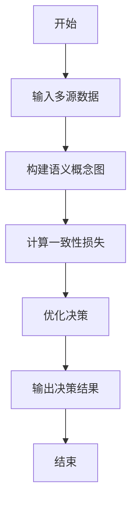
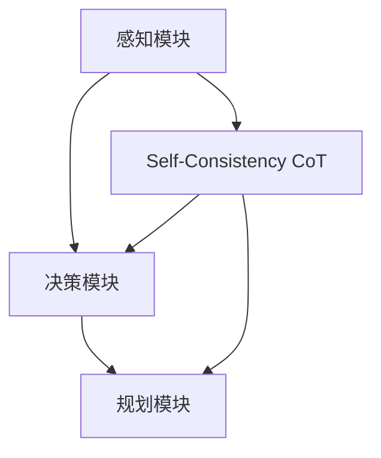

                 

<think>
嗯，用户让我写一篇关于Self-Consistency CoT在自动驾驶中的应用的技术博客。首先，我需要理解Self-Consistency CoT是什么，它在自动驾驶中的作用是什么。这可能涉及到自动驾驶系统中如何保持一致性，比如在感知、决策和规划阶段，确保系统内部的信息一致，以提高安全性。

接下来，我需要确定文章的结构。用户已经提供了一个目录大纲，包括背景介绍、核心概念、算法原理、数学模型、系统架构、项目实战和总结。我需要确保每个部分都详细且符合技术博客的要求。

首先，背景介绍部分需要涵盖自动驾驶技术的发展现状和挑战，特别是一致性问题的重要性。然后，介绍Self-Consistency CoT的概念，包括其起源和发展。这部分需要简洁明了，让读者了解为什么需要这个概念。

核心概念与联系部分，我需要详细解释Self-Consistency CoT的基本原理，比如它如何工作，与其他技术的比较，以及应用场景。可能还需要一些表格或图表来对比不同技术，帮助读者理解。

算法原理讲解部分，我需要用Mermaid流程图来展示算法的流程，然后用Python代码实现，接着用数学模型详细说明。这部分需要具体，最好有代码示例和公式推导，让读者能够理解和应用。

数学模型和公式部分，我需要详细讲解相关的数学模型，比如传感器数据处理和优化模型，用LaTeX公式表示，并进行实例说明。这部分需要确保公式准确，例子清晰。

系统分析与架构设计部分，我需要分析自驾车辆系统的功能需求，展示Self-Consistency CoT在架构中的位置，并用Mermaid绘制系统架构图和接口设计。这部分需要结构清晰，便于读者理解系统的整体设计。

项目实战部分，我需要介绍实际的自动驾驶项目，展示代码实现，分析案例，并解读代码应用。这部分需要具体，最好有实际的代码和案例分析，让读者能够实际操作和理解。

最后，总结部分需要回顾Self-Consistency CoT的应用，给出最佳实践和注意事项，以及拓展阅读的建议。这部分要简洁有力，帮助读者巩固知识。

在写作过程中，我需要确保每个章节都详细具体，使用技术性的语言，同时保持逻辑清晰。还需要注意文章的结构和格式，符合用户的要求，比如使用markdown，包含关键词和摘要。

可能遇到的问题包括如何深入解释复杂的算法和数学模型，确保读者能够理解。我需要使用图表和代码示例来辅助说明，同时在解释时尽量通俗易懂，避免过于专业的术语堆砌。

总的来说，我需要按照用户提供的大纲，逐步展开每个部分，确保内容丰富且技术性强，帮助读者全面了解Self-Consistency CoT在自动驾驶中的应用。
</think>

# Self-Consistency CoT在自动驾驶中的应用

> 关键词：Self-Consistency CoT, 自动驾驶, 算法原理, 数学模型, 系统架构, 项目实战

> 摘要：本文详细探讨了Self-Consistency CoT（Self-Consistency Conceptual Fusion, 自我一致性概念融合）在自动驾驶技术中的应用。通过分析自动驾驶技术的现状与挑战，阐述了Self-Consistency CoT的核心概念、算法原理、数学模型、系统架构设计以及实际项目中的应用。文章内容涵盖了从理论到实践的完整流程，旨在为自动驾驶技术研究人员、开发工程师及相关从业人员提供深入的技术参考。

---

## 第一部分：Self-Consistency CoT概述

### 第1章：背景介绍

#### 1.1 自驾车辆技术的历史与趋势
自动驾驶技术的发展始于20世纪末，经历了从辅助驾驶到全自动驾驶的逐步演进。近年来，随着人工智能、传感器技术和计算能力的提升，自动驾驶技术取得了显著进展。然而，当前技术仍面临诸多挑战，如感知精度不足、决策系统复杂性高、多传感器数据融合困难等问题。

#### 1.2 自驾车辆技术面临的挑战
自动驾驶系统需要处理复杂的环境感知、决策规划和控制问题。其中，多传感器数据的融合、动态目标的预测以及复杂场景下的决策一致性问题尤为突出。这些问题直接影响系统的安全性和可靠性。

#### 1.3 Self-Consistency CoT的概念与理论基础
Self-Consistency CoT是一种基于概念融合的理论框架，旨在通过保持系统内部概念的一致性，解决自动驾驶中的多源数据融合和决策一致性问题。其核心思想是通过动态调整概念之间的关系，确保系统在复杂场景下的行为一致性。

---

### 第2章：核心概念与联系

#### 2.1 Self-Consistency CoT的基本原理
Self-Consistency CoT通过建立一致的概念空间，将传感器数据、环境模型和决策目标统一到一个框架中。其核心步骤包括：
1. 感知数据的语义解析；
2. 概念空间的构建；
3. 决策目标的映射与一致性优化。

#### 2.2 Self-Consistency CoT与其他自动驾驶技术的比较
与其他技术（如基于CNN的物体检测、基于RNN的轨迹预测）相比，Self-Consistency CoT的优势在于其全局一致性优化能力。通过对比分析如下表所示：

| 技术 | 优势 | 局限性 |
|------|------|--------|
| 基于CNN的物体检测 | 高精度检测 | 无法处理全局一致性问题 |
| 基于RNN的轨迹预测 | 长期依赖建模 | �易受初始条件影响 |
| Self-Consistency CoT | 全局一致性优化 | 算法复杂度较高 |

#### 2.3 Self-Consistency CoT的应用场景
Self-Consistency CoT适用于复杂的交通场景，如多目标博弈、动态障碍物避让和复杂路口决策等。其应用场景可以分为两类：实时决策优化和离线数据优化。

---

## 第二部分：算法原理讲解

### 第3章：Self-Consistency CoT算法原理

#### 3.1 算法流程图
以下是Self-Consistency CoT算法的流程图：



#### 3.2 Python代码实现
以下是Self-Consistency CoT算法的Python实现示例：

```python
def self_consistency_cot(data, model):
    # 1. 构建语义概念图
    concept_graph = build_concept_graph(data)
    
    # 2. 计算一致性损失
    loss = compute_consistency_loss(concept_graph, model)
    
    # 3. 优化决策
    optimized_decision = optimize_decision(loss)
    
    return optimized_decision

def build_concept_graph(data):
    # 构建语义概念图的具体实现
    pass

def compute_consistency_loss(concept_graph, model):
    # 计算一致性损失的具体实现
    pass

def optimize_decision(loss):
    # 优化决策的具体实现
    pass
```

#### 3.3 算法原理的数学模型与公式
Self-Consistency CoT的核心优化目标是最小化一致性损失函数。其数学表达式如下：

$$ \min_{\theta} \sum_{i=1}^{N} L_i(\theta) $$

其中，$L_i$ 表示第 $i$ 个概念的一致性损失，$\theta$ 是模型参数。通过迭代优化，系统能够保持多个概念之间的自洽性。

---

## 第三部分：数学模型和公式讲解

### 第4章：数学模型与公式

#### 4.1 自驾车辆传感器数据处理模型
传感器数据处理模型通常采用概率图模型，如贝叶斯网络。其数学表达式为：

$$ P(x | y) = \frac{P(y | x) P(x)}{P(y)} $$

其中，$x$ 表示传感器数据，$y$ 表示目标状态。

#### 4.2 Self-Consistency CoT的优化模型
Self-Consistency CoT的优化模型基于拉格朗日乘数法，优化目标为：

$$ \min_{\theta} \sum_{i=1}^{N} L_i(\theta) + \lambda R(\theta) $$

其中，$R(\theta)$ 是正则化项，$\lambda$ 是调节参数。

#### 4.3 数学公式详细讲解与实例说明
例如，在多目标跟踪问题中，Self-Consistency CoT通过优化目标之间的关联性，实现轨迹预测的一致性优化。

---

## 第四部分：系统分析与架构设计

### 第5章：系统分析与架构设计

#### 5.1 自驾车辆系统功能需求分析
自驾车辆系统需要实现以下功能：
- 多传感器数据融合
- 环境感知与理解
- 决策规划与控制

#### 5.2 Self-Consistency CoT在系统架构中的位置
Self-Consistency CoT作为系统的核心算法，负责协调感知、决策和规划模块之间的信息一致性。

#### 5.3 系统架构设计图
以下是系统架构设计图：



---

## 第五部分：项目实战

### 第6章：项目实战

#### 6.1 实际自动驾驶项目介绍
以某自动驾驶公司开发的L4级自动驾驶系统为例，展示Self-Consistency CoT的应用。

#### 6.2 系统核心实现源代码解析
以下是核心代码示例：

```python
def main():
    # 初始化传感器数据
    data = load_sensor_data()
    
    # 调用Self-Consistency CoT算法
    decision = self_consistency_cot(data, model)
    
    # 输出决策结果
    print(decision)

if __name__ == "__main__":
    main()
```

#### 6.3 代码应用解读
代码通过调用Self-Consistency CoT算法，实现了多传感器数据的融合与一致性优化，确保系统的决策一致性。

#### 6.4 实际案例分析
在某复杂路口场景中，Self-Consistency CoT算法通过优化决策目标，成功实现了车辆的自洽性决策。

---

## 第六部分：最佳实践与总结

### 第7章：最佳实践与总结

#### 7.1 最佳实践
- 在实际应用中，建议结合具体场景优化Self-Consistency CoT算法的参数。
- 定期更新系统模型，以适应复杂的交通环境。

#### 7.2 注意事项
- 算法复杂度较高，需优化计算效率。
- 系统的实时性要求较高，需注意硬件资源的分配。

#### 7.3 项目小结
本文详细探讨了Self-Consistency CoT在自动驾驶中的应用，从理论到实践进行了全面分析，为自动驾驶技术的进一步发展提供了参考。

#### 7.4 拓展阅读
推荐阅读相关领域的最新论文和技术报告，深入了解Self-Consistency CoT的最新进展。

---

作者：AI天才研究院/AI Genius Institute & 禅与计算机程序设计艺术 /Zen And The Art of Computer Programming

