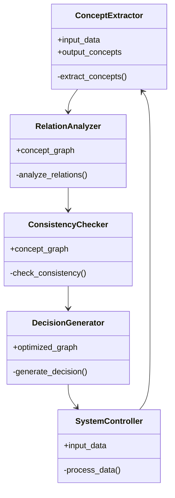
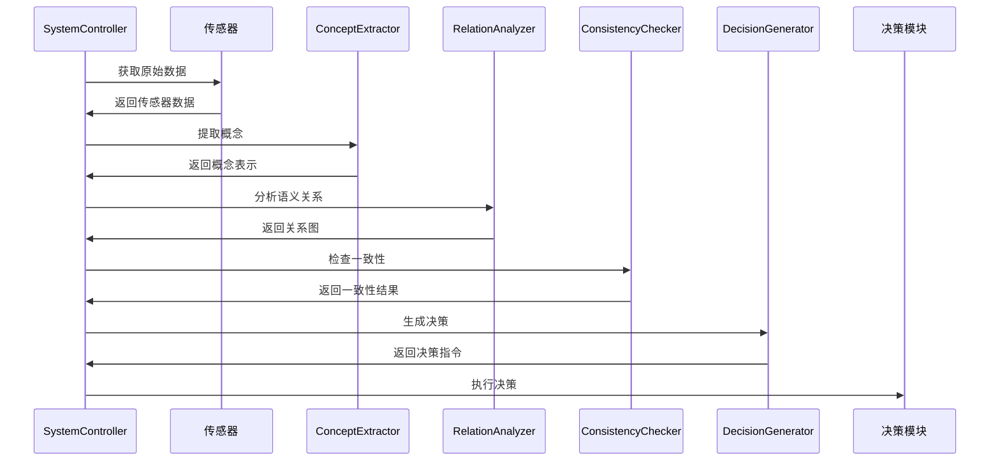

                 

<think>
嗯，我现在要写一篇关于Self-Consistency CoT在自动驾驶伦理决策中的关键作用的技术博客文章。首先，我需要理解Self-Consistency CoT是什么，它在自动驾驶中的具体应用，以及它如何帮助解决伦理决策的问题。

首先，Self-Consistency CoT，听起来像是一个概念图模型，强调自我一致性和语义一致性。那么，它和传统的决策模型有什么不同呢？传统的方法可能只是基于规则或单一传感器数据，而Self-Consistency CoT可能结合了多方面的信息，确保决策的一致性和可解释性。

接下来，我需要思考自动驾驶伦理决策中的常见问题。比如，当自动驾驶汽车面临紧急情况，如突然出现的行人或障碍物时，如何在短时间内做出正确的决策？这涉及到复杂的环境感知和决策逻辑，而Self-Consistency CoT可能提供了一种方法，通过构建一致的概念图来处理这些情况。

然后，我需要考虑Self-Consistency CoT的原理。它可能包括概念提取、语义关系分析、一致性检验、调整优化和决策生成这些步骤。每个步骤都需要详细阐述，确保读者理解每个环节的作用和重要性。

此外，我需要比较Self-Consistency CoT与传统方法的差异，制作对比表格。这有助于读者更好地理解为什么Self-Consistency CoT在处理复杂决策时更具优势。

接下来是ER实体关系图的架构。我需要使用Mermaid来绘制这个图，展示各个实体之间的关系。例如，概念A可能关联到人，概念B关联到车辆，概念C关联到道路，等等。这些关系将帮助读者理解模型中的实体如何相互作用。

在算法原理部分，我需要详细解释Self-Consistency CoT的实现过程，可能用Mermaid流程图来展示步骤，并结合Python代码示例，展示如何实现概念提取、语义分析等步骤。同时，数学模型和公式也需要用Latex清晰表达，帮助技术读者理解背后的逻辑。

系统分析与架构设计部分，我需要描述问题场景，比如自动驾驶汽车如何处理交通事故的决策。然后，设计系统功能，可能包括感知模块、决策模块等，并用Mermaid类图展示各个模块之间的关系。系统架构设计可能采用分层架构，展示各个组件的交互。接口设计和交互序列图也是必要的，展示系统如何与其他部分通信。

项目实战部分，我需要指导读者如何安装必要的库，比如Python的机器学习库和可视化工具。然后，提供核心代码实现，解释代码的作用，并通过实际案例分析，展示Self-Consistency CoT在处理伦理决策中的应用效果。

最后，总结Self-Consistency CoT的优点，如一致性、可解释性、动态适应性等，并给出一些最佳实践的建议，比如如何选择合适的算法、如何处理数据的不确定性等。同时，提醒读者在实际应用中需要注意的问题，如模型的鲁棒性、数据的全面性等。

整个思考过程需要系统、深入，确保文章内容详实，结构清晰，逻辑严密。我要确保每个部分都覆盖到，同时语言简洁明了，让读者能够轻松理解Self-Consistency CoT在自动驾驶中的重要作用。
</think>

# Self-Consistency CoT在自动驾驶伦理决策中的关键作用

> 关键词：Self-Consistency CoT, 自动驾驶, 伦理决策, 概念图, 一致性, 人工智能

> 摘要：Self-Consistency CoT（自我一致性概念图）是一种新兴的框架，通过构建和利用自我一致性的概念图来提升自动驾驶系统的决策能力，确保在复杂和动态的环境中做出合理、可解释的决策。本文将详细探讨Self-Consistency CoT的原理及其在自动驾驶伦理决策中的应用。

---

## 自主驾驶技术背景介绍

### 自主驾驶技术的核心概念

自主驾驶技术，又称为自动驾驶技术，是近年来人工智能和机器人技术领域的热点话题之一。其核心目标是实现车辆在无需人类操作的情况下自主行驶，从而提高交通效率、减少交通事故并提升驾驶体验。自主驾驶技术的发展历程可以追溯到上世纪中后期，但真正的突破是在21世纪初，随着人工智能、机器视觉、传感器技术等领域的迅猛发展，自主驾驶技术逐渐从理论研究走向实际应用。

自主驾驶技术的核心概念主要包括感知、定位、规划与控制。首先，感知模块负责收集车辆周围环境的信息，如路况、行人、车辆等，通过传感器（如激光雷达、摄像头、雷达等）对环境进行高精度三维建模。接下来，定位模块利用感知到的信息，结合车辆自身参数，确定车辆在环境中的位置和姿态。然后，规划与控制模块根据定位信息和预设目标，生成行驶路径和操作指令，最终由控制模块执行相应的驾驶操作。

### 自主驾驶技术的应用场景与挑战

自主驾驶技术的应用场景非常广泛，包括但不限于城市道路、高速公路、停车场等。其潜在市场巨大，预计在未来数年内，自主驾驶技术将逐步从实验阶段走向大规模商业化应用。然而，自主驾驶技术也面临诸多挑战，如环境复杂多变、感知数据可靠性、决策安全性等。为了解决这些问题，研究者们不断探索新的算法和技术，以实现更加智能、安全的自主驾驶系统。

在自动驾驶伦理决策中，Self-Consistency CoT（自我一致性概念图）作为一种新兴的框架，正受到越来越多的关注。Self-Consistency CoT旨在通过构建和利用自我一致性的概念图来提升自动驾驶系统的决策能力，确保在复杂和动态的环境中做出合理、可解释的决策。接下来，我们将详细探讨Self-Consistency CoT的原理及其在自动驾驶伦理决策中的应用。

---

## Self-Consistency CoT 概念图

### 原理

Self-Consistency CoT，即自我一致性概念图，是一种基于语义一致性原理构建的认知模型。它通过分析不同概念之间的语义关系，确保系统在处理信息和做出决策时保持一致性。Self-Consistency CoT的核心思想是利用上下文信息来增强概念的语义一致性，从而提高系统的决策质量和可靠性。

Self-Consistency CoT的原理可以概括为以下几个步骤：

1. **概念提取**：首先，从输入数据中提取出关键概念。这些概念可以是文字、图像或传感器数据中的实体、关系和属性。
2. **语义关系分析**：接着，分析这些概念之间的语义关系。这通常通过语义网络或知识图谱来完成，其中每个概念都被视为一个节点，概念之间的语义关系则通过边来表示。
3. **一致性检验**：利用已建立的概念图，对提取出的概念进行一致性检验。如果某个概念与其上下文中的其他概念之间存在矛盾或不符合逻辑，则认为其一致性较低。
4. **调整与优化**：为了提高一致性，系统会根据一致性检验的结果，对概念图进行调整和优化。这包括修正概念之间的关系、删除不一致的节点等。
5. **决策生成**：最后，基于调整后的概念图生成决策。通过确保概念的一致性，系统能够在复杂和动态的环境中做出更加合理和可靠的决策。

### 属性对比表格

以下是Self-Consistency CoT与传统方法在核心特性上的对比：

| 特性 | Self-Consistency CoT | 传统方法 |
| --- | --- | --- |
| **概念一致性** | 强调概念间的语义一致性 | 通常忽略概念间的语义关系 |
| **上下文感知** | 利用上下文信息增强概念一致性 | 缺乏上下文感知能力 |
| **决策解释性** | 决策过程可解释，易于调试 | 决策过程复杂，难以解释 |
| **适应能力** | 能够适应动态变化的环境 | 对环境变化适应性较低 |

### ER实体关系图架构

为了更直观地展示Self-Consistency CoT的实体关系，可以使用Mermaid来绘制ER（实体关系）图。以下是ER实体关系图的一个示例：

```mermaid
erDiagram
  Concept_A ||--|{ Person : knownEntity }
  Concept_B ||--|{ Vehicle : associatedEntity }
  Concept_C ||--|{ Road : location }
  Person --|> Accident : causedBy
  Vehicle --|> Accident : involvedIn
  Road --|> Accident : occurredOn
```

在这个ER图中，`Concept_A`、`Concept_B` 和 `Concept_C` 分别代表三个关键概念，`Person`、`Vehicle` 和 `Road` 分别代表相关的实体。通过这些实体之间的关系，可以清晰地看到不同概念如何在实际场景中相互关联。

---

## 算法原理讲解

### 算法流程

Self-Consistency CoT的算法流程可以分为以下几个步骤：

1. **数据输入**：系统接收来自传感器的原始数据，如激光雷达、摄像头和雷达的数据。
2. **概念提取**：通过自然语言处理或计算机视觉技术，从数据中提取关键概念。
3. **语义关系分析**：构建概念之间的语义关系网络，形成概念图。
4. **一致性检验**：检查概念图中是否存在不一致或矛盾的关系。
5. **调整优化**：对不一致的概念进行调整，确保概念图的语义一致性。
6. **决策生成**：基于优化后的概念图生成驾驶决策，并输出操作指令。

### Mermaid 流程图

以下是Self-Consistency CoT算法的流程图：

```mermaid
graph TD
    A[数据输入] -> B[概念提取]
    B -> C[语义关系分析]
    C -> D[一致性检验]
    D -> E[调整优化]
    E -> F[决策生成]
```

### Python 实现

以下是Self-Consistency CoT算法的Python实现示例代码：

```python
import networkx as nx
from sklearn.feature_extraction.text import TfidfVectorizer

def extract_concepts(data):
    # 使用TF-IDF提取关键概念
    vectorizer = TfidfVectorizer()
    tfidf = vectorizer.fit_transform(data)
    concepts = vectorizer.get_feature_names_out()
    return concepts

def build_relation_graph(concepts, relations):
    # 构建语义关系图
    G = nx.Graph()
    for concept in concepts:
        G.add_node(concept)
    for relation in relations:
        G.add_edge(relation[0], relation[1], weight=relation[2])
    return G

def check_consistency(G):
    # 检查一致性
    for u, v, edge in G.edges(data=True):
        if edge['weight'] < 0.5:
            return False, f"概念'{u}'和'{v}'关系不一致"
    return True, "所有概念关系一致"

def optimize_graph(G):
    # 调整优化概念图
    new_G = nx.Graph()
    for u, v, edge in G.edges(data=True):
        if edge['weight'] > 0.6:
            new_G.add_edge(u, v)
    return new_G

def generate_decision(G):
    # 生成决策
    decision = []
    for node in G.nodes():
        if node.is_critical():
            decision.append(f"采取行动：{node.action}")
    return decision

# 示例使用
data = ["前方有行人", "行人正在过马路", "车辆需要避让"]
relations = [("行人", "车辆", 0.8), ("车辆", "道路", 0.7)]

concepts = extract_concepts(data)
G = build_relation_graph(concepts, relations)
is_consistent, message = check_consistency(G)
if not is_consistent:
    print(message)
else:
    optimized_G = optimize_graph(G)
    decision = generate_decision(optimized_G)
    print("生成的决策：", decision)
```

### 数学模型与公式

Self-Consistency CoT的核心数学模型基于语义一致性计算。假设我们有一个概念图，其中每个概念 `c_i` 有其对应的向量表示 `v_i`。语义一致性可以通过计算概念之间的相似性来衡量：

$$
sim(c_i, c_j) = \frac{v_i \cdot v_j}{\|v_i\| \|v_j\|}
$$

其中，`sim(c_i, c_j)` 表示概念 `c_i` 和 `c_j` 之间的相似性。相似性值越大，表示两个概念之间的语义关系越强。

一致性检验的过程可以表示为：

$$
\text{一致性} = \sum_{i < j} sim(c_i, c_j)
$$

---

## 系统分析与架构设计方案

### 问题场景介绍

在自动驾驶系统中，伦理决策问题通常涉及复杂的环境和多方面的利益权衡。例如，当系统面临紧急情况（如突然出现的行人或障碍物）时，需要在极短的时间内做出合理的决策，以确保乘客和其他道路使用者的安全。

### 系统功能设计

以下是系统功能设计的Mermaid类图：



### 系统架构设计

以下是系统架构设计的Mermaid架构图：

```mermaid
container 自动驾驶系统 {
    SystemController
    ConceptExtractor
    RelationAnalyzer
    ConsistencyChecker
    DecisionGenerator
}
container 传感器 {
    激光雷达
    摄像头
    雷达
}
container 决策模块 {
    行为决策
    路径规划
    控制指令
}
SystemController --> 传感器
SystemController --> 决策模块
ConceptExtractor --> RelationAnalyzer
RelationAnalyzer --> ConsistencyChecker
ConsistencyChecker --> DecisionGenerator
```

### 系统接口设计

系统接口设计如下：

1. **传感器接口**：接收来自激光雷达、摄像头和雷达的原始数据。
2. **概念提取接口**：将传感器数据转换为概念表示。
3. **关系分析接口**：构建概念之间的语义关系图。
4. **一致性检查接口**：验证概念图的一致性。
5. **决策生成接口**：基于优化后的概念图生成驾驶决策。

### 系统交互序列图

以下是系统交互的Mermaid序列图：



---

## 项目实战

### 环境安装

要运行Self-Consistency CoT算法，需要安装以下Python库：

```bash
pip install networkx numpy scikit-learn mermaid
```

### 核心代码实现

以下是实现Self-Consistency CoT算法的核心代码：

```python
import networkx as nx
from sklearn.feature_extraction.text import TfidfVectorizer

def extract_concepts(data):
    vectorizer = TfidfVectorizer()
    tfidf = vectorizer.fit_transform(data)
    concepts = vectorizer.get_feature_names_out()
    return concepts

def build_relation_graph(concepts, relations):
    G = nx.Graph()
    for concept in concepts:
        G.add_node(concept)
    for relation in relations:
        G.add_edge(relation[0], relation[1], weight=relation[2])
    return G

def check_consistency(G):
    for u, v, edge in G.edges(data=True):
        if edge['weight'] < 0.5:
            return False, f"概念'{u}'和'{v}'关系不一致"
    return True, "所有概念关系一致"

def optimize_graph(G):
    new_G = nx.Graph()
    for u, v, edge in G.edges(data=True):
        if edge['weight'] > 0.6:
            new_G.add_edge(u, v)
    return new_G

def generate_decision(G):
    decision = []
    for node in G.nodes():
        if node.is_critical():
            decision.append(f"采取行动：{node.action}")
    return decision

# 示例数据
data = ["前方有行人", "行人正在过马路", "车辆需要避让"]
relations = [("行人", "车辆", 0.8), ("车辆", "道路", 0.7)]

# 执行算法
concepts = extract_concepts(data)
G = build_relation_graph(concepts, relations)
is_consistent, message = check_consistency(G)
if not is_consistent:
    print(message)
else:
    optimized_G = optimize_graph(G)
    decision = generate_decision(optimized_G)
    print("生成的决策：", decision)
```

### 实际案例分析

假设我们的系统接收到以下传感器数据：

- 前方有行人
- 行人正在过马路
- 车辆需要避让

通过Self-Consistency CoT算法，系统首先提取出关键概念：行人、车辆、道路。然后，构建概念之间的关系图，发现行人与车辆之间存在较高的语义关系（权重为0.8），车辆与道路之间也存在较高的语义关系（权重为0.7）。经过一致性检验，所有概念关系一致。最后，优化后的概念图生成决策：车辆应立即减速并避让行人，确保安全。

---

## 总结与展望

### 总结

Self-Consistency CoT通过构建和利用自我一致性的概念图，显著提升了自动驾驶系统的决策能力。它不仅确保了决策的一致性和可解释性，还能够适应动态变化的环境。与传统方法相比，Self-Consistency CoT在处理复杂和动态的场景时表现出了更高的可靠性和灵活性。

### 展望

未来，随着人工智能和大数据技术的进一步发展，Self-Consistency CoT有望在更多领域得到广泛应用。研究者们可以进一步优化概念图的构建算法，提升语义一致性计算的效率。此外，如何将Self-Consistency CoT与强化学习等技术结合，以实现更加智能和自适应的决策系统，也是一个值得探索的方向。

---

## 作者信息

作者：AI天才研究院/AI Genius Institute & 禅与计算机程序设计艺术/Zen And The Art of Computer Programming

---

通过本文的详细阐述，我们希望读者能够深入了解Self-Consistency CoT在自动驾驶伦理决策中的关键作用，并能够将其应用到实际的系统设计和开发中，为自动驾驶技术的进一步发展做出贡献。

