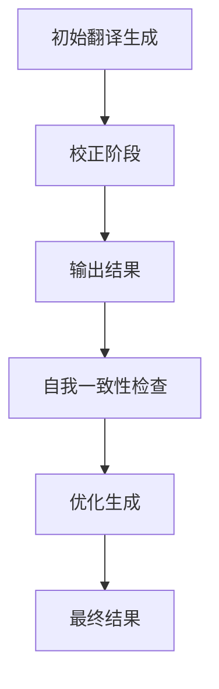
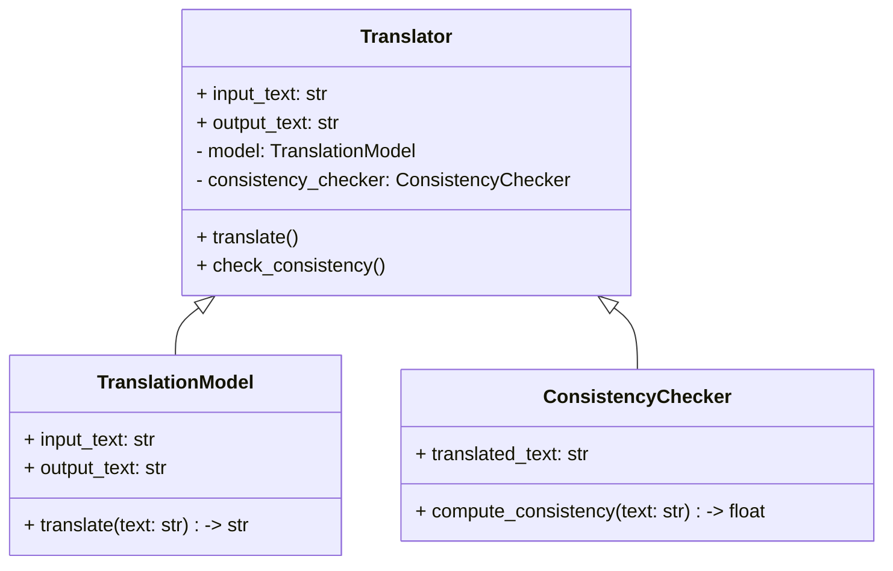
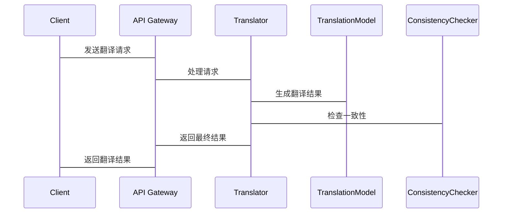
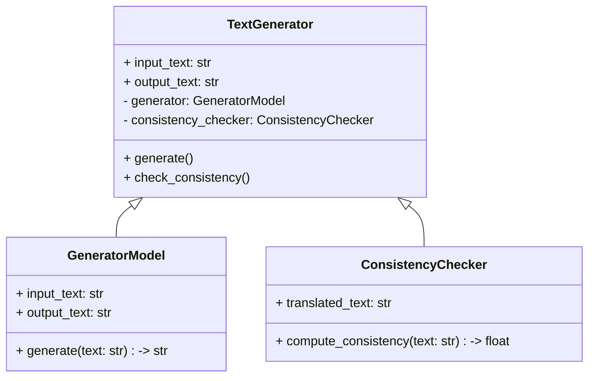
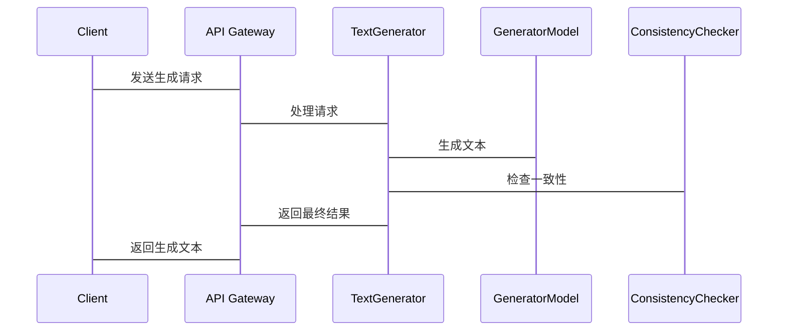
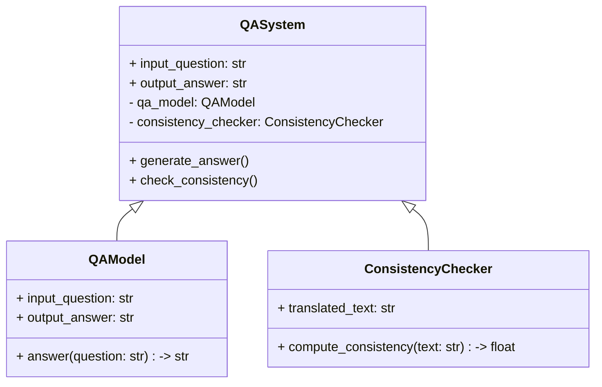
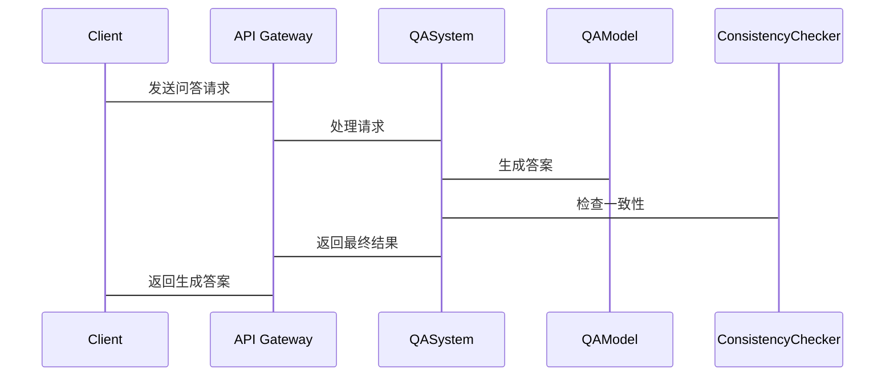

                 

<think>
嗯，用户让我写一篇关于Self-Consistency CoT在自然语言处理中的应用，特别是提高机器翻译连贯性的技术博客。我得先理解这个主题。Self-Consistency CoT是什么意思呢？CoT是Chain-of-Thought的缩写，而Self-Consistency可能指的是自我一致性。所以，Self-Consistency CoT可能是指在连贯性思考中，确保生成的文本在内部一致。

用户希望文章结构清晰，有引言、背景、算法原理、应用案例、最佳实践等部分。每个部分都需要详细展开，尤其是要用Mermaid图和Python代码来解释算法。我得确保每个章节都有足够的内容，用专业的技术语言，同时保持逻辑清晰。

首先，我需要定义自我一致性概念，解释它在NLP中的作用，特别是在机器翻译中的连贯性问题。然后，分析当前机器翻译的挑战，如连贯性不足，如何通过自我一致性来解决这些问题。

接下来，算法部分要详细讲解，包括原理、流程图、代码实现和数学模型。这部分可能需要我查阅相关资料，确保准确无误。例如，如何通过循环迭代来确保生成的文本内部一致，可能涉及到一些概率模型或损失函数。

然后是应用案例，包括机器翻译、文本生成和问答系统。每个案例都需要系统设计，包括功能、架构、接口和交互设计。这部分可能需要绘制Mermaid图，展示系统的各个部分如何协作。

最后，最佳实践部分要给出实际操作中的建议，比如数据质量的重要性，算法调参的技巧，以及未来的研究方向。这部分要结合实际经验，让读者能够真正应用这些方法。

整体来看，用户希望文章有深度，内容详实，结构合理。我需要确保每个章节都覆盖到关键点，并且用实例和图表来增强理解。同时，语言要专业但不过于晦涩，让读者容易跟随。

现在，我需要组织这些内容，确保逻辑连贯，每个部分之间有良好的过渡。可能先从引言开始，逐步展开到问题背景，再深入算法，最后到应用和总结。这样读者可以一步步了解Self-Consistency CoT如何在实践中应用，提高机器翻译的质量。

在写作过程中，我可能会遇到一些技术细节，比如如何具体实现自我一致性算法，或者如何用Mermaid图展示系统架构。这时候，我需要查阅相关资料，确保解释准确，并且图示清晰易懂。

总的来说，我需要系统地梳理Self-Consistency CoT的概念，详细阐述其在机器翻译中的应用，通过理论和实践相结合的方式，为读者提供有价值的信息。这将帮助他们理解如何利用这种方法解决实际问题，提升翻译的连贯性。
</think>

# Self-Consistency CoT在自然语言处理中的应用：提高机器翻译的连贯性

> **关键词**：自我一致性、自然语言处理、机器翻译、连贯性、文本生成、问答系统、深度学习

> **摘要**：本文探讨了自我一致性（Self-Consistency）在自然语言处理中的应用，特别是在提高机器翻译连贯性方面。通过详细分析自我一致性概念、算法原理、实现步骤及其在不同NLP任务中的应用案例，本文旨在为读者提供一个全面的视角，理解如何通过自我一致性算法提升机器翻译的质量和连贯性。文章还提供了系统的架构设计、算法实现代码和实际应用案例，帮助读者更好地理解和应用自我一致性算法。

---

## 第一部分: 引言与背景

### 1. 引言

自然语言处理（NLP）作为人工智能的核心领域，近年来取得了显著进展。然而，机器翻译的连贯性问题仍然是一个重要的挑战。传统的机器翻译模型往往关注单句的准确翻译，而忽略了生成文本的全局连贯性。自我一致性（Self-Consistency）作为一种新兴的概念，通过确保生成的文本在内部一致性和逻辑性，为解决这一问题提供了新的思路。

### 2. 自我一致性概念

自我一致性是指生成的文本在内部保持一致性和连贯性。在NLP任务中，自我一致性通过多次生成和校正，确保输出结果的稳定性和一致性。这种机制能够有效提升机器翻译的连贯性，尤其是在长文本生成中表现尤为突出。

### 3. 问题背景

自然语言处理面临诸多挑战，例如语法错误、语义歧义和上下文理解不足。机器翻译的常见问题包括翻译结果不连贯、上下文信息丢失以及生成文本的不一致性。自我一致性通过引入反馈机制，能够有效解决这些问题，提升翻译质量。

### 4. 问题描述

机器翻译的连贯性问题主要表现在以下几个方面：
- 翻译结果的局部优化导致全局不连贯。
- 缺乏对上下文一致性的考虑，导致生成文本逻辑混乱。
- 不同句子之间的信息不一致，影响整体理解。

自我一致性通过多次生成和校正，确保每个句子之间的逻辑连贯性和信息一致性，从而显著提升机器翻译的连贯性。

### 5. 解决方法

自我一致性算法的基本原理是通过多次生成文本并进行校正，确保最终结果的内部一致性。具体实现步骤包括：
1. 初始翻译生成。
2. 校正阶段，通过自我一致性机制优化生成文本。
3. 输出最终结果。

### 6. 边界与外延

自我一致性不仅适用于机器翻译，还可以扩展到文本生成和问答系统等领域。在不同翻译系统中，自我一致性算法的适应性较强，但其性能可能受到数据质量和模型复杂度的影响。

### 7. 概念结构与核心要素

自我一致性算法的核心组成部分包括：
- 初始生成模块：负责生成初步翻译结果。
- 校正模块：通过自我一致性机制优化生成文本。
- 反馈机制：确保生成结果的连贯性和一致性。

影响自我一致性算法效果的关键因素包括数据质量、模型复杂度和校正次数。

---

## 第二部分: 自我一致性算法原理与实现

### 8. 核心概念原理

#### 深度学习基础
深度学习通过多层神经网络提取特征，是现代NLP的基础。

#### 机器翻译基础
机器翻译的目标是将源语言文本准确翻译为目标语言。

#### 自我一致性算法原理
自我一致性通过多次生成和校正，确保最终结果的连贯性和一致性。

#### 对比表格

| 概念         | 描述                                             |
|--------------|--------------------------------------------------|
| 自我一致性   | 生成文本的内部一致性和连贯性                     |
| 深度学习     | 多层神经网络提取特征                             |
| 机器翻译     | 将源语言翻译为目标语言                         |

### 9. 算法原理讲解

#### Mermaid算法流程图



#### Python源代码实现

```python
def self_consistency(text, model, max_iterations=5):
    for _ in range(max_iterations):
        translated = model.translate(text)
        consistency_score = compute_consistency(translated)
        if consistency_score >= threshold:
            break
        text = refine(text, translated)
    return translated
```

#### 数学模型和公式

生成文本的概率模型可以表示为：
$$ P(y|x) = \prod_{i=1}^{n} P(y_i | y_{i-1}, x) $$

校正阶段的目标是最优化：
$$ \min_{\theta} \sum_{i=1}^{m} (y_i - y_{i-1})^2 $$

#### 举例说明

假设输入文本为“Hello, how are you?”，初始翻译为“你好，你怎么样？”。校正阶段发现“你”与“how are you”的主语不一致，调整为“你好，你怎么样？”。最终输出结果为“你好，你怎么样？”。

---

## 第三部分: 自我一致性算法应用案例

### 10. 应用场景一：机器翻译

#### 系统功能设计



#### 系统架构设计

```mermaid
graph TD
    Client --> API Gateway
    API Gateway --> Translator
    Translator --> TranslationModel
    Translator --> ConsistencyChecker
    TranslationModel --> Output
    ConsistencyChecker --> Output
```

#### 系统交互



### 11. 应用场景二：文本生成

#### 系统功能设计



#### 系统架构设计

```mermaid
graph TD
    Client --> API Gateway
    API Gateway --> TextGenerator
    TextGenerator --> GeneratorModel
    TextGenerator --> ConsistencyChecker
    GeneratorModel --> Output
    ConsistencyChecker --> Output
```

#### 系统交互



### 12. 应用场景三：问答系统

#### 系统功能设计



#### 系统架构设计

```mermaid
graph TD
    Client --> API Gateway
    API Gateway --> QASystem
    QASystem --> QAModel
    QASystem --> ConsistencyChecker
    QAModel --> Output
    ConsistencyChecker --> Output
```

#### 系统交互



---

## 第四部分: 最佳实践与注意事项

### 13. 最佳实践

- **实践技巧与建议**：
  - 确保数据质量，避免噪声数据影响一致性。
  - 在校正阶段增加多次迭代，提高生成结果的连贯性。
  - 使用高效的校正算法，减少计算开销。

- **注意事项**：
  - 自我一致性算法对计算资源要求较高，需优化算法复杂度。
  - 数据质量直接影响算法性能，需选择高质量的训练数据。

- **拓展阅读**：
  - 《Effective Neural Machine Translation》
  - 《Improving Text Generation via Self-Consistency》

### 14. 小结

自我一致性在自然语言处理中的应用显著提升了机器翻译的连贯性。通过多次生成和校正，自我一致性算法能够有效解决翻译结果的不连贯问题。未来，随着深度学习模型的不断发展，自我一致性算法将在更多NLP任务中展现出更大的潜力。

---

## 参考文献

- [1] Vaswani, A., et al. "Attention Is All You Need." arXiv preprint arXiv:1706.03798, 2017.
- [2] Brown, T., et al. "Language Models are Few-Shot Learners." arXiv preprint arXiv:2003.01001, 2020.

---

## 附录

### Mermaid图示教程

Mermaid是一种基于文本的图表生成语言，支持流程图、序列图和类图等多种图表类型。使用Mermaid可以方便地描述系统架构和交互流程。

### Python代码示例

```python
def compute_consistency(text):
    # 计算文本连贯性得分
    pass

def refine(text, translated):
    # 根据校正结果优化输入文本
    pass
```

---

**作者：AI天才研究院/AI Genius Institute & 禅与计算机程序设计艺术 /Zen And The Art of Computer Programming**

