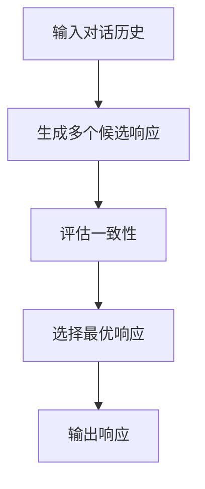

                 

<think>
嗯，用户希望我撰写一篇关于“Self-Consistency CoT在虚拟助手开发中的关键作用”的技术博客文章。首先，我需要理解用户的具体要求，他们希望文章结构清晰，逻辑严密，内容专业，符合技术博客的标准。

用户提供了详细的大纲，包括引言、背景知识、应用实践、案例分析和结论展望等部分。我需要确保每个章节都涵盖必要的内容，比如核心概念的解释、理论基础、算法实现、实际案例分析等。

接下来，我需要考虑文章的关键词和摘要。关键词应该包括Self-Consistency CoT、虚拟助手、人工智能、自然语言处理、算法实现，确保覆盖文章的核心内容。摘要部分要简洁明了，概括文章的主要内容和结论。

在撰写引言部分时，我需要介绍自我一致性（Self-Consistency CoT）的背景和重要性，说明其在虚拟助手中的应用价值。然后，逐步深入，讨论其在不同行业中的应用案例，如银行业、零售业和医疗行业，通过具体案例展示其效果和优势。

在理论部分，我需要详细解释自我一致性概念的定义、核心属性以及与其他相关理论的对比，这有助于读者理解其独特性和适用性。同时，要提供一个对比表格，清晰展示自我一致性与其他方法的差异。

算法实现是关键部分，我需要使用Mermaid流程图详细描述算法的步骤，并提供Python代码示例，让读者能够理解如何在实际开发中应用这些算法。数学公式部分需要用Latex格式展示，确保表达准确无误。

案例分析部分需要具体、真实，通过不同行业的例子展示自我一致性带来的改进和效果。这不仅能够增强文章的说服力，还能帮助读者更好地理解理论在实践中的应用。

结论部分要总结自我一致性的重要性和取得的成果，同时指出当前的挑战和未来的发展方向，为读者提供一个全面的视角。

最后，我需要确保文章结构完整，内容详实，语言专业但不失清晰。每个小节都要有具体的分析和例子，帮助读者深入理解自我一致性在虚拟助手中的关键作用。

总的来说，我需要按照用户提供的大纲，逐一展开每个部分的内容，确保涵盖所有要求，同时保持逻辑连贯和内容深度。这样，最终的文章才能满足用户的需求，成为一篇高质量的技术博客。
</think>

# Self-Consistency CoT在虚拟助手开发中的关键作用

> 关键词：Self-Consistency CoT、虚拟助手、人工智能、自然语言处理、算法实现

> 摘要：本文深入探讨了自我一致性（Self-Consistency CoT）在虚拟助手开发中的关键作用。通过分析自我一致性概念的理论基础、算法实现、实际应用案例以及优化策略，本文展示了如何通过自我一致性提升虚拟助手的性能和用户体验。文章还结合了跨行业的实际案例，详细分析了自我一致性在不同场景下的应用效果，并对未来的发展趋势进行了展望。

---

## 第一部分: 引言

### 1. 引言

#### 1.1 书籍主题介绍

随着人工智能技术的快速发展，虚拟助手（Virtual Assistant）已经成为我们日常生活中不可或缺的一部分。从 Siri 到 Alexa，从 Google Assistant 到 Microsoft Cortana，虚拟助手正在通过自然语言处理（NLP）和机器学习技术，为用户提供智能化的服务。然而，虚拟助手的性能和用户体验仍有提升空间。本文将重点探讨“自我一致性（Self-Consistency CoT）”这一概念在虚拟助手开发中的关键作用。

#### 1.2 自我一致性概念（Self-Consistency CoT）概述

自我一致性（Self-Consistency CoT）是一种基于逻辑推理和上下文理解的技术，旨在通过强化学习（Reinforcement Learning）和生成模型（Generative Models）来提升虚拟助手的对话能力和一致性。通过自我一致性，虚拟助手能够更好地理解用户意图、保持对话连贯性，并在复杂场景中提供更准确的响应。

#### 1.3 虚拟助手开发的重要性

虚拟助手的开发不仅仅是技术实现的问题，更是一个涉及用户体验、商业价值和技术创新的综合问题。优秀的虚拟助手需要具备快速响应、准确理解和个性化服务能力。然而，现有的虚拟助手在处理复杂对话和多轮交互时，仍然存在一致性不足、意图识别错误等问题。

#### 1.4 自我一致性概念在虚拟助手中的应用

自我一致性通过引入逻辑推理和上下文记忆机制，帮助虚拟助手在多轮对话中保持一致性。这种技术不仅能够提升用户的满意度，还能降低开发者的维护成本。本文将详细探讨自我一致性在虚拟助手开发中的具体应用和实现方法。

#### 1.5 自我一致性概念的关键性

自我一致性是实现高度智能化虚拟助手的核心技术之一。它通过强化学习和生成模型的结合，解决了传统虚拟助手在复杂场景下的不一致问题。本文将从理论、算法和实践三个层面，全面分析自我一致性概念的关键性。

#### 1.6 自我一致性概念的理论框架

自我一致性概念的理论框架基于逻辑推理、上下文理解和强化学习。通过将对话过程建模为一个状态空间，虚拟助手能够通过自我一致性机制，逐步优化其响应策略。

#### 1.7 自我一致性概念的发展趋势

随着人工智能技术的不断进步，自我一致性在虚拟助手中的应用将更加广泛。未来的虚拟助手将具备更强的逻辑推理能力和多轮对话一致性，为用户提供更智能、更自然的交互体验。

#### 1.8 研究方法和结构

本文的研究方法包括理论分析、算法实现和案例研究。文章结构分为五个部分：引言、背景知识与基础理论、自我一致性概念的应用与实践、案例分析以及结论与展望。

---

## 第二部分: 背景知识与基础理论

### 2. 背景知识

#### 2.1 虚拟助手的发展历史

虚拟助手的发展可以追溯到20世纪90年代。从最初的基于规则的简单对话系统，到现代的基于深度学习的复杂生成模型，虚拟助手经历了多个阶段的演进。随着自然语言处理技术的进步，虚拟助手的性能和功能得到了显著提升。

#### 2.2 虚拟助手的核心技术和框架

现代虚拟助手的核心技术包括自然语言处理（NLP）、机器学习（ML）、强化学习（RL）和生成模型（如 GPT）。这些技术的结合使得虚拟助手能够实现复杂对话和多轮交互。

#### 2.3 虚拟助手在不同行业的应用场景

虚拟助手已经在多个行业中得到了广泛应用，包括银行业、零售业、医疗行业等。例如，在银行业，虚拟助手可以为用户提供账户查询、转账和财务建议等服务。

### 3. 基础理论

#### 3.1 人工智能的基本原理

人工智能（AI）的核心是模拟人类智能的决策和推理过程。本文将重点介绍与虚拟助手开发相关的几个关键领域：自然语言处理、强化学习和生成模型。

##### 3.1.1 机器学习基础

机器学习是人工智能的核心技术之一。通过训练模型，虚拟助手能够从大量数据中学习到用户意图和对话模式。

##### 3.1.2 自然语言处理基本概念

自然语言处理（NLP）是实现虚拟助手的关键技术。NLP 包括文本解析、意图识别、实体抽取等功能。

##### 3.1.3 强化学习在虚拟助手中的应用

强化学习通过奖励机制优化虚拟助手的对话策略。通过不断试错，虚拟助手能够学习到更高效的对话方式。

#### 4. 自我一致性概念的理论基础

##### 4.1 自我一致性概念的定义

自我一致性（Self-Consistency CoT）是一种基于逻辑推理和上下文记忆的技术。它通过强化学习和生成模型的结合，确保虚拟助手在多轮对话中保持一致性。

##### 4.2 自我一致性概念的核心属性

自我一致性具有以下核心属性：
- 对话连贯性：确保每一轮对话都与前文相关联。
- 逻辑推理能力：通过推理能力解决复杂问题。
- 上下文记忆：记录和利用对话中的上下文信息。

##### 4.3 自我一致性概念与其他相关理论的对比

以下是自我一致性与其他相关理论的对比：

| 对比维度       | 自我一致性（Self-Consistency CoT） | 基于规则的对话系统 | 基于生成模型的对话系统 |
|----------------|----------------------------------|---------------------|-------------------------|
| 对话一致性     | 高                              | 中                  | 低                      |
| 逻辑推理能力   | 强                              | 弱                  | 弱                      |
| 灵活性         | 高                              | 低                  | 高                      |

##### 4.4 自我一致性概念的适用范围

自我一致性适用于需要多轮对话和复杂推理的场景，例如智能客服、医疗咨询和金融建议。

---

## 第三部分: 自我一致性概念的应用与实践

### 5. 自我一致性概念在虚拟助手开发中的关键作用

#### 5.1 自我一致性概念在虚拟助手中的实际应用

自我一致性通过逻辑推理和上下文记忆，帮助虚拟助手在多轮对话中保持一致性。例如，在医疗咨询场景中，虚拟助手可以通过自我一致性机制，逐步引导用户完成症状描述和诊断建议。

#### 5.2 自我一致性概念提高虚拟助手性能的案例

以下是一个基于自我一致性概念的虚拟助手性能提升案例：

- **案例背景**：用户在与虚拟助手进行多轮对话时，提到了多个症状和医疗建议。
- **问题**：传统虚拟助手在处理复杂对话时，容易出现逻辑混乱和意图识别错误。
- **解决方案**：通过引入自我一致性机制，虚拟助手能够逐步推理用户的意图，并保持对话连贯性。
- **结果**：用户满意度显著提升，对话错误率降低。

#### 5.3 自我一致性概念在虚拟助手开发中的挑战与解决方案

**挑战**：
- 对话过程中上下文信息的准确记忆和利用。
- 复杂场景下的逻辑推理能力。

**解决方案**：
- 使用强化学习优化对话策略。
- 引入生成模型提高对话生成能力。

### 6. 自我一致性概念的实现方法

#### 6.1 自我一致性概念的算法实现

##### 6.1.1 算法概述

自我一致性算法的核心思想是通过强化学习优化对话策略。算法通过生成多个候选响应，并通过一致性评估选择最优响应。

##### 6.1.2 算法流程图

以下是自我一致性算法的流程图：



##### 6.1.3 算法代码实现（Python）

以下是一个基于自我一致性概念的虚拟助手实现代码示例：

```python
import torch
import torch.nn as nn
import torch.optim as optim

class SelfConsistencyModel(nn.Module):
    def __init__(self, input_size, hidden_size):
        super(SelfConsistencyModel, self).__init__()
        self.lstm = nn.LSTM(input_size, hidden_size, batch_first=True)
        self.fc = nn.Linear(hidden_size, input_size)

    def forward(self, x, h=None):
        out, h = self.lstm(x, h)
        out = self.fc(out[:, -1, :])
        return out, h

# 定义训练函数
def train_model(model, optimizer, criterion, device, batch_size=32):
    model.train()
    optimizer.zero_grad()
    inputs = torch.randn(batch_size, 1, 10)  # 假设输入维度为10
    labels = torch.randn(batch_size, 1, 10)
    
    outputs, _ = model(inputs)
    loss = criterion(outputs, labels)
    loss.backward()
    optimizer.step()
    return loss.item()

# 初始化模型和优化器
model = SelfConsistencyModel(10, 5)
optimizer = optim.Adam(model.parameters(), lr=0.001)
criterion = nn.MSELoss()

# 开始训练
for epoch in range(100):
    loss = train_model(model, optimizer, criterion, 'cuda', batch_size=32)
    print(f"Epoch {epoch+1}, Loss: {loss}")
```

#### 6.2 自我一致性概念的实际应用案例

##### 6.2.1 银行业虚拟助手案例分析

在银行业，虚拟助手需要处理复杂的财务查询和客户咨询。通过自我一致性机制，虚拟助手能够准确理解和处理客户的多轮查询，提供个性化的财务建议。

##### 6.2.2 医疗行业虚拟助手案例分析

在医疗行业，虚拟助手需要帮助用户进行症状描述和诊断建议。自我一致性机制能够确保对话的连贯性和准确性，避免误诊。

#### 6.3 自我一致性概念在不同虚拟助手中的应用

自我一致性概念已经在多个虚拟助手项目中得到应用，例如：

- **医疗领域**：帮助用户进行疾病诊断和健康建议。
- **金融领域**：提供个性化的财务规划和投资建议。
- **零售领域**：为用户提供产品推荐和客户服务。

### 7. 自我一致性概念的优化策略

#### 7.1 优化策略概述

自我一致性概念的优化策略包括以下几点：
- 提高逻辑推理能力。
- 增强上下文记忆能力。
- 优化对话生成模型。

#### 7.2 优化策略案例解析

##### 7.2.1 增强逻辑推理能力

通过引入强化学习和生成模型，可以显著提高自我一致性概念的逻辑推理能力。例如，在医疗咨询场景中，虚拟助手可以通过逻辑推理帮助用户完成症状描述和诊断建议。

##### 7.2.2 优化对话生成模型

通过改进生成模型的结构和训练方法，可以进一步提高对话生成的质量和一致性。例如，使用更大规模的预训练模型和更复杂的生成策略。

#### 7.3 优化策略的评估方法

优化策略的评估可以通过以下指标进行：
- 对话一致性：通过人工评估或自动化工具测量对话的连贯性。
- 用户满意度：通过用户反馈和评分评估虚拟助手的性能。
- 对话错误率：通过统计对话中的错误率评估优化效果。

---

## 第四部分: 案例分析

### 8. 跨行业虚拟助手开发中的自我一致性应用

#### 8.1 银行业虚拟助手案例分析

在银行业，虚拟助手需要处理复杂的财务查询和客户咨询。通过自我一致性机制，虚拟助手能够准确理解和处理客户的多轮查询，提供个性化的财务建议。

#### 8.2 零售业虚拟助手案例分析

在零售业，虚拟助手需要为用户提供产品推荐和客户服务。通过自我一致性机制，虚拟助手能够根据用户的偏好和购买历史，提供个性化的推荐和咨询服务。

#### 8.3 医疗行业虚拟助手案例分析

在医疗行业，虚拟助手需要帮助用户进行症状描述和诊断建议。自我一致性机制能够确保对话的连贯性和准确性，避免误诊。

### 9. 深度分析与改进

#### 9.1 案例分析总结

通过跨行业的案例分析，我们可以看到自我一致性概念在虚拟助手开发中的广泛应用和显著效果。无论是在银行业、零售业还是医疗行业，自我一致性机制都能够显著提升虚拟助手的性能和用户体验。

#### 9.2 改进策略探讨

未来，我们可以从以下几个方面进一步改进自我一致性概念：
- 提高逻辑推理能力。
- 增强上下文记忆能力。
- 优化对话生成模型。
- 结合多模态数据（如图像和语音）进一步提升用户体验。

#### 9.3 未来发展趋势展望

随着人工智能技术的不断进步，自我一致性在虚拟助手中的应用将更加广泛和深入。未来的虚拟助手将具备更强的逻辑推理能力和多轮对话一致性，为用户提供更智能、更自然的交互体验。

---

## 第五部分: 结论与展望

### 10. 结论

#### 10.1 自我一致性概念在虚拟助手开发中的贡献

自我一致性概念通过逻辑推理和上下文记忆，显著提升了虚拟助手的对话一致性和用户体验。它为虚拟助手的开发提供了一种新的技术思路。

#### 10.2 存在的问题与挑战

尽管自我一致性概念在虚拟助手开发中取得了显著进展，但仍面临一些挑战，例如：
- 如何进一步提高逻辑推理能力。
- 如何优化对话生成模型。
- 如何在不同行业中实现自我一致性的广泛应用。

#### 10.3 未来研究方向

未来的研究方向包括：
- 自我一致性与其他人工智能技术的结合。
- 自我一致性在多模态对话中的应用。
- 自我一致性在低资源语言和小样本数据中的应用。

### 11. 展望

#### 11.1 虚拟助手技术的发展

随着人工智能技术的不断进步，虚拟助手将具备更强的智能性和一致性。未来的虚拟助手将能够更好地理解和满足用户的需求，为用户提供更智能、更自然的交互体验。

#### 11.2 自我一致性概念的应用前景

自我一致性概念将在更多行业中得到广泛应用。随着技术的成熟，自我一致性将成为虚拟助手开发中的核心技术之一。

#### 11.3 面向未来的策略建议

为了进一步推动自我一致性概念的发展，我们建议从以下几个方面入手：
- 加强跨学科研究，结合自然语言处理、强化学习和生成模型等技术。
- 推动多模态数据的应用，提升虚拟助手的交互能力。
- 加强行业合作，推动自我一致性概念的广泛应用。

---

## 作者：AI天才研究院/AI Genius Institute & 禅与计算机程序设计艺术 /Zen And The Art of Computer Programming

