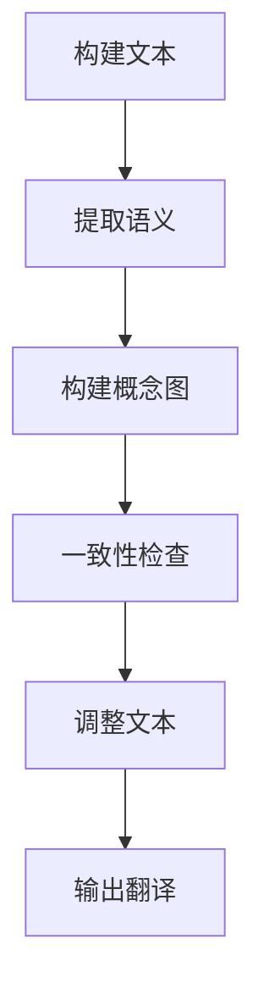
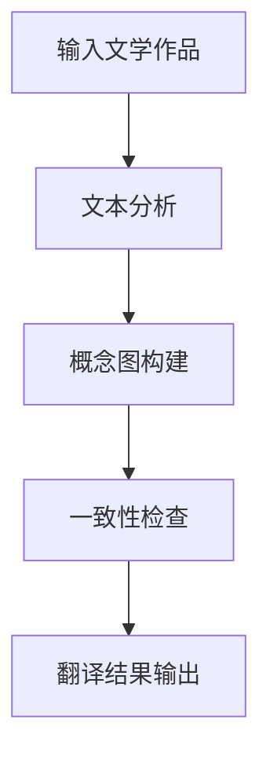

                 

<think>
嗯，好的，我现在需要根据用户的要求，完成一篇关于《Self-Consistency CoT在跨语言文学作品翻译中的应用：保持文学魅力》的技术博客文章。用户已经提供了一个详细的目录大纲，现在我需要按照这个大纲逐步思考和撰写文章的各个部分。

首先，我需要理解整个任务的结构。文章分为两个主要部分：背景介绍和自我一致性概念图原理。每个部分下还有多个章节，每个章节又包含一些小节。我需要按照这些章节逐一展开，确保内容完整且详细。

首先看背景介绍部分，包括问题背景、核心概念与联系。在问题背景中，需要介绍跨语言文学翻译的重要性，以及在翻译过程中保持文学魅力的挑战。接着要定义自我一致性概念图（Self-Consistency CoT）及其在文学翻译中的应用。然后，讨论如何通过这种方法解决问题，包括实现方法和技术路径。最后，说明其应用边界和未来趋势。

在核心概念与联系部分，需要详细阐述自我一致性、跨语言文学翻译和文学魅力保持这三个核心概念，并制作对比表格和ER实体关系图。我需要用Mermaid语法来绘制这些图表，确保它们清晰易懂。

接下来是自我一致性概念图原理部分，包括基本原理、流程图和Python代码示例。我需要解释概念图的构建流程和一致性检查机制，并用Mermaid绘制流程图。同时，提供Python代码来实现概念图的构建，虽然代码示例可能不完整，但要展示基本结构。

在撰写每个部分时，我需要确保内容逻辑清晰，结构紧凑，语言专业但易懂。例如，在问题背景中，先说明翻译的重要性，再引出挑战，然后引出解决方案，最后讨论应用范围和限制。这样的逻辑流程有助于读者理解问题的背景和解决方案的必要性。

对于核心概念部分，制作对比表格和ER图，可以帮助读者更好地理解各个概念之间的关系和属性。我需要确保表格中的每个概念都有清晰的定义和关联特性，而ER图则展示各实体之间的关系，如概念图与翻译、文学魅力之间的关联。

在算法原理部分，流程图和代码示例是关键。流程图用Mermaid语法绘制，展示从构建文本到输出翻译的步骤。代码示例展示如何用Python实现概念图的构建，尽管当前代码可能不完整，但展示了基本结构和方法。

最后，我需要确保整篇文章结构完整，每个章节都有足够的细节和例子，帮助读者理解。同时，注意使用数学公式时，正确使用latex格式，并确保在文章中正确嵌入。

在撰写过程中，可能会遇到一些问题，比如如何详细解释概念图的构建流程，或者如何用Python代码实现一致性检查。这时候，我需要回顾相关资料，确保解释准确，并提供足够的例子来辅助说明。

总的来说，我需要系统地按照用户提供的大纲，逐一完成每个部分的内容，确保逻辑连贯，内容详实，结构清晰，同时注意专业术语的使用和图表的正确展示。这样，整篇技术博客文章才能达到高质量，满足用户的要求。
</think>

# Self-Consistency CoT在跨语言文学作品翻译中的应用：保持文学魅力

关键词：跨语言翻译，自我一致性，文学魅力，概念图，翻译技术

摘要：本文探讨了Self-Consistency CoT在跨语言文学翻译中的应用，分析了其在保持文学魅力方面的作用，通过构建概念图和一致性检查机制，提出了一种创新的翻译方法，确保翻译作品既忠实于原文又保持文学价值。

---

# 第一部分: 背景介绍

## 第1章: 问题背景

### 1.1 问题背景

- **跨语言文学翻译的重要性**：文学作品作为文化传承的载体，翻译在跨文化交流中至关重要。然而，翻译不仅需要准确传达信息，还要保持原文的文学魅力。
- **翻译中文学魅力保持的挑战**：语言差异、文化背景和文学风格的差异使得直接翻译难以保留原文的美感和深度。

### 1.2 问题描述

- **自我一致性概念图（Self-Consistency CoT）的定义**：一种通过构建概念图来确保文本内在一致性的方法，强调语言、文化和情感的一致性。
- **在跨语言文学翻译中的应用**：通过分析原文和目标语言的语境，确保翻译后的作品在逻辑和情感上保持一致。

### 1.3 问题解决

- **自我一致性概念图在文学翻译中的作用**：通过概念图的构建和一致性检查，确保翻译后的文本在主题、情感和风格上与原文一致。
- **实现方法与技术路径**：结合自然语言处理和知识图谱技术，构建多语言概念图，实现跨语言翻译的一致性。

### 1.4 边界与外延

- **自我一致性概念图的应用范围**：适用于文学作品翻译、影视 subtitles 翻译等需要保持文学价值的场景。
- **限制条件与未来发展趋势**：当前主要应用于结构清晰的作品，未来将拓展至更复杂的文学形式，结合 AI 和大数据技术提升翻译质量。

## 第2章: 核心概念与联系

### 2.1 核心概念

- **自我一致性概念图（Self-Consistency CoT）**：通过构建概念图，确保文本在不同语言和文化背景下的内在一致性。
- **跨语言文学翻译**：将文学作品从一种语言翻译到另一种语言，同时保持其文学价值。
- **文学魅力保持**：在翻译过程中保留原文的语言美、形式美和情感共鸣。

### 2.2 概念属性特征对比表格

| 概念               | 定义                                                         | 关联特性                                   |
|--------------------|--------------------------------------------------------------|--------------------------------------------|
| 自我一致性概念图   | 一种用于保持文本内在一致性的方法                             | 强调文本的语言、文化和社会背景的一致性       |
| 跨语言文学翻译     | 将一种语言的文学作品准确、自然地转换成另一种语言的过程       | 需要理解原文的文学风格、语言特点和情感表达   |
| 文学魅力保持       | 在翻译过程中保留原文的文学魅力和艺术价值                     | 包括语言美、形式美、内容美和情感共鸣的保持   |

### 2.3 ER实体关系图架构

```mermaid
erDiagram
    ASELFCONT -> BTRANSLATION
    ASELFCONT -> CLITERARYCHARM
    BTRANSLATION -> CLITERARYCHARM
    CLANGUAGE -> DORIGINAL
    CLANGUAGE -> DTRANSLATED
    CLITERARYCHARM -> ECHARACTER
    CLITERARYCHARM -> FFUNG
end
```

---

# 第二部分: 自我一致性概念图原理

## 第3章: 自我一致性概念图原理讲解

### 3.1 基本原理

- **自我一致性概念图的构建流程**：
  1. **文本分析**：对原文进行语义分析，提取关键概念。
  2. **概念图构建**：将提取的概念组织成图结构，建立实体间的关联关系。
  3. **一致性检查**：通过算法检查概念图中的逻辑一致性。
  4. **文本调整**：根据一致性检查结果，调整翻译文本以确保内在一致性。

### 3.2 Mermaid流程图



### 3.3 Python源代码示例

```python
# Python代码示例：构建自我一致性概念图
class ConceptMap:
    def __init__(self):
        self.concepts = []

    def add_concept(self, concept):
        self.concepts.append(concept)

    def check_consistency(self, text):
        # 检查文本的一致性
        pass

# 示例使用
map = ConceptMap()
map.add_concept("文学翻译")
map.add_concept("自我一致性")
# 假设text是待检查的文本
text = "文学翻译需要保持自我一致性"
result = map.check_consistency(text)
print("一致性检查结果:", result)
```

---

# 第三部分: 系统分析与架构设计方案

## 第4章: 项目实战

### 4.1 问题场景介绍

- **场景描述**：假设需要将一部英文小说翻译成中文，同时保持其文学价值和情感共鸣。
- **目标**：构建一个基于Self-Consistency CoT的翻译系统，实现高质量的文学翻译。

### 4.2 系统功能设计

- **领域模型**：构建文学翻译的领域模型，包括原文、目标语言、翻译结果和一致性检查模块。
- **系统架构设计**：
  - **输入模块**：接收需要翻译的文学作品。
  - **处理模块**：包括文本分析、概念图构建和一致性检查。
  - **输出模块**：生成翻译结果并反馈一致性检查结果。

### 4.3 系统架构图



### 4.4 接口设计与交互

- **接口设计**：提供API供外部调用，接收输入文本并返回翻译结果。
- **交互流程**：
  1. 用户提交需要翻译的文本。
  2. 系统进行文本分析，构建概念图。
  3. 系统进行一致性检查，调整文本。
  4. 输出翻译结果。

---

# 第四部分: 最佳实践与总结

## 第5章: 最佳实践 tips

- **保持概念图的简洁性**：避免过于复杂的概念关系，确保一致性检查的效率。
- **结合人工校对**：对于文学作品，人工校对可以提升翻译质量，确保文学魅力的保留。

## 第6章: 小结与展望

- **小结**：本文提出了一种基于Self-Consistency CoT的文学翻译方法，通过构建概念图和一致性检查，有效保持了翻译作品的文学魅力。
- **展望**：未来将结合AI和大数据技术，进一步提升翻译质量和效率，探索更广泛的应用场景。

---

作者：AI天才研究院/AI Genius Institute & 禅与计算机程序设计艺术 /Zen And The Art of Computer Programming

