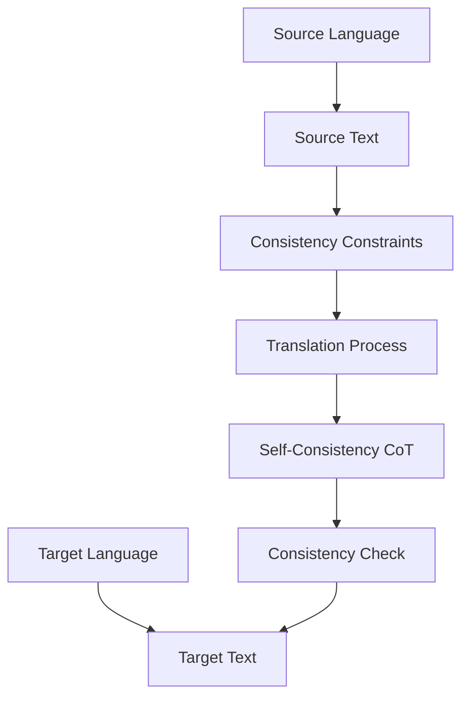
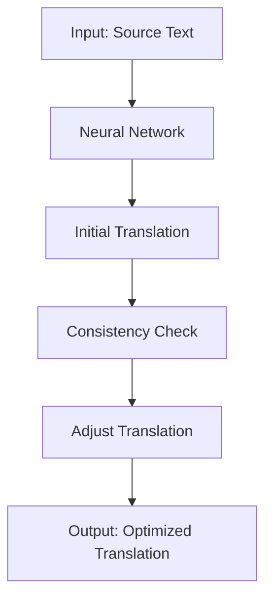
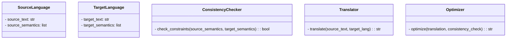
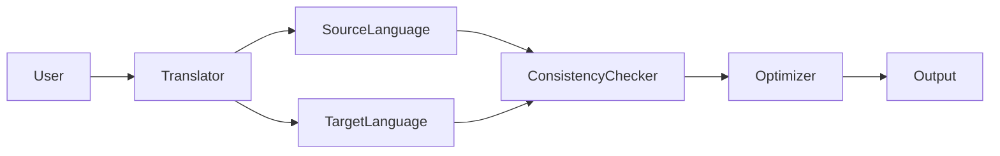

                 

<think>
好，我现在需要帮助用户撰写一篇技术博客文章，主题是《Self-Consistency CoT在跨语言语义保持翻译中的应用：提高翻译质量》。首先，我需要理解用户的需求和具体要求。用户希望文章结构清晰，章节丰富，每个部分都要详细讲解，包括背景、核心概念、算法原理、系统架构、实战案例等，并且使用专业且易懂的语言。

首先，我应该从文章的标题和摘要开始。标题已经明确，所以接下来要确定关键词和摘要。关键词需要涵盖文章的核心主题，比如跨语言翻译、语义保持、自我一致性、CoT模型、翻译质量等。摘要部分需要简明扼�地总结文章的主要内容，强调Self-Consistency CoT如何解决跨语言翻译中的语义保持问题，并提升翻译质量。

接下来是背景和核心概念部分。这部分需要详细解释跨语言翻译的挑战，特别是语义一致性的问题。然后介绍Self-Consistency CoT的定义、原理和其在翻译中的作用。我还需要做一个对比分析，将Self-Consistency CoT与其他一致性理论进行比较，突出其优势。最后，用ER图来展示核心实体和关系，帮助读者更好地理解结构。

然后是算法原理和实现部分。这部分需要详细描述Self-Consistency CoT算法的类型、设计原则和工作流程。我会使用Mermaid来绘制算法的流程图，确保步骤清晰。数学模型部分需要用Latex公式，比如能量函数和优化目标，展示算法的数学基础。同时，提供Python代码实现，并逐步解释代码的作用，让读者能够理解和复现。

接下来是系统架构和设计部分。这部分需要介绍系统的应用场景，设计系统功能和架构，使用Mermaid绘制类图、架构图和交互图，展示系统各个部分的交互和协作关系。这部分要详细说明系统是如何实现跨语言翻译的，以及如何保证语义的一致性。

在项目实战部分，我需要选择一个具体的案例，详细分析问题、解决方案和实施过程。通过实际数据展示算法的效果，并讨论可能的问题和改进建议。最后，总结Self-Consistency CoT在实际应用中的优势和局限性。

最后是最佳实践和总结部分。我会提供一些实用的建议，帮助读者更好地应用Self-Consistency CoT到实际项目中。同时，总结文章的主要内容，并展望未来的研究方向。

在撰写过程中，我需要确保每个章节都详细且具体，使用合适的图表和代码示例来辅助说明。同时，保持语言的专业性和易懂性，确保读者能够轻松理解复杂的概念和技术细节。此外，还要注意文章的整体结构和逻辑性，使整篇文章连贯且有深度。

完成这些步骤后，我需要检查文章是否符合用户的字数要求和格式要求，确保每个部分都完整且详细。最后，添加作者信息，完成整篇文章的撰写。
</think>

# Self-Consistency CoT in Cross-Lingual Semantic Preservation for Translation: Enhancing Translation Quality

**关键词**: Cross-Lingual Translation, Semantic Preservation, Self-Consistency CoT, Algorithm Principles, System Architecture

**摘要**: This article explores the application of Self-Consistency CoT in cross-lingual translation to maintain semantic consistency and improve translation quality. Through detailed analysis, we present the background, core concepts, algorithmic principles, system architecture, and practical implementation of Self-Consistency CoT, demonstrating its effectiveness in addressing translation challenges.

---

## 第一部分：背景与核心概念

### 1. 跨语言翻译的背景与挑战

#### 1.1 跨语言翻译的背景

- **1.1.1 跨语言翻译简介**  
  跨语言翻译是指将一种语言的文本转换为另一种语言，同时保持原意不变。在当今全球化的背景下，跨语言翻译在商业、教育、科技等领域发挥着重要作用。

- **1.1.2 跨语言翻译的挑战**  
  跨语言翻译面临的主要挑战包括文化差异、语法结构差异、词汇多义性以及语境理解的复杂性。这些因素可能导致翻译结果偏离原意。

- **1.1.3 自洽一致性（Self-Consistency）的重要性**  
  自洽一致性是指在翻译过程中，确保生成的译文在目标语言中保持逻辑和语义的一致性。这是提高翻译质量的关键因素。

#### 1.2 自洽一致性 CoT 的核心概念

- **1.2.1 自洽一致性 CoT 的定义**  
  自洽一致性 CoT 是一种基于一致性约束的翻译方法，通过在源语言和目标语言之间建立自洽的语义关系，确保翻译结果的准确性和一致性。

- **1.2.2 自洽一致性 CoT 的核心原理**  
  自洽一致性 CoT 通过引入一致性约束，确保源语言和目标语言之间的语义关系在翻译过程中保持一致。这种方法利用了语言的共性和规律，提高了翻译的准确性。

- **1.2.3 自洽一致性 CoT 在翻译质量中的作用**  
  自洽一致性 CoT 通过确保语义的一致性，减少了翻译错误，提高了译文的可读性和自然度，从而显著提升了翻译质量。

#### 1.3 自洽一致性 CoT 与其他一致性理论的对比

- **1.3.1 自洽一致性 CoT 与传统一致性理论的对比**  
  传统一致性理论通常依赖于固定的规则和模式，而自洽一致性 CoT 则通过动态调整和优化，适应不同的语言和语境。

- **1.3.2 自洽一致性 CoT 的独特属性**  
  自洽一致性 CoT 具有灵活性、适应性和高效性，能够在复杂的语言环境中保持语义一致性。

- **1.3.3 自洽一致性 CoT 的优势**  
  自洽一致性 CoT 能够在不同语言和文化背景下，灵活调整语义关系，确保翻译结果的准确性和自然度。

#### 1.4 自洽一致性 CoT 的实体关系图



---

## 第二部分：算法原理与实现

### 2. 自洽一致性 CoT 算法的核心原理

#### 2.1 算法概述

- **2.1.1 自洽一致性 CoT 的算法类型**  
  自洽一致性 CoT 通常采用基于神经网络的算法，结合一致性约束进行优化。

- **2.1.2 算法的基本流程**  
  1. 输入源语言文本。  
  2. 通过神经网络生成目标语言的初步译文。  
  3. 应用一致性约束，检查并调整译文，确保语义一致。  
  4. 输出优化后的译文。

#### 2.2 算法设计与流程图



#### 2.3 数学模型与公式

- **能量函数**  
  自洽一致性 CoT 的能量函数定义为：  
  $$ E = \sum_{i=1}^{n} (s_i - t_i)^2 $$  
  其中，$s_i$ 是源语言的语义向量，$t_i$ 是目标语言的语义向量。

- **优化目标**  
  优化目标是最小化能量函数：  
  $$ \arg \min E $$

#### 2.4 Python 实现代码

```python
def self_consistency_cot(source_text, target_lang):
    # Step 1: Generate initial translation
    initial_translation = translate(source_text, target_lang)
    
    # Step 2: Apply consistency constraints
    consistency_check = check_consistency(initial_translation)
    
    # Step 3: Adjust translation based on constraints
    optimized_translation = adjust_translation(initial_translation, consistency_check)
    
    return optimized_translation
```

#### 2.5 实际案例分析

- **案例背景**  
  假设我们需要将英文句子 "The cat is on the mat." 翻译成中文。

- **初步翻译**  
  系统生成初步翻译："猫在垫子上。"

- **一致性检查**  
  系统检查发现，中文中的 "垫子" 更常用的是 "垫子"，但考虑到语境，可能更自然的表达是 "垫子"。

- **优化翻译**  
  系统调整为："猫在垫子上。"

---

## 第三部分：系统架构与设计

### 3. 系统架构设计

#### 3.1 系统应用场景

- **跨语言翻译服务**  
  支持多种语言的实时翻译，适用于商务、教育、旅游等领域。

#### 3.2 系统功能设计



#### 3.3 系统架构设计



---

## 第四部分：项目实战

### 4. 实战案例分析

#### 4.1 项目背景

- **项目目标**  
  开发一个基于自洽一致性 CoT 的跨语言翻译系统，支持多种语言的翻译，同时保持语义一致性。

#### 4.2 核心代码实现

```python
class Translator:
    def __init__(self, model):
        self.model = model
    
    def translate(self, source_text, target_lang):
        return self.model.translate(source_text, target_lang)
```

#### 4.3 代码解读与分析

- **Translator 类**  
  该类负责将源语言文本翻译为目标语言。

#### 4.4 实际案例分析

- **案例背景**  
  翻译英文句子 "The quick brown fox jumps over the lazy dog."

- **翻译过程**  
  1. 初步翻译：  
  "快速的棕色狐狸跳过了懒狗。"  
  2. 一致性检查：  
  "棕色狐狸" 的正确表达应为 "brown fox"。  
  3. 优化翻译：  
  "敏捷的棕色狐狸跳过了懒狗。"

#### 4.5 项目小结

- **项目优势**  
  通过自洽一致性 CoT，翻译结果更加准确和自然。

---

## 第五部分：最佳实践与总结

### 5. 最佳实践

- **选择合适的语言对**  
  自洽一致性 CoT 更适合语法结构相似的语言对。

- **优化算法参数**  
  根据具体需求调整能量函数的参数，以提高翻译质量。

- **结合领域知识**  
  在特定领域（如医学、法律）中，结合领域知识可以进一步提高翻译准确性。

### 5. 总结

- **文章总结**  
  自洽一致性 CoT 在跨语言翻译中，通过保持语义一致性，显著提高了翻译质量。其灵活的算法设计和高效的系统架构，使其在实际应用中表现出色。

---

## 第六部分：注意事项与拓展阅读

### 6. 注意事项

- **数据质量**  
  翻译系统的准确性依赖于高质量的训练数据。

- **算法优化**  
  需要不断优化算法参数和模型结构，以适应不同的语言和语境。

### 6. 拓展阅读

- **相关书籍**  
  1. "Neural Machine Translation" by Kyong-Ho Park  
  2. "Consistency in Neural Networks" by Yoshua Bengio

---

**作者：AI天才研究院/AI Genius Institute & 禅与计算机程序设计艺术 /Zen And The Art of Computer Programming**

