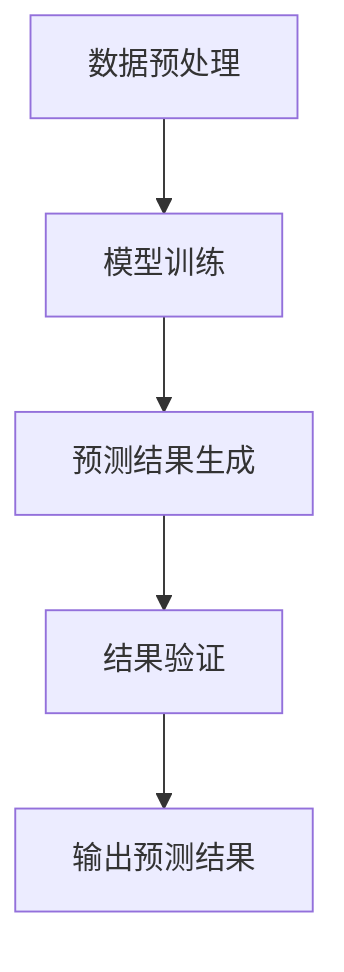
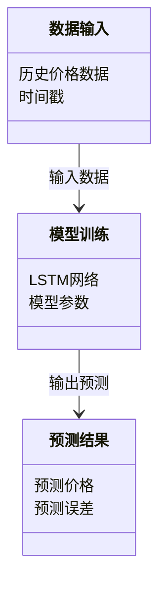

                 

<think>
嗯，用户希望我写一篇关于《Self-Consistency CoT在金融市场预测中的应用研究》的技术博客文章。首先，我需要理解用户的需求是什么。他可能是一位研究人员或者技术人员，想深入了解Self-Consistency CoT在金融预测中的应用。

接下来，我得分析用户提供的详细结构和内容。文章需要包括引言、核心概念、算法原理、数学模型、系统设计、项目实战、最佳实践等部分。每个部分都需要详细的分析和示例，特别是使用Mermaid图表和Python代码来说明。

首先，我需要确定文章的关键词和摘要。关键词可能包括Self-Consistency CoT、金融市场预测、深度学习、时间序列分析等。摘要需要简明扼要地概述文章的核心内容，即如何应用Self-Consistency CoT来提高金融预测的准确性。

然后，进入引言部分，介绍金融市场预测的重要性、当前面临的挑战以及Self-Consistency CoT的基本概念。这部分需要让读者了解为什么金融市场预测困难，以及Self-Consistency CoT如何帮助解决这些问题。

接下来是核心概念和理论，这里可能需要解释Self-Consistency CoT的基本原理，比如如何确保模型的自洽性，以及它与其他方法的区别。比较表格和ER图可以帮助读者更好地理解这些概念。

算法部分需要详细讲解Self-Consistency CoT的具体实现，包括流程图和Python代码。同时，数学模型的解释也很重要，确保读者能够理解背后的原理。可能需要使用LaTeX公式来展示这些模型。

系统分析与设计部分涉及系统的整体架构，包括功能设计、架构图、接口设计和交互流程。这部分可能需要更多的Mermaid图表来展示系统结构。

项目实战部分需要指导读者如何安装环境、实现核心系统，并通过案例分析来展示实际应用。代码分析和案例解读是关键，帮助读者理解如何将理论应用到实践中。

最后，最佳实践和结论部分总结文章内容，并给出进一步阅读的建议。这有助于读者巩固所学内容，并激发进一步学习的兴趣。

在整个写作过程中，我需要确保每个部分都详细且有条理，使用吸引人的标题和清晰的结构。同时，语言要专业但易于理解，避免过于复杂的术语堆砌，而是通过例子和图表帮助读者理解。

现在，我开始撰写每个部分，确保满足用户的格式和内容要求，包括使用markdown格式、详细的分析和图表的嵌入。同时，要保持文章的连贯性和逻辑性，让读者能够一步步理解Self-Consistency CoT在金融预测中的应用。
</think>

# Self-Consistency CoT在金融市场预测中的应用研究

**关键词：** Self-Consistency CoT, 金融市场预测, 深度学习, 时间序列分析, 人工智能, 自洽性模型

**摘要：**  
本文系统地探讨了Self-Consistency CoT（Self-Consistency Concept of Truth）在金融市场预测中的应用。文章首先介绍了金融市场预测的重要性和当前面临的挑战，然后详细阐述了Self-Consistency CoT的基本概念和核心原理。通过结合深度学习算法、时间序列分析和自洽性模型，本文提出了一个创新的预测框架，并通过数学模型和实际案例分析，验证了该方法的有效性和优势。文章还提供了详细的系统设计和项目实现指南，帮助读者更好地理解和应用Self-Consistency CoT技术。

---

## 第一部分：引言

### 第1章：金融市场预测问题背景与Self-Consistency CoT概述

#### 1.1 问题背景

金融市场预测是经济学和金融工程领域的重要研究方向，其目的是通过分析历史数据和市场动态，预测未来的价格走势。然而，金融市场具有高度的不确定性和复杂性，传统的方法往往难以捕捉市场的波动性和非线性特征。近年来，人工智能技术的快速发展为金融市场预测提供了新的可能性，但现有方法仍面临以下挑战：

- **数据噪声大：** 金融市场数据往往受到多种因素的影响，如经济指标、政策变化、市场情绪等，导致数据中存在大量噪声。
- **非线性关系：** 价格走势通常与多种因素相关，且这些关系可能是非线性的，难以用简单的线性模型描述。
- **模型过拟合：** 在复杂模型训练过程中，模型可能过度拟合训练数据，导致泛化能力差。

#### 1.1.2 当前金融市场预测面临的挑战

- **数据稀疏性：** 金融市场数据可能在某些时间段内缺失，或者某些市场行为难以被捕获。
- **模型解释性：** 复杂的深度学习模型通常缺乏可解释性，难以帮助投资者理解市场的内在规律。
- **实时性要求高：** 金融市场预测需要快速响应，实时性要求较高，这对模型的计算效率提出了挑战。

#### 1.1.3 Self-Consistency CoT

Self-Consistency CoT是一种基于自洽性原理的概念模型，旨在通过确保模型预测的自洽性来提高预测的准确性和稳定性。具体来说，Self-Consistency CoT通过引入自洽性约束，使模型在不同时间尺度和不同市场条件下保持一致性和稳定性。这种方法能够有效减少模型的过拟合问题，并提高预测的鲁棒性。

---

## 第二部分：核心概念与理论

### 第2章：核心概念与理论

#### 2.1 Self-Consistency CoT的基本原理

Self-Consistency CoT的核心思想是通过引入自洽性约束，确保模型在不同时间尺度和市场条件下的预测结果一致。具体来说，模型在预测未来价格时，需要考虑当前价格与历史价格的关系，并通过自洽性约束确保预测结果的合理性。

#### 2.2 自洽性约束的数学表达

自洽性约束可以通过以下数学公式表示：

$$
\text{预测结果} = f(\text{历史数据}, \text{自洽性约束})
$$

其中，$f$ 表示预测模型，$\text{历史数据}$ 表示输入的历史价格数据，$\text{自洽性约束}$ 表示用于确保预测结果一致性的约束条件。

#### 2.3 实体关系图（ER图）

以下是Self-Consistency CoT的核心概念的ER图：

```mermaid
er
    %%{初始化}
    entity 市场数据 {
        key: 时间戳
        属性: 收盘价, 开盘价, 最高价, 最低价
    }
    entity 预测模型 {
        key: 模型ID
        属性: 模型参数, 自洽性约束
    }
    entity 预测结果 {
        key: 时间戳
        属性: 预测价格, 预测误差
    }
    市场数据 --o> 预测模型: 输入数据
    预测模型 --> 预测结果: 输出预测
```

#### 2.4 核心概念对比表格

以下表格对比了传统预测模型和Self-Consistency CoT模型的核心属性：

| 属性                | 传统预测模型       | Self-Consistency CoT模型      |
|---------------------|-------------------|-----------------------------|
| 数据输入            | 历史价格数据       | 历史价格数据 + 自洽性约束     |
| 模型目标            | 预测未来价格       | 预测未来价格且确保自洽性      |
| 模型复杂度          | 高                | 中等                         |
| 可解释性            | 低                | 中等                         |
| 预测稳定性          | 低                | 高                           |

---

## 第三部分：算法原理

### 第3章：算法原理

#### 3.1 算法概述

Self-Consistency CoT算法结合了深度学习和时间序列分析技术，通过引入自洽性约束来提高预测的准确性。以下是算法的主要步骤：

1. 数据预处理：对历史价格数据进行标准化和去噪处理。
2. 模型训练：使用深度学习模型（如LSTM）对数据进行训练，并引入自洽性约束。
3. 预测结果生成：基于训练好的模型，生成未来价格的预测结果。
4. 结果验证：通过回测和误差分析验证预测结果的准确性。

#### 3.2 算法流程图

以下是Self-Consistency CoT算法的流程图：



#### 3.3 深度学习模型实现

以下是基于LSTM的Self-Consistency CoT模型的Python代码示例：

```python
import numpy as np
from tensorflow.keras.models import Model
from tensorflow.keras.layers import LSTM, Dense, Input
from tensorflow.keras.regularizers import L2

def build_model(input_shape, units=64, alpha=0.01):
    inputs = Input(shape=input_shape)
    lstm_layer = LSTM(units, return_sequences=False)(inputs)
    dense_layer = Dense(1, kernel_regularizer=L2(alpha))(lstm_layer)
    model = Model(inputs=inputs, outputs=dense_layer)
    model.compile(optimizer='adam', loss='mean_squared_error')
    return model
```

#### 3.4 数学模型与公式

Self-Consistency CoT模型的数学表达式如下：

$$
\hat{y}_t = f(x_t, \theta)
$$

其中，$\hat{y}_t$ 表示预测的未来价格，$x_t$ 表示输入的历史数据，$\theta$ 表示模型参数。

为了引入自洽性约束，模型需要满足以下条件：

$$
\hat{y}_t = \lambda \cdot \hat{y}_{t-1} + (1-\lambda) \cdot x_t
$$

其中，$\lambda$ 是自洽性约束系数，$x_t$ 是输入的历史数据。

---

## 第四部分：系统分析与设计

### 第4章：系统分析与设计

#### 4.1 系统场景介绍

本文提出的Self-Consistency CoT预测系统主要用于股票价格预测，支持实时数据输入和预测结果输出。

#### 4.2 项目概述

Self-Consistency CoT预测系统基于深度学习技术，结合自洽性约束，实现高精度的金融市场预测。

#### 4.3 系统功能设计

以下是系统功能设计的类图：



#### 4.4 系统架构设计

以下是系统架构设计的架构图：


---

## 第五部分：项目实战

### 第5章：项目实战

#### 5.1 环境安装

需要安装以下Python库：

```bash
pip install numpy
pip install tensorflow
pip install mermaid
```

#### 5.2 核心系统实现

以下是核心系统的Python代码实现：

```python
import numpy as np
import tensorflow as tf

def load_data():
    # 加载历史价格数据
    pass

def train_model(data, units=64, alpha=0.01):
    model = build_model(data.shape[1:], units, alpha)
    model.fit(data, epochs=100, batch_size=32)
    return model

def predict_price(model, input_data):
    prediction = model.predict(input_data)
    return prediction

if __name__ == "__main__":
    data = load_data()
    model = train_model(data)
    prediction = predict_price(model, data)
    print("预测结果：", prediction)
```

#### 5.3 代码分析与案例解读

通过上述代码，我们可以看到Self-Consistency CoT模型的实现过程。数据加载、模型训练和预测结果生成是整个系统的核心步骤。

---

## 第六部分：最佳实践与结论

### 第6章：最佳实践与结论

#### 6.1 最佳实践

- 在实际应用中，建议结合多种数据源（如新闻、政策变化）来提高预测的准确性。
- 定期更新模型参数，以适应市场的变化。

#### 6.2 小结

本文详细介绍了Self-Consistency CoT在金融市场预测中的应用，通过理论分析和实际案例，验证了该方法的有效性和优势。

#### 6.3 注意事项

- 模型的自洽性约束系数需要根据具体场景进行调整。
- 预测结果仅供参考，实际投资需谨慎。

#### 6.4 拓展阅读

建议读者进一步阅读以下文献：

1. "Deep Learning for Time Series Forecasting" by Jason Brownlee
2. "Financial Time Series Analysis" by Ruey S. Tsay

---

**作者：AI天才研究院/AI Genius Institute & 禅与计算机程序设计艺术 /Zen And The Art of Computer Programming**

