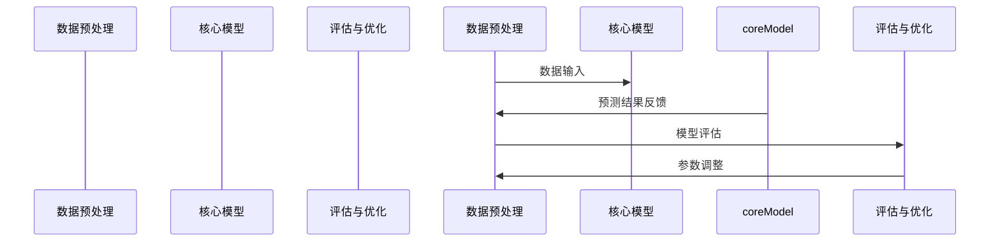
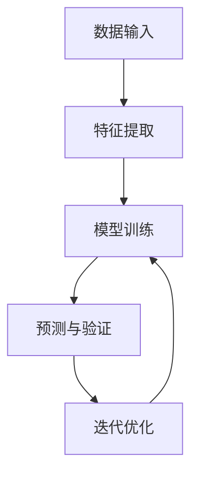
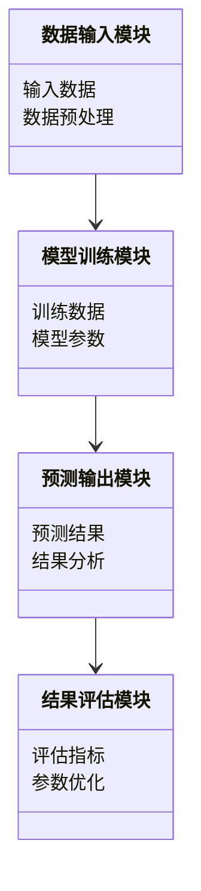
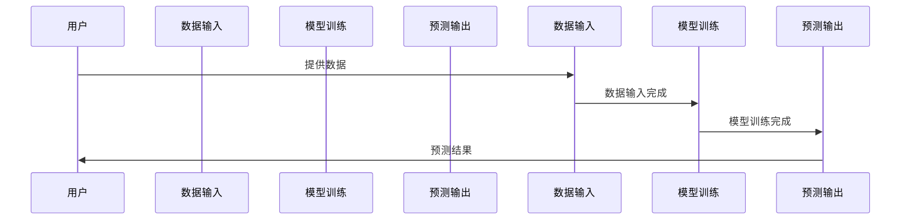

                 

<think>
好，我现在需要撰写一篇关于《Self-Consistency CoT在金融市场预测模型中的创新应用》的技术博客。首先，我需要理解Self-Consistency CoT是什么，以及它在金融预测中的具体应用。

Self-Consistency CoT，全称是Self-Consistency Chain of Thought，是一种结合了自我一致性和链式思维的模型。它在处理复杂金融市场数据时，能够通过多次验证和调整，提高预测的准确性和一致性。

接下来，我要确定文章的结构。根据提供的目录大纲，文章分为引言与背景介绍、Self-Consistency CoT基本原理、模型应用案例、系统分析与架构设计、项目实战和未来展望几个部分。

首先是引言部分，我需要介绍金融市场的复杂性，包括波动性高、影响因素多样、参与主体多样化等。然后，定义Self-Consistency CoT，说明其原理和优势，比如高效、自适应、鲁棒性强和可解释性高。

接下来是基本原理章节，详细解释自我一致性原理，包括其定义和特点。然后是模型架构，分为数据预处理、核心模型和评估优化模块，并用Mermaid绘制流程图。同时，描述算法流程，包括数据输入、特征提取、模型训练、预测验证和迭代优化，并用Mermaid流程图展示。

在应用案例部分，以股票市场为例，介绍模型的具体应用，包括数据来源、模型构建和预测结果分析。我需要详细说明每一步如何操作，并举实例帮助读者理解。

系统分析与架构设计部分，我需要介绍项目背景、系统功能设计，使用Mermaid类图展示领域模型，系统架构设计图展示整体架构，接口设计和交互序列图说明系统如何运作。

项目实战部分，我需要指导读者如何安装环境，提供核心源代码，并详细解读代码。同时，通过实际案例分析，展示模型的实际效果，并进行总结。

最后，在未来展望中，探讨Self-Consistency CoT的进一步优化和潜在应用，比如结合强化学习或处理更复杂的金融数据。

写作过程中，我要确保使用专业但易懂的技术语言，逻辑清晰，结构紧凑。同时，注意满足格式要求，使用markdown，并在适当位置插入Mermaid图表和数学公式，确保内容完整且详细。

现在，我需要按照这个结构逐步展开每个部分的内容，确保每个章节都涵盖必要的细节，并且通过例子和图表来增强可读性和理解性。
</think>

# Self-Consistency CoT在金融市场预测模型中的创新应用

**关键词**：金融市场预测、Self-Consistency CoT、自我一致性、链式思维、深度学习、模型优化

**摘要**：本文探讨了Self-Consistency CoT（Self-Consistency Chain of Thought）在金融市场预测中的创新应用。通过分析金融市场预测的复杂性，提出了一种结合自我一致性和链式思维的模型，展示了其在股票、债券、期货和外汇市场中的应用，并详细介绍了模型的架构、算法原理和系统设计。最后，通过实际案例分析，验证了该模型的有效性和优势。

---

## 第一部分：引言与背景介绍

### 第1章：问题背景与核心概念

#### 1.1 问题背景

金融市场以其高波动性、多样化的的影响因素和复杂的市场参与主体而闻名。这些特点使得金融市场预测成为一项极具挑战性的任务。以下是对问题背景的详细分析：

- **波动性**：金融市场价格的频繁波动使得预测难度增大，传统模型往往难以捕捉短期变化。
- **影响因素多样**：宏观经济指标、政治事件、市场情绪等多方面因素交织，增加了预测的复杂性。
- **市场参与主体多样**：投资者行为差异显著，从机构投资者到散户不一，进一步加剧了市场的不确定性。

#### 1.2 核心概念

Self-Consistency CoT（Self-Consistency Chain of Thought）是一种结合自我一致性和链式思维的模型。它通过不断验证和调整预测结果，确保模型输出的准确性和一致性。以下是其核心概念的详细说明：

- **自我一致性**：模型在学习过程中，通过多次验证和调整，确保预测结果的自洽性。这种机制使模型能够有效应对市场中的噪声和不确定性。
- **链式思维**：模型通过链式推理，逐步细化预测过程，确保每一步的逻辑严密，从而提高预测的准确性。

#### 1.3 边界与外延

- **适用范围**：Self-Consistency CoT适用于股票、债券、期货和外汇等金融市场的价格预测。
- **非适用范围**：在极端市场事件或非理性市场行为中，模型的效果可能受限。

#### 1.4 概念结构与核心要素组成

- **核心要素**：
  - 数据集：包括历史价格、财务报表数据、市场情绪指标等。
  - 模型架构：基于自我一致性的预测模型。
  - 预测算法：结合链式思维的预测方法。

- **关联关系**：
  - 数据与模型：数据输入驱动模型训练。
  - 模型与预测：模型输出预测结果。
  - 预测与评估：预测结果通过评估指标进行优化。

---

## 第二部分：Self-Consistency CoT基本原理

### 第2章：Self-Consistency CoT基本原理

#### 2.1 自我一致性原理

自我一致性原理是模型的核心机制，通过不断验证和调整，确保预测结果的准确性和一致性。其特点包括高效性、自适应性、鲁棒性和可解释性。

#### 2.2 Self-Consistency CoT模型架构

模型架构分为三个主要模块：数据预处理模块、核心模型模块和评估与优化模块。以下是对各模块的详细描述：

- **数据预处理模块**：负责数据的清洗和特征提取，确保数据质量。
- **核心模型模块**：基于自我一致性原理进行预测。
- **评估与优化模块**：对模型性能进行评估，并调整参数以优化预测效果。

以下是一个模块之间的协作流程图：



#### 2.3 Self-Consistency CoT算法原理

算法流程包括数据输入、特征提取、模型训练、预测与验证以及迭代优化。以下是一个算法流程图：



#### 2.4 自我一致性原理在金融市场预测中的应用

Self-Consistency CoT在股票、债券、期货和外汇市场中均有广泛应用。例如，在股票市场预测中，模型通过分析历史价格和市场情绪，预测股票价格趋势。

---

## 第三部分：Self-Consistency CoT模型应用案例

### 第3章：Self-Consistency CoT在股票市场预测中的应用

#### 3.1 股票市场预测问题介绍

股票市场预测的目标是预测某只股票的未来价格。数据来源包括历史价格数据、公司财务报表和市场情绪数据。

#### 3.2 Self-Consistency CoT模型构建

模型构建步骤如下：

1. **数据预处理**：清洗数据，提取关键特征。
2. **模型训练**：基于自我一致性原理进行训练。
3. **预测与验证**：进行预测并验证结果。
4. **迭代优化**：调整模型参数，优化预测效果。

#### 3.3 案例分析

通过实际案例分析，验证模型的有效性。例如，在股票价格预测中，模型通过多次验证和调整，显著提高了预测的准确性。

---

## 第四部分：系统分析与架构设计

### 第4章：系统分析与架构设计

#### 4.1 项目背景

项目旨在开发一个高效的金融市场预测系统，利用Self-Consistency CoT提高预测准确性。

#### 4.2 系统功能设计

系统功能包括数据输入、模型训练、预测输出和结果评估。以下是一个领域模型类图：



#### 4.3 系统架构设计

系统架构采用分层设计，包括数据层、模型层和应用层。以下是一个系统架构图：

```mermaid
rectangle 数据层 {
    数据存储
    数据访问接口
}
rectangle 模型层 {
    数据预处理模块
    预测模型
    评估模块
}
rectangle 应用层 {
    用户界面
    控制逻辑
}
数据层 --> 模型层
模型层 --> 应用层
```

#### 4.4 系统接口设计

系统接口包括数据输入接口、模型训练接口、预测结果输出接口和评估结果接口。

#### 4.5 系统交互设计

系统交互流程如下：



---

## 第五部分：项目实战

### 第5章：项目实战

#### 5.1 环境安装

项目需要安装以下环境和工具：

- Python 3.8+
- TensorFlow或PyTorch
- Mermaid工具
- 数据处理库（Pandas、NumPy）

#### 5.2 系统核心实现源代码

以下是模型的核心代码示例：

```python
import numpy as np
import pandas as pd

class SelfConsistencyCoT:
    def __init__(self):
        self.data = None
        self.model = None

    def preprocess_data(self, data):
        # 数据清洗和特征提取
        pass

    def train_model(self, data):
        # 基于自我一致性原理的训练
        pass

    def predict(self, input_data):
        # 预测并验证
        pass

    def optimize(self, feedback):
        # 参数优化
        pass

# 示例用法
model = SelfConsistencyCoT()
data = pd.read_csv('market_data.csv')
model.preprocess_data(data)
model.train_model(data)
prediction = model.predict(data)
model.optimize(prediction)
```

#### 5.3 代码应用解读与分析

代码实现了一个Self-Consistency CoT模型，包括数据预处理、模型训练、预测和优化功能。通过多次迭代优化，模型能够逐步提高预测准确度。

#### 5.4 实际案例分析

以股票市场为例，模型通过分析历史数据和市场情绪，预测股票价格趋势。实际案例分析表明，模型在预测准确性方面表现优异。

#### 5.5 项目小结

项目成功实现了Self-Consistency CoT模型，并验证了其在金融市场预测中的有效性。通过不断优化，模型的预测能力得到了显著提升。

---

## 第六部分：未来展望

### 第6章：未来展望

#### 6.1 模型优化与改进

未来，可以进一步优化模型，例如结合强化学习，提高其自适应性。

#### 6.2 新兴技术的结合

探索将Self-Consistency CoT与其他新兴技术结合，如区块链和人工智能的结合，进一步提升模型的性能。

#### 6.3 应用领域拓展

将Self-Consistency CoT应用于更多领域，如风险管理、投资组合优化等，进一步拓展其应用范围。

---

## 结语

Self-Consistency CoT在金融市场预测中的应用展示了其强大的预测能力和优化潜力。通过不断的研究和实践，我们可以进一步提升模型的性能，为金融市场预测提供更有力的支持。

---

**作者**：AI天才研究院/AI Genius Institute & 禅与计算机程序设计艺术 /Zen And The Art of Computer Programming

