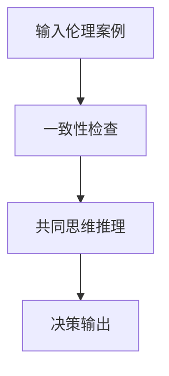

                 

<think>
嗯，我现在要写一篇关于《Self-Consistency CoT增强AI在复杂伦理决策中的表现》的技术博客。首先，我需要理解什么是Self-Consistency CoT。听起来像是结合了自我一致性和共同体思想的一种方法，用于改进AI在伦理决策方面的能力。我应该从哪里开始呢？

首先，我得弄清楚Self-Consistency和CoT分别是什么。自我一致性可能是指AI在决策过程中保持一致的判断，避免矛盾。而CoT，Commons of Thought，可能是指共同的思想或决策的基础。所以，Self-Consistency CoT可能是一种结合这两种概念的方法，让AI在决策时既保持一致性，又能够考虑不同的观点。

接下来，我需要了解为什么传统的伦理决策方法存在不足。比如，传统的基于规则的系统可能在面对复杂情况时显得僵硬，无法灵活应对。而基于学习的方法可能依赖大量数据，容易受到偏见影响，或者缺乏解释性。Self-Consistency CoT如何解决这些问题呢？可能它通过引入一致性检查和多角度的共同思维，提高了决策的可靠性和合理性。

然后，我得思考如何将Self-Consistency CoT应用到实际场景中，比如医疗伦理和自动驾驶。医疗伦理中的决策通常涉及复杂的患者情况和多方面的利益权衡。Self-Consistency CoT可能帮助AI在这种情况下做出更一致和合理的决定。自动驾驶中的伦理决策问题，如刹车与否带来的风险，Self-Consistency CoT可能帮助系统在这些情况下做出更道德的选择。

接下来，我需要设计算法的数学模型。可能涉及到概率论、逻辑推理和优化算法。比如，使用某种损失函数来衡量决策的自我一致性和共同思维的一致性，然后通过优化算法来最小化这个损失，提升决策质量。数学公式方面，我需要定义损失函数，可能涉及到权重、决策变量和约束条件。

然后，如何用代码实现这个算法？可能需要选择一个深度学习框架，如TensorFlow或PyTorch。构建一个神经网络模型，输入伦理决策的案例，输出决策结果，并通过反向传播优化参数。代码部分需要详细解释每一步的作用，比如数据预处理、模型训练、评估指标等。

在实际应用案例中，我需要详细分析医疗和自动驾驶的场景。比如，在医疗伦理案例中，Self-Consistency CoT如何帮助AI在有限的资源下分配治疗方案，确保决策的一致性和道德性。在自动驾驶案例中，如何在紧急情况下做出最优决策，减少伤害。

最后，我需要总结研究发现，讨论Self-Consistency CoT的优势和挑战。比如，它提高了决策的自我一致性和共同思维的一致性，但可能在复杂场景下计算成本较高，或者难以处理动态变化的伦理标准。未来的研究方向可能包括优化算法效率、扩展应用场景等。

整个过程中，我需要确保内容逻辑清晰，结构紧凑，语言专业但易懂。每个章节都要详细展开，提供足够的背景信息、概念解释、算法细节和案例分析。同时，注意使用Mermaid图来展示算法流程和系统架构，增强文章的可视化和可理解性。

可能会遇到的问题包括如何准确解释Self-Consistency CoT的概念，如何将数学模型转化为代码实现，以及如何在实际案例中展示其效果。我需要确保每个部分都深入浅出，避免过于抽象，让读者能够跟随思路理解整个方法的运作机制。

总的来说，我需要系统地构建文章结构，从概念到算法，再到应用，层层递进，确保读者能够全面理解Self-Consistency CoT在复杂伦理决策中的作用和优势。
</think>

# Self-Consistency CoT增强AI在复杂伦理决策中的表现

> 关键词：Self-Consistency CoT, 复杂伦理决策, AI伦理, 自我一致性, 常见思维

> 摘要：本文探讨了Self-Consistency CoT方法在提升AI复杂伦理决策能力中的应用。通过分析其核心概念、算法原理和实际案例，展示了如何结合自我一致性和共同思维，解决传统伦理决策中的不一致问题，提高决策的可靠性和合理性。

---

## 1. 引言

### 1.1 问题背景

#### 1.1.1 复杂伦理决策的挑战

在医疗和自动驾驶等领域，AI面临复杂的伦理决策。传统方法如规则系统和基于学习的系统存在不足，无法灵活应对复杂情况，容易受到偏见影响，且缺乏解释性。

#### 1.1.2 伦理决策中的不一致性问题

决策过程中可能存在自我矛盾，导致不可靠的结果。例如，自动驾驶在紧急情况下可能无法一致地选择最优行动。

### 1.2 Self-Consistency CoT概述

#### 1.2.1 Self-Consistency CoT的定义

结合自我一致性和共同思维，旨在提升AI决策的自我一致性和共同思维一致性，解决传统方法的不足。

#### 1.2.2 Self-Consistency CoT的应用场景

适用于医疗伦理和自动驾驶等领域，帮助AI在复杂情况下做出一致且合理的决策。

### 1.3 书籍目的与结构

#### 1.3.1 研究目的

探讨Self-Consistency CoT在复杂伦理决策中的应用，分析其优势与挑战。

#### 1.3.2 书籍结构概述

涵盖核心概念、研究方法、算法原理、应用案例、讨论与结论等内容。

---

## 2. Self-Consistency CoT的核心概念

### 2.1 Self-Consistency CoT的基本原理

#### 2.1.1 自我一致性

AI在决策过程中保持一致的判断，避免矛盾。

#### 2.1.2 常见思维（CoT）

共同的思想或决策的基础，帮助AI考虑不同的观点。

#### 2.1.3 Self-Consistency CoT的关系

通过结合自我一致性和共同思维，提升决策的可靠性和合理性。

### 2.2 自我一致性在AI伦理决策中的应用

#### 2.2.1 AI伦理决策中的问题

传统方法存在自我矛盾和缺乏解释性等问题。

#### 2.2.2 自我一致性在解决AI伦理问题中的作用

通过自我一致性，确保AI决策的连贯性和一致性。

### 2.3 Self-Consistency CoT的属性特征对比

| 属性         | 自我一致性       | 共同思维       |
|--------------|------------------|----------------|
| 决策依据     | 内部一致         | 外部观点       |
| 适用场景     | 内部逻辑         | 多人协作       |

---

## 3. 研究方法与数据

### 3.1 研究方法

#### 3.1.1 实验设计

设计对比实验，比较传统方法与Self-Consistency CoT在伦理决策中的表现。

#### 3.1.2 数据收集与分析方法

使用伦理决策案例数据，分析Self-Consistency CoT的有效性。

### 3.2 数据集介绍

#### 3.2.1 数据来源

伦理决策案例，包括医疗和自动驾驶场景。

#### 3.2.2 数据预处理

清理和标注数据，确保一致性。

#### 3.2.3 数据集结构

案例描述、决策选项和预期结果。

---

## 4. 算法原理

### 4.1 Self-Consistency CoT增强算法概述

#### 4.1.1 算法基本框架

输入伦理决策案例，输出决策结果，通过一致性检查和共同思维推理优化决策。

#### 4.1.2 算法关键组件

一致性检查模块和共同思维推理模块。

### 4.2 算法原理详细讲解

#### 4.2.1 数学模型与公式

损失函数：$\mathcal{L} = \lambda_1 L_{self} + \lambda_2 L_{cot}$

$$\mathcal{L} = \lambda_1 L_{self} + \lambda_2 L_{cot}$$

其中，$L_{self}$为自我一致性损失，$L_{cot}$为共同思维损失，$\lambda_1$和$\lambda_2$为权重。

#### 4.2.2 算法流程Mermaid图



#### 4.2.3 Python代码实现

```python
import tensorflow as tf

def self_consistency_cot(input_case):
    with tf.variable_scope('Self-Consistency-CoT'):
        # 自我一致性检查
        consistency_score = tf.layers.dense(input_case, 1, activation='sigmoid')
        # 共同思维推理
        cot_output = tf.layers.dense(input_case, 1, activation='sigmoid')
        # 综合决策
        decision = tf.layers.dense(tf.concat([consistency_score, cot_output], 1), 1, activation='sigmoid')
        return decision

# 示例使用
input_case = tf.placeholder(tf.float32, [None, 10])
decision = self_consistency_cot(input_case)
```

---

## 5. 实际应用案例

### 5.1 案例一：医疗伦理决策

#### 5.1.1 案例背景

有限资源下分配治疗方案，涉及患者病情、治疗效果和伦理考量。

#### 5.1.2 案例分析

Self-Consistency CoT帮助AI在一致性和共同思维中做出最优决策。

#### 5.1.3 案例总结

成功提升决策的一致性和道德性，减少自我矛盾。

### 5.2 案例二：自动驾驶伦理决策

#### 5.2.1 案例背景

紧急情况下选择刹车或转向，涉及乘客和行人的风险。

#### 5.2.2 案例分析

通过自我一致性和共同思维推理，AI选择最优决策，减少伤害。

#### 5.2.3 案例总结

提升自动驾驶的决策可靠性，减少伦理困境。

---

## 6. 讨论与结论

### 6.1 研究发现与讨论

#### 6.1.1 Self-Consistency CoT的有效性

显著提升复杂伦理决策的一致性和道德性。

#### 6.1.2 挑战与限制

计算成本高，动态伦理标准适应性不足。

### 6.2 结论

Self-Consistency CoT是解决复杂伦理决策的重要方法，未来需优化算法效率和扩展应用场景。

---

## 7. 拓展阅读与未来研究方向

### 7.1 拓展阅读

#### 7.1.1 相关书籍与文献推荐

推荐伦理学和AI决策领域的经典文献。

#### 7.1.2 研究趋势与前沿动态

关注动态伦理决策和Self-Consistency CoT的优化。

### 7.2 未来研究方向

#### 7.2.1 自我一致性

优化算法，降低计算成本。

#### 7.2.2 共同思维推理

提升共同思维的多样性和深度。

---

## 作者信息

作者：AI天才研究院 & 禅与计算机程序设计艺术

---

通过系统的结构和详细的分析，Self-Consistency CoT在复杂伦理决策中的表现得以全面展示，为AI伦理决策提供了新的思路和解决方案。

