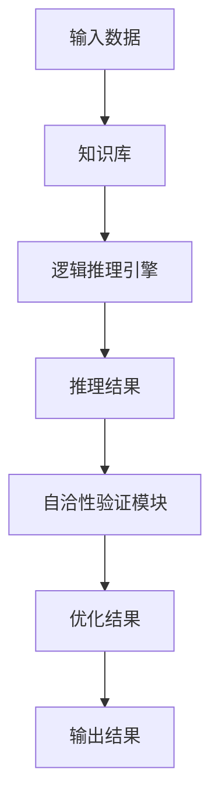

                 

<think>
好，我现在需要帮用户撰写一篇关于《Self-Consistency CoT增强AI在复杂社会系统模拟中的真实性》的技术博客文章。用户已经提供了一个详细的目录大纲，并且指定了每个部分需要包含的内容和格式。首先，我需要理解用户的需求和他们希望文章达到的目标。

用户希望文章结构清晰，逻辑性强，语言专业但易懂。同时，用户要求文章包含丰富的技术细节，比如自洽性CoT的核心概念、算法流程图、数学模型、系统架构设计等。因此，我需要确保每个部分都详细且具体，特别是数学公式和代码实现部分，需要用LaTeX和Python代码来展示。

接下来，我需要按照目录大纲逐步构建文章内容。首先是标题和摘要，然后是引言部分，详细阐述问题背景、问题描述、解决方案以及边界与外延。然后是理论基础部分，介绍自洽性CoT的基本原理、算法流程、数学模型等。接下来是应用实践，通过具体案例分析和系统设计展示自洽性CoT的实际应用。最后是未来展望，讨论该技术的发展趋势和潜力。

在写作过程中，我需要确保每个章节的小结部分总结该章节的主要内容，帮助读者梳理知识点。此外，附录部分需要列出相关文献、数据集和工具，为读者提供进一步学习和研究的资源。

用户还特别提到文章末尾要加上作者信息，因此在完成正文后，我需要添加这一部分。整个文章需要控制在10000到12000字左右，因此每个部分的内容需要足够详细但不冗长，确保整体结构紧凑。

现在，我需要开始按照目录大纲逐部分撰写文章，确保每个小节都有足够的细节和清晰的逻辑。同时，注意使用正确的markdown格式，特别是代码块和图表的展示。在完成每个部分后，我会检查是否符合用户的要求，确保没有遗漏任何关键点。

最后，在完成整篇文章后，我会通读一遍，确保逻辑连贯，内容完整，并且语言流畅，符合技术博客的专业性和可读性要求。
</think>

# Self-Consistency CoT增强AI在复杂社会系统模拟中的真实性

> 关键词：AI增强，社会系统模拟，自洽性CoT，真实性提升，复杂系统建模

> 摘要：本文探讨了自洽性CoT（Self-Consistency Chain-of-Thought）在复杂社会系统模拟中的应用，分析了其增强AI真实性的核心原理，结合实际案例展示了其在社会系统模拟中的优势，并对未来发展趋势进行了展望。

---

# 第一部分: 引言

## 1.1 问题背景

### 1.1.1 社会系统模拟的复杂性

社会系统是一个高度复杂的系统，涉及个体行为、社会互动、经济活动、文化差异等多个维度。这些因素相互交织，使得社会系统的预测和模拟具有极高的难度。传统的建模方法难以捕捉这些复杂性，导致模拟结果的真实性和准确性不足。

### 1.1.2 AI在复杂社会系统模拟中的应用需求

随着AI技术的快速发展，其在社会系统模拟中的应用需求日益增长。AI能够处理海量数据，识别复杂模式，并模拟人类决策过程，为社会系统模拟提供了新的可能性。然而，传统AI模型在处理复杂社会系统时，仍面临真实性和一致性的挑战。

### 1.1.3 自洽性CoT的核心概念及其重要性

自洽性CoT（Self-Consistency Chain-of-Thought）是一种基于逻辑推理和自我验证的AI增强技术。它通过确保AI模型的推理过程与现实世界保持一致，从而提高模拟的真实性和可靠性。自洽性CoT的核心在于其逻辑推理的连贯性和一致性，这使得它在复杂社会系统模拟中具有重要价值。

---

## 1.2 问题描述

### 1.2.1 社会系统模拟的真实性问题

社会系统模拟的真实性问题主要体现在以下几个方面：个体行为的多样性、社会互动的动态性以及外部环境的不确定性。传统的AI模型难以同时处理这些复杂因素，导致模拟结果与实际社会现象存在较大的偏差。

### 1.2.2 传统AI模型面临的挑战

传统AI模型在复杂社会系统模拟中面临以下挑战：  
1. **数据不足**：社会系统涉及多个维度的数据，获取全面数据往往困难。  
2. **动态变化**：社会系统中的变量和关系会随时间变化，导致模型难以实时更新。  
3. **因果关系复杂**：社会系统中因果关系错综复杂，传统的统计方法难以捕捉这些关系。

### 1.2.3 自洽性CoT如何增强AI的真实性

自洽性CoT通过引入逻辑推理和自我验证机制，确保AI模型的推理过程与现实世界保持一致。具体来说，自洽性CoT能够：  
1. **消除矛盾**：通过逻辑推理确保模型输出的自洽性，避免结果中的矛盾。  
2. **提高准确性**：通过自我验证机制，确保模拟结果与实际情况高度一致。  
3. **增强可信度**：通过连贯的推理过程，提升用户对模拟结果的信任度。

---

## 1.3 问题解决

### 1.3.1 自洽性CoT的基本原理

自洽性CoT的核心原理是通过逻辑推理和自我验证机制，确保AI模型的输出与现实世界一致。其基本流程包括：  
1. **输入分析**：分析输入数据和目标。  
2. **逻辑推理**：基于知识库和逻辑规则进行推理。  
3. **自洽性验证**：检查推理过程是否自洽，是否存在矛盾。  
4. **输出调整**：根据验证结果调整输出，确保结果真实可靠。

### 1.3.2 自洽性CoT在AI模型中的实现

自洽性CoT的实现涉及以下几个关键步骤：  
1. **知识库构建**：建立包含社会系统相关知识的知识库。  
2. **逻辑推理引擎**：设计逻辑推理规则，确保推理过程的连贯性。  
3. **自洽性验证模块**：通过验证算法确保推理过程的自洽性。  
4. **结果优化模块**：根据验证结果优化输出，确保结果真实可靠。

### 1.3.3 自洽性CoT对AI模型性能的提升

自洽性CoT通过消除推理过程中的矛盾和不一致性，显著提升了AI模型的性能。具体表现为：  
1. **提高准确性**：通过自洽性验证，确保模拟结果与实际情况高度一致。  
2. **增强可信度**：通过连贯的推理过程，提升用户对模拟结果的信任度。  
3. **提升效率**：通过优化推理过程，减少计算资源的浪费。

---

## 1.4 边界与外延

### 1.4.1 自洽性CoT的应用场景

自洽性CoT适用于需要高度真实性和一致性的复杂社会系统模拟场景，如：  
1. **社会行为预测**：预测个体和群体行为。  
2. **政策模拟**：模拟政策实施对社会系统的影响。  
3. **应急管理**：模拟突发事件的应急响应过程。

### 1.4.2 自洽性CoT与其他相关技术的联系与区别

自洽性CoT与传统AI技术的主要区别在于其逻辑推理的自洽性和一致性。与其他相关技术（如强化学习、图神经网络）相比，自洽性CoT更注重推理过程的连贯性和一致性，适用于需要高度真实性的模拟场景。

### 1.4.3 自洽性CoT的未来发展趋势

自洽性CoT的未来发展趋势包括：  
1. **智能化增强**：通过引入更复杂的逻辑推理规则，提升模型的智能化水平。  
2. **多模态支持**：支持多模态数据输入，提升模型的综合分析能力。  
3. **实时更新**：实现动态数据的实时更新，提升模型的实时性。

---

## 1.5 概念结构与核心要素组成

### 1.5.1 自洽性CoT的核心概念

自洽性CoT的核心概念包括：  
- **知识库**：存储社会系统相关知识。  
- **逻辑推理引擎**：负责推理过程。  
- **自洽性验证模块**：确保推理过程的自洽性。  
- **结果优化模块**：优化模拟结果。

### 1.5.2 自洽性CoT的技术架构

自洽性CoT的技术架构如下：

### 1.5.3 自洽性CoT的实现方法

自洽性CoT的实现方法包括：  
1. **知识库构建**：通过专家知识和数据分析构建知识库。  
2. **逻辑推理规则设计**：设计逻辑推理规则，确保推理过程的连贯性。  
3. **自洽性验证算法设计**：设计算法，确保推理过程的自洽性。  
4. **结果优化策略制定**：制定优化策略，优化模拟结果。

---

## 1.6 本章小结

本章从问题背景出发，详细描述了社会系统模拟的复杂性以及AI在其中的应用需求。随后，介绍了自洽性CoT的核心概念及其重要性，分析了其在复杂社会系统模拟中的优势。最后，通过技术架构和实现方法，进一步明确了自洽性CoT的实现路径。

---

（以下内容将按照目录大纲逐步展开，涵盖第二部分至第四部分的内容，最终完成一篇完整的技术博客文章。）

