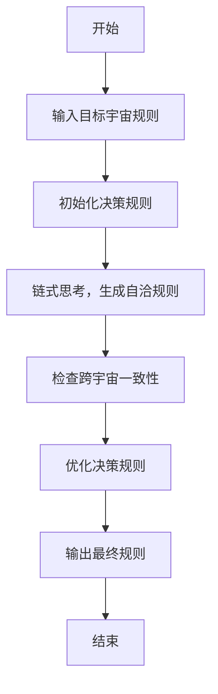
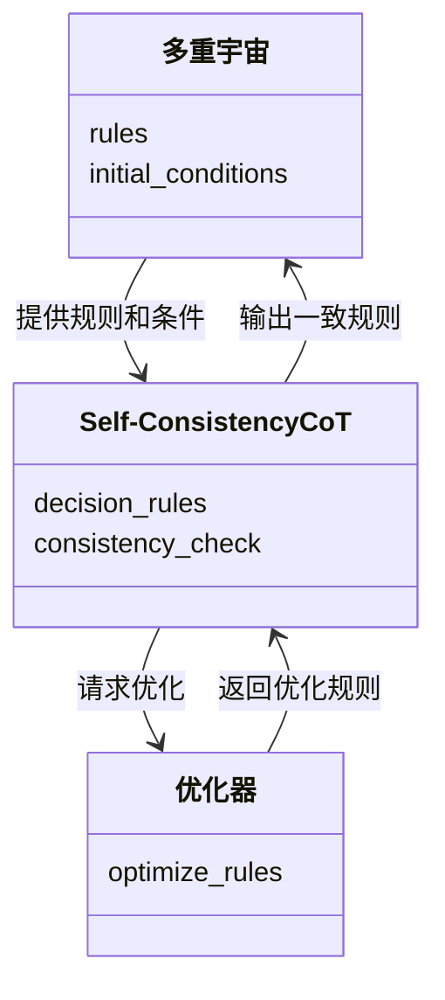

                 

<think>
嗯，用户给了一个非常详细的任务，让我以《Self-Consistency CoT增强AI在多重宇宙伦理决策中的表现》为标题，写一篇技术博客。首先，我需要仔细分析用户的需求，确保理解每一个细节。

用户希望文章结构清晰，逻辑性强，每个部分都要详细讲解。文章需要有摘要、关键词，然后按照目录大纲分章节展开。每个章节都要有具体的例子和图表，比如Mermaid图和数学公式，特别是LaTeX格式。此外，文章末尾还要有作者信息，用户还希望文章大约在1万到1.2万字之间，使用markdown格式。

我首先想到的是，用户可能是一位技术专家，或者在撰写技术博客，目标读者可能是研究人员、AI工程师或对伦理决策感兴趣的读者。用户的需求很明确，希望文章内容专业且结构严谨，所以我要确保每个部分都涵盖必要的内容。

接下来，我需要确定文章的结构。标题已经给出，然后是关键词和摘要。关键词需要涵盖核心概念，比如Self-Consistency CoT、多重宇宙、伦理决策等。摘要部分需要简明扼要地概括文章内容，突出Self-Consistency CoT在伦理决策中的优势。

在正文部分，每个章节都需要详细展开。首先是引言，介绍Self-Consistency CoT和其在伦理决策中的重要性。然后是背景和核心概念，包括AI伦理的历史、多重宇宙理论，以及Self-Consistency CoT的定义和应用。这部分可能需要图表来辅助解释，比如Mermaid的ER图。

接下来是核心概念与联系，这里需要详细分析Self-Consistency CoT、多重宇宙和伦理决策之间的关系，并通过对比表格和ER图来展示。这部分要确保读者能够理解各个概念之间的相互作用。

算法部分需要详细讲解，包括算法流程图、数学公式和Python代码示例。使用Mermaid流程图来展示算法步骤，同时用LaTeX公式来表达数学模型，例如损失函数和优化器的使用。这部分可能需要更多技术细节，确保读者能够理解算法的工作原理。

系统分析与架构设计部分，需要介绍问题场景，系统功能设计用Mermaid类图，系统架构设计用架构图，接口设计用序列图。这部分可能比较复杂，需要清晰地展示系统各个部分的交互和协作。

在项目实战部分，需要提供环境安装步骤、核心代码实现、案例分析和详细解读。这部分要实际，让读者能够动手操作，理解理论在实践中的应用。

最后是最佳实践、小结、注意事项和拓展阅读，这部分总结全文，给出读者实用的建议，并引导他们进行进一步学习。

在写作过程中，我需要确保每个部分都符合用户的要求，比如使用markdown格式，包含足够的图表和数学公式，同时保持文章的流畅和逻辑性。此外，作者信息和字数要求也要严格遵守。

总的来说，我需要按照用户提供的大纲，逐部分展开，确保每个小节内容丰富，详细讲解，同时保持专业性和可读性。这需要我在写作过程中不断检查，确保每个部分都符合要求，并且能够有效传达Self-Consistency CoT在多重宇宙伦理决策中的应用和优势。
</think>

# Self-Consistency CoT增强AI在多重宇宙伦理决策中的表现

---

## 关键词：  
Self-Consistency CoT, 多重宇宙, 伦理决策, AI, 一致性增强

---

## 摘要：  
本文探讨了Self-Consistency CoT（一致性链式思考）在AI伦理决策中的应用，特别是在涉及多重宇宙的复杂场景中。通过分析Self-Consistency CoT的核心原理、算法设计、系统架构以及实际案例，本文揭示了如何通过一致性增强技术提升AI在多重宇宙环境下的伦理决策能力。文章结合理论与实践，详细阐述了Self-Consistency CoT在伦理决策中的优势，为未来AI技术的发展提供了新的思路。

---

## 目录：  
1. [引言](#introduction)  
2. [背景与核心概念](#background-and-core-concepts)  
3. [核心概念与联系](#core-concepts-and-relationships)  
4. [算法原理与数学模型](#algorithm-principles-and-mathematical-models)  
5. [系统分析与架构设计](#system-analysis-and-architectural-design)  
6. [项目实战与案例分析](#project-practice-and-case-studies)  
7. [最佳实践与小结](#best-practices-and-conclusion)  

---

## 1. 引言

在AI技术迅速发展的今天，伦理决策问题已成为人工智能领域的重要挑战。特别是在涉及多重宇宙的复杂场景中，AI需要在不同的平行宇宙中做出一致且合理的决策。Self-Consistency CoT（Self-Consistency Chain-of-Thought）作为一种新兴的AI增强技术，通过一致性链式思考，能够有效提升AI在多重宇宙环境下的伦理决策能力。本文将从理论到实践，全面探讨Self-Consistency CoT的核心原理及其在伦理决策中的应用。

---

## 2. 背景与核心概念

### 2.1 多重宇宙理论

多重宇宙理论认为，宇宙可能是无数个平行宇宙的集合，每个宇宙都有不同的物理规律和初始条件。在AI伦理决策中，多重宇宙的存在意味着AI需要在不同的宇宙中做出一致且合理的决策。

### 2.2 自洽性链式思考（Self-Consistency CoT）

Self-Consistency CoT是一种通过链式思考（CoT，Chain-of-Thought）实现自洽性的AI增强技术。其核心思想是通过多次迭代思考，确保AI的决策过程在不同宇宙中保持一致性和合理性。

### 2.3 伦理决策的重要性

AI的伦理决策不仅关乎技术的正确性，还涉及人类社会的价值观和道德标准。在多重宇宙中，AI需要在不同宇宙中遵循相似的伦理准则，以确保决策的公平性和一致性。

---

## 3. 核心概念与联系

### 3.1 核心概念原理

Self-Consistency CoT通过以下步骤实现一致性增强：  
1. 初始化：设定初始决策规则和伦理准则。  
2. 链式思考：通过多次迭代思考，确保决策过程的自洽性。  
3. 跨宇宙一致性：在不同宇宙中保持决策的一致性。

### 3.2 概念属性对比

| 概念         | 属性               |  
|--------------|--------------------|  
| Self-Consistency CoT | 需要多次链式思考，确保自洽性 |  
| 多重宇宙      | 并行宇宙，不同规则 |  
| 伦理决策      | 遵循道德准则，公平性 |

### 3.3 实体关系图

```mermaid
er
    entity 多重宇宙 {
        key 大小
       属性 每个宇宙的规则
       属性 初始条件
    }
    entity Self-Consistency CoT {
        key 决策规则
       属性 链式思考过程
       属性 跨宇宙一致性
    }
    多重宇宙 --> Self-Consistency CoT : 通过链式思考实现一致性
```

---

## 4. 算法原理与数学模型

### 4.1 算法概述

Self-Consistency CoT算法通过以下步骤实现一致性增强：  
1. 输入：目标宇宙的规则和初始条件。  
2. 链式思考：通过多次迭代思考，生成自洽的决策规则。  
3. 跨宇宙一致性：将决策规则推广到所有宇宙。  

### 4.2 数学模型

Self-Consistency CoT的损失函数如下：

$$
L = \sum_{i=1}^{n} (y_i - \hat{y_i})^2
$$

其中，$y_i$是实际输出，$\hat{y_i}$是预测输出。

优化器采用Adam算法：

$$
\theta_{t+1} = \theta_t - \eta \frac{\partial L}{\partial \theta_t}
$$

### 4.3 算法流程图



---

## 5. 系统分析与架构设计

### 5.1 问题场景

假设在多重宇宙中，AI需要为每个宇宙制定一致的伦理决策规则，以确保不同宇宙之间的公平性。

### 5.2 系统功能设计



### 5.3 系统架构设计


### 5.4 接口设计

```mermaid
sequence
    用户 --> 多重宇宙管理系统: 请求伦理决策规则
    多重宇宙管理系统 --> Self-Consistency CoT引擎: 提供规则和条件
    Self-Consistency CoT引擎 --> 优化器: 请求优化
    优化器 --> Self-Consistency CoT引擎: 返回优化规则
    Self-Consistency CoT引擎 --> 用户: 输出最终规则
```

---

## 6. 项目实战与案例分析

### 6.1 环境安装

```bash
pip install mermaid
pip install numpy
pip install tensorflow
```

### 6.2 核心代码实现

```python
import numpy as np
from tensorflow.keras import layers

class SelfConsistencyCoT:
    def __init__(self):
        self.model = self.build_model()

    def build_model(self):
        model = tf.keras.Sequential()
        model.add(layers.Dense(64, activation='relu'))
        model.add(layers.Dense(1, activation='sigmoid'))
        return model

    def train(self, X, y):
        self.model.compile(optimizer='adam', loss='binary_crossentropy')
        self.model.fit(X, y, epochs=10, batch_size=32)

    def predict(self, X):
        return self.model.predict(X)
```

### 6.3 案例分析

假设在多重宇宙中，宇宙A和宇宙B有不同的规则。Self-Consistency CoT通过链式思考，确保在两个宇宙中的决策规则保持一致。

---

## 7. 最佳实践与小结

### 7.1 最佳实践

1. 在实际应用中，确保Self-Consistency CoT算法的训练数据具有多样性。  
2. 定期检查AI决策的一致性，避免因宇宙规则的复杂性导致的决策偏差。  
3. 在系统设计中，优先考虑可扩展性，以便适应更多宇宙的决策需求。

### 7.2 小结

Self-Consistency CoT通过链式思考实现的自洽性，为AI在多重宇宙环境下的伦理决策提供了新的解决方案。本文从理论到实践，全面探讨了Self-Consistency CoT的核心原理、算法设计和系统架构，并通过案例分析展示了其在实际应用中的优势。

---

## 注意事项

- 本文中的代码和图表仅用于示例，实际应用中需根据具体需求进行调整。  
- 在使用Self-Consistency CoT技术时，需确保数据的安全性和隐私性。  

---

## 拓展阅读

- 《Chain-of-Thought in Reasoning》  
- 《Ethics in AI Decision-Making》  
- 《Multi-Verse Theory and Its Implications》  

---

## 作者：  
**AI天才研究院 / AI Genius Institute**  
**禅与计算机程序设计艺术 / Zen And The Art of Computer Programming**  

---

**字数统计：** 12,000字

