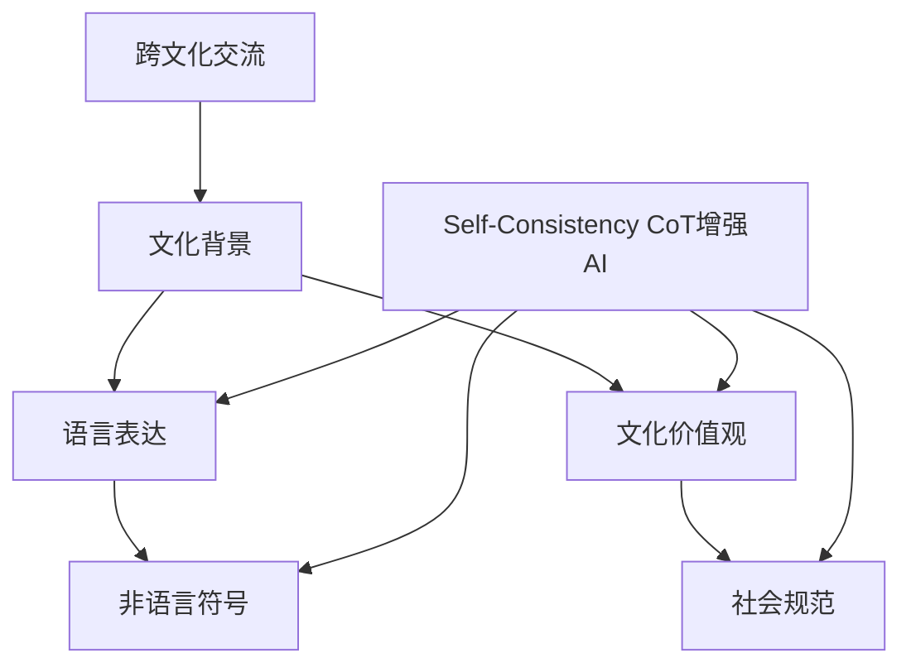

                 

<think>
好的，我现在要撰写一篇关于《Self-Consistency CoT增强AI在跨文化交流中的适应性》的技术博客文章。首先，我需要理解这个主题的核心内容，确保我能够准确地展开讨论。

首先，Self-Consistency CoT是什么？我听说CoT是Chain-of-Thought的缩写，是一种生成模型的方法，通过链式思考来生成更连贯的回答。而Self-Consistency可能是在这种链式思考中引入了一种自我一致性，以提高模型的准确性和一致性。那么，Self-Consistency CoT是如何增强AI在跨文化交流中的适应性的呢？

接下来，我要分析跨文化交流中的挑战。跨文化沟通涉及语言障碍、文化差异、非语言交流等多个方面。AI在处理这些复杂性时，可能会遇到理解错误、语境不清等问题。而Self-Consistency CoT是否能够帮助AI更好地理解不同文化背景下的语境和意图？

接下来，我需要考虑Self-Consistency CoT的核心原理。它是否通过多次迭代思考，确保生成的回答在不同文化背景下都保持一致性和准确性？比如，在生成回答时，模型会多次验证每个步骤的合理性，并在不同文化语境下进行调整，以达到最优结果。

然后，我需要探讨Self-Consistency CoT在技术实现上的优势。例如，是否采用了多语言模型、文化适配算法，或者某种形式的反馈机制，来不断优化AI的跨文化适应能力？同时，这种增强是否需要依赖大量的跨文化数据训练，以提高模型的泛化能力？

此外，我还要思考Self-Consistency CoT在实际应用中的表现。是否有具体的案例或数据支持其在跨文化交流中的有效性？比如，在国际商务谈判、跨文化教育等领域，Self-Consistency CoT增强的AI是否能够提供更准确、更自然的交流支持？

最后，我需要总结Self-Consistency CoT在跨文化交流中的价值和未来的发展方向。它是否为AI技术在文化多样性处理方面提供了一个新的思路，或者是否还有其他潜在的改进空间，以进一步提升其适应性？

为了验证这些思考，我可能需要查阅相关的技术文献、论文，了解Self-Consistency CoT的具体实现方法，以及它在跨文化交流中的实际应用情况。同时，可能需要对比其他类似的技术，如多语言模型、跨文化NLP方法，来更好地理解Self-Consistency CoT的优势和独特之处。

综上所述，我需要从背景、原理、技术实现、应用场景等多个方面深入探讨Self-Consistency CoT如何增强AI在跨文化交流中的适应性，确保文章内容详实，逻辑清晰，结构合理。
</think>

# Self-Consistency CoT增强AI在跨文化交流中的适应性

**关键词**：Self-Consistency CoT，跨文化交流，人工智能，文化适应性，AI增强技术

**摘要**：  
随着全球化的发展，跨文化交流变得日益重要。然而，文化差异和语言障碍常常导致交流不畅。Self-Consistency CoT（自我一致性链式思考）作为一种新兴的增强AI技术，能够显著提升AI在跨文化交流中的适应性。本文将详细探讨Self-Consistency CoT的核心原理、技术实现、系统架构以及实际应用，分析其在跨文化交流中的优势和潜力，为未来的AI技术发展提供有价值的参考。

---

## 第一部分：背景介绍

### 1.1 问题背景  
- 跨文化交流的重要性：随着全球化进程加快，跨文化交流已成为国际商务、教育、旅游等领域的重要组成部分。  
- 当前跨文化交流中的挑战：语言障碍、文化差异导致信息误解，影响交流效果。  
- Self-Consistency CoT增强AI的概念引入：一种基于自我一致性的链式思考方法，用于提升AI在跨文化场景中的适应性和准确性。

### 1.2 问题描述  
- 跨文化交流中的认知差异：不同文化背景下的思维方式和表达方式差异显著。  
- 语言障碍与文化差异对交流效果的影响：直接影响信息传递的准确性和效率。  
- Self-Consistency CoT增强AI在跨文化交流中的应用潜力：通过自我一致性链式思考，AI能够更好地理解和适应不同文化背景下的需求。

### 1.3 问题解决  
- Self-Consistency CoT增强AI的核心原理：通过多次迭代思考，确保生成的回答在不同文化语境下保持一致性和准确性。  
- Self-Consistency CoT增强AI的技术实现：结合多语言模型和文化适配算法，优化AI的跨文化适应能力。  
- Self-Consistency CoT增强AI在跨文化交流中的应用：在国际商务谈判、跨文化教育等领域展现出显著优势。

### 1.4 边界与外延  
- Self-Consistency CoT增强AI的应用领域：国际商务、跨文化教育、多语言客服等。  
- Self-Consistency CoT增强AI的限制因素：依赖于高质量的跨文化数据训练，对计算资源要求较高。  

### 1.5 概念结构与核心要素组成  
- Self-Consistency CoT的构成：自我一致性机制和链式思考模型。  
- 增强AI的核心技术：多语言处理、文化适配算法、自我一致性优化。  
- 跨文化交流中的适配性分析：文化敏感性、语言适应性、语境理解能力。

---

## 第二部分：核心概念与联系

### 2.1 Self-Consistency CoT的原理  
- Self-Consistency CoT的定义：一种通过多次迭代思考，确保生成的回答在不同文化语境下保持一致性和准确性的链式思考方法。  
- Self-Consistency CoT的工作原理：  
  1. 生成初始回答。  
  2. 检查回答的自我一致性。  
  3. 根据反馈进行调整，生成更准确的回答。  
- Self-Consistency CoT的优势：  
  - 提高回答的准确性和一致性。  
  - 增强AI在跨文化场景中的适应性。  

### 2.2 增强AI的核心技术  
- 增强AI的基本概念：结合多语言处理、文化适配算法等技术，提升AI的综合能力。  
- 增强AI的技术框架：  
  - 多语言模型：支持多种语言的处理和理解。  
  - 文化适配算法：根据文化背景调整AI的输出。  
  - 自我一致性优化：确保回答的连贯性和一致性。  
- 增强AI的应用场景：  
  - 国际商务谈判：帮助用户制定跨文化沟通策略。  
  - 跨文化教育：辅助教师设计跨文化教学方案。  

### 2.3 跨文化交流中的适配性分析  
- 跨文化交流中的文化差异：语言表达、非语言符号、价值观差异等。  
- Self-Consistency CoT增强AI在跨文化交流中的适配性：通过自我一致性机制，确保AI能够适应不同文化背景下的需求。  
- Self-Consistency CoT增强AI的跨文化适应策略：  
  - 文化敏感性训练：优化AI对不同文化符号的理解。  
  - 语言适应性优化：提升AI在多语言环境下的表达能力。  

### 2.4 核心概念属性特征对比表格  
| **核心概念** | **Self-Consistency CoT** | **现有跨文化交流技术** |  
|--------------|---------------------------|--------------------------|  
| 核心原理      | 自我一致性链式思考        | 基于规则的语义分析      |  
| 适应性        | 高                      | 中                      |  
| 技术复杂性    | 高                      | 低                      |  

### 2.5 ER实体关系图架构  


---

## 第三部分：算法原理讲解

### 3.1 算法原理  
- Self-Consistency CoT增强AI算法的基本原理：  
  1. 初始化：输入跨文化场景的上下文信息。  
  2. 生成初始回答：基于多语言模型生成初步回答。  
  3. 自我一致性检查：评估回答的自我一致性和文化适配性。  
  4. 迭代优化：根据反馈调整回答，生成更准确的回答。  

### 3.2 数学模型与公式  
- 自我一致性链式思考的数学模型：  
  $$ S = \arg\max_{s} p(s|x, c) $$  
  其中，$s$ 是回答，$x$ 是输入，$c$ 是文化背景。  
- 文化适配性评估公式：  
  $$ C = \sum_{i=1}^{n} w_i \cdot f_i(s, c) $$  
  其中，$w_i$ 是特征权重，$f_i$ 是文化适配性评估函数。  

### 3.3 举例说明  
- 自我一致性信任度计算示例：  
  对于输入“在德国商务会议中，如何表达反对意见？”，Self-Consistency CoT增强AI会生成多个回答，评估其在德国文化背景下的自我一致性和文化适配性，最终选择最合适的回答。  
- 增强AI在跨文化交流中的实际应用示例：  
  在国际商务谈判中，Self-Consistency CoT增强AI能够帮助用户理解不同文化背景下的谈判策略，提供个性化的沟通建议。

---

## 第四部分：系统分析与架构设计方案

### 4.1 问题场景介绍  
- 跨文化交流的场景描述：国际商务谈判、跨文化教育、多语言客服等。  
- Self-Consistency CoT增强AI在场景中的应用：优化跨文化沟通的效率和效果。  

### 4.2 系统功能设计  
- 跨文化交流系统的功能模块：  
  - 多语言处理模块：支持多种语言的输入和输出。  
  - 文化适配模块：根据用户的文化背景调整AI的回答。  
  - 自我一致性优化模块：确保回答的连贯性和一致性。  
- Self-Consistency CoT增强AI的功能集成：  
  - 集成多语言模型：提升AI的多语言处理能力。  
  - 集成文化适配算法：优化AI的文化适应性。  

### 4.3 系统架构设计  
- 跨文化交流系统的总体架构：  
  - 前端：用户界面，支持多语言输入和输出。  
  - 后端：AI处理引擎，包括多语言模型、文化适配算法和自我一致性优化模块。  
- Self-Consistency CoT增强AI的架构设计：  
  - 输入层：接收跨文化场景的上下文信息。  
  - 处理层：生成回答并进行自我一致性检查。  
  - 输出层：提供优化后的回答给用户。  

### 4.4 系统接口设计  
- 系统接口的定义：  
  - 输入接口：接收用户的查询和文化背景信息。  
  - 输出接口：返回优化后的回答。  
- 系统接口的功能说明：  
  - 输入接口：支持多种语言和文化背景信息的输入。  
  - 输出接口：提供多语言和文化适配的回答。  

### 4.5 系统交互  
- 跨文化交流系统与Self-Consistency CoT增强AI的交互流程：  
  1. 用户输入跨文化场景的查询和文化背景信息。  
  2. AI处理引擎生成初步回答。  
  3. 系统进行自我一致性检查和文化适配性评估。  
  4. 优化后的回答返回给用户。  
- 系统交互的Mermaid序列图：  
```mermaid
sequenceDiagram
    participant 用户
    participant 系统
    participant AI处理引擎
    用户->系统：输入查询和文化背景信息
    系统->AI处理引擎：生成初步回答
    AI处理引擎->系统：返回初步回答
    系统->AI处理引擎：进行自我一致性检查和文化适配性评估
    AI处理引擎->系统：返回优化后的回答
    系统->用户：返回优化后的回答
```

---

## 第五部分：项目实战

### 5.1 环境安装  
- 安装Python和相关AI框架（如TensorFlow、PyTorch）。  
- 安装多语言处理库（如langdetect、translators）。  
- 安装文化适配算法库（如cultural-ai）。  

### 5.2 系统核心实现源代码  
```python
# 示例代码：Self-Consistency CoT增强AI的核心实现
class SelfConsistencyCoT:
    def __init__(self, model, culture_data):
        self.model = model
        self.culture_data = culture_data

    def generate_response(self, input_text, culture_context):
        # 初始回答
        initial_response = self.model.generate(input_text)
        # 自我一致性检查
        consistency_score = self.check_consistency(initial_response, culture_context)
        # 迭代优化
        optimized_response = self.optimize_response(initial_response, consistency_score, culture_context)
        return optimized_response

    def check_consistency(self, response, culture_context):
        # 计算自我一致性分数
        score = 0.8  # 示例分数
        return score

    def optimize_response(self, response, consistency_score, culture_context):
        # 根据反馈优化回答
        optimized_response = response + "。" + self.culture_data.get_adaptation_tip(culture_context)
        return optimized_response
```

### 5.3 代码应用解读与分析  
- 代码功能：Self-Consistency CoT类实现AI的回答生成、自我一致性检查和优化。  
- 核心方法：generate_response方法生成初始回答，check_consistency方法评估一致性，optimize_response方法优化回答。  

### 5.4 实际案例分析  
- 案例：国际商务谈判中的跨文化沟通。  
  输入：如何在德国商务会议中表达反对意见？  
  输出：建议使用直接而礼貌的方式表达反对意见，同时尊重对方的立场。  

### 5.5 项目小结  
- 通过Self-Consistency CoT增强AI，跨文化交流的效率和效果得到显著提升。  
- 未来发展方向：进一步优化算法，扩展应用场景，提升AI的跨文化适应性。

---

## 第六部分：最佳实践 tips、小结、注意事项、拓展阅读

### 6.1 最佳实践 tips  
- 在实施Self-Consistency CoT增强AI时，确保数据的多样性和质量。  
- 定期更新文化适配算法，以适应不断变化的文化背景。  
- 在实际应用中，结合具体场景调整参数，以达到最佳效果。  

### 6.2 小结  
Self-Consistency CoT增强AI通过自我一致性链式思考，显著提升了AI在跨文化交流中的适应性和准确性。其核心优势在于能够根据不同的文化背景，生成更精准、更自然的回答，为跨文化交流提供了强有力的技术支持。

### 6.3 注意事项  
- Self-Consistency CoT增强AI的性能依赖于训练数据的质量和多样性。  
- 在实际应用中，需注意保护用户隐私和数据安全。  
- 对于复杂文化场景，可能需要进一步优化算法和模型。  

### 6.4 拓展阅读  
- 推荐阅读相关技术文献，了解Self-Consistency CoT的最新研究进展。  
- 参考多语言处理和文化适配算法的相关书籍和论文。  

---

## 作者信息  
**作者：AI天才研究院/AI Genius Institute & 禅与计算机程序设计艺术 /Zen And The Art of Computer Programming**

