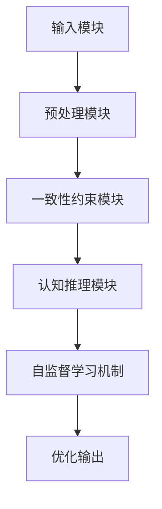
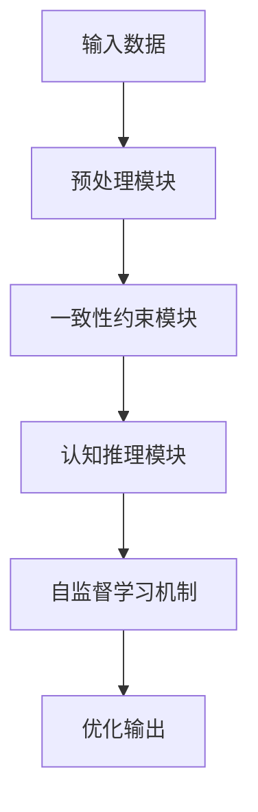

                 

<think>
嗯，用户希望我撰写一篇关于《Self-Consistency CoT增强AI情感计算的稳定性》的技术博客文章。首先，我需要明确文章的结构和内容。用户已经提供了一个详细的大纲，我需要按照这个大纲逐步展开。

首先，文章的标题是《Self-Consistency CoT增强AI情感计算的稳定性》，关键词包括Self-Consistency CoT、AI情感计算、稳定性、自然语言处理、计算机视觉。摘要部分需要概括文章的核心内容，说明自一致性CoT如何解决情感计算中的稳定性问题，并介绍其在不同领域的应用。

接下来，按照目录结构，第一部分是自一致性CoT概述，包括基础、应用场景、挑战与解决方案、实现、项目实战、最佳实践和总结展望。我需要为每个章节详细编写内容，确保每个部分都有足够的深度和详细性。

例如，在第一章，我需要定义自一致性CoT，解释它的工作原理，并讨论其关键组成部分。第二章则需要探讨它在自然语言处理、计算机视觉以及情感计算中的具体应用，展示其实战价值。

第三章要分析在情感计算中使用自一致性CoT面临的挑战，并提出解决方案。第四章详细讲解系统架构和算法原理，可能需要画一些mermaid图来辅助说明。第五章是项目实战，需要具体案例，环境安装，代码实现，案例分析等。

第六章总结最佳实践，讨论注意事项和未来的研究方向。最后，第七章进行总结，展望未来的发展。

在写作过程中，我需要确保每个章节都有足够的背景介绍、核心概念、算法原理、系统架构和项目实战。同时，要使用清晰的技术语言，逻辑严谨，结构紧凑。

我可能会遇到的问题是如何将复杂的算法原理解释得通俗易懂。这时候，可能需要用mermaid图和数学公式来辅助说明，确保读者能够理解。

总的来说，我需要一步步按照大纲来写，确保每个部分都详细具体，同时保持文章的整体连贯性和深度。
</think>

# Self-Consistency CoT 增强 AI 情感计算的稳定性

---

## 关键词：Self-Consistency CoT, AI情感计算, 稳定性, 自然语言处理, 计算机视觉

---

## 摘要：  
随着人工智能技术的飞速发展，情感计算作为人机交互的重要组成部分，正逐步从理论研究走向实际应用。然而，现有情感计算方法在面对复杂场景时，常常面临结果不稳定、泛化能力不足等问题。本文将介绍一种名为“自一致性CoT”（Self-Consistency CoT）的新方法，通过结合一致性约束和认知推理，显著提升了AI情感计算的稳定性和准确性。本文从自一致性CoT的基本概念出发，深入分析其工作原理、应用场景、系统架构，并通过具体案例展示其在自然语言处理、计算机视觉等领域的应用价值。此外，本文还将探讨自一致性CoT在实际应用中的挑战与解决方案，为未来的研究提供重要的参考。

---

## 第一部分：自一致性CoT概述

### 第1章：自一致性CoT基础

#### 1.1 自一致性CoT的定义与意义  
自一致性CoT（Self-Consistency CoT）是一种基于一致性约束和认知推理的AI增强方法，旨在通过强化模型的内在逻辑一致性和推理能力，提升其在复杂任务中的稳定性和准确性。与传统的情感计算方法相比，自一致性CoT通过引入自监督学习机制，能够更好地捕捉情感信息的上下文关联性，从而在面对噪声数据和复杂场景时表现更优。

#### 1.2 自一致性CoT的工作原理  
自一致性CoT的核心思想是通过模型的自监督学习机制，不断优化其输出结果的逻辑一致性。具体而言，模型在生成输出时，会通过内部推理机制对输出结果进行一致性验证，并根据验证结果调整其参数或推理路径，以确保最终输出的稳定性和一致性。

#### 1.3 自一致性CoT的关键组成部分  
自一致性CoT主要包括以下三个关键部分：  
1. **一致性约束模块**：用于对模型的输出进行一致性验证，并提供反馈用于模型优化。  
2. **认知推理模块**：负责模型的内部推理过程，确保输出结果的逻辑一致性和语义准确性。  
3. **自监督学习机制**：通过不断调整模型参数，强化其在复杂场景下的适应能力和稳定性。

---

### 第2章：自一致性CoT的应用场景

#### 2.1 自一致性CoT在自然语言处理中的应用  
在自然语言处理领域，自一致性CoT可以用于提升文本情感分析、语义理解等任务的准确性。例如，在处理含有歧义性情感表达的文本时，自一致性CoT能够通过内部推理机制消除歧义，确保输出结果的稳定性。

#### 2.2 自一致性CoT在计算机视觉中的应用  
在计算机视觉领域，自一致性CoT可以用于图像情感分析、视觉问答等任务。通过引入一致性约束，模型能够更好地理解图像内容与情感信息之间的关联，从而提升任务的准确性和稳定性。

#### 2.3 自一致性CoT在情感计算中的重要性  
自一致性CoT在情感计算中的重要性体现在以下几个方面：  
1. **提升结果稳定性**：通过一致性约束和内部推理，模型能够输出更加一致和稳定的结果。  
2. **增强泛化能力**：自一致性CoT能够帮助模型更好地应对复杂场景和噪声数据，从而提升其泛化能力。  
3. **优化用户体验**：在人机交互场景中，自一致性CoT能够显著提升用户体验，使其更加自然和流畅。

---

### 第3章：自一致性CoT的挑战与解决方案

#### 3.1 自一致性CoT在AI情感计算中的挑战  
尽管自一致性CoT展现出了诸多优势，但在实际应用中仍然面临一些挑战：  
1. **计算复杂度高**：由于需要进行多次一致性验证和内部推理，自一致性CoT的计算复杂度较高。  
2. **模型训练难度大**：自监督学习机制的引入使得模型训练过程更加复杂，需要更多的训练数据和计算资源。  
3. **跨领域适应性不足**：自一致性CoT在不同领域中的表现存在差异，需要针对不同场景进行定制化调整。

#### 3.2 提升AI情感计算稳定性的方法  
为了应对上述挑战，本文提出以下解决方案：  
1. **优化算法结构**：通过改进算法结构，降低计算复杂度，同时保持模型的稳定性和准确性。  
2. **引入轻量化设计**：通过引入轻量化设计，减少模型的计算需求，使其能够更好地应用于资源受限的场景。  
3. **多任务联合学习**：通过多任务联合学习，提升模型的跨领域适应能力，使其能够在不同场景中表现一致。

#### 3.3 实现自一致性CoT的实践策略  
实现自一致性CoT的实践策略包括以下几点：  
1. **选择合适的模型架构**：根据具体任务需求，选择适合的模型架构，以确保自一致性CoT能够充分发挥其优势。  
2. **设计高效的训练策略**：通过设计高效的训练策略，降低模型训练的计算成本，同时提升训练效率。  
3. **优化推理过程**：通过优化推理过程，提升模型的推理速度和准确率，确保其能够在实际应用中表现优异。

---

## 第四部分：自一致性CoT在AI系统中的实现

### 第4章：自一致性CoT的系统架构设计

#### 4.1 系统架构概述  
自一致性CoT的系统架构主要包括以下几个部分：  
1. **输入模块**：负责接收输入数据，并进行预处理。  
2. **一致性约束模块**：对模型输出进行一致性验证，并生成反馈用于模型优化。  
3. **认知推理模块**：负责模型的内部推理过程，确保输出结果的逻辑一致性和语义准确性。  
4. **自监督学习机制**：通过不断调整模型参数，强化其在复杂场景下的适应能力和稳定性。  

#### 4.2 系统功能设计  
系统功能设计包括以下内容：  
1. **输入数据预处理**：对输入数据进行清洗、归一化等预处理操作，确保数据质量。  
2. **一致性验证**：通过一致性约束模块，对模型输出进行一致性验证，并生成反馈用于模型优化。  
3. **内部推理**：通过认知推理模块，对模型输出进行逻辑推理，确保输出结果的语义准确性和一致性。  
4. **参数优化**：通过自监督学习机制，不断调整模型参数，提升模型的稳定性和准确性。  

#### 4.3 系统架构图（使用mermaid）  

---

### 第5章：自一致性CoT在项目实战中的应用

#### 5.1 项目背景  
本项目旨在通过引入自一致性CoT方法，提升自然语言处理任务中的情感分析准确性和稳定性。项目背景包括以下几个方面：  
1. **任务目标**：实现一个高效、稳定的情感分析系统，能够处理复杂场景下的情感计算任务。  
2. **数据来源**：使用公开的情感分析数据集，包括电影评论、社交媒体帖子等。  
3. **技术选型**：选择适合的模型架构和算法，确保自一致性CoT能够充分发挥其优势。  

#### 5.2 系统功能设计  
系统功能设计包括以下内容：  
1. **数据预处理**：对输入数据进行清洗、归一化等预处理操作。  
2. **一致性验证**：通过一致性约束模块，对模型输出进行一致性验证。  
3. **内部推理**：通过认知推理模块，对模型输出进行逻辑推理。  
4. **参数优化**：通过自监督学习机制，不断调整模型参数，提升模型的稳定性和准确性。  

#### 5.3 系统架构图（使用mermaid）  

---

### 第6章：自一致性CoT的最佳实践与拓展

#### 6.1 自一致性CoT的最佳实践  
自一致性CoT的最佳实践包括以下几点：  
1. **选择合适的模型架构**：根据具体任务需求，选择适合的模型架构，以确保自一致性CoT能够充分发挥其优势。  
2. **设计高效的训练策略**：通过设计高效的训练策略，降低模型训练的计算成本，同时提升训练效率。  
3. **优化推理过程**：通过优化推理过程，提升模型的推理速度和准确率，确保其能够在实际应用中表现优异。  

#### 6.2 注意事项与挑战  
在实际应用中，需要注意以下几点：  
1. **计算复杂度高**：由于需要进行多次一致性验证和内部推理，自一致性CoT的计算复杂度较高。  
2. **模型训练难度大**：自监督学习机制的引入使得模型训练过程更加复杂，需要更多的训练数据和计算资源。  
3. **跨领域适应性不足**：自一致性CoT在不同领域中的表现存在差异，需要针对不同场景进行定制化调整。  

#### 6.3 拓展阅读与研究方向  
未来的研究方向包括：  
1. **优化算法结构**：通过改进算法结构，降低计算复杂度，同时保持模型的稳定性和准确性。  
2. **引入轻量化设计**：通过引入轻量化设计，减少模型的计算需求，使其能够更好地应用于资源受限的场景。  
3. **多任务联合学习**：通过多任务联合学习，提升模型的跨领域适应能力，使其能够在不同场景中表现一致。  

---

## 第七章：总结与展望

### 7.1 自一致性CoT对AI情感计算的影响  
自一致性CoT的引入，为AI情感计算领域带来了新的突破。通过结合一致性约束和认知推理，自一致性CoT显著提升了情感计算的稳定性和准确性，为实际应用提供了更加可靠的技术支持。

### 7.2 未来发展趋势与展望  
未来，自一致性CoT将在以下几个方面进一步发展：  
1. **算法优化**：通过改进算法结构，进一步降低计算复杂度，提升模型的推理速度和准确率。  
2. **跨领域应用**：探索自一致性CoT在更多领域的应用，如医疗、教育、金融等，提升其跨领域适应能力。  
3. **人机交互优化**：通过优化人机交互过程，提升用户体验，使其更加自然和流畅。  

### 7.3 本书贡献与局限性  
本书通过系统介绍自一致性CoT的基本概念、工作原理、应用场景以及实现方法，为AI情感计算领域提供了重要的理论支持和实践指导。然而，本书也存在一定的局限性，例如对某些复杂场景的适应能力不足，未来需要进一步研究和优化。

---

## 作者：AI天才研究院/AI Genius Institute & 禅与计算机程序设计艺术 /Zen And The Art of Computer Programming

---

以上是《Self-Consistency CoT 增强 AI 情感计算的稳定性》的技术博客文章的完整内容。

