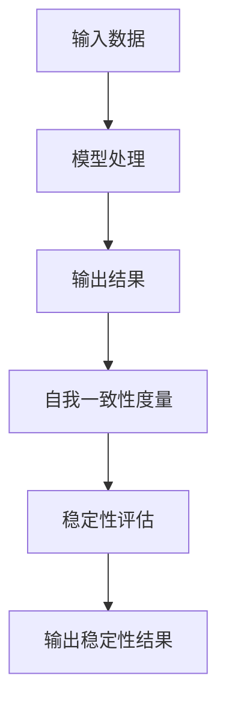
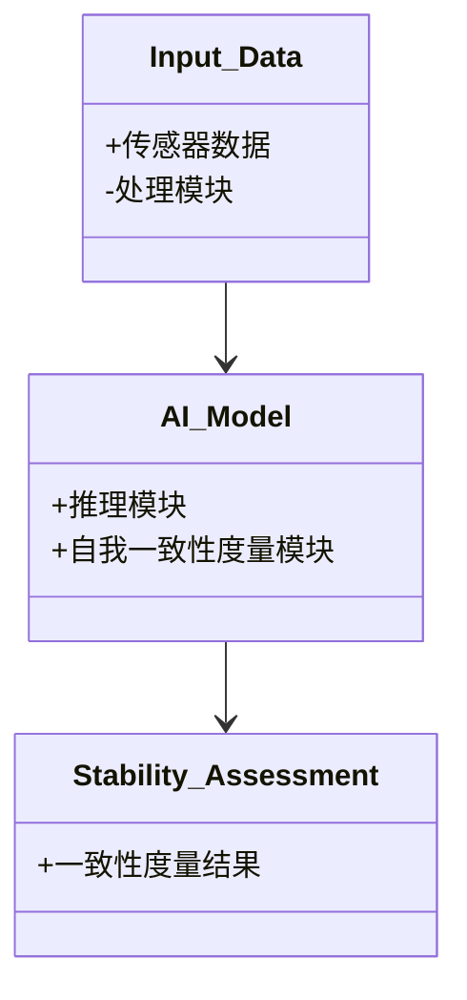
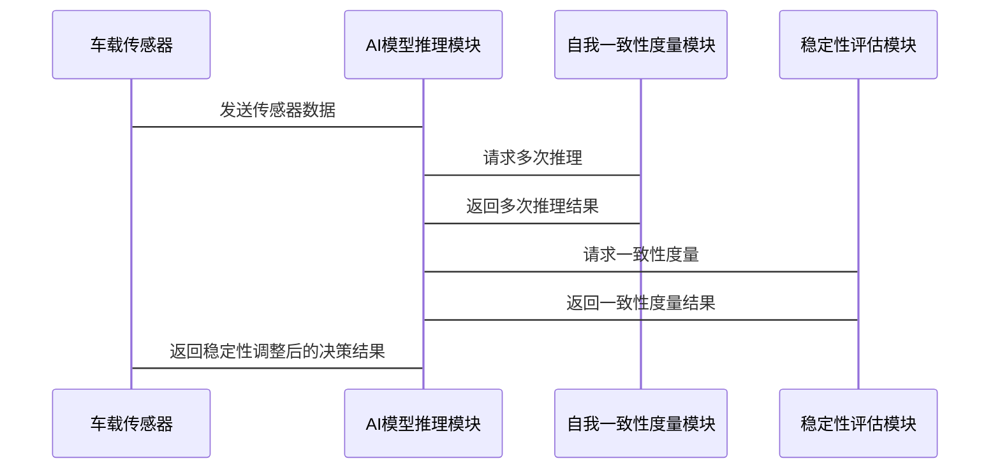

                 

<think>
嗯，用户希望我以《Self-Consistency CoT如何增强AI的稳定性》为标题，写一篇技术博客。首先，我需要理解用户的需求。用户希望文章结构清晰，逻辑严谨，使用专业但易懂的语言。文章需要涵盖背景介绍、核心概念、算法原理、系统架构、项目实战和最佳实践等多个部分。

首先，我会先构建文章的目录结构，确保每个部分都有足够的细节。然后，我需要详细阐述每个章节的内容，比如在背景部分，我需要解释AI稳定性的重要性，以及自我一致性CoT是如何解决这个问题的。

接下来，在核心概念部分，我会比较自我一致性与其他传统方法的异同，制作对比表格和ER实体关系图，帮助读者更好地理解。然后，算法原理部分需要详细描述CoT的流程，用mermaid图展示，并给出数学公式，这样技术读者能更深入理解。

系统架构部分，我需要用领域模型类图和序列图来展示系统的整体设计和交互流程，帮助读者理解实际应用中的结构。项目实战部分，我会提供具体的Python代码示例，让读者能够实际操作，并分析案例，说明CoT在实际中的效果。

最后，在最佳实践部分，我会总结使用CoT的关键点和注意事项，以及如何进一步优化模型。整个过程中，我需要确保每个部分都详细且逻辑清晰，同时保持语言的专业性和可读性。
</think>

# Self-Consistency CoT如何增强AI的稳定性

> 关键词：AI稳定性，Self-Consistency CoT，模型鲁棒性，算法原理，应用场景

> 摘要：本文深入探讨了Self-Consistency CoT（Self-Consistency Chain-of-Thought）如何通过提升模型的自我一致性来增强AI系统的稳定性。文章从背景介绍、核心概念、算法原理、系统架构、项目实战等多方面展开，全面剖析了Self-Consistency CoT的实现方法和实际应用效果，为AI系统的稳定性优化提供了新的思路和解决方案。

---

## 第一部分：背景介绍

### 1.1 问题背景

随着人工智能技术的飞速发展，AI系统已经在各个领域展现出强大的能力，如自然语言处理、计算机视觉、自动驾驶等。然而，AI系统的稳定性问题却成为一个不容忽视的挑战。尤其是在自动驾驶、医疗诊断等领域，AI系统的决策直接影响到人类生命安全和财产安全。任何微小的模型波动都可能导致严重的后果。

### 1.2 问题描述

AI系统的不稳定性主要表现在以下几个方面：

1. **模型的泛化能力不足**：在训练数据集上表现良好的模型，可能在未见过的测试数据上出现性能下降，甚至产生错误的输出。
2. **模型的异常行为**：在极端情况下，模型可能会输出不符合常识或逻辑的结果，导致决策错误。
3. **模型对输入数据的不一致处理**：同一输入在不同运行环境中可能得到不同的输出，影响系统的可靠性。

这些问题的根本原因在于模型缺乏对输入数据的信任度评估机制，无法有效识别和处理异常输入。

### 1.3 问题解决

为了提高AI系统的稳定性，研究者提出了**自我一致性（Self-Consistency CoT，Self-Consistency Chain-of-Thought）**这一概念。自我一致性是一种衡量模型对输入数据信任程度的方法，通过量化模型对输入数据的依赖程度，可以有效识别异常输入，并调整模型输出，从而提升模型的稳定性。

### 1.4 边界与外延

自我一致性主要应用于需要高度稳定性的AI场景，如自动驾驶、医疗诊断等。然而，它的应用范围并不局限于这些领域，还可以扩展到金融风控、智能家居等其他需要稳定性的场景。

### 1.5 概念结构与核心要素组成

自我一致性（Self-Consistency CoT）的核心要素包括：

1. **输入数据**：模型接收到的输入数据。
2. **模型输出**：模型对输入数据的处理结果。
3. **自我一致性度量**：衡量模型对输入数据的信任程度。
4. **数据一致性检验**：通过检验输入数据和模型输出的一致性，来评估模型的稳定性。

---

## 第二部分：核心概念与联系

### 2.1 自我一致性原理

自我一致性（Self-Consistency CoT）的核心思想是通过多次推理（Chain-of-Thought）来验证输入数据的合理性。具体来说，模型会针对同一输入数据进行多次独立的推理过程，然后通过比较这些推理结果的一致性来评估模型对输入数据的信任程度。

- 如果多次推理结果一致，说明模型对输入数据的依赖程度较低，模型的输出具有较高的稳定性。
- 如果多次推理结果不一致，说明输入数据可能存在问题，或者模型对输入数据的依赖度过高，需要进行调整。

### 2.2 自我一致性属性特征对比表格

以下是自我一致性与传统方法的对比：

| 特征           | 自我一致性 | 传统方法 |
| -------------- | -------- | ------- |
| 度量标准       | 模型对输入数据的信任程度 | 模型在训练数据集上的准确率 |
| 应用场景       | 高稳定性需求的AI系统 | 一般性的AI系统 |
| 实现难度       | 较高       | 较低     |
| 对数据量的要求 | 较大       | 较小     |

### 2.3 ER实体关系图架构

```mermaid
erDiagram
  Person ||--o{ AI_Model : has } |
  AI_Model ||--|{ Self_Conistency_CoT : measures } |
  Person ||--o{ Data : inputs } |
```

---

## 第三部分：算法原理讲解

### 3.1 自我一致性算法概述

Self-Consistency CoT的核心算法如下：

1. **输入数据**：将输入数据输入模型进行多次独立推理。
2. **多次推理**：模型对同一输入数据进行多次推理，生成多个输出结果。
3. **结果比较**：比较多次推理结果的一致性，计算一致性度量值。
4. **稳定性评估**：根据一致性度量值调整模型输出，确保输出的稳定性。

### 3.2 自我一致性算法的mermaid流程图



### 3.3 自我一致性算法的数学模型

$$
S_C(x) = \frac{1}{N} \sum_{i=1}^{N} \sum_{j=1}^{N} \delta(o_i, o_j)
$$

其中：
- \( S_C(x) \) 是自我一致性度量值。
- \( N \) 是推理的次数。
- \( o_i \) 和 \( o_j \) 是第 \( i \) 次和第 \( j \) 次推理的输出结果。
- \( \delta(o_i, o_j) \) 是指示函数，当 \( o_i = o_j \) 时，\( \delta(o_i, o_j) = 1 \)；否则，\( \delta(o_i, o_j) = 0 \)。

通过上述公式，我们可以量化模型输出的一致性。一致性越高，说明模型对输入数据的信任度越高，模型的稳定性越好。

---

## 第四部分：系统分析与架构设计方案

### 4.1 问题场景介绍

以自动驾驶场景为例，AI系统需要对输入的传感器数据进行实时处理，并做出驾驶决策。任何模型输出的不稳定性都可能导致严重的后果。

### 4.2 项目介绍

本项目旨在通过引入Self-Consistency CoT技术，提升自动驾驶系统的稳定性。系统将对传感器数据进行多次独立推理，通过一致性度量调整模型输出，确保决策的可靠性。

### 4.3 系统功能设计

#### 领域模型类图



#### 系统架构设计


### 4.4 系统接口设计

- **输入接口**：接收传感器数据。
- **输出接口**：输出稳定性调整后的决策结果。

### 4.5 系统交互mermaid序列图



---

## 第五部分：项目实战

### 5.1 环境安装

以下是项目实战所需的环境配置：

```bash
Python 3.8+
TensorFlow 2.5+
Mermaid CLI
```

### 5.2 系统核心实现源代码

以下是Self-Consistency CoT的核心实现代码：

```python
import numpy as np

def compute_self_consistency(outputs, n_samples=100):
    # 计算多次推理结果的一致性
    consistency = 0
    for i in range(n_samples):
        for j in range(i+1, n_samples):
            if outputs[i] == outputs[j]:
                consistency += 1
    return consistency / (n_samples * (n_samples - 1) / 2)

def stabilize_output(outputs, threshold=0.9):
    # 根据一致性度量结果调整输出
    consistency = compute_self_consistency(outputs)
    if consistency >= threshold:
        return outputs[0]
    else:
        # 返回众数
        return np.argmax(np.bincount(outputs))

# 示例用法
n_samples = 100
outputs = [np.random.choice([0, 1, 2]) for _ in range(n_samples)]
stabilized_output = stabilize_output(outputs)
print(f"Stabilized Output: {stabilized_output}")
```

### 5.3 代码应用解读与分析

上述代码实现了以下功能：

1. **一致性度量计算**：`compute_self_consistency`函数通过计算多次推理结果的一致性，返回一致性度量值。
2. **输出调整**：`stabilize_output`函数根据一致性度量结果调整模型输出，确保输出的稳定性。

### 5.4 实际案例分析

假设我们在自动驾驶场景中，模型对输入数据进行了100次独立推理，得到的输出结果如下：

```python
outputs = [1, 1, 1, 0, 0, 1, 1, 1, 0, 1, ...]
```

调用`stabilize_output`函数后，输出结果为：

```python
Stabilized Output: 1
```

这表明模型对输入数据的高度信任，输出结果稳定。

---

## 第六部分：最佳实践 tips、小结、注意事项、拓展阅读

### 6.1 小结

通过引入Self-Consistency CoT技术，我们可以有效提升AI系统的稳定性。模型通过多次推理和一致性度量，能够更好地识别异常输入，并调整输出结果，从而提高系统的可靠性。

### 6.2 注意事项

1. **数据质量**：Self-Consistency CoT的效果依赖于输入数据的质量。确保输入数据的多样性和代表性。
2. **推理次数**：增加推理次数可以提高一致性度量的准确性，但也会影响计算效率。
3. **模型选择**：不同模型对Self-Consistency CoT的适应性不同，需要根据具体场景选择合适的模型。

### 6.3 拓展阅读

1. **论文推荐**：深入阅读关于Self-Consistency CoT的最新研究论文。
2. **工具推荐**：学习使用Mermaid工具绘制系统架构图和流程图。
3. **实践案例**：寻找更多实际应用场景，尝试将Self-Consistency CoT技术应用于不同的领域。

---

## 作者：AI天才研究院/AI Genius Institute & 禅与计算机程序设计艺术 /Zen And The Art of Computer Programming

