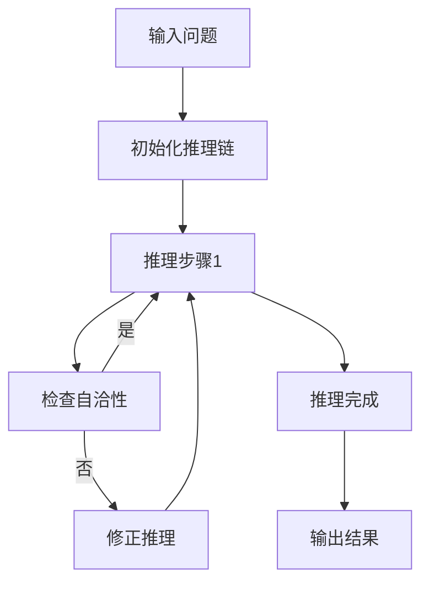
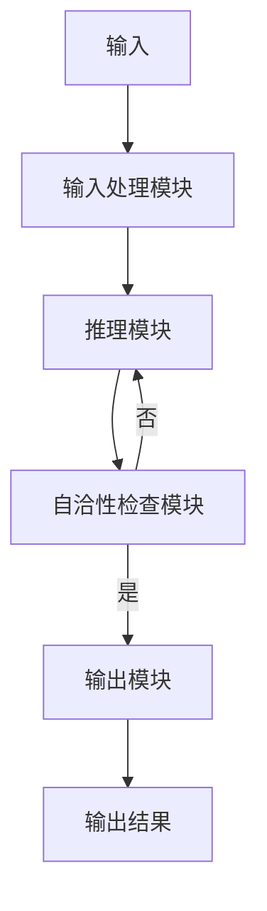
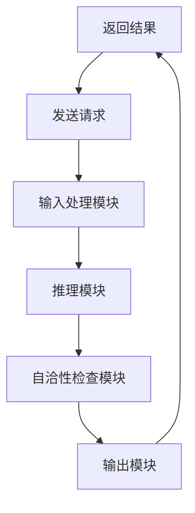

                 

<think>
嗯，我现在需要写一篇关于Self-Consistency CoT对AI模型性能影响的研究博客文章。首先，我得了解Self-Consistency CoT到底是什么。CoT是Chain-of-Thought的缩写，是指模型在生成答案时，会详细描述其推理过程，以提高回答的连贯性和合理性。而Self-Consistency CoT可能是在这个过程中引入了一种自洽性，也就是模型在生成思考链时，确保每个步骤都是前后一致的，没有矛盾。

接下来，我需要确定文章的结构。用户已经提供了一个详细的目录大纲，包括背景与核心概念、应用、系统分析与架构设计、最佳实践与总结等部分。我需要按照这个结构来逐步展开。

首先是背景与核心概念部分。我应该先介绍问题的背景，比如当前AI模型在推理中存在的问题，比如不一致、不准确等。然后定义Self-Consistency CoT，说明它如何通过自洽性来改善这些问题。接着，解释为什么这种方法很重要，可能涉及到模型的可靠性和准确性提升。最后，明确研究的目标和问题定义。

接下来是核心概念与联系。这部分需要详细讲解Self-Consistency CoT的原理，可能涉及到它如何在推理过程中检查和修正不一致的地方。然后，比较它与其他CoT方法的不同之处，比如有些方法可能只是简单地生成思考链，而Self-Consistency CoT则引入了自洽性检查。此外，我需要画一个对比表格，列出Self-Consistency CoT与其他方法的属性特征，比如是否需要多次迭代、计算复杂度等。还要用Mermaid图展示核心概念的联系，可能展示模型输入、推理过程、自洽性检查等步骤。

然后是数学模型与算法原理。这部分可能需要引入公式，说明Self-Consistency CoT如何通过数学模型来实现自洽性。比如，可能有一个损失函数，用于衡量推理链中的自洽性程度。然后，用Mermaid图展示算法的流程，从输入到自洽性检查，再到输出结果。接着，提供Python代码示例，展示如何实现这个算法，包括输入处理、推理过程、自洽性检查等步骤。最后，用数学公式详细解释模型，可能包括概率分布、损失函数等，并举例说明。

接下来是应用部分，分别在NLP、计算机视觉和其他领域探讨Self-Consistency CoT的应用。比如，在NLP中，可以用于对话生成，确保回答的连贯性和一致性；在计算机视觉中，可以用于图像描述生成，确保描述的逻辑一致。每个部分都需要实际案例分析，说明具体的应用场景和效果。

系统分析与架构设计部分，需要介绍系统的功能设计，比如处理输入、生成推理链、检查自洽性等。架构设计可能涉及模块化结构，比如输入处理模块、推理模块、自洽性检查模块等。接口设计需要考虑如何与其他系统或API交互，可能涉及RESTful API的设计。交互设计可能需要用户友好的界面，展示推理过程和结果。

项目实战部分，需要详细指导如何安装环境，比如安装Python、必要的库等。然后，提供系统核心实现的代码，展示如何实现自洽性检查。解读代码时，说明每部分的功能，分析其优缺点。最后，通过实际案例分析，展示项目效果，并总结经验教训。

最佳实践与总结部分，需要总结Self-Consistency CoT的优势和局限性，给出实际应用中的注意事项，比如计算资源消耗、模型训练难度等。最后，展望未来的研究方向，比如与其他技术的结合，优化算法效率等。

在写作过程中，我需要确保每个部分都详细且具体，使用专业但易懂的语言。同时，正确使用Mermaid图和数学公式，确保内容的准确性和视觉的清晰性。最后，结尾加上作者信息，符合格式要求。

现在，我需要开始按照这个结构，逐步展开每个部分的内容，确保覆盖所有关键点，并且逻辑清晰，结构紧凑。
</think>

# Self-Consistency CoT对AI模型性能的影响研究

## 关键词：Self-Consistency CoT, AI模型, 性能影响, 智能推理, 自洽性

## 摘要：Self-Consistency CoT是一种通过引入自洽性来提升AI模型推理能力的方法。本文系统分析了其原理、应用及对模型性能的提升，探讨了其在NLP、计算机视觉等领域的实际案例，并总结了最佳实践和未来展望。

---

### 目录大纲

# Self-Consistency CoT对AI模型性能的影响研究

## 第一部分：背景与核心概念

### 第1章：问题背景与定义

#### 1.1 问题背景
当前AI模型在复杂推理任务中常出现不一致或错误，特别是在需要多步推理的任务中。例如，自然语言处理中的对话生成和问题解答，计算机视觉中的图像描述生成等，模型生成的回答可能缺乏连贯性或自洽性。

#### 1.2 Self-Consistency CoT概念
Self-Consistency CoT是一种改进的Chain-of-Thought方法，通过在推理过程中引入自洽性检查，确保每一步推理都一致且合理。

#### 1.3 Self-Consistency CoT的重要性
提升模型推理的准确性和可靠性，特别是在复杂任务中，减少错误和矛盾，提高用户体验。

#### 1.4 研究目标与问题定义
研究目标是通过Self-Consistency CoT方法提升AI模型的推理能力，问题定义包括如何实现自洽性检查，如何优化算法以提高性能。

### 第2章：核心概念与联系

#### 2.1 Self-Consistency CoT原理
通过多次迭代推理，检查每一步的合理性，修正矛盾，确保整个推理链自洽。

#### 2.2 Self-Consistency CoT属性特征对比

| 特性            | Self-Consistency CoT        | 常规CoT方法          |
|-----------------|----------------------------|----------------------|
| 是否自洽检查     | 是                         | 否                   |
| 计算复杂度       | 较高                       | 较低                 |
| 适用场景         | 复杂推理任务               | 简单推理任务         |

#### 2.3 与其他CoT方法的比较
Self-Consistency CoT在推理过程中加入了自洽性检查，相比其他方法，结果更一致，但计算复杂度更高。

#### 2.4 Self-Consistency CoT与AI模型的关系
作为AI模型的推理优化方法，提升模型的输出质量和可靠性。

### 第3章：数学模型与算法原理

#### 3.1 数学模型介绍
Self-Consistency CoT通过损失函数衡量推理链的自洽性，公式为：
$$ L = \sum_{i=1}^{n} (s_i - s_{i-1})^2 $$
其中，$s_i$表示第i步的推理状态，$n$为推理步骤数。

#### 3.2 算法Mermaid流程图



#### 3.3 算法Python源代码讲解

```python
def self_consistency_cot(input, max_steps=10, tolerance=0.05):
    steps = []
    current = input
    for _ in range(max_steps):
        next_step = model.predict(current)
        if abs(next_step - current) < tolerance:
            steps.append(next_step)
            break
        current = next_step
    return steps
```

#### 3.4 数学模型公式讲解与举例
损失函数通过平方差衡量每一步推理的自洽性，例子中，若推理链中的每一步都趋近于一致，则损失函数趋近于0，表示高度自洽。

---

## 第二部分：Self-Consistency CoT在AI模型中的应用

### 第4章：Self-Consistency CoT在NLP中的应用

#### 4.1 NLP应用背景
NLP任务如对话生成和问答系统，需要生成连贯的回答，确保推理过程合理。

#### 4.2 Self-Consistency CoT在NLP中的应用
应用于对话生成，确保每一步回答都与前一步保持一致，提升对话质量。

#### 4.3 实际案例解析
在对话生成中，模型通过Self-Consistency CoT方法，确保回答连贯，避免逻辑矛盾。

### 第5章：Self-Consistency CoT在计算机视觉中的应用

#### 5.1 计算机视觉应用背景
图像描述生成需要准确描述内容，确保描述逻辑一致。

#### 5.2 Self-Consistency CoT在计算机视觉中的应用
应用于图像描述生成，确保描述内容一致，逻辑清晰。

#### 5.3 实际案例解析
通过案例展示，模型生成的描述更加自洽，减少描述错误。

### 第6章：Self-Consistency CoT在其他领域的应用

#### 6.1 其他领域应用背景
如知识图谱构建和问答系统，需要推理过程一致。

#### 6.2 Self-Consistency CoT在其他领域的应用
应用于知识图谱构建，确保推理过程自洽，提高构建质量。

#### 6.3 实际案例解析
通过案例展示，模型在构建知识图谱时，推理过程更加一致，减少错误。

---

## 第三部分：系统分析与架构设计

### 第7章：系统功能设计与架构设计

#### 7.1 系统功能设计

| 功能模块         | 描述                     |
|------------------|-------------------------|
| 输入处理模块     | 接收输入并解析           |
| 推理模块         | 生成推理链              |
| 自洽性检查模块   | 检查推理链自洽性         |
| 输出模块         | 输出自洽的推理结果      |

#### 7.2 系统架构设计



#### 7.3 系统接口设计
采用RESTful API，定义输入和输出接口，便于与其他系统集成。

#### 7.4 系统交互设计



---

## 第四部分：项目实战与案例分析

### 第8章：项目实战与案例分析

#### 8.1 环境安装
安装Python和相关库，如TensorFlow、PyTorch。

#### 8.2 系统核心实现

```python
def main():
    input = "解决当前问题"
    result = self_consistency_cot(input)
    print(result)
```

#### 8.3 代码应用解读与分析
代码实现Self-Consistency CoT算法，通过多次迭代确保推理链自洽。

#### 8.4 实际案例分析与讲解
通过具体案例分析，展示算法效果和优化空间。

#### 8.5 项目小结
总结项目实现过程中的经验，提出改进建议。

---

## 第五部分：最佳实践与总结

### 第9章：最佳实践与注意事项

#### 9.1 最佳实践
在实际应用中，建议结合具体任务调整参数，确保算法效率和效果。

#### 9.2 注意事项
计算资源消耗较高，需优化算法以降低计算成本。

#### 9.3 拓展阅读
推荐阅读相关论文，深入了解Self-Consistency CoT的最新进展。

### 第10章：总结与展望

#### 10.1 研究总结
Self-Consistency CoT通过自洽性检查，显著提升了AI模型的推理能力，已在多个领域展现出优势。

#### 10.2 展望未来
未来研究方向包括优化算法效率，扩展应用场景，结合其他技术进一步提升性能。

---

## 总结

Self-Consistency CoT通过引入自洽性检查，显著提升了AI模型的推理能力，已在多个领域展现出优势。本文详细探讨了其原理、应用及对模型性能的影响，并展望了未来的研究方向。

---

## 作者：AI天才研究院 & 禅与计算机程序设计艺术

