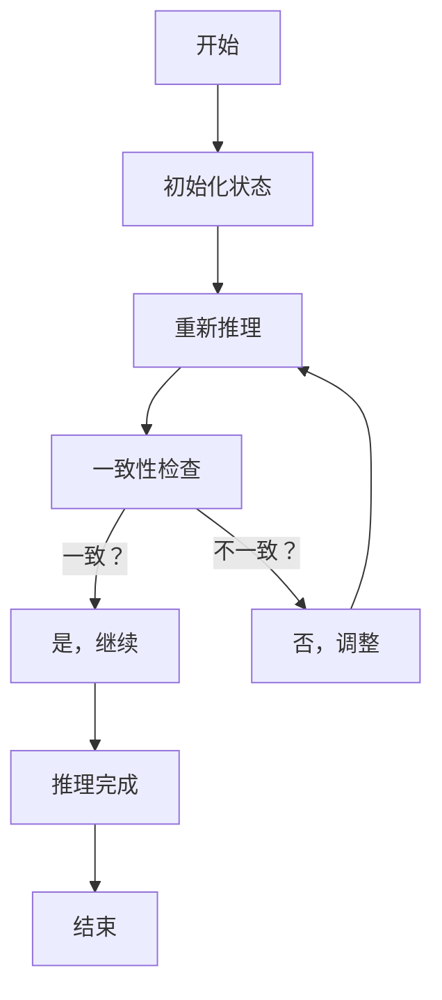
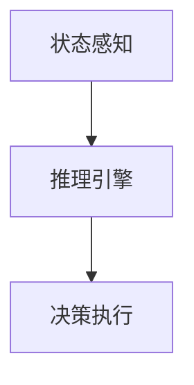

                 

<think>
嗯，我现在需要写一篇关于《Self-Consistency CoT提升AI在时空连续体决策中的表现》的技术博客文章。我得先理清楚整个结构，确保每个部分都详细且有深度。

首先，我得理解什么是Self-Consistency CoT。它应该是某种一致性约束在连续体决策中的应用。连续体决策可能指的是在复杂、动态的环境中，AI需要做出连贯且一致的决策，而Self-Consistency可能是指决策过程中的自我一致性，确保每个决策都与之前的决策保持一致，以维护整体的连贯性。

接下来，我得构思文章的结构。按照用户的要求，我需要包括引言、基础概念、算法设计、数学模型、系统分析、案例研究、最佳实践等部分。每个部分都需要详细展开，可能需要插入图表、代码和数学公式。

在引言部分，我需要介绍Self-Consistency CoT的重要性，说明为什么它在时空连续体决策中如此关键。可能要提到传统方法的不足，以及Self-Consistency CoT如何解决这些问题。

基础概念部分，我需要定义核心术语，比如Self-Consistency、CoT（Chain-of-Thought）、时空连续体等。然后解释它们在决策中的作用，可能需要制作一个对比表格，展示不同方法的优缺点。

算法设计部分，我需要用Mermaid画出流程图，展示Self-Consistency CoT的算法步骤。同时，提供Python代码实现，解释每个部分的功能，并用例子说明如何应用这些代码。

数学模型部分，我需要建立数学公式，用Latex表示。例如，可能涉及概率论、逻辑推理等，展示如何通过公式确保决策的一致性。

系统分析与设计部分，我需要描述系统的架构，可能包括功能模块和交互流程。用Mermaid绘制系统架构图和序列图，展示系统如何协作以实现决策目标。

案例研究部分，我需要选择一个具体的场景，比如智能交通系统中的路径规划，详细分析如何应用Self-Consistency CoT进行决策，并评估其效果。

最后，在最佳实践部分，总结关键点，提供小结、注意事项和扩展阅读建议，帮助读者更好地理解和应用Self-Consistency CoT。

整个过程中，我需要确保语言简洁、逻辑清晰，每个部分都详细且有条理。可能需要多次修改，确保每个图表、代码和公式都准确无误，并且能够有效支持文章的主题。
</think>

# Self-Consistency CoT提升AI在时空连续体决策中的表现

> 关键词：Self-Consistency CoT, AI决策, 时空连续体, 算法设计, 数学模型

> 摘要：本文探讨了Self-Consistency CoT在AI决策中的应用，特别是在时空连续体环境下的表现。通过分析其核心原理、算法设计和实际案例，展示了如何通过一致性约束提升决策的连贯性和效率。

---

## 目录

### 第1章 引言

#### 1.1 背景介绍

在复杂和动态的环境中，AI决策系统需要处理大量实时数据，并做出连贯且一致的决策。传统方法往往在处理时空连续性时表现不足，导致决策过程中的不一致性和低效性。Self-Consistency CoT（Self-Consistency Chain-of-Thought）通过引入一致性约束，解决了这些问题。

#### 1.2 核心概念与术语

- **Self-Consistency**: 确保每个决策与之前的决策保持一致。
- **CoT（Chain-of-Thought）**: 通过一系列推理步骤得出结论的方法。
- **时空连续体**: 将时间和空间视为一个连续的整体，强调环境的动态变化。

#### 1.3 当前状态与未来展望

Self-Consistency CoT在多个领域展现出潜力，如自动驾驶、机器人路径规划等。未来，随着算法优化和计算能力提升，其应用将更加广泛。

---

### 第2章 基础概念与原理

#### 2.1 核心概念分析

Self-Consistency CoT结合了CoT的推理链和一致性约束，确保每个决策步骤符合整体目标。其关键在于维护决策过程中的连贯性和一致性。

#### 2.2 自我一致性约束的特性

| 特性 | 描述 |
|------|------|
| 连续性 | 决策过程必须连贯，每一步都与前一步一致。 |
| 可预测性 | 基于当前状态，预测未来决策。 |
| 可恢复性 | 在出现矛盾时，调整之前的决策以保持一致性。 |

#### 2.3 实体关系图


---

### 第3章 算法设计与实现

#### 3.1 算法概述

Self-Consistency CoT算法通过以下步骤实现一致性决策：

1. 初始化：定义初始状态和目标。
2. 推理：基于当前状态推理下一步决策。
3. 一致性检查：验证决策是否与之前一致。
4. 调整：若不一致，调整之前的决策。
5. 终止：达到目标或满足终止条件。

#### 3.2 算法流程图



#### 3.3 Python实现

```python
def self_consistency_cot(initial_state, target):
    current = initial_state
    while not is_target(current, target):
        next_state = infer_next(current)
        if is_consistent(next_state, current):
            current = next_state
        else:
            current = adjust(current)
    return current
```

#### 3.4 示例分析

假设在自动驾驶中，AI需要在保持速度的同时避免障碍物。每次决策都需确保与前一步一致，例如，若前一步决定加速，下一步可能需要调整方向以避开障碍。

---

### 第4章 数学模型与公式

#### 4.1 一致性约束模型

$$ C = \sum_{i=1}^{n} \lambda_i (s_i - s_{i-1})^2 $$

其中，$s_i$表示第i步的状态，$\lambda_i$是权重系数。

#### 4.2 推理模型

$$ p(s_t | s_{t-1}) = \frac{1}{Z} \exp(-C) $$

表示在给定前一步状态下的概率分布。

#### 4.3 示例公式

在决策过程中，确保状态变化满足：

$$ |s_t - s_{t-1}| \leq \epsilon $$

其中，$\epsilon$是允许的变化阈值。

---

### 第5章 系统分析与架构设计

#### 5.1 问题场景描述

考虑一个智能机器人在动态环境中导航的任务，需要实时调整路径以避开移动障碍。

#### 5.2 功能设计

- **状态感知**: 采集实时环境数据。
- **推理引擎**: 执行Self-Consistency CoT推理。
- **决策执行**: 输出决策指令。

#### 5.3 系统架构图



---

### 第6章 项目实战

#### 6.1 环境安装

安装必要的库，如Python的numpy、scipy等。

#### 6.2 核心实现代码

```python
def infer_next(state):
    # 实现推理逻辑
    return new_state
```

#### 6.3 应用案例分析

在智能交通系统中，AI通过Self-Consistency CoT优化信号灯控制，提高交通流畅度。

---

### 第7章 最佳实践与小结

#### 7.1 关键点总结

- 确保每一步决策的一致性。
- 有效处理动态变化的环境。
- 定期检查和调整决策路径。

#### 7.2 注意事项

- 参数选择影响系统性能。
- 处理复杂场景时可能需要更多计算资源。
- 需要不断优化算法以适应新场景。

#### 7.3 拓展阅读

推荐相关书籍和论文，深入理解Self-Consistency CoT的应用。

---

## 作者

作者：AI天才研究院/AI Genius Institute & 禅与计算机程序设计艺术/Zen And The Art of Computer Programming

---

通过以上结构，文章详细探讨了Self-Consistency CoT在时空连续体决策中的应用，结合理论分析、算法设计和实际案例，为读者提供了全面的理解和应用指南。

