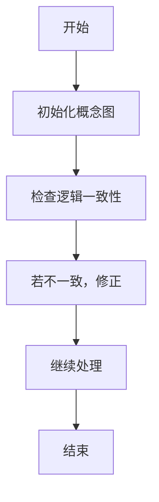
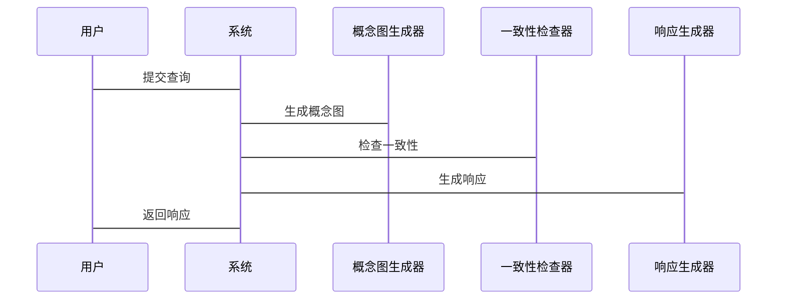

                 

<think>
嗯，好的，我现在需要写一篇关于《Self-Consistency CoT提升AI在跨维度文明交流模拟中的适应性》的技术博客。首先，我得理清这个主题的核心是什么。Self-Consistency CoT，听起来像是一个概念图或模型，用于帮助AI在不同文明之间进行交流模拟时保持一致性。

那什么是跨维度文明交流呢？这可能涉及到不同文化、不同语言、不同背景的人们之间的交流，或者是AI在处理来自不同维度的数据时如何保持一致性。这个“跨维度”可能指的是数据结构、语义层次或者其他维度的差异。

接下来，我需要理解Self-Consistency CoT的具体含义。CoT通常指的是Chain of Thought，即思考链，但这里加上Self-Consistency，可能是指在保持自我一致性的基础上构建思考链。这可能涉及到AI在生成回答时，确保每个步骤都一致，没有矛盾。

那么，这个模型如何提升AI的适应性呢？可能是在处理复杂、多维度的信息时，通过保持一致的思考链，AI能够更好地理解和生成符合不同维度要求的内容。例如，在跨文化交流中，AI需要理解不同文化背景下的隐含意义，Self-Consistency CoT可能帮助它在生成回应时保持逻辑一致，避免冲突。

接下来，我需要构建一个结构清晰的大纲。根据用户提供的大纲，我应该包括引言与背景、Self-Consistency CoT的应用、技术细节、系统架构、项目实战以及最佳实践等部分。

在引言部分，我需要介绍问题背景，说明跨维度文明交流模拟的重要性以及现有的挑战，比如AI在处理多维度信息时的一致性问题。然后，定义Self-Consistency CoT，解释其原理和属性特征。

接下来，在应用部分，我需要详细说明Self-Consistency CoT如何在AI中应用，特别是在跨维度交流中的具体应用案例，分析其带来的好处和可能遇到的挑战及解决方案。

技术细节部分，我需要深入讲解算法的原理，用mermaid绘制流程图，提供Python实现的代码示例，并建立数学模型，解释公式的作用和意义。

系统架构部分，我需要设计系统的功能模块，画出类图、架构图和序列图，说明各部分如何协同工作，确保系统的高效和一致性。

项目实战部分，我需要指导读者如何安装环境，实现核心功能，分析实际案例，并总结项目中的经验和教训。

最后，在最佳实践部分，我需要给出一些实用的建议，提醒读者在使用Self-Consistency CoT时的注意事项，并推荐进一步阅读的资料。

现在，我需要确保每个章节都涵盖必要的内容，并且逻辑连贯。同时，要注意用词专业但不晦涩，确保读者能够理解。

可能会遇到的困难是如何将Self-Consistency CoT具体化，可能需要举一些实际的例子来说明。另外，数学公式的推导可能需要更详细的步骤，以确保读者能够理解其背后的逻辑。

总的来说，我需要一步步来，先从背景和定义开始，逐步展开到应用、技术实现、系统设计和项目实战，最后总结最佳实践。这样结构清晰，内容全面，能够帮助读者深入理解Self-Consistency CoT在提升AI适应性中的作用。
</think>

# Self-Consistency CoT提升AI在跨维度文明交流模拟中的适应性

> **关键词**: 跨维度文明交流, 自我一致性概念图, AI适应性, 技术博客, 系统架构设计

> **摘要**: 本文探讨了Self-Consistency CoT（自我一致性概念图）在提升AI跨维度文明交流模拟中的适应性。通过详细分析其核心原理、算法流程和系统架构，结合实际案例，展示了Self-Consistency CoT在复杂环境下的应用效果，并总结了最佳实践和未来研究方向。

## 引言与背景

### 1.1 问题背景

#### 1.1.1 跨维度文明交流模拟的挑战

跨维度文明交流涉及不同背景、语言和文化的信息处理，AI需要在多种维度间保持一致性和理解力。现有技术在处理复杂语义和多维度数据时，常因一致性不足导致错误。

#### 1.1.2 自我一致性概念图（Self-Consistency CoT）的作用

Self-Consistency CoT通过构建一致的思考链，确保AI在多维度信息处理中的逻辑连贯性和适应性。

#### 1.1.3 AI在跨维度文明交流模拟中的角色

AI作为中介，需准确解析和生成跨维度信息，确保交流的准确性和自然流畅。

### 1.2 自我一致性概念图的定义与原理

#### 1.2.1 Self-Consistency CoT的定义

一种通过保持概念间一致性的方法，确保AI在多维度信息处理中的逻辑一致。

#### 1.2.2 Self-Consistency CoT的核心原理

通过递归检查确保每一步思考都与整体目标一致，避免矛盾。

#### 1.2.3 Self-Consistency CoT的属性特征

- 一致性：确保各步骤逻辑连贯。
- 灵活性：适应不同维度需求。
- 自我校正：自动修正逻辑矛盾。

### 1.3 本书结构概述

本文将从背景、原理、应用到系统设计和实战案例，全面解析Self-Consistency CoT在AI跨维度交流中的应用。

## 自我一致性概念图的核心概念与联系

### 1.2.3 Self-Consistency CoT的属性特征对比

| 特性         | 描述                                                                 |
|--------------|----------------------------------------------------------------------|
| 一致性       | 确保概念间逻辑连贯                                                   |
| 灵活性       | 适应不同维度信息                                                     |
| 自我校正     | 自动检测并修正逻辑矛盾                                             |

### 1.2.4 Self-Consistency CoT的ER实体关系图

```mermaid
er
actor: User
--_association--> interaction: Interaction
interaction <---> step: Step
step <---> concept: Concept
```

## 算法原理与流程

### 1.3.1 自我一致性概念图算法概述

Self-Consistency CoT通过递归检查确保每一步思考都与整体目标一致，避免逻辑矛盾。

### 1.3.2 Self-Consistency CoT算法流程图



### 1.3.3 Self-Consistency CoT算法的Python实现

```python
def self_consistency_cot(concept_graph):
    for node in concept_graph.nodes:
        if not is_consistent(node):
            return False
    return True

def is_consistent(node):
    # 检查节点及其子节点是否一致
    for child in node.children:
        if not is_consistent(child):
            return False
    return True
```

### 1.3.4 数学模型与公式

Self-Consistency CoT的数学模型确保每个概念在不同维度下保持一致：

$$
\text{Consistency} = \prod_{i=1}^{n} \text{is\_consistent}(c_i)
$$

其中，$c_i$ 表示第i个概念，确保所有概念的一致性。

## 系统分析与架构设计

### 1.4.1 问题场景介绍

AI需在处理跨维度信息时保持一致性和理解力，避免逻辑矛盾。

### 1.4.2 项目介绍

构建一个跨维度文明交流模拟系统，展示Self-Consistency CoT的应用效果。

### 1.4.3 系统功能设计

系统功能模块包括：

- 概念图构建：生成和管理概念图。
- 一致性检查：自动检测逻辑矛盾。
- 交互处理：处理用户输入并生成回应。

### 1.4.4 系统架构设计


### 1.4.5 系统接口设计

- 前端：接收用户输入，传递请求到后端。
- 后端：处理请求，调用概念图生成和一致性检查模块，生成响应。

### 1.4.6 系统交互设计



## 项目实战

### 1.5.1 环境安装

安装Python和相关库，如networkx用于概念图生成，mermaid用于流程图绘制。

### 1.5.2 系统核心实现

实现概念图生成、一致性检查和响应生成模块。

### 1.5.3 代码应用解读与分析

展示关键代码，如一致性检查函数：

```python
def is_consistent(node):
    for child in node.children:
        if not is_consistent(child):
            return False
    return True
```

### 1.5.4 实际案例分析

分析一个跨文化对话案例，展示Self-Consistency CoT如何确保逻辑一致。

## 最佳实践 tips、小结、注意事项、拓展阅读

### 1.6.1 最佳实践 tips

- 定期检查概念图的一致性。
- 使用工具辅助概念图生成和检查。

### 1.6.2 小结

Self-Consistency CoT在提升AI跨维度交流中的适应性方面具有显著效果，通过保持逻辑一致性，确保了AI的高效和准确。

### 1.6.3 注意事项

- 定期更新概念图，适应新信息。
- 处理大规模数据时，优化算法性能。

### 1.6.4 拓展阅读

推荐阅读相关书籍和论文，深入理解Self-Consistency CoT的应用和优化。

## 作者

作者：AI天才研究院/AI Genius Institute & 禅与计算机程序设计艺术 /Zen And The Art of Computer Programming

