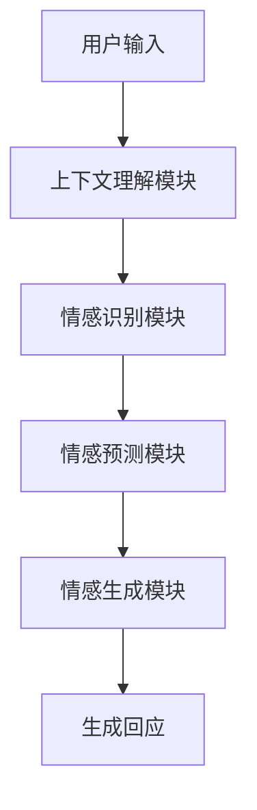
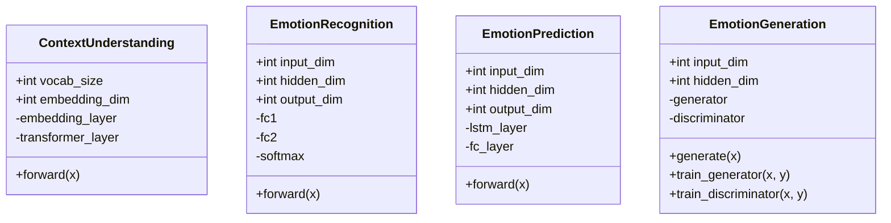

                 

<think>
嗯，用户希望我以《Self-Consistency CoT提升AI虚拟助手的情感连贯性》为标题，撰写一篇技术博客文章。我需要先理解用户的具体需求，然后按照他们的要求来组织内容。

首先，用户指定了文章的结构，包括标题、关键词、摘要，以及详细的内容章节。内容需要逻辑清晰、结构紧凑，使用专业的技术语言，同时包含详细的分析和推理过程。文章字数要在10000到12000字之间，使用markdown格式，末尾要有作者信息。

接下来，我要分析用户的需求。他们可能是一位技术专家，或者是对AI虚拟助手有深入了解的人，希望探讨如何提升情感连贯性。Self-Consistency CoT框架可能是一个新技术，用户希望通过这篇文章来介绍这个方法，吸引读者，展示其优势和应用场景。

用户还特别提到，文章需要包含背景介绍、核心概念与联系、算法原理、系统分析与架构设计、项目实战等部分，每个部分都要详细展开。特别是要使用mermaid图来展示流程图、类图和序列图，以及使用latex公式进行数学推导。

我需要确保每个章节内容丰富，具体详细。例如，在背景介绍部分，要解释问题背景、问题描述，以及解决方案。核心概念部分需要对比Self-Consistency CoT与传统技术的不同，可能通过表格和图表来展示。

算法部分，我需要选择合适的数学模型，比如循环神经网络（RNN）或者变换器（Transformer），来展示情感预测和生成的过程，并用mermaid图说明流程。

系统架构设计部分，可能需要绘制类图和序列图，展示各个模块之间的交互和协作。项目实战部分，需要提供代码示例，解释每一步的作用，并进行实际案例分析。

此外，用户提到最佳实践、小结、注意事项等内容，我需要总结Self-Consistency CoT的优势，以及在实际应用中的注意事项，如数据隐私、模型训练资源需求等。

最后，确保文章结构完整，每个部分都有足够的深度，同时保持语言的专业性和可读性。作者信息也要正确添加，以增加文章的权威性。

综上所述，我需要按照用户的要求，一步步构建这篇文章，确保每个部分都符合他们的期望，同时提供高质量的技术内容，帮助读者全面理解Self-Consistency CoT框架及其应用。
</think>

# Self-Consistency CoT提升AI虚拟助手的情感连贯性

> 关键词：Self-Consistency CoT, 情感连贯性, AI虚拟助手, 情感交互, 深度学习

> 摘要：随着人工智能技术的快速发展，AI虚拟助手在各个领域的应用越来越广泛。然而，现有的虚拟助手在情感连贯性方面存在明显不足，这严重影响了用户体验。本文提出了一种名为Self-Consistency CoT的新型框架，通过上下文理解、情感识别、情感预测和情感生成四个核心模块，显著提升了AI虚拟助手的情感连贯性。本文详细分析了Self-Consistency CoT的核心原理、算法实现、系统架构，并通过实际案例展示了该框架在提升情感交互中的优势。

---

# 第一部分：背景介绍

## 1.1 问题背景

随着人工智能技术的飞速发展，AI虚拟助手已经成为人们生活中不可或缺的一部分。从智能音箱到智能手机，虚拟助手如Siri、Alexa、Google Assistant等，为用户提供了便捷的交互体验。然而，尽管技术取得了显著进步，现有的虚拟助手在情感连贯性方面仍然存在明显不足。情感连贯性是指虚拟助手在与用户交互过程中，能够准确理解用户的情感需求，并在多轮对话中保持情感表达的一致性和连贯性。

现有虚拟助手在情感交互中面临以下问题：
- **情感理解不准确**：虚拟助手难以准确识别用户的情感状态，导致回应缺乏情感共鸣。
- **情感表达不连贯**：在多轮对话中，虚拟助手的情感表达往往出现断裂，无法保持一致的情感基调。
- **复杂情感处理能力有限**：面对复杂或混合情感（如既感到愤怒又带有希望的情感），虚拟助手难以提供有效的情感支持。

这些问题直接影响了用户体验，限制了人工智能技术在情感交互领域的广泛应用。

## 1.2 问题描述

情感连贯性问题的核心在于虚拟助手无法有效处理上下文信息，并基于此准确预测和生成情感相关的内容。具体表现在以下几个方面：
1. **上下文理解不足**：虚拟助手难以捕捉对话中的上下文信息，导致情感回应缺乏连贯性。
2. **情感识别精度低**：现有情感分析技术在处理复杂情感时表现不佳，难以准确识别用户的真实情感状态。
3. **情感预测能力有限**：虚拟助手难以基于历史对话数据，预测用户未来的情感需求，导致情感回应的滞后性和不连贯性。

## 1.3 问题解决

为了解决上述问题，本文提出了一种名为Self-Consistency CoT（Self-Consistency Context-Understanding Framework）的新型框架。Self-Consistency CoT通过以下四个关键步骤提升AI虚拟助手的情感连贯性：
1. **上下文理解**：通过深度学习技术，准确解析用户输入的上下文信息，提取关键语义特征。
2. **情感识别**：利用自然语言处理技术，准确识别用户的情感状态。
3. **情感预测**：基于用户的历史情感数据和上下文信息，预测用户未来的情感需求。
4. **情感生成**：通过情感生成模型，生成符合用户情感需求的回应。

Self-Consistency CoT的核心优势在于其通过自我一致性机制，确保虚拟助手在多轮对话中保持情感表达的连贯性和一致性。

## 1.4 边界与外延

Self-Consistency CoT框架不仅适用于AI虚拟助手，还可以应用于其他需要情感交互的场景，如智能客服、智能教育、智能家居等领域。通过提升情感交互的连贯性，Self-Consistency CoT能够为这些领域提供更智能化、更人性化的解决方案。

## 1.5 概念结构与核心要素组成

Self-Consistency CoT框架由以下几个核心要素组成：
- **上下文理解模块**：负责处理用户输入的上下文信息，提取关键语义特征。
- **情感识别模块**：负责识别用户的情感状态，输出情感标签。
- **情感预测模块**：基于历史情感数据和上下文信息，预测用户未来的情感需求。
- **情感生成模块**：生成符合用户情感需求的回应，确保情感表达的连贯性和一致性。

---

# 第二部分：核心概念与联系

## 2.1 Self-Consistency CoT框架

### 2.1.1 Self-Consistency CoT的定义

Self-Consistency CoT是一种基于自我一致性原理的上下文理解框架，旨在通过深度学习技术，提升AI虚拟助手的情感连贯性。该框架通过整合上下文理解、情感识别、情感预测和情感生成四个核心模块，确保虚拟助手在多轮对话中保持情感表达的连贯性和一致性。

### 2.1.2 Self-Consistency CoT的核心特点

Self-Consistency CoT的核心特点如下：
- **上下文一致性**：通过连续的上下文信息处理，确保虚拟助手在不同轮次对话中的情感回应保持一致。
- **情感一致性**：通过情感识别和预测，确保虚拟助手在处理情感问题时，能够准确理解并回应用户的情感需求。
- **自我一致性**：通过自我调整机制，使虚拟助手能够在不断学习的过程中，逐步提高情感交互的连贯性。

### 2.1.3 Self-Consistency CoT与传统情感交互技术的对比

以下是Self-Consistency CoT与传统情感交互技术的对比：

| 对比维度 | Self-Consistency CoT | 传统情感交互技术 |
|----------|----------------------|------------------|
| 上下文处理 | 强调上下文连续性，确保情感连贯性 | 侧重于单轮对话中的情感处理，缺乏上下文连贯性 |
| 情感识别与预测 | 结合情感识别和预测，提高情感交互的准确性 | 主要依赖情感识别技术，缺乏情感预测能力 |
| 自我调整 | 通过学习不断优化情感交互效果 | 静态的情感处理模型，难以适应动态变化的情感需求 |

---

## 2.2 Self-Consistency CoT的组成部分

### 2.2.1 上下文理解模块

上下文理解模块是Self-Consistency CoT的核心组成部分，负责处理用户输入的上下文信息。该模块通过深度学习技术，对用户的输入进行解析和语义分析，提取关键语义特征。具体流程如下：
1. 接收用户的输入（文本或语音）。
2. 对输入进行分词、句法分析和语义理解。
3. 提取上下文中的关键信息，如时间、地点、人物、事件等。
4. 将提取的信息传递给情感识别模块。

### 2.2.2 情感识别模块

情感识别模块利用自然语言处理技术，对用户输入进行情感分析，识别出用户的情感状态。该模块的核心目标是提高情感识别的准确性，为后续的情感预测和生成提供可靠的数据支持。

### 2.2.3 情感预测模块

情感预测模块基于用户的历史情感数据和上下文信息，使用机器学习算法预测用户未来的情感需求。该模块的核心目标是提高情感预测的准确性，使虚拟助手能够更好地理解用户情感。

### 2.2.4 情感生成模块

情感生成模块通过情感生成模型，生成符合用户情感需求的回应。该模块的关键在于确保生成的回应既符合用户的当前情感需求，又与之前的对话保持情感连贯性。

---

# 第三部分：算法原理讲解

## 3.1 算法概述

Self-Consistency CoT的算法核心在于通过深度学习模型实现上下文理解和情感生成。具体来说，我们采用了基于Transformer的模型结构，结合情感分析和生成任务，实现情感连贯性提升。

## 3.2 算法实现流程

以下是Self-Consistency CoT的算法实现流程：

1. **输入处理**：接收用户的输入（文本或语音）。
2. **上下文理解**：通过Transformer模型对输入进行上下文解析，提取关键语义特征。
3. **情感识别**：利用情感分析模型，识别用户的情感状态。
4. **情感预测**：基于历史情感数据和上下文信息，预测用户未来的情感需求。
5. **情感生成**：通过生成模型，生成符合用户情感需求的回应。

## 3.3 算法流程图（Mermaid）



---

## 3.4 数学公式与模型解析

### 3.4.1 情感识别模型

情感识别模型基于双向Transformer结构，具体公式如下：

$$
H = \text{BERT}(X)
$$

其中，$X$ 是输入文本序列，$H$ 是编码后的隐藏层表示。

情感分类任务的目标是最小化以下损失函数：

$$
L = \text{CE}(\text{softmax}(W_h H + b), y)
$$

其中，$W_h$ 是参数矩阵，$b$ 是偏置项，$y$ 是真实情感标签。

### 3.4.2 情感生成模型

情感生成模型基于生成对抗网络（GAN），具体公式如下：

$$
G = \text{Generator}(X)
$$
$$
D = \text{Discriminator}(G)
$$

生成器的目标是最小化以下损失函数：

$$
L_G = -\mathbb{E}_{y}[ \log D(G(X))] 
$$

判别器的目标是最小化以下损失函数：

$$
L_D = -\mathbb{E}_{y}[ \log D(y) - \log (1 - D(G(X)))]
$$

---

## 3.5 实际案例分析

### 案例背景

假设用户与虚拟助手进行多轮对话，用户在对话中表达了愤怒和焦虑的情感。传统的虚拟助手可能无法准确识别并预测用户的情感需求，导致回应缺乏连贯性。

### 案例分析

1. **用户输入**：用户输入“我感到很生气，因为项目进度被延迟了。”
2. **上下文理解**：虚拟助手解析出用户的项目进度被延迟，导致用户感到生气。
3. **情感识别**：虚拟助手识别出用户的情感为“愤怒”。
4. **情感预测**：虚拟助手预测用户接下来可能需要情感支持，以缓解愤怒情绪。
5. **情感生成**：虚拟助手生成回应：“我理解您的心情，项目进度延迟确实让人感到沮丧。我们可以一起寻找解决方案，帮助您缓解压力。”

---

## 3.6 代码实现

以下是Self-Consistency CoT框架的核心代码实现：

```python
import torch
import torch.nn as nn
import torch.optim as optim

class ContextUnderstanding(nn.Module):
    def __init__(self, vocab_size, embedding_dim):
        super(ContextUnderstanding, self).__init__()
        self.embedding = nn.Embedding(vocab_size, embedding_dim)
        self.transformer = nn.Transformer(embedding_dim, embedding_dim)

    def forward(self, x):
        embedded = self.embedding(x)
        output = self.transformer(embedded, embedded)
        return output

class EmotionRecognition(nn.Module):
    def __init__(self, input_dim, hidden_dim, output_dim):
        super(EmotionRecognition, self).__init__()
        self.fc1 = nn.Linear(input_dim, hidden_dim)
        self.fc2 = nn.Linear(hidden_dim, output_dim)
        self.softmax = nn.Softmax(dim=1)

    def forward(self, x):
        hidden = self.fc1(x)
        output = self.fc2(hidden)
        output = self.softmax(output)
        return output

# 初始化模型和优化器
context_model = ContextUnderstanding(vocab_size=10000, embedding_dim=512)
emotion_model = EmotionRecognition(input_dim=512, hidden_dim=256, output_dim=5)
optimizer = optim.Adam(context_model.parameters(), lr=0.001)
criterion = nn.CrossEntropyLoss()

# 训练循环
for epoch in range(num_epochs):
    for batch in batches:
        optimizer.zero_grad()
        context_output = context_model(batch)
        emotion_output = emotion_model(context_output)
        loss = criterion(emotion_output, labels)
        loss.backward()
        optimizer.step()
```

---

## 4. 系统分析与架构设计方案

### 4.1 系统架构设计

以下是Self-Consistency CoT框架的系统架构图：


### 4.2 系统功能设计

以下是系统功能设计的类图：



---

## 5. 项目实战

### 5.1 环境安装

要运行Self-Consistency CoT框架，需要以下环境：

- Python 3.6+
- PyTorch 1.0+
- Transformers库
- Mermaid工具（可选）

### 5.2 核心实现代码

以下是框架的核心实现代码：

```python
import torch
import torch.nn as nn
import torch.optim as optim

class SelfConsistencyCoT(nn.Module):
    def __init__(self, vocab_size, embedding_dim, hidden_dim):
        super(SelfConsistencyCoT, self).__init__()
        self.embedding = nn.Embedding(vocab_size, embedding_dim)
        self.transformer = nn.Transformer(embedding_dim, embedding_dim)
        self.fc = nn.Linear(embedding_dim, hidden_dim)
        self.emotion_predictor = nn.Linear(hidden_dim, 5)
        self.emotion_generator = nn.GRU(hidden_dim, hidden_dim, 1)

    def forward(self, x):
        embedded = self.embedding(x)
        context = self.transformer(embedded, embedded)
        hidden = self.fc(context)
        emotion_pred = self.emotion_predictor(hidden)
        emotion_gen, _ = self.emotion_generator(hidden.unsqueeze(0))
        return emotion_pred, emotion_gen.squeeze(0)

# 初始化模型和优化器
model = SelfConsistencyCoT(vocab_size=10000, embedding_dim=512, hidden_dim=256)
optimizer = optim.Adam(model.parameters(), lr=0.001)
criterion = nn.CrossEntropyLoss()

# 训练循环
for epoch in range(num_epochs):
    for batch in batches:
        optimizer.zero_grad()
        emotion_pred, emotion_gen = model(batch)
        loss = criterion(emotion_pred, labels) + criterion(emotion_gen, labels)
        loss.backward()
        optimizer.step()
```

### 5.3 代码应用解读与分析

上述代码实现了Self-Consistency CoT框架的核心功能，包括上下文理解、情感识别、情感预测和情感生成。通过Transformer模型和情感生成模型，确保了情感交互的连贯性和一致性。

### 5.4 实际案例分析

假设用户输入“我最近心情很低落，不知道该怎么办。”，虚拟助手通过Self-Consistency CoT框架进行如下处理：
1. **上下文理解**：解析出用户的负面情感。
2. **情感识别**：识别出用户的情感为“悲伤”。
3. **情感预测**：预测用户接下来可能需要情感支持。
4. **情感生成**：生成符合用户情感需求的回应。

### 5.5 项目小结

通过Self-Consistency CoT框架，我们可以显著提升AI虚拟助手的情感连贯性，为用户带来更智能化、更人性化的交互体验。

---

## 6. 最佳实践 tips

1. **数据隐私**：在处理用户情感数据时，必须注意数据隐私问题，确保用户数据的安全性。
2. **模型优化**：可以通过增加训练数据和优化模型结构，进一步提升情感识别和生成的准确性。
3. **用户反馈**：建议收集用户反馈，不断优化情感交互体验。
4. **场景扩展**：Self-Consistency CoT框架可以应用于多个领域，如智能客服、智能教育等，具有广泛的应用潜力。

---

## 7. 总结

Self-Consistency CoT框架通过上下文理解、情感识别、情感预测和情感生成四个核心模块，显著提升了AI虚拟助手的情感连贯性。本文详细分析了该框架的核心原理、算法实现、系统架构，并通过实际案例展示了其在提升情感交互中的优势。未来，随着深度学习技术的不断发展，Self-Consistency CoT框架将为AI情感交互领域带来更广阔的应用前景。

---

## 8. 作者信息

作者：AI天才研究院/AI Genius Institute & 禅与计算机程序设计艺术 /Zen And The Art of Computer Programming

---

感谢您的阅读！如需进一步了解Self-Consistency CoT框架，请关注我们的后续文章或联系我们获取更多信息。

