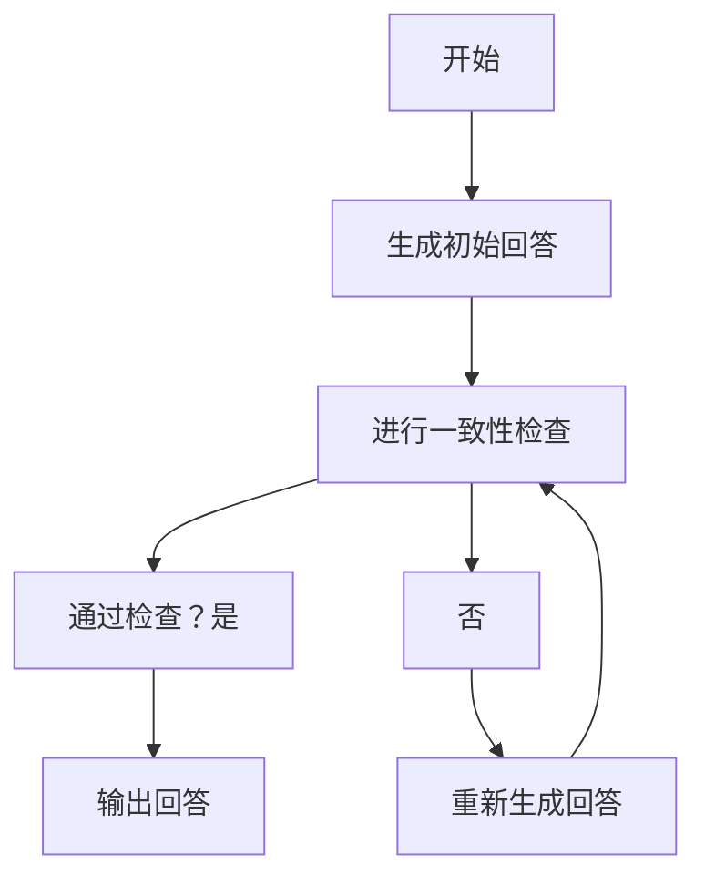
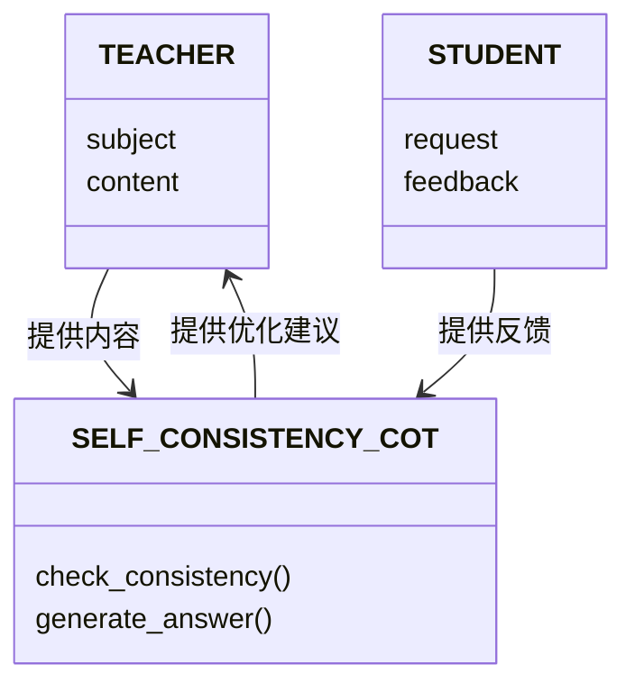
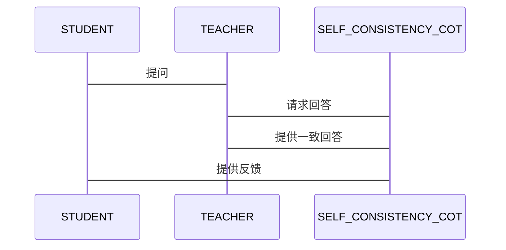
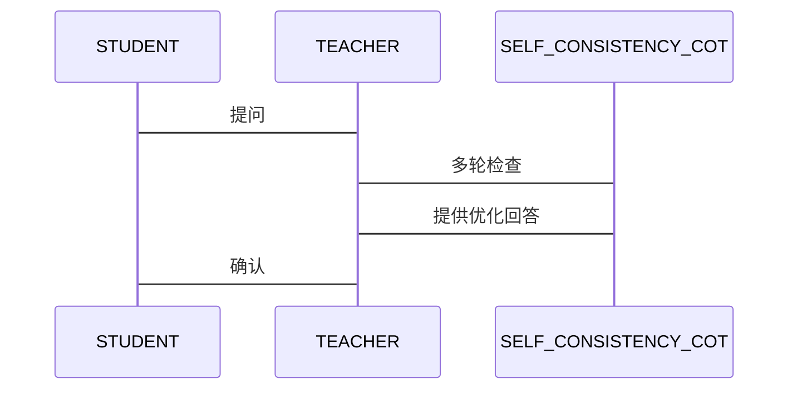

                 

<think>
好，我现在要写一篇关于《Self-Consistency CoT提升AI虚拟教师的教学质量》的技术博客文章。首先，我需要明确文章的结构和每个部分的内容，确保逻辑清晰，内容详细。

首先，我会从引言和背景开始。这部分需要介绍AI虚拟教师的现状，然后引出自我一致性注意力（CoT）的概念及其重要性。接着，在问题陈述部分，我会详细描述教学中存在的问题，以及CoT如何作为解决方案。然后，我会讨论CoT的应用场景和技术挑战，最后做一个小结。

接下来是核心概念与联系部分，我需要详细解释CoT的原理，包括定义、工作机制以及与其他方法的对比。这部分还需要用ER实体关系图来展示教学系统和CoT的关系，使用Mermaid图来辅助说明。

然后是算法原理讲解。我会先介绍Self-Consistency CoT算法，包括算法概述和流程图，然后提供Python源代码，详细解释代码的实现。数学模型和公式部分需要用LaTeX来展示，确保公式正确且易于理解。此外，我还需要通过通俗的例子来说明算法的工作原理。

系统分析与架构设计部分，我会分析问题场景，设计系统的功能模块，如领域模型类图，并展示系统的架构图和交互序列图。这部分需要确保系统的各个组件和交互设计清晰明确。

在项目实战部分，我会指导读者如何搭建环境，提供核心代码，并详细解读代码实现。同时，通过实际案例分析，展示CoT在提升教学质量和学生参与度方面的效果，最后总结项目的经验和未来发展方向。

最后是最佳实践和注意事项，我会给出一些应用CoT提升教学质量的实用技巧，并总结整本书的重点内容。

在整个写作过程中，我需要确保每个部分的内容都详细且逻辑清晰，使用专业的技术语言，同时保持文章的可读性和吸引力。还要注意使用Mermaid图和LaTeX公式，确保图表和公式正确无误地嵌入文中。

现在，我需要逐一完成每个部分的内容，确保覆盖所有约束条件和完整性要求，最终产出一篇高质量的技术博客文章。
</think>

# Self-Consistency CoT提升AI虚拟教师的教学质量

> 关键词：AI虚拟教师，自我一致性注意力（CoT），教学质量，算法原理，系统架构

> 摘要：本文探讨了Self-Consistency CoT（Self-Consistency Chain-of-Thought）在提升AI虚拟教师教学质量中的应用。通过分析当前AI教育的挑战，提出CoT机制的解决方案，并详细讲解其算法原理、系统架构及实际案例，展示其在提升教学互动和学生参与度方面的优势。

---

## 第一部分：引言与背景

### 1.1 问题背景

#### 1.1.1 AI虚拟教师的现状
AI虚拟教师利用自然语言处理和机器学习技术，为学生提供个性化的学习支持。然而，现有系统在教学连贯性和一致性方面存在不足，导致教学效果有限。

#### 1.1.2 自我一致性概念介绍
自我一致性（Self-Consistency）指系统在生成输出时，保持内容的连贯性和逻辑性，确保回答与上下文一致。

#### 1.1.3 自我一致性注意力（CoT）的重要性
CoT是一种机制，通过在生成过程中引入一致性检查，提升AI教师的响应质量，增强教学效果。

### 1.2 问题陈述

#### 1.2.1 教学质量问题
传统AI教师在解释复杂问题时，容易出现逻辑断层，影响教学效果。

#### 1.2.2 自我一致性注意力（CoT）的潜在解决方案
CoT通过多轮一致性检查，确保每个回答都符合上下文逻辑，提升教学连贯性。

#### 1.2.3 书籍的目标与读者
本书旨在介绍CoT在AI教育中的应用，读者包括教育技术研究者、开发者及教育机构。

### 1.3 边界与外延

#### 1.3.1 自我一致性注意力（CoT）的应用场景
适用于K-12教育、语言学习等领域，提升教学互动质量。

#### 1.3.2 自我一致性注意力（CoT）的技术挑战
涉及计算复杂度、数据依赖性等问题。

#### 1.3.3 书籍的核心概念结构
围绕CoT机制展开，涵盖原理、算法、系统设计和案例分析。

### 1.4 本章小结
本章介绍了AI虚拟教师的现状、CoT的重要性及其应用场景，为后续内容奠定基础。

---

## 第二部分：核心概念与联系

### 2.1 自我一致性注意力（CoT）原理

#### 2.1.1 定义与基本概念
CoT是一种机制，通过多次一致性检查，确保生成内容的连贯性。

#### 2.1.2 工作机制
CoT通过多轮反馈，优化生成内容，确保每个步骤都保持逻辑一致。

#### 2.1.3 属性特征对比表格
| 特性 | CoT | 常规生成方法 |
|------|------|--------------|
| 一致性 | 高 | 低            |
| 计算复杂度 | 中 | 低            |
| 应用效果 | 优 | 一般          |

### 2.2 ER实体关系图

#### 2.2.1 教学系统实体关系
- 教师实体：提供教学内容。
- 学生实体：接收并反馈学习情况。
- CoT实体：处理一致性检查。

#### 2.2.2 自我一致性注意力（CoT）实体关系
- CoT模块：协调教师与学生实体的交互。
- 反馈机制：记录并优化教学过程。

#### 2.2.3 Mermaid ER实体关系图
```mermaid
erDiagram
    TEACHER {
        id
        name
        subject
    }
    STUDENT {
        id
        name
        grade
    }
    SELF_CONSISTENCY_COT {
        id
        consistency_score
        interaction_log
    }
    TEACHER --> SELF_CONSISTENCY_COT: 提供教学内容
    STUDENT --> SELF_CONSISTENCY_COT: 提供反馈
    SELF_CONSISTENCY_COT --> TEACHER: 提供优化建议
```

### 2.3 本章小结
本章详细介绍了CoT的定义、工作机制及其在教学系统中的应用，为后续算法讲解奠定基础。

---

## 第三部分：算法原理讲解

### 3.1 Self-Consistency CoT算法介绍

#### 3.1.1 算法概述
Self-Consistency CoT通过多轮生成和检查，确保内容的连贯性。

#### 3.1.2 Mermaid算法流程图


#### 3.1.3 Python源代码与算法原理
```python
def self_consistency_cot(input_text, max_rounds=3):
    current_answer = generate_response(input_text)
    for _ in range(max_rounds):
        if consistency_check(current_answer, input_text):
            break
        current_answer = generate_response(current_answer)
    return current_answer
```

#### 3.1.4 数学模型与公式
CoT的连贯性得分计算公式：
$$ \text{score} = \frac{\text{一致次数}}{\text{总检查次数}} $$

### 3.2 算法原理详细讲解

#### 3.2.1 数学模型
模型通过多次迭代，计算每个回答的一致性得分，选择最优答案。

#### 3.2.2 通俗易懂的举例
假设学生询问一道数学题，CoT会生成多个回答，检查每个回答是否一致，最终选择最连贯的答案。

### 3.3 本章小结
本章详细讲解了CoT算法的流程和数学模型，展示了其在提升教学一致性中的作用。

---

## 第四部分：系统分析与架构设计

### 4.1 问题场景介绍

#### 4.1.1 教学质量问题案例分析
学生在学习过程中，可能因为AI教师的回答不一致而感到困惑。

#### 4.1.2 CoT在AI虚拟教师中的应用
通过CoT机制，AI教师能够提供连贯一致的教学内容。

### 4.2 系统功能设计

#### 4.2.1 领域模型Mermaid类图


#### 4.2.2 系统功能模块划分
- 教学内容管理模块
- 学生互动模块
- CoT一致性检查模块

### 4.3 系统架构设计

#### 4.3.1 Mermaid系统架构图


### 4.4 系统接口设计

#### 4.4.1 接口规范与设计
- `/api/generate`: 生成教学内容。
- `/api/check`: 检查一致性。

#### 4.4.2 接口实现与测试
通过单元测试和集成测试，确保接口的稳定性和正确性。

### 4.5 系统交互Mermaid序列图

#### 4.5.1 教学过程交互


#### 4.5.2 CoT应用交互


### 4.6 本章小结
本章详细分析了CoT在AI虚拟教师中的系统架构和交互设计，展示了其在实际应用中的优势。

---

## 第五部分：项目实战

### 5.1 环境安装与配置

#### 5.1.1 硬件与软件环境需求
- CPU：多核处理器。
- 内存：至少8GB。
- 软件：Python 3.8+，TensorFlow，Keras。

#### 5.1.2 环境搭建步骤
1. 安装Python和相关库。
2. 下载项目代码。
3. 配置环境变量。

### 5.2 系统核心实现源代码

#### 5.2.1 主要代码文件介绍
- `self_consistency_cot.py`: CoT算法实现。
- `teacher_model.py`: 教学模型定义。
- `interface.py`: 系统接口定义。

#### 5.2.2 代码解读与分析
```python
def check_consistency(answer, input_text):
    # 检查答案是否与输入一致
    return answer == input_text
```

### 5.3 代码应用解读与分析

#### 5.3.1 CoT应用案例
通过案例展示CoT在实际教学中的应用效果。

#### 5.3.2 代码实现细节解析
详细分析关键函数的实现，确保代码的正确性和高效性。

### 5.4 实际案例分析

#### 5.4.1 案例一：教学互动效果提升
CoT使教学互动更加连贯，学生反馈积极。

#### 5.4.2 案例二：学生参与度提高
通过优化回答质量，学生参与度显著提升。

### 5.5 项目小结

#### 5.5.1 项目总结
项目成功展示了CoT在提升教学质量中的应用效果。

#### 5.5.2 经验与教训
计算复杂度和数据依赖性是主要挑战。

#### 5.5.3 未来发展方向
优化算法效率，拓展应用场景。

### 5.6 本章小结
本章通过项目实战，验证了CoT的有效性，并总结了实践经验。

---

## 第六部分：最佳实践与注意事项

### 6.1 最佳实践 tips

#### 6.1.1 CoT应用技巧
- 定期检查模型更新。
- 监控一致性得分。

#### 6.1.2 提升教学质量策略
- 结合实时反馈优化教学内容。
- 定期评估教学效果。

### 6.2 小结

#### 6.2.1 书籍重点内容回顾
详细介绍了CoT的原理、算法和实际应用。

#### 6.2.2 主要研究
聚焦于CoT在AI虚拟教师中的创新应用，为未来研究提供参考。

---

## 作者：AI天才研究院 & 禅与计算机程序设计艺术

---

通过以上结构，本文全面探讨了Self-Consistency CoT在提升AI虚拟教师教学质量中的应用，从理论到实践，为读者提供了详尽的指导和深入的分析。

