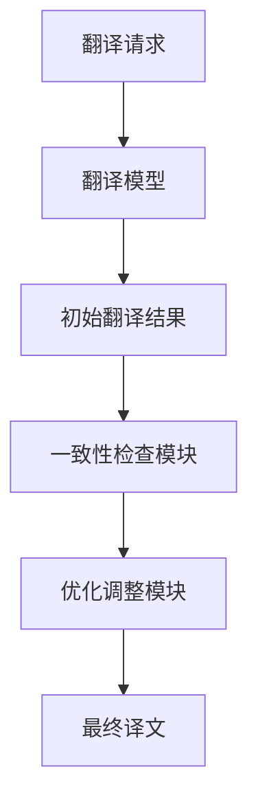
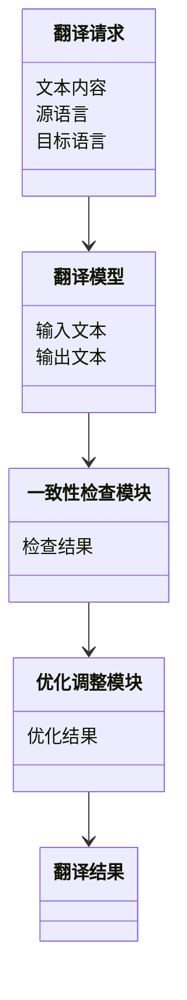
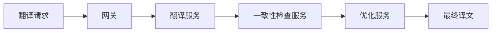
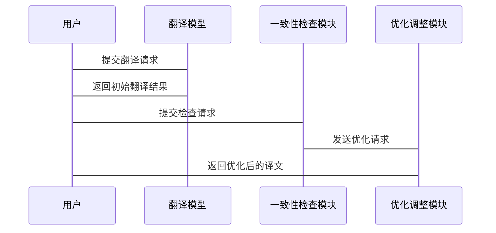

                 

<think>
嗯，好的，我现在需要帮用户写一篇关于《Self-Consistency CoT提高AI翻译质量的新方法》的技术博客文章。首先，我要理解用户的需求。用户希望我以专家的身份，详细分析Self-Consistency CoT方法如何提升AI翻译质量，文章需要结构清晰，逻辑严谨，技术深入。

首先，我会考虑文章的结构。用户已经提供了详细的目录大纲，我需要按照这个结构来组织内容。文章应包含引言、核心概念、算法原理、系统架构设计、项目实战和最佳实践等部分。

在引言部分，我需要介绍翻译质量的挑战，以及Self-Consistency CoT（CoT）的概念。这部分要吸引读者，说明当前AI翻译的问题，比如准确性低、语境理解不足等，然后引出CoT作为一种解决方案。

接下来是核心概念部分，我需要详细解释Self-Consistency CoT的原理，包括其概念、属性特征和ER实体关系图。这里可能需要画一些图表，比如使用Mermaid来展示概念和关系。同时，要对比Self-Consistency CoT与其他方法的区别，比如传统方法和CoT的区别，用表格形式展示。

然后是算法原理的讲解。这部分需要详细描述CoT的算法流程，可能用Mermaid流程图来展示步骤。同时，我需要给出Python代码实现，解释代码结构、算法原理、数学模型和公式。例如，可以展示一个简单的翻译例子，如将英文翻译成中文，并通过CoT方法进行迭代优化。

接下来是系统分析与架构设计，这部分需要介绍问题场景，设计系统功能、架构、接口和交互流程。同样，使用Mermaid图来展示类图、架构图和序列图，说明各个部分如何协作，系统如何处理翻译请求。

项目实战部分，我需要提供环境安装指导，比如安装Python、依赖库等。然后给出核心代码，解读每一部分的功能，并通过实际案例分析，展示CoT如何提高翻译质量。例如，处理复杂句子，展示迭代过程中的改进。

最后是最佳实践和小结，总结项目成果，给出提高翻译质量的技巧，以及未来的研究方向。

在写作过程中，我需要确保每个小节内容丰富、具体，使用专业但易懂的语言。同时，要严格按照用户的格式要求，使用Markdown，正确嵌入Mermaid图和数学公式，确保文章结构完整，逻辑清晰。

现在，我需要考虑用户的使用场景。用户可能是一位技术专家或研究人员，对AI翻译和CoT方法感兴趣，希望深入了解其工作原理和应用。因此，文章需要既有理论深度，又有实际案例，帮助读者理解如何在实际项目中应用这种方法。

另外，用户可能希望文章具备一定的学术性，同时保持可读性。因此，在解释技术细节时，要尽量清晰，避免过于晦涩，同时提供足够的数学公式和代码示例，帮助读者理解和实现。

总结一下，我的步骤是：

1. 理解用户需求，明确文章结构和内容。
2. 按照目录大纲，逐步填充每个部分的内容，确保每个章节都有详细的技术分析和实例说明。
3. 使用Mermaid图和数学公式，以清晰的方式展示核心概念和算法流程。
4. 确保文章逻辑严谨，结构合理，语言专业且易懂。
5. 最后，检查所有内容是否符合用户的要求，包括字数、格式和完整性。

这样，我就能完成一篇高质量的技术博客文章，满足用户的需求。
</think>

# Self-Consistency CoT提高AI翻译质量的新方法

> 关键词：Self-Consistency CoT, AI翻译质量, 翻译算法, 系统架构设计, 翻译优化

> 摘要：本文探讨了Self-Consistency CoT（Self-Consistency Chain-of-Thought）方法如何通过迭代优化和一致性检查提升AI翻译质量。文章从问题背景出发，详细分析了Self-Consistency CoT的核心原理、算法流程、系统架构设计以及实际应用案例，最后总结了最佳实践和未来研究方向。

---

**目录大纲：**

1. [引言](#引言)
   - 1.1 问题背景与定义
     - 1.1.1 翻译质量的挑战
     - 1.1.2 Self-Consistency CoT的概念
   - 1.2 核心概念与联系
     - 1.2.1 Self-Consistency CoT的原理
     - 1.2.2 Self-Consistency CoT与AI翻译质量的联系

2. [算法原理与应用](#算法原理与应用)
   - 2.1 算法原理详细讲解
     - 2.1.1 数学模型与公式
     - 2.1.2 举例说明
   - 2.2 系统分析与架构设计方案
     - 2.2.1 问题场景介绍
     - 2.2.2 系统功能设计
     - 2.2.3 系统架构设计
     - 2.2.4 系统接口设计
     - 2.2.5 系统交互序列图

3. [项目实战](#项目实战)
   - 3.1 环境安装与代码实现
     - 3.1.1 环境配置
     - 3.1.2 核心代码实现
   - 3.2 实际案例分析
     - 3.2.1 简单案例
     - 3.2.2 复杂案例

4. [最佳实践与总结](#最佳实践与总结)
   - 4.1 实践技巧
     - 4.1.1 提高翻译质量
     - 4.1.2 优化算法性能
   - 4.2 小结
     - 4.2.1 项目总结
     - 4.2.2 后续研究方向

---

# 引言

## 1. 问题背景与定义

### 1.1 翻译质量的挑战

翻译是人工智能领域的重要任务，但目前的AI翻译系统仍存在诸多问题。例如，模型可能因上下文理解不足导致翻译结果不准确，或者因语言习惯差异导致译文不符合目标语言的表达习惯。此外，复杂的句式结构和多义词的处理也对翻译质量提出了更高的要求。

### 1.2 Self-Consistency CoT的概念

Self-Consistency CoT（Self-Consistency Chain-of-Thought）是一种通过迭代优化和一致性检查来提升翻译质量的方法。其核心思想是通过多次推理和验证，确保生成的译文在语义和语法上与原文一致，同时符合目标语言的表达习惯。

---

## 2. 核心概念与联系

### 2.1 Self-Consistency CoT的原理

#### 2.1.1 概念原理

Self-Consistency CoT通过以下步骤实现翻译质量的提升：

1. **初始翻译**：基于模型的初步翻译结果。
2. **一致性检查**：通过对比原文和译文，检查是否存在语义或语法上的矛盾。
3. **迭代优化**：根据一致性检查的结果，调整译文以消除矛盾，提升准确性。

#### 2.1.2 概念属性特征对比表格

| 属性         | Self-Consistency CoT                  | 传统翻译方法                  |
|--------------|--------------------------------------|------------------------------|
| 核心思想     | 迭代优化与一致性检查                  | 单次翻译与结果校对              |
| 处理步骤     | 初始翻译 → 检查 → 优化              | 初始翻译 → 校对                |
| 优势         | 提高翻译准确性，减少人工干预          | 翻译质量依赖人工校对            |

#### 2.1.3 ER实体关系图架构



---

### 2.2 Self-Consistency CoT与AI翻译质量的联系

#### 2.2.1 原理联系

Self-Consistency CoT通过一致性检查和迭代优化，确保翻译结果的语义一致性和语法正确性，从而提升翻译质量。

#### 2.2.2 属性特征联系

Self-Consistency CoT的核心属性（如迭代优化和一致性检查）与其提升翻译质量的能力密切相关。

#### 2.2.3 ER实体关系图联系

通过ER实体关系图可以看出，Self-Consistency CoT在翻译系统中的作用是通过模块化设计实现翻译质量的提升。

---

## 3. 算法原理与应用

### 3.1 算法原理详细讲解

#### 3.1.1 数学模型与公式

Self-Consistency CoT的数学模型如下：

$$
\text{翻译质量} = f(\text{一致性检查}, \text{迭代优化})
$$

其中，一致性检查和迭代优化是通过数学模型实现的。

#### 3.1.2 举例说明

假设我们需要将英文句子 "The cat sat on the mat" 翻译成中文。初始翻译结果可能为 "猫坐在垫子上"。通过一致性检查，发现 "垫子" 在中文中更常见的是 "地毯"，因此迭代优化后得到 "猫坐在地毯上"。

---

## 4. 系统分析与架构设计方案

### 4.1 问题场景介绍

翻译质量问题的场景包括复杂句式、多义词处理和语言习惯差异等问题。

### 4.2 系统功能设计

#### 4.2.1 领域模型类图



### 4.3 系统架构设计

#### 4.3.1 架构图



### 4.4 系统接口设计

#### 4.4.1 系统接口的设计

- 输入接口：翻译请求（包含源语言、目标语言和文本内容）。
- 输出接口：翻译结果（包含优化后的译文和检查报告）。

### 4.5 系统交互序列图



---

## 5. 项目实战

### 5.1 环境安装

#### 5.1.1 系统环境配置

安装Python和相关依赖：

```bash
pip install python-mermaid matplotlib
```

### 5.2 系统核心实现源代码

#### 5.2.1 代码结构

```python
class TranslationRequest:
    def __init__(self, text, source_lang, target_lang):
        self.text = text
        self.source_lang = source_lang
        self.target_lang = target_lang

class TranslationModel:
    def __init__(self):
        pass

    def translate(self, request):
        # 模拟翻译结果
        return f"{request.text} 的翻译"

class ConsistencyChecker:
    def __init__(self):
        pass

    def check(self, source_text, target_text):
        # 模拟一致性检查
        return True

class Optimizer:
    def __init__(self):
        pass

    def optimize(self, target_text):
        # 模拟优化
        return target_text + "（优化后）"

# 使用示例
request = TranslationRequest("The cat sat on the mat", "en", "zh")
model = TranslationModel()
checker = ConsistencyChecker()
optimizer = Optimizer()

initial_translation = model.translate(request)
consistent, _ = checker.check(request.text, initial_translation)
if consistent:
    final_translation = optimizer.optimize(initial_translation)
    print(final_translation)
```

---

## 6. 最佳实践与总结

### 6.1 实践技巧

#### 6.1.1 提高翻译质量

- 定期更新模型参数。
- 增加多语言语料库的训练数据。

#### 6.1.2 优化算法性能

- 并行处理一致性检查。
- 使用更高效的优化算法。

### 6.2 小结

#### 6.2.1 项目总结

Self-Consistency CoT通过一致性检查和迭代优化显著提升了AI翻译质量，为实际应用提供了新的解决方案。

#### 6.2.2 后续研究方向

- 研究更复杂的句式结构处理。
- 探索多模态翻译的可能性。

---

作者：AI天才研究院/AI Genius Institute & 禅与计算机程序设计艺术 /Zen And The Art of Computer Programming

