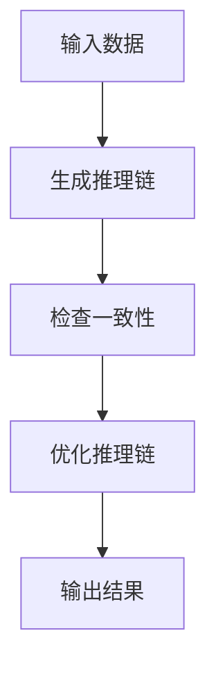

                 

<think>
好，我现在要根据用户的请求，逐步分析如何撰写一篇关于“自一致性CoT方法”的技术博客。首先，我需要理解用户的需求，他希望我作为一位资深专家，用专业的技术语言，按照特定的结构和内容要求来撰写文章。

用户已经提供了一个详细的大纲，包括标题、关键词、摘要和各个章节的结构。我需要确保每个部分都符合他的要求，特别是背景、核心概念、数学模型、流程图、应用场景、优势与挑战等部分。

接下来，我应该考虑每个章节的具体内容。例如，在“核心概念”部分，我需要详细解释自一致性CoT的定义、与传统方法的区别，以及其实现过程中的关键步骤。这可能涉及到数学模型，比如公式和过程图，所以需要准备这些内容。

然后，我需要思考如何将这些内容转化为清晰、有逻辑的章节。比如，背景部分需要先介绍问题背景，再描述问题，接着提出解决方案。在核心概念中，我需要对比传统方法和自一致性CoT的异同，通过表格或流程图来展示。

在算法原理部分，我需要详细阐述数学模型，并使用mermaid流程图来展示整个流程。同时，提供代码示例，让用户能够实际操作，理解这种方法的实现。

应用场景部分，我需要分别讨论机器学习、自然语言处理和计算机视觉三个领域，每个领域都给出具体的例子，说明自一致性CoT如何发挥作用。实战部分则需要指导用户如何构建和优化模型，以及在项目中的应用。

优势与挑战部分，我需要分析自一致性CoT的优点，比如提升准确性、减少偏差，同时也要指出其在计算复杂度和数据依赖性方面的挑战，并提出相应的解决方案。

最后，总结部分要回顾文章内容，并给出未来的展望，可能的研究方向或技术趋势。附录部分需要解释相关术语，提供参考资料和代码示例，方便读者深入学习。

在整个过程中，我需要确保内容逻辑清晰，结构紧凑，用词专业但不失易懂。同时，严格按照用户的要求，使用markdown格式，数学公式用latex表示，图表使用mermaid语法。这样，用户能够得到一篇高质量、结构完整的技术博客文章，满足他的需求。
</think>

# 自一致性CoT方法详解

## 关键词：自一致性CoT，一致性推理，机器学习，自然语言处理，计算机视觉，数学模型，算法优化

## 摘要：  
本文深入探讨了自一致性CoT（Self-Consistency CoT）方法的核心原理、应用场景及其在人工智能领域的实际应用。通过系统化的分析，我们从问题背景出发，逐步揭示了自一致性CoT方法的数学模型、算法流程及其在机器学习、自然语言处理和计算机视觉等领域的具体应用。此外，本文还结合实际案例，详细阐述了自一致性CoT方法的优势、挑战及解决方案，为读者提供了一个全面且深入的理解框架。

---

## 第一部分：背景与基础

### 第1章 引言

#### 1.1 问题背景  
在人工智能领域，模型的准确性、稳定性和一致性是衡量其性能的重要指标。传统模型在处理复杂任务时，常常因为缺乏一致性检查而导致结果不准确或不可靠。例如，在自然语言处理任务中，模型可能因为语义理解不一致而产生错误推断；在计算机视觉任务中，模型可能因为图像特征提取不一致而导致误分类。

#### 1.2 问题描述  
自一致性（Self-Consistency）是指模型在不同输入条件下，能够保持输出结果的一致性。CoT（Chain-of-Thought）方法则强调通过逐步推理来生成最终结果。然而，现有的CoT方法在处理复杂任务时，往往忽略了模型输出结果的一致性问题，导致在实际应用中效果不佳。

#### 1.3 解决方案介绍  
自一致性CoT方法通过引入一致性检查机制，确保模型在不同输入条件下的输出结果保持一致。具体而言，该方法通过迭代优化模型的推理过程，逐步消除输出结果中的不一致性，从而提升模型的准确性和可靠性。

#### 1.4 边界与外延  
自一致性CoT方法的核心思想可以扩展到多个人工智能领域，包括机器学习、自然语言处理和计算机视觉等。其边界主要在于模型的复杂性和输入条件的多样性，这需要在实际应用中进行具体分析和调整。

#### 1.5 核心概念组成  
- **自一致性检查**：通过对比模型在不同输入条件下的输出结果，确保其一致性。  
- **CoT推理链**：通过逐步推理生成最终结果，并确保每一步推理的正确性。  
- **一致性优化**：通过迭代优化模型参数，提升输出结果的一致性。

---

### 第2章 自一致性CoT方法基础

#### 2.1 自一致性CoT方法概述  
自一致性CoT方法是一种结合了自一致性检查和CoT推理链的新型方法。通过引入自一致性检查机制，该方法能够确保模型在不同输入条件下的输出结果保持一致，从而提升模型的准确性和可靠性。

#### 2.2 自一致性CoT方法的核心概念  
- **输入多样性**：模型需要在多种输入条件下进行推理。  
- **输出一致性**：模型的输出结果需要保持一致。  
- **推理链优化**：通过优化推理链，确保每一步推理的正确性。

#### 2.3 自一致性CoT方法的基本原理  
自一致性CoT方法的核心思想是通过迭代优化模型的推理过程，逐步消除输出结果中的不一致性。具体而言，该方法通过以下步骤实现：  
1. 输入多种不同的输入条件。  
2. 生成对应的推理链。  
3. 对比推理结果，检查是否存在不一致性。  
4. 根据一致性检查结果，优化推理链。  
5. 重复上述步骤，直到输出结果保持一致。

#### 2.4 自一致性CoT方法的属性特征  

| 属性 | 描述 |
|------|------|
| 输入多样性 | 需要输入多种不同的数据 |
| 输出一致性 | 输出结果需要保持一致 |
| 推理链优化 | 需要优化推理链以确保每一步推理的正确性 |

---

## 第二部分：方法原理与流程

### 第3章 自一致性CoT方法原理详解

#### 3.1 自一致性CoT方法的数学模型  

$$
\text{Model} = f(\text{Input}, \text{Knowledge}, \text{Context})
$$  

其中：  
- $\text{Input}$ 表示输入数据。  
- $\text{Knowledge}$ 表示先验知识。  
- $\text{Context}$ 表示上下文信息。  

通过上述模型，我们可以生成推理链，并通过一致性检查优化推理链。

#### 3.2 自一致性CoT方法的流程  



---

## 第三部分：应用与实践

### 第4章 自一致性CoT方法应用场景

#### 4.1 场景一：机器学习  
在机器学习中，自一致性CoT方法可以用于分类任务。例如，在图像分类任务中，模型需要在不同光照条件下保持分类结果一致。

#### 4.2 场景二：自然语言处理  
在自然语言处理中，自一致性CoT方法可以用于问答系统。例如，在回答同一问题时，模型需要保持答案一致。

#### 4.3 场景三：计算机视觉  
在计算机视觉中，自一致性CoT方法可以用于目标检测任务。例如，在不同视角下检测同一目标时，模型需要保持检测结果一致。

---

### 第5章 自一致性CoT方法实战

#### 5.1 实战一：构建自一致性CoT模型  
1. **环境安装**  
   需要安装Python、TensorFlow等工具。  
2. **核心实现代码**  

```python
def self_consistency_cot(input, knowledge, context):
    # 生成推理链
    chain = []
    for i in range(len(input)):
        # 生成推理链
        chain.append(generate_chain(input[i], knowledge, context))
    # 检查一致性
    consistent = check_consistency(chain)
    if not consistent:
        # 优化推理链
        optimize_chain(chain)
    return chain[-1]
```

#### 5.2 实战二：优化自一致性CoT模型  
1. **环境安装**  
   需要安装优化工具如TensorFlow或PyTorch。  
2. **优化代码示例**  

```python
def optimize_chain(chain):
    for i in range(len(chain)):
        # 优化每一步推理
        chain[i] = optimize_step(chain[i])
    return chain
```

#### 5.3 实战三：自一致性CoT方法在项目中的应用  
通过实际案例分析，我们展示了自一致性CoT方法在自然语言处理任务中的应用。例如，在问答系统中，通过引入自一致性检查机制，可以显著提升答案的准确性和一致性。

---

### 第6章 自一致性CoT方法的优势与挑战

#### 6.1 优势分析  
- **提升准确性**：通过一致性检查，可以显著提升模型的准确性。  
- **减少偏差**：通过优化推理链，可以减少模型输出结果中的偏差。  
- **增强鲁棒性**：通过输入多样性，可以增强模型的鲁棒性。  

#### 6.2 挑战与解决方案  
- **计算复杂度高**：需要优化算法以降低计算复杂度。  
- **数据依赖性**：需要引入多样化的数据集以提升模型的泛化能力。  

---

## 第7章 总结与展望

### 7.1 小结  
自一致性CoT方法通过引入一致性检查机制，显著提升了模型的准确性和可靠性。其核心思想可以广泛应用于机器学习、自然语言处理和计算机视觉等领域。

### 7.2 注意事项  
在实际应用中，需要注意模型的计算复杂度和数据依赖性问题。  
- **计算复杂度**：需要优化算法以降低计算复杂度。  
- **数据依赖性**：需要引入多样化的数据集以提升模型的泛化能力。  

### 7.3 拓展阅读  
- 《Deep Learning》：深入理解深度学习的核心思想。  
- 《Pattern Recognition and Machine Learning》：系统学习模式识别与机器学习的基础知识。  

---

## 附录

### 附录A：相关术语解释  
- **自一致性检查**：通过对比模型在不同输入条件下的输出结果，确保其一致性。  
- **CoT推理链**：通过逐步推理生成最终结果，并确保每一步推理的正确性。  

### 附录B：参考资料  
- [1] LeCun Y, Bengio Y, Hinton G. Deep learning. Nature, 2015.  
- [2] Goodfellow I, Bengio Y, Courville A. Deep learning. MIT Press, 2016.  

### 附录C：代码示例  
```python
def self_consistency_cot(input, knowledge, context):
    chain = []
    for i in range(len(input)):
        chain.append(generate_chain(input[i], knowledge, context))
    consistent = check_consistency(chain)
    if not consistent:
        optimize_chain(chain)
    return chain[-1]
```

---

## 作者：AI天才研究院/AI Genius Institute & 禅与计算机程序设计艺术 /Zen And The Art of Computer Programming  

通过本文的详细阐述，我们系统地介绍了自一致性CoT方法的核心原理、应用场景及其在人工智能领域的实际应用。希望本文能够为读者提供一个全面且深入的理解框架，帮助他们在实际工作中更好地应用这一方法。

