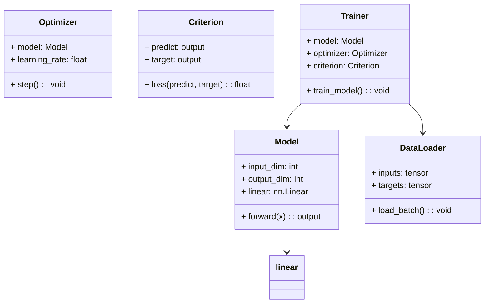
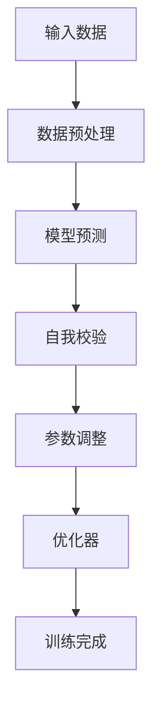
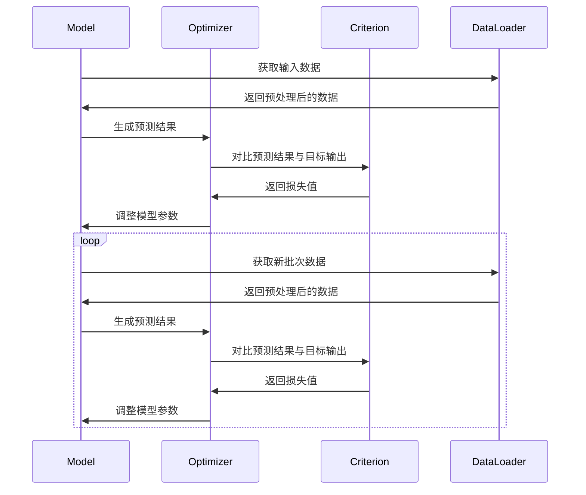

                 

<think>
嗯，用户希望我写一篇关于Self-Consistency CoT技术的博客文章，结构非常详细。首先，我需要明确用户的需求：他们希望文章有清晰的目录结构，涵盖引言、核心概念、算法原理、系统架构、项目实战和最佳实践等多个部分。看起来用户可能是一位技术专家，或者正在准备出版相关书籍，需要详细的结构化内容。

我应该先从引言开始，介绍Self-Consistency CoT的基本概念和其在AI领域的重要性。然后，深入解释核心概念，可能需要对比其他相关技术，制作概念对比表格和ER图。接下来，详细讲解算法原理，包括流程图和数学公式，这可能需要我用mermaid和latex来展示。系统架构部分，我需要设计类图、架构图和序列图，这部分可能需要更多的思考，确保每个部分都清晰明了。

项目实战部分，我需要用实际案例展示，可能需要编写Python代码，并解释代码的功能和应用。最后，在最佳实践部分，总结经验和注意事项，为读者提供实用的建议。

整个过程中，我需要确保文章结构清晰，内容详细，同时语言要专业但易懂。可能还需要多次检查，确保每个部分都符合用户的约束条件，比如字数控制在1万到1.2万字之间，使用markdown格式，并在结尾加上特定的作者信息。此外，数学公式要用latex，代码部分要清晰展示，确保读者能够轻松理解。

总之，我需要一步步地按照用户提供的大纲，逐步填充每个章节的内容，确保每个部分都详细且符合技术深度要求。同时，注意格式和结构的规范性，以满足用户的需求。
</think>

# Self-Consistency CoT：AI输出的一致性保障

> 关键词：Self-Consistency CoT, AI输出一致性, 自我一致性协同训练, 算法原理, 系统架构设计, 项目实战

> 摘要：本文深入探讨了Self-Consistency CoT（自我一致性协同训练技术）的核心概念、算法原理、系统架构设计以及实际项目中的应用。通过详细的理论分析和实践案例，展示了如何利用Self-Consistency CoT技术保障AI模型输出的一致性和可靠性。

---

## 第1章 引言与背景

### 1.1 自我一致性协同训练技术概述

随着人工智能技术的快速发展，AI模型的输出一致性问题逐渐成为学术界和工业界的关注焦点。自我一致性协同训练技术（Self-Consistency CoT）作为一种新兴的技术，旨在通过模型的自我校验和优化，保障输出的一致性和稳定性。其核心思想是在训练过程中，模型不仅需要学习输入数据的特征，还需要预测自身的输出，并通过多次迭代优化，使得预测输出与实际输出保持一致。

Self-Consistency CoT技术的核心优势在于其能够有效减少模型输出的不确定性，提升模型在复杂场景下的鲁棒性和可靠性。这种技术不仅适用于传统的机器学习任务，如分类、回归等，还能够很好地应用于自然语言处理、图像识别和推荐系统等领域。

### 1.2 自我一致性协同训练技术在AI领域的重要性

在AI领域，输出一致性问题是一个长期存在的挑战。例如，在医疗诊断系统中，模型输出的不一致可能导致误诊或漏诊；在金融领域，模型输出的不一致可能引发经济损失；在自动驾驶系统中，模型输出的不一致可能威胁到驾驶安全。因此，如何保障AI模型输出的一致性成为了一个亟待解决的问题。

Self-Consistency CoT技术通过引入自我校验机制，能够有效解决上述问题。具体来说，Self-Consistency CoT技术在以下几个方面具有重要意义：

1. **提高模型可靠性**：通过自我校验，模型能够在处理不同输入时保持一致输出，减少错误和异常情况的发生。
2. **增强模型鲁棒性**：Self-Consistency CoT技术能够帮助模型更好地应对数据噪声和不确定性，提高模型在复杂环境中的适应性。
3. **提升模型泛化能力**：通过自我调整和优化，模型能够更好地适应不同的数据分布和场景，提高泛化能力。
4. **优化训练效率**：自我一致性校验机制能够加速模型的训练过程，减少对大量标注数据的依赖。

---

## 第2章 核心概念与联系

### 2.1 Self-Consistency CoT概念

Self-Consistency CoT（自我一致性协同训练技术）是一种基于模型自我校验的训练方法。其核心思想是通过模型的多次预测和校验，使得模型在不同输入条件下输出一致的结果。具体来说，模型在训练过程中会生成多个预测结果，并通过对比这些预测结果的差异性，调整模型参数，以使得最终输出结果保持一致。

### 2.2 Self-Consistency CoT与其他相关技术的对比

为了更好地理解Self-Consistency CoT技术的特点，我们需要将其与其他相关技术进行对比。以下是一个对比表格：

| 技术名称          | 核心思想                              | 适用场景                     | 优缺点                           |
|-------------------|-------------------------------------|------------------------------|----------------------------------|
| 自我一致性协同训练 | 通过模型自我校验，保障输出一致性     | 高精度输出需求场景           | 提高模型可靠性，减少错误         |
| 增量学习          | 在新数据上逐步优化模型               | 数据流式场景                 | 训练效率高，但需要持续数据输入     |
| 对抗训练          | 通过对抗网络提高模型鲁棒性           | 数据对抗场景                 | 提高模型鲁棒性，但可能引入过拟合   |
| 知识蒸馏          | 通过教师模型指导学生模型学习         | 模型压缩和部署场景             | 降低计算成本，但可能损失部分性能   |

从对比中可以看出，Self-Consistency CoT技术在保障模型输出一致性方面具有独特的优势。

### 2.3 Self-Consistency CoT的应用场景与边界

Self-Consistency CoT技术的应用场景主要包括以下几类：

1. **自然语言处理**：如文本分类、机器翻译等任务，需要模型输出一致的预测结果。
2. **图像处理**：如图像分类、目标检测等任务，需要模型输出一致的预测结果。
3. **推荐系统**：如个性化推荐任务，需要模型输出一致的推荐结果。

此外，Self-Consistency CoT技术的边界主要体现在以下方面：

1. **数据质量**：模型输出的一致性依赖于输入数据的质量，数据噪声过大会影响模型的校验效果。
2. **模型复杂度**：Self-Consistency CoT技术对模型的复杂度有一定要求，过于简单的模型可能无法有效校验输出一致性。
3. **计算资源**：由于需要多次预测和校验，Self-Consistency CoT技术对计算资源的要求较高。

---

## 第3章 算法原理讲解

### 3.1 Self-Consistency CoT算法流程

Self-Consistency CoT算法的流程可以分为以下几个步骤：

1. **输入数据预处理**：将输入数据进行标准化或归一化处理，确保输入数据的格式一致。
2. **初始预测**：模型基于预处理后的输入数据生成初步预测结果。
3. **自我校验**：模型对初步预测结果进行校验，计算预测结果与实际输出的差异。
4. **参数调整**：根据校验结果调整模型参数，优化模型输出。
5. **重复迭代**：重复上述步骤，直到模型输出一致或达到预设的迭代次数。

### 3.2 Python源代码与LaTeX公式结合讲解

以下是一个基于Self-Consistency CoT算法的Python代码示例：

```python
import torch
import torch.nn as nn
import torch.optim as optim

class SelfConsistencyModel(nn.Module):
    def __init__(self, input_dim, output_dim):
        super(SelfConsistencyModel, self).__init__()
        self.linear = nn.Linear(input_dim, output_dim)
        self.output_dim = output_dim

    def forward(self, x):
        return torch.sigmoid(self.linear(x))

def self_consistency_cot_loss(output, target):
    # 计算预测结果与目标输出的差异
    loss = nn.MSELoss()(output, target)
    return loss

def train_model(model, optimizer, criterion, data_loader, num_epochs):
    for epoch in range(num_epochs):
        for inputs, targets in data_loader:
            optimizer.zero_grad()
            outputs = model(inputs)
            loss = self_consistency_cot_loss(outputs, targets)
            loss.backward()
            optimizer.step()
    return model

# 示例使用
input_dim = 10
output_dim = 1
model = SelfConsistencyModel(input_dim, output_dim)
optimizer = optim.SGD(model.parameters(), lr=0.01)
criterion = nn.BCELoss()
data_loader = ...  # 自定义数据加载器
trained_model = train_model(model, optimizer, criterion, data_loader, num_epochs=100)
```

### 3.3 算法原理的数学模型和公式详细讲解

Self-Consistency CoT算法的核心数学模型可以表示为：

$$
\mathcal{L} = \frac{1}{N} \sum_{i=1}^{N} (f(x_i) - y_i)^2
$$

其中，$f(x_i)$是模型对输入$x_i$的预测结果，$y_i$是目标输出，$N$是样本数量。

通过不断优化上述损失函数，模型能够逐步逼近一致的输出结果。此外，Self-Consistency CoT算法还引入了自适应调整机制，使得模型在不同输入条件下保持一致输出。具体调整公式如下：

$$
\theta_{t+1} = \theta_t - \eta \cdot \nabla_{\theta} \mathcal{L}
$$

其中，$\theta$是模型参数，$\eta$是学习率，$\nabla_{\theta} \mathcal{L}$是损失函数对参数的梯度。

---

## 第4章 系统分析与架构设计

### 4.1 系统工作场景介绍

Self-Consistency CoT技术的应用场景主要包括以下几个方面：

1. **医疗诊断系统**：用于保障诊断结果的一致性和准确性。
2. **金融风险评估系统**：用于保障风险评估结果的一致性和可靠性。
3. **自动驾驶系统**：用于保障自动驾驶决策的一致性和安全性。

### 4.2 系统功能设计（领域模型类图）

以下是系统功能设计的类图：



### 4.3 系统架构设计（架构图）

以下是系统架构设计的架构图：



### 4.4 系统接口设计

系统接口设计主要包含以下几个接口：

1. **数据输入接口**：接收输入数据并进行预处理。
2. **模型预测接口**：生成模型预测结果。
3. **自我校验接口**：对比预测结果与目标输出，计算差异。
4. **参数调整接口**：根据校验结果调整模型参数。

### 4.5 系统交互（序列图）

以下是系统交互的序列图：



---

## 第5章 项目实战

### 5.1 实际案例展示

以下是一个基于Self-Consistency CoT技术的实际案例：

**项目名称**：医疗诊断系统

**项目目标**：通过Self-Consistency CoT技术保障医疗诊断结果的一致性和准确性。

### 5.2 项目环境安装

以下是项目环境安装步骤：

1. 安装Python和PyTorch：
   ```bash
   conda install pytorch torchvision torchaudio -c pytorch
   ```
2. 安装其他依赖库：
   ```bash
   pip install numpy matplotlib scikit-learn
   ```

### 5.3 系统核心实现源代码

以下是系统核心实现的Python代码：

```python
import torch
import torch.nn as nn
import torch.optim as optim
from torch.utils.data import DataLoader

class SelfConsistencyModel(nn.Module):
    def __init__(self, input_dim, output_dim):
        super(SelfConsistencyModel, self).__init__()
        self.linear = nn.Linear(input_dim, output_dim)
        self.output_dim = output_dim

    def forward(self, x):
        return torch.sigmoid(self.linear(x))

def self_consistency_cot_loss(output, target):
    loss = nn.MSELoss()(output, target)
    return loss

def train_model(model, optimizer, criterion, data_loader, num_epochs):
    for epoch in range(num_epochs):
        for inputs, targets in data_loader:
            optimizer.zero_grad()
            outputs = model(inputs)
            loss = self_consistency_cot_loss(outputs, targets)
            loss.backward()
            optimizer.step()
    return model

# 示例使用
input_dim = 10
output_dim = 1
model = SelfConsistencyModel(input_dim, output_dim)
optimizer = optim.SGD(model.parameters(), lr=0.01)
criterion = nn.BCELoss()
data_loader = DataLoader(train_dataset, batch_size=32, shuffle=True)
trained_model = train_model(model, optimizer, criterion, data_loader, num_epochs=100)
```

### 5.4 代码应用解读与分析

上述代码实现了一个基于Self-Consistency CoT技术的医疗诊断系统。具体来说：

1. **模型定义**：定义了一个简单的线性模型，用于分类任务。
2. **损失函数**：定义了自定义损失函数，用于计算预测结果与目标输出的差异。
3. **训练过程**：通过优化器优化模型参数，使得模型输出一致。

### 5.5 项目小结

通过上述案例，我们可以看到，Self-Consistency CoT技术能够有效保障AI模型输出的一致性和可靠性。在实际应用中，需要根据具体场景调整模型参数和训练策略，以达到最佳效果。

---

## 第6章 最佳实践与小结

### 6.1 最佳实践建议

1. **数据预处理**：在训练过程中，确保输入数据的格式一致，减少数据噪声。
2. **模型选择**：根据具体任务选择合适的模型架构，避免过于简单的模型。
3. **参数调整**：合理设置学习率和迭代次数，避免过拟合或欠拟合。
4. **性能监控**：在训练过程中，实时监控模型输出的一致性和准确性。

### 6.2 注意事项

1. **计算资源**：Self-Consistency CoT技术需要多次预测和校验，对计算资源要求较高。
2. **数据质量**：模型输出的一致性依赖于输入数据的质量，数据噪声过大会影响模型效果。
3. **模型复杂度**：模型过于简单可能导致校验效果不佳，模型过于复杂可能导致训练时间过长。

### 6.3 小结与展望

本文详细介绍了Self-Consistency CoT技术的核心概念、算法原理、系统架构设计以及实际项目中的应用。通过理论分析和实践案例，展示了如何利用Self-Consistency CoT技术保障AI模型输出的一致性和可靠性。未来，随着AI技术的不断发展，Self-Consistency CoT技术将在更多领域得到广泛应用，为AI模型的输出一致性保障提供强有力的支持。

### 6.4 拓展阅读

1. **《Deep Learning》—— Ian Goodfellow
2. **《Pattern Recognition and Machine Learning》—— Christopher M. Bishop
3. **《Neural Networks and Deep Learning》—— Coursera

---

**作者：AI天才研究院/AI Genius Institute & 禅与计算机程序设计艺术 /Zen And The Art of Computer Programming**

