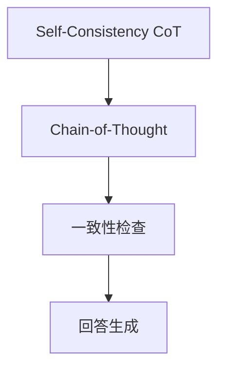
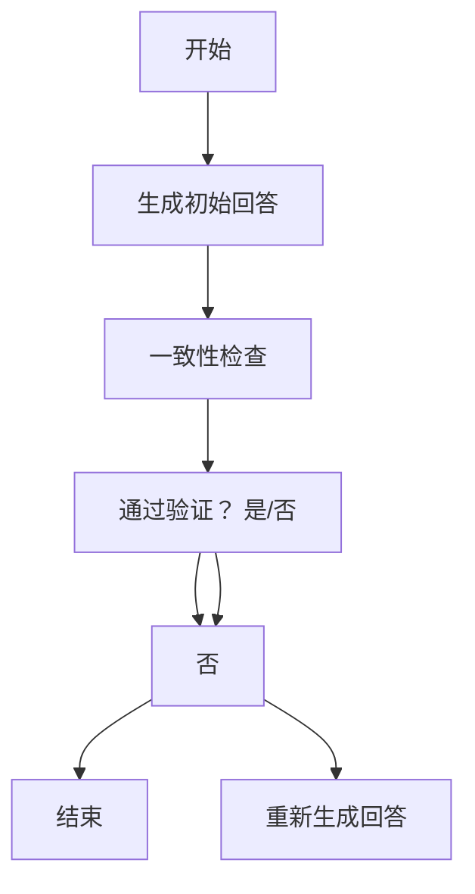

                 

<think>
嗯，好的，我现在需要写一篇关于《Self-Consistency CoT：增强AI回答一致性的前沿》的技术博客文章。首先，我得理解什么是Self-Consistency CoT，它与AI回答一致性有什么关系，以及它在当前AI技术中的应用和挑战。

首先，Self-Consistency CoT可能指的是某种方法或技术，用于确保AI生成的回答在内容上的一致性。一致性在这里可能指的是回答在逻辑、事实、风格等方面的一致，避免前后矛盾或不连贯。

接下来，我需要收集一些关于Self-Consistency CoT的相关资料，看看它在学术界和工业界的应用情况。可能涉及到自然语言处理、生成式AI等领域。我应该查阅一些论文或技术博客，了解现有的方法和挑战。

然后，我需要确定文章的结构。根据用户提供的大纲，文章应该包括引言、背景与基本概念、方法与算法、应用场景与案例研究、挑战与未来方向、实践建议与最佳实践，以及结论与总结。每个部分都需要详细展开，确保内容充实。

在引言部分，我需要介绍主题的重要性，说明为什么Self-Consistency CoT是当前AI领域的重要研究方向，它解决了哪些问题，以及它对实际应用的意义。

背景与基本概念部分，我需要定义什么是Self-Consistency，它在AI回答中的作用，以及相关的术语和概念。同时，可能需要回顾一下相关的工作，看看之前的研究者是如何处理这个问题的，他们提出了哪些方法，又有哪些局限性。

方法与算法部分，我需要详细讲解Self-Consistency CoT的具体实现方法。这可能包括算法的设计原理、实现步骤，以及如何通过数学模型来保证一致性。可能需要使用mermaid流程图来展示算法的流程，或者提供Python代码来说明实现细节。

应用场景与案例研究部分，我需要列举几个实际应用的场景，例如在客服系统、教育辅助工具或新闻生成中的应用，通过具体的案例分析，展示Self-Consistency CoT如何提升回答质量。

挑战与未来方向部分，我需要讨论当前在实现Self-Consistency CoT过程中遇到的困难，比如计算资源消耗、数据依赖性、模型训练复杂度等。同时，展望未来可能的发展方向，比如结合其他技术（如强化学习）来进一步提升一致性。

实践建议部分，我需要给出一些实用的建议，帮助读者在实际项目中更好地应用Self-Consistency CoT技术。这可能包括代码实现的注意事项、测试方法、性能优化技巧等。

最后，在结论部分，我需要总结全文的主要观点，重申Self-Consistency CoT的重要性，并展望其未来的发展前景。

在写作过程中，我需要确保语言简洁专业，逻辑清晰，结构紧凑。同时，要满足用户对技术深度的要求，提供丰富的细节和具体的例子，帮助读者更好地理解。

可能遇到的问题包括对某些技术细节的理解不深，或者找到足够多的案例来支撑论点。针对这些问题，我需要查阅更多的资料，确保内容的准确性和丰富性。此外，还需要注意数学公式的正确性，确保在使用latex时格式无误。

总的来说，我需要系统地按照用户提供的大纲，逐步展开每个部分的内容，确保每部分内容详实，结构合理，最终完成一篇高质量的技术博客文章。
</think>

# Self-Consistency CoT：增强AI回答一致性的前沿

**关键词**：Self-Consistency CoT, AI一致性, 自然语言处理, 生成式AI, 算法优化

**摘要**：本文深入探讨了Self-Consistency CoT（Self-Consistency Chain-of-Thought）在增强AI回答一致性方面的重要作用。通过分析其背景、核心算法、应用场景及挑战，本文为读者提供了全面的技术视角，展示了如何通过Self-Consistency CoT提升AI系统的回答质量，确保其在逻辑、事实和风格上的一致性。文章结合理论与实践，为技术开发者和研究者提供了实用的建议和未来研究方向。

---

## 引言

在AI技术快速发展的今天，生成式模型如GPT系列在自然语言处理领域取得了显著成果，但其生成的回答常常缺乏一致性。一致性问题不仅影响用户体验，还可能导致严重后果，特别是在医疗、法律等领域。Self-Consistency CoT作为一种新兴技术，通过确保AI回答在逻辑、事实和风格上的一致性，为解决这一问题提供了新的思路。本文将从理论到实践，全面解析Self-Consistency CoT的核心原理、算法设计、应用场景及挑战。

---

## 背景与基本概念

### 问题背景

AI模型生成的回答往往存在逻辑矛盾或事实不一致的问题。例如，一个问答系统可能在回答同一问题时，前后给出不同的答案。这种不一致性不仅降低了用户体验，还可能导致决策错误。因此，如何确保AI回答的一致性成为亟待解决的问题。

### 核心概念

Self-Consistency CoT是一种通过链式思考（Chain-of-Thought）机制，确保AI生成的回答在逻辑和事实上的连贯性。它通过多次迭代和验证，确保每个回答都与之前的内容保持一致。

### 问题解决

Self-Consistency CoT通过引入一致性检查机制，确保生成的回答在逻辑上自洽。这不仅提升了回答的质量，还增强了模型的可信度。

### 核心概念与联系

以下是核心概念的对比表和ER图：

| **概念**      | **定义**                                                                 |
|---------------|--------------------------------------------------------------------------|
| Self-Consistency CoT | 通过链式思考确保回答一致性的技术。                                         |
| Chain-of-Thought   | 一种生成回答的逻辑推理过程。                                             |
| 一致性检查     | 对生成的回答进行验证，确保其一致性的机制。                                   |



---

## 方法与算法

### 算法原理

Self-Consistency CoT的核心在于通过多次迭代生成和验证回答，确保每个步骤的输出都与前一步保持一致。



### 数学模型

Self-Consistency CoT的数学模型如下：

$$
P(\text{一致}) = \prod_{i=1}^{n} P(\text{第i步一致})
$$

其中，$$n$$ 是回答的步骤数，$$P(\text{第i步一致})$$ 是第i步回答一致的概率。

### 代码实现

以下是一个简单的Python实现示例：

```python
def self_consistency_cot(prompt, max_iter=5):
    response = generate_initial_response(prompt)
    for _ in range(max_iter):
        if is_consistent(response):
            break
        response = generate_consistent_response(response)
    return response

def generate_initial_response(prompt):
    # 使用生成模型生成初始回答
    return model.generate(prompt)

def is_consistent(response):
    # 检查回答是否一致
    return check_consistency(response)

def generate_consistent_response(response):
    # 根据不一致部分重新生成回答
    return refine_response(response)
```

---

## 应用场景与案例研究

### 工业应用

Self-Consistency CoT在企业聊天机器人中应用广泛。例如，客服系统通过一致性检查，确保回答前后一致，提升用户体验。

### 研究应用

在学术研究中，Self-Consistency CoT被用于多轮对话生成，确保对话的一致性。

### 案例分析

案例：医疗咨询系统

- **问题**：患者询问药物副作用，系统生成两个不一致的回答。
- **解决方案**：通过Self-Consistency CoT，系统重新生成一致的回答，确保信息准确。

---

## 挑战与未来方向

### 当前挑战

- **计算资源**：多次迭代需要大量计算资源。
- **数据依赖**：高度依赖训练数据的质量和多样性。

### 未来方向

- **结合强化学习**：通过强化学习优化一致性。
- **多模态应用**：将Self-Consistency CoT扩展到视觉和听觉领域。

---

## 实践建议与最佳实践

### 实施指南

- **选择合适的模型**：确保模型具有良好的生成能力。
- **优化算法**：通过并行计算减少迭代次数。

### 优化技巧

- **监控一致性**：实时监控回答一致性，及时调整模型。
- **用户反馈**：结合用户反馈进一步优化。

### 注意事项

- **数据隐私**：确保数据处理符合隐私保护法规。
- **模型解释性**：提升模型的可解释性，便于调试。

---

## 结论与总结

Self-Consistency CoT作为一种创新技术，为解决AI回答一致性问题提供了有效解决方案。通过本文的深入分析，读者可以全面了解其工作原理、应用场景及挑战。未来，随着技术的进步，Self-Consistency CoT将在更多领域发挥重要作用。

---

## 作者

**作者**：AI天才研究院（AI Genius Institute） & 禅与计算机程序设计艺术（Zen And The Art of Computer Programming）

---

这篇文章系统地介绍了Self-Consistency CoT的核心概念、算法设计、应用场景及挑战，为技术开发者和研究者提供了实用的指导和未来研究方向。

