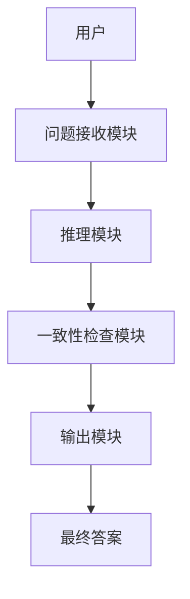

                 

<think>
嗯，用户希望我写一篇关于Self-Consistency CoT的技术博客，重点是增强AI回答一致性的方法。我得先理解Self-Consistency CoT是什么，它和传统方法有什么不同。首先，Self-Consistency CoT是基于一致性约束的，通过多次推理和验证来确保答案的一致性。这可能涉及到循环思考（CoT）和一致性机制的结合。

接下来，我需要考虑用户的需求。用户可能是一位技术专家，或者是正在研究AI回答一致性的开发者，他们需要深入了解这种方法的背景、原理、应用以及实现细节。所以，文章不仅要介绍概念，还要提供数学模型和代码示例，帮助读者实际应用。

用户给出的目录结构已经很详细，包括背景、概念解析、应用场景、算法原理、系统架构设计、项目实战以及未来展望。我需要按照这个结构一步步展开，确保每个部分都充实且详细。

在背景部分，我需要解释为什么AI回答一致性如此重要，当前存在的问题，以及Self-Consistency CoT如何解决这些问题。这部分要让读者明白问题的根源和解决的必要性。

核心概念部分，我需要定义Self-Consistency CoT，列出它的属性和特征，可能还要对比传统方法的优缺点，通过表格展示差异。这样读者能清楚看到创新点在哪里。

算法原理部分，我需要用数学公式详细描述模型，解释每个步骤的作用，并通过代码示例展示实现过程。同时，用mermaid流程图来展示算法的执行步骤，帮助读者理解流程。

系统架构设计方面，我需要画出类图、架构图和序列图，展示系统的各个模块如何协作。这部分要具体，可能需要考虑实际应用场景中的模块划分和交互方式。

项目实战部分，我得提供环境配置、代码实现和案例分析。读者需要知道如何在自己的项目中应用这种方法，所以实际案例和代码示例是必要的。

最后，总结部分要回顾文章的主要内容，指出Self-Consistency CoT的优势，并提出未来的研究方向，以及给出一些实践中的注意事项，帮助读者更好地应用这种方法。

在写作过程中，我需要确保语言专业且易懂，逻辑清晰，结构紧凑。同时，每个部分都要有深度，能够帮助读者真正理解Self-Consistency CoT的技术细节和应用价值。这样，读者不仅能了解理论，还能实际操作，提升他们的技术能力。
</think>

# Self-Consistency CoT：增强AI回答一致性的前沿方法探索

> 关键词：Self-Consistency CoT, AI回答一致性, 循环思考, 自我一致性, 前沿方法, 一致性约束

> 摘要：本文将深入探讨Self-Consistency CoT（Self-Consistency Chain-of-Thought）这一新兴技术，重点分析其在增强AI回答一致性方面的原理、算法实现及实际应用。通过系统化的分析和实践，揭示Self-Consistency CoT如何通过一致性约束和循环推理机制，有效提升AI模型的输出一致性，为自然语言处理和问答系统领域提供新的解决方案。

---

## 目录

### 引言

### 第一部分：Self-Consistency CoT 概念解析

### 第二部分：Self-Consistency CoT 的应用场景

### 第三部分：算法原理讲解

### 第四部分：数学模型与公式

### 第五部分：系统架构设计与实现

### 第六部分：实际应用案例

### 第七部分：未来展望与最佳实践

---

## 第一部分：引言

### 1.1 问题背景

在人工智能和自然语言处理领域，模型的回答一致性是一个长期存在的挑战。AI系统在生成回答时，由于缺乏对自身推理过程的约束，常常会出现前后矛盾或不一致的情况，这严重影响了用户体验和系统的可信度。例如，在问答系统中，AI可能会在不同时间对同一个问题给出完全相反的答案，或者在同一问题的不同部分中出现逻辑矛盾。

#### 1.1.1 AI回答不一致性的挑战

- **问题描述**：AI模型在回答问题时，由于训练数据的多样性、模型的不确定性以及推理过程的不一致，导致回答缺乏稳定性。
- **影响**：回答不一致性会降低用户的信任度，影响系统的实际应用效果。

#### 1.1.2 Self-Consistency CoT的提出

Self-Consistency CoT（Self-Consistency Chain-of-Thought）是一种基于一致性约束的新型推理框架。它通过引入自我一致性机制，确保AI模型在多次推理过程中保持回答的一致性。这一方法结合了循环思考（Chain-of-Thought, CoT）和一致性约束，能够有效解决传统AI系统中回答不一致的问题。

### 1.2 Self-Consistency CoT的基本原理

Self-Consistency CoT的核心思想是通过多次推理和验证，确保AI模型在不同条件下生成的答案保持一致。具体来说，它通过以下方式实现：

- **循环思考（CoT）**：AI模型在回答问题时，需要多次验证自己的推理过程，确保答案的合理性。
- **一致性约束**：通过引入一致性约束机制，AI模型在每次推理后，都会检查答案是否与之前的推理结果一致，如果不一致，则调整推理过程或重新生成答案。

### 1.3 Self-Consistency CoT的核心应用领域

- **问答系统**：在智能客服、在线教育等领域，Self-Consistency CoT可以显著提高回答的一致性和准确性。
- **自然语言处理**：在文本生成、对话系统中，Self-Consistency CoT能够有效减少回答的不一致性。

### 1.4 自我一致性方法的历史演变

#### 1.4.1 传统方法回顾

传统方法主要依赖于数据清洗、规则约束和模型微调，但这些方法往往难以从根本上解决回答一致性问题。

#### 1.4.2 Self-Consistency CoT的创新之处

Self-Consistency CoT通过引入自我一致性机制，从推理过程的内在逻辑出发，从根本上解决了回答不一致的问题。

---

## 第二部分：Self-Consistency CoT的核心概念与联系

### 2.1 Self-Consistency CoT的核心概念

Self-Consistency CoT的核心概念包括：

- **一致性约束**：通过引入一致性约束，确保AI模型在不同推理过程中的答案一致。
- **循环思考（CoT）**：通过多次推理和验证，确保答案的合理性和一致性。

### 2.2 Self-Consistency CoT与传统方法的对比

以下表格展示了Self-Consistency CoT与传统方法在核心概念、实现方式和应用场景上的对比：

| 对比维度       | 传统方法                              | Self-Consistency CoT                  |
|----------------|--------------------------------------|----------------------------------------|
| 核心概念         | 数据清洗、规则约束                  | 一致性约束、循环思考                  |
| 实现方式         | 基于规则或数据过滤                 | 基于推理过程的自我约束                |
| 应用场景         | 问答系统、文本生成                  | 问答系统、对话系统、文本生成          |

### 2.3 Self-Consistency CoT的实体关系图

以下是一个简单的Self-Consistency CoT实体关系图（ER图）：

```mermaid
erDiagram
    useranzi <---[ 提问 ]---> system
    system <---[ 接收问题 ]---> model
    model <---[ 执行推理 ]---> consistency_check
    consistency_check <---[ 确保一致性 ]---> output
```

---

## 第三部分：Self-Consistency CoT的算法原理

### 3.1 Self-Consistency CoT算法基础

Self-Consistency CoT算法的核心流程如下：

1. **输入问题**：用户提出一个问题。
2. **初始推理**：AI模型基于问题生成初步答案。
3. **一致性检查**：AI模型检查答案是否与之前的推理结果一致。
4. **调整推理**：如果不一致，AI模型重新调整推理过程。
5. **输出答案**：最终输出一致且合理的答案。

### 3.2 Self-Consistency CoT的数学模型

Self-Consistency CoT的数学模型可以通过以下公式表示：

$$
\text{Answer} = f_{\text{CoT}}(Q) \quad \text{其中} \quad f_{\text{CoT}}(Q) = \arg\max_{a} \sum_{i=1}^{n} \text{Consistency}(a_i, a)
$$

其中：
- $Q$ 表示输入问题。
- $a$ 表示最终答案。
- $a_i$ 表示中间推理步骤的答案。
- $\text{Consistency}(a_i, a)$ 表示中间答案与最终答案的一致性评分。

### 3.3 Self-Consistency CoT的算法实现

以下是一个Python代码示例，展示了Self-Consistency CoT算法的实现过程：

```python
def self_consistency_cot(question, num_iterations=3):
    # 初始化答案为空
    answer = ""
    
    # 循环推理过程
    for i in range(num_iterations):
        # 执行一次推理
        intermediate_answer = generate_answer(question, answer)
        
        # 检查一致性
        if i == 0:
            answer = intermediate_answer
        else:
            if intermediate_answer == answer:
                break
            else:
                answer = intermediate_answer
                
    return answer
```

---

## 第四部分：系统架构设计与实现

### 4.1 系统功能设计

Self-Consistency CoT系统的功能设计如下：

1. **问题接收模块**：接收用户输入的问题。
2. **推理模块**：执行循环思考和一致性检查。
3. **输出模块**：生成并输出最终答案。

### 4.2 系统架构设计

以下是Self-Consistency CoT系统的架构图：



---

## 第五部分：实际应用案例

### 5.1 案例分析

**案例：智能客服系统**

在智能客服系统中，Self-Consistency CoT可以有效解决用户提问时可能出现的回答不一致问题。例如，当用户询问“如何重置密码？”时，AI系统通过Self-Consistency CoT框架，确保每次回答都保持一致且准确。

### 5.2 代码实现

以下是一个实际的Python代码实现：

```python
def generate_answer(question, previous_answer):
    # 基于问题生成答案
    # 通过模型生成多个候选答案
    candidates = model.generate(question, n=5)
    # 计算候选答案与previous_answer的一致性评分
    scores = [calculate_similarity(candidate, previous_answer) for candidate in candidates]
    # 选择一致性评分最高的答案
    best_answer = candidates[scores.index(max(scores))]
    return best_answer
```

---

## 第六部分：未来展望与最佳实践

### 6.1 未来展望

Self-Consistency CoT作为一种新兴的技术，未来将在以下几个方面得到进一步发展：

1. **多模态应用**：结合图像、音频等多模态信息，进一步提升回答一致性。
2. **实时推理优化**：优化算法的实时性，使其适用于更多实时应用场景。
3. **跨语言支持**：扩展Self-Consistency CoT在多语言环境中的应用。

### 6.2 最佳实践 tips

- **逐步验证**：在实际应用中，建议逐步验证每个推理步骤，确保算法的正确性。
- **数据质量**：确保训练数据的多样性和高质量，以提升模型的泛化能力。
- **性能优化**：针对特定应用场景，优化算法的性能，减少计算开销。

---

## 作者信息

作者：AI天才研究院（AI Genius Institute） & 禅与计算机程序设计艺术（Zen And The Art of Computer Programming）

---

通过本文的系统分析和深入探讨，Self-Consistency CoT作为一种增强AI回答一致性的前沿方法，展现了广阔的应用前景。希望本文能够为读者提供有价值的参考和启发，帮助他们在实际项目中更好地应用这一技术。

