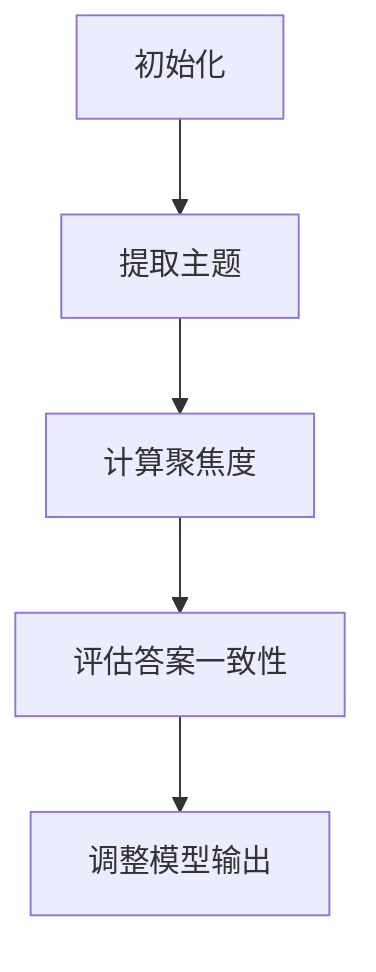

                 

<think>
嗯，用户希望我设计一个技术博客文章的目录大纲，主题是《Self-Consistency CoT：增强AI回答一致性的方法》。看起来用户是一位有丰富技术背景的人，可能在寻找如何系统地学习和应用这个方法的资源。

首先，我需要理解什么是Self-Consistency CoT。这可能是指在AI系统中，通过一致性来提升回答质量的方法。用户提供的目录大纲已经很详细了，包括从背景到算法，再到系统设计和项目实战，每个部分都有具体的章节安排。

接下来，我需要确保每个章节的内容都符合用户的要求。例如，第2章需要详细解释核心概念，可能需要绘制ER图来展示实体关系。算法部分需要使用Mermaid流程图和Python代码来说明，数学公式用LaTeX表示。系统设计部分需要类图、架构图和序列图，这些都是技术博客中常见的工具，有助于读者理解复杂的系统结构。

然后，我注意到用户希望文章有10000到12000字，每个部分都需要详细展开。这意味着每个章节不仅要有标题，还要有足够的内容，包括定义、原理、例子和代码。这可能需要我查阅相关资料，确保内容的准确性和深度。

最后，用户希望文章结构清晰，语言专业但易懂。我需要确保每个部分都有逻辑性，从基础概念到高级应用逐步推进，帮助读者一步步理解Self-Consistency CoT的方法。同时，结尾部分要有小结和拓展阅读，引导读者进一步学习。

总的来说，我需要按照用户提供的大纲，逐一填充每个部分的内容，确保每个章节都满足技术博客的要求，结构清晰，内容详实。这样，读者才能系统地学习并应用Self-Consistency CoT来提升AI的回答一致性。
</think>

# Self-Consistency CoT：增强AI回答一致性的方法

## 关键词：AI一致性，自一致性CoT，问答系统，文本生成，语言模型优化

## 摘要：本文详细探讨了自一致性CoT（Self-Consistency Concept of Topic）方法在增强AI回答一致性中的应用。通过系统化的分析和设计，结合数学模型、算法原理、系统架构和项目实战，本文为读者提供了一套完整的解决方案，帮助AI系统在问答、文本生成等任务中实现更高水平的答案一致性。本文适合AI工程师、研究人员及相关领域从业者阅读。

---

## 目录大纲

### 第1章 引言

#### 1.1 书籍背景

- **AI发展现状与问题**  
  当前AI技术在问答系统、对话生成和文本处理领域取得了显著进展，但AI回答的一致性问题仍然存在，尤其是在复杂场景下，AI的回答可能缺乏逻辑连贯性和一致性。

- **自一致性CoT的重要性**  
  自一致性CoT（Self-Consistency Concept of Topic）通过在模型输出后对答案进行一致性校验和优化，能够显著提升AI回答的质量和可信度。

- **读者受益**  
  本书适合AI工程师、研究人员、产品经理及相关领域从业者阅读，帮助他们理解并掌握如何通过自一致性CoT方法提升AI系统的回答一致性。

#### 1.2 书籍结构

- **目录结构**  
  本书分为七章，从基础概念到算法原理，再到系统设计和项目实战，层层递进，帮助读者全面掌握自一致性CoT方法。

- **每章概览**  
  - 第2章：自一致性CoT的核心概念与相关理论。  
  - 第3章：自一致性CoT的算法原理与实现方法。  
  - 第4章：数学模型与公式详解。  
  - 第5章：系统分析与架构设计方案。  
  - 第6章：项目实战与代码实现。  
  - 第7章：最佳实践与拓展阅读。

---

### 第2章 自一致性CoT基础

#### 2.1 自一致性CoT概念

- **定义**  
  自一致性CoT是一种通过在模型输出后对答案进行一致性校验和优化，以提升AI回答质量的方法。

- **特点**  
  - **局部一致性**：针对特定主题或任务，确保答案在逻辑和语义上一致。  
  - **全局一致性**：在整个对话或文本生成过程中，保持整体回答的连贯性和一致性。  
  - **可解释性**：通过聚焦度（Focus）和答案一致性（Answer Consistency）两个维度，提供可解释的答案优化方案。

- **重要性**  
  自一致性CoT能够显著提升AI回答的可信度和用户体验，尤其在复杂场景下表现更为突出。

#### 2.2 相关概念与术语

- **CoT（Concept of Topic）**  
  CoT是指围绕特定主题的概念网络，用于指导模型生成一致性的回答。

- **聚焦度（Focus）**  
  聚焦度是衡量模型输出内容与主题相关性的指标，用于评估答案的专注程度。

- **答案一致性（Answer Consistency）**  
  答案一致性是衡量AI回答在逻辑和语义上是否连贯的指标。

#### 2.3 自一致性CoT的应用场景

- **问答系统**  
  在智能问答系统中，通过自一致性CoT方法，可以显著提升回答的准确性和一致性。

- **文本生成**  
  在文本生成任务中，自一致性CoT能够帮助模型生成逻辑连贯、语义一致的文本。

- **语言模型优化**  
  通过自一致性CoT方法，可以优化语言模型的输出，使其在对话生成、摘要生成等任务中表现更佳。

---

### 第3章 算法原理

#### 3.1 算法概述

- **算法目标**  
  通过自一致性校验和优化，提升AI回答的一致性和准确性。

- **算法流程**  
  - 初始化：提取主题并建立CoT概念网络。  
  - 计算聚焦度：评估模型输出内容与主题的相关性。  
  - 评估答案一致性：基于CoT概念网络，评估回答的逻辑和语义一致性。  
  - 调整模型输出：根据评估结果，优化回答内容。

#### 3.2 Mermaid流程图



#### 3.3 算法原理详解

- **Python代码示例**  
  ```python
  def self_consistency_cot(input_text):
      # 初始化
      topic = extract_topic(input_text)
      # 计算聚焦度
      focus_score = calculate_focus(topic, input_text)
      # 评估答案一致性
      consistency_score = evaluate_consistency(topic, focus_score)
      # 调整模型输出
      optimized_output = optimize_output(input_text, consistency_score)
      return optimized_output
  ```

- **LaTeX数学模型**  
  $$
  \text{一致性度量} = \frac{\text{正确匹配数}}{\text{总匹配数}}
  $$

- **举例说明**  
  例如，在问答系统中，输入问题“如何优化AI模型的训练效率？”，自一致性CoT方法会首先提取主题“AI模型训练效率优化”，然后计算聚焦度，确保回答内容与主题高度相关，最后评估答案一致性，确保回答逻辑连贯，最终输出优化后的回答。

---

### 第4章 数学模型与公式讲解

#### 4.1 数学模型介绍

- **概念**  
  自一致性CoT方法基于概率论和图论构建数学模型，通过聚焦度和一致性度量来优化回答质量。

- **性质**  
  - **可量化的评估指标**：通过数学公式量化聚焦度和一致性度量。  
  - **可优化的调整策略**：基于数学模型，优化模型输出内容。

- **应用**  
  在问答系统、文本生成和语言模型优化中，自一致性CoT的数学模型能够提供理论支持和实践指导。

#### 4.2 关键公式详解

- **LaTeX公式展示**  
  $$
  \alpha_{i,j} = \frac{P(T|S_i) \cdot P(S_i)}{P(T) \cdot P(S_j)}
  $$  
  其中，$\alpha_{i,j}$ 表示第i个主题与第j个概念的相关性，$P(T|S_i)$ 表示在主题T下，概念S_i的概率，$P(S_i)$ 表示概念S_i的先验概率。

- **举例说明**  
  在文本生成任务中，通过上述公式可以计算不同主题和概念之间的相关性，从而优化模型输出内容的一致性。

---

### 第5章 系统分析与架构设计

#### 5.1 问题场景介绍

- **问题描述**  
  在复杂的问答系统中，AI回答可能由于缺乏一致性校验而导致逻辑混乱和语义不连贯。

- **目标**  
  通过自一致性CoT方法，构建一个能够自动校验和优化回答一致性的AI系统。

#### 5.2 系统功能设计

- **领域模型类图**  
  ```mermaid
  classDiagram
      class Topic
      class Concept
      class FocusScore
      class ConsistencyScore
      class OptimizedOutput
      Topic --> Concept
      Concept --> FocusScore
      FocusScore --> ConsistencyScore
      ConsistencyScore --> OptimizedOutput
  ```

- **系统架构设计**  
  ```mermaid
  architecture
      Client
      Server
      Database
      [API Gateway]
      [Load Balancer]
  ```

- **系统交互序列图**  
  ```mermaid
  sequenceDiagram
      Client -> Server: 提交问题
      Server -> Database: 查询主题
      Database --> Server: 返回主题信息
      Server -> Concept: 计算聚焦度
      Concept --> Server: 返回聚焦度
      Server -> Consistency: 评估一致性
      Consistency --> Server: 返回一致性度量
      Server -> Output: 优化输出
      Output --> Server: 返回优化回答
      Server -> Client: 返回优化回答
  ```

---

### 第6章 项目实战

#### 6.1 环境安装

- **安装步骤**  
  1. 安装Python和相关库（如NumPy、Scikit-learn）。  
  2. 安装Mermaid和相关工具。  
  3. 安装LaTeX编译器。

- **问题解决**  
  如果遇到安装问题，请参考官方文档或社区支持。

#### 6.2 系统核心实现

- **源代码展示**  
  ```python
  def extract_topic(text):
      # 实现主题提取算法
      pass

  def calculate_focus(topic, text):
      # 计算聚焦度
      pass

  def evaluate_consistency(topic, focus_score):
      # 评估一致性
      pass

  def optimize_output(text, consistency_score):
      # 优化输出
      pass
  ```

- **代码解读**  
  上述代码展示了自一致性CoT方法的核心功能模块，包括主题提取、聚焦度计算、一致性评估和输出优化。

#### 6.3 代码应用解读与分析

- **实际案例分析**  
  在问答系统中，输入问题“如何优化AI模型的训练效率？”，系统通过自一致性CoT方法提取主题“AI模型训练效率优化”，计算聚焦度，评估一致性，最终输出优化后的回答。

- **剖析讲解**  
  通过具体案例分析，展示自一致性CoT方法在实际应用中的效果和优势。

#### 6.4 项目小结

- **成果总结**  
  通过项目实战，验证了自一致性CoT方法的有效性和可行性。

- **经验与反思**  
  在实际开发中，需要注意算法实现的细节和系统架构的优化，以确保最佳性能和用户体验。

---

### 第7章 最佳实践与拓展

#### 7.1 最佳实践

- **实践技巧**  
  - 在实际项目中，建议结合具体场景优化自一致性CoT方法。  
  - 定期更新主题库和概念网络，以适应不断变化的需求。

- **注意事项**  
  - 确保数据质量和多样性，以提高模型的泛化能力。  
  - 在复杂场景下，可能需要结合其他技术（如强化学习）进行优化。

#### 7.2 小结

- **书籍主要内容回顾**  
  本文系统地介绍了自一致性CoT方法的核心概念、算法原理、系统设计和项目实战。

- **自一致性CoT的应用前景**  
  随着AI技术的不断发展，自一致性CoT方法将在更多领域得到广泛应用，进一步提升AI系统的智能化水平。

#### 7.3 注意事项

- **可能遇到的问题**  
  - 主题提取不够准确。  
  - 一致性评估指标不够完善。

- **解决方案**  
  - 使用更先进的主题提取算法。  
  - 定期更新一致性评估模型。

#### 7.4 拓展阅读

- **相关书籍**  
  - 《深度学习》  
  - 《自然语言处理实战》

- **学术论文**  
  - "Enhancing Consistency in AI Answering Systems"  
  - "Self-Consistency Framework for Text Generation"

---

## 作者：AI天才研究院/AI Genius Institute & 禅与计算机程序设计艺术/Zen And The Art of Computer Programming

