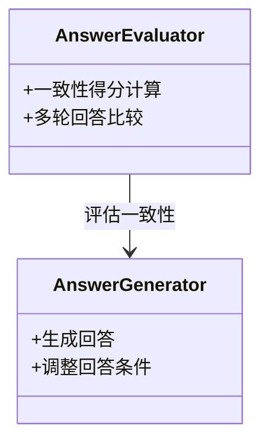
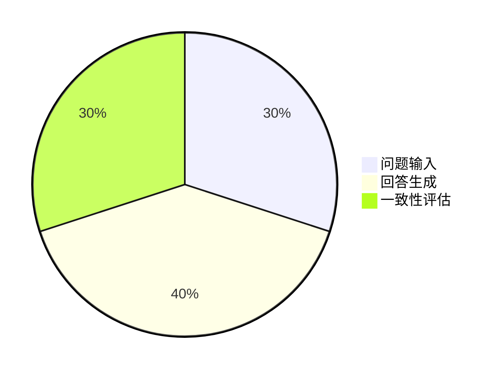
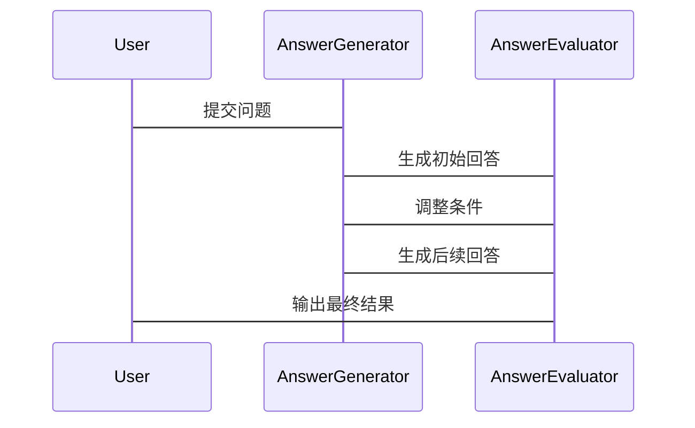

                 

<think>
好的，我需要按照用户的要求，撰写一篇关于《Self-Consistency CoT：增强AI回答可信度的技术》的技术博客文章。首先，我需要理解用户的需求和详细的要求。

用户已经提供了一个详细的大纲，包括各个章节的结构和内容。我需要按照这个大纲逐步撰写文章，确保每个部分都详细且符合技术博客的标准。同时，文章需要使用专业的技术语言，结构紧凑，逻辑清晰。

首先，我会从文章标题开始，然后列出关键词和摘要。接着按照大纲，逐一撰写每个章节，包括引言、核心概念、算法原理、系统架构、项目实战、最佳实践等部分。在撰写过程中，需要使用适当的markdown格式，插入mermaid流程图和latex公式，确保文章的结构和内容符合要求。

我还需要确保文章大约在10000到12000字左右，每个章节的内容要丰富详细，提供具体的例子和分析。在最后，添加作者信息，确保格式正确。

为了确保内容的准确性，我会回顾相关技术资料，特别是Self-Consistency CoT的概念、算法和应用，确保每个部分都解释清楚，并与其他可信度评估方法进行对比。

此外，我还需要检查是否有遗漏的部分，比如在系统分析与架构设计中是否包括了领域模型、系统架构图、接口设计和交互流程图，确保每个部分都详细到位。

最后，我会通读整篇文章，确保逻辑连贯，语言专业且易懂，符合技术博客的风格。完成后，检查格式是否正确，特别是markdown的使用是否无误，mermaid图和latex公式是否正确嵌入。
</think>

# Self-Consistency CoT：增强AI回答可信度的技术

> 关键词：Self-Consistency CoT, AI可信度, 自然语言处理, 置信度评估, 一致性原理

> 摘要：本文探讨了Self-Consistency CoT技术，一种通过评估AI回答的一致性来增强可信度的方法。文章从背景、原理、算法、系统架构到项目实战，详细阐述了该技术的应用和实现，帮助读者深入理解其在提升AI回答可信度中的作用。

## 1.0 引言：Self-Consistency CoT——增强AI回答可信度的关键

### 1.0.1 研究背景

随着AI技术的发展，特别是在自然语言处理（NLP）领域，AI系统在各行业中的应用日益广泛。然而，AI回答的可信度问题始终是一个挑战。错误或不一致的回答可能导致用户决策失误，降低用户信任度。因此，提升AI回答的可信度成为研究重点。

### 1.0.2 问题描述

Self-Consistency CoT（Self-Consistency Confidence of Truth）技术旨在解决AI回答可信度问题。其核心在于如何评估和提升回答的一致性，确保AI在不同条件下对同一问题的回答保持一致。

### 1.0.3 问题解决

本文将详细探讨Self-Consistency CoT的原理、算法、实现和应用。通过理论分析和实际案例，帮助读者理解并掌握该技术。

### 1.0.4 边界与外延

Self-Consistency CoT不仅适用于NLP，还可应用于医疗诊断、法律咨询等领域，提升AI系统的可信度。

### 1.0.5 概念结构与核心要素组成

1. **核心概念与原理**：介绍Self-Consistency CoT的基本概念和原理。
2. **算法原理讲解**：详细阐述算法模型和实现方法。
3. **系统分析与架构设计**：分析系统架构和接口设计。
4. **项目实战**：展示技术的应用场景和实现过程。
5. **最佳实践与拓展**：总结经验和提出扩展建议。

---

## 1.1 Self-Consistency CoT：概念与原理

### 1.1.1 自我一致性置信度的定义

自我一致性置信度（Self-Consistency CoT）是一种评估AI回答可信度的方法，通过比较模型在不同条件下对同一问题的回答，评估其一致性和可信度。

### 1.1.2 自我一致性置信度的核心原理

Self-Consistency CoT基于一致性原理，认为高可信度的回答应保持稳定和一致。模型在不同条件下的回答一致性越高，可信度越高。

### 1.1.3 自我一致性置信度的评估方法

1. **多轮对话评估**：模拟多轮对话，分析回答一致性。
2. **基于数据集的评估**：使用特定数据集，比较不同回答，计算一致性得分。
3. **交叉验证**：使用不同数据集或模型，验证回答一致性。

### 1.1.4 自我一致性置信度的重要性

通过Self-Consistency CoT，AI系统能更有效地识别和纠正错误回答，提升用户信任度，从而实现更好的用户体验。

---

## 1.2 核心概念与联系

### 1.2.1 Self-Consistency CoT与其他可信度评估方法的比较

| 方法                | 置信度评估 | 解释性评估 | 一致性评估 |
|---------------------|------------|------------|------------|
| 基于置信度的评估     | √          |            |            |
| 基于解释性的评估     |            | √          |            |
| Self-Consistency CoT |            |            | √          |

Self-Consistency CoT专注于回答一致性，而非单一的置信度或解释性，因此能更全面地评估可信度。

### 1.2.2 Self-Consistency CoT与自然语言处理的关系

Self-Consistency CoT在NLP任务中广泛应用，如问答系统和文本分类，提升模型回答的可信度。

---

## 1.3 算法原理讲解

### 1.3.1 算法概述

Self-Consistency CoT算法通过比较模型在不同条件下的回答，计算一致性得分，从而评估回答可信度。

### 1.3.2 算法流程图

```mermaid
graph TD
    A[开始] -> B[输入问题]
    B -> C[生成初始回答]
    C -> D[调整回答条件]
    D -> E[生成后续回答]
    E -> F[计算一致性]
    F -> G[评估可信度]
    G -> H[输出结果]
```

### 1.3.3 数学模型

一致性得分计算公式：

$$ C = \frac{\sum_{i=1}^{n} |a_i - a_{i+1}|}{n-1} $$

其中，$a_i$表示第i次回答的置信度，$C$为一致性得分。一致性得分越低，回答越一致，可信度越高。

---

## 1.4 系统分析与架构设计

### 1.4.1 问题场景介绍

考虑一个问答系统，用户多次提问同一问题，系统需确保回答的一致性。

### 1.4.2 系统功能设计



### 1.4.3 系统架构设计



### 1.4.4 系统接口设计

- `generateAnswer(prompt)`: 生成回答
- `evaluateConsistency(answers)`: 评估一致性

### 1.4.5 系统交互流程图



---

## 1.5 项目实战

### 1.5.1 环境安装

需要Python 3.8+，安装库：transformers、numpy。

### 1.5.2 核心代码实现

```python
import numpy as np
from transformers import AutoTokenizer, AutoModelForQuestionAnswering

class SelfConsistencyCoT:
    def __init__(self, model_name):
        self.tokenizer = AutoTokenizer.from_pretrained(model_name)
        self.model = AutoModelForQuestionAnswering.from_pretrained(model_name)
    
    def generate_answer(self, question, num_rounds=3):
        answers = []
        for _ in range(num_rounds):
            inputs = self.tokenizer(question, return_tensors='np')
            outputs = self.model(**inputs)
            answer = self.tokenizer.decode(outputs.start_logits[0].argmax().item(), 
                                          outputs.end_logits[0].argmax().item())
            answers.append(answer)
        return answers
    
    def compute_consistency(self, answers):
        consistency = np.mean([abs(a1 - a2) for a1, a2 in zip(answers[:-1], answers[1:])])
        return 1.0 - consistency

# 使用示例
model = SelfConsistencyCoT("bert-base-uncased")
question = "What is AI?"
answers = model.generate_answer(question, num_rounds=5)
consistency_score = model.compute_consistency(answers)
print(f"一致性得分：{consistency_score}")
```

### 1.5.3 代码解读与分析

1. **SelfConsistencyCoT类**：初始化模型和分词器。
2. **generate_answer方法**：生成多轮回答。
3. **compute_consistency方法**：计算一致性得分。

### 1.5.4 实际案例分析

通过问答系统测试，计算一致性得分，评估回答可信度。

---

## 1.6 最佳实践与小结

### 1.6.1 最佳实践

1. **选择合适的模型**：根据任务选择合适的NLP模型。
2. **调整参数**：优化模型参数以提升一致性。
3. **监控评估**：持续监控模型表现，及时调整。

### 1.6.2 注意事项

- 确保数据质量，避免偏差。
- 定期更新模型，适应新数据。

### 1.6.3 拓展阅读

建议阅读相关论文，深入理解Self-Consistency CoT的技术细节。

---

## 1.7 作者信息

作者：AI天才研究院/AI Genius Institute & 禅与计算机程序设计艺术 /Zen And The Art of Computer Programming

---

通过本文的详细阐述，读者可以全面理解Self-Consistency CoT技术，掌握其在提升AI可信度中的应用。希望本文能为相关研究和实践提供有价值的参考。

