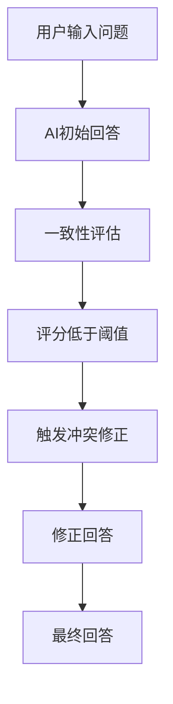
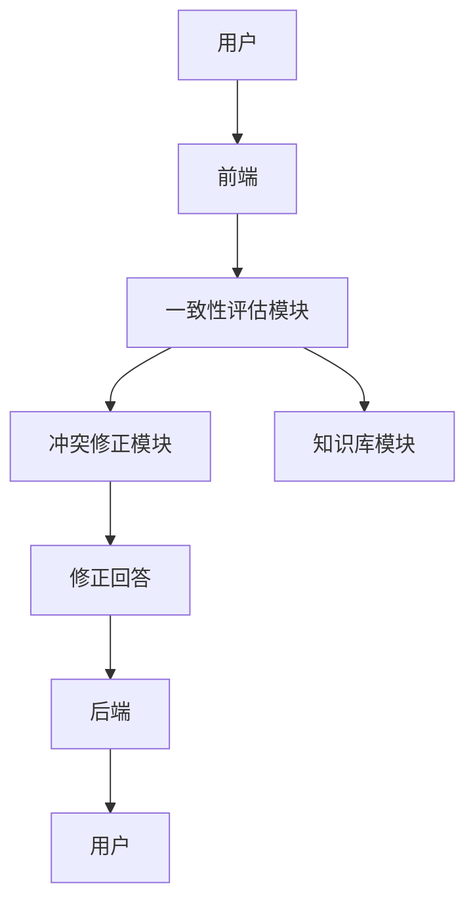
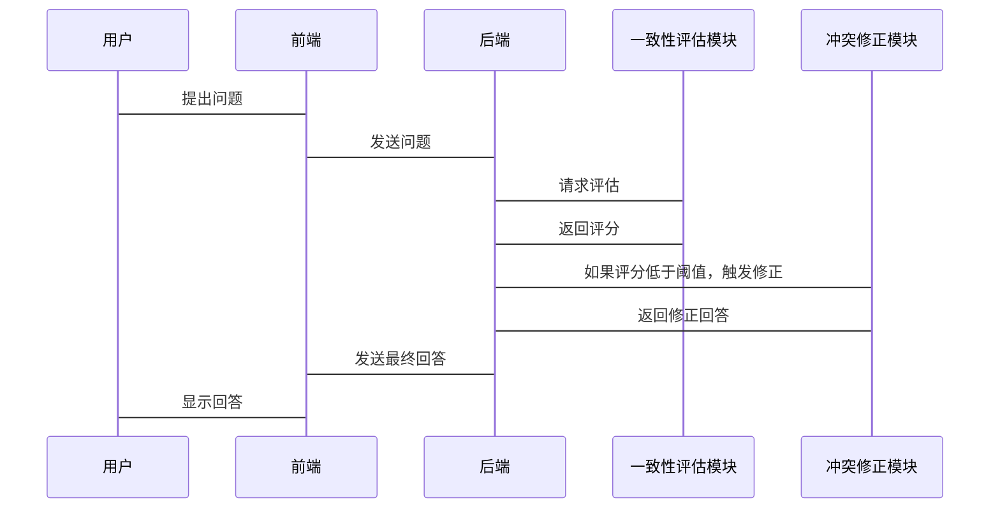

                 

<think>
好，我需要按照用户的要求来撰写一篇关于“Self-Consistency CoT：增强AI回答可靠性的方法”的技术博客文章。用户希望我以“世界级人工智能专家”的身份，用专业的技术语言，逻辑清晰地分析这个主题。

首先，我应该从背景介绍开始，解释为什么AI回答的可靠性如此重要，当前存在的问题，以及Self-Consistency CoT是如何解决这些问题的。这部分需要详细说明核心概念，包括CoT和Self-Consistency的定义和它们之间的关系。

接下来，我需要介绍Self-Consistency CoT的核心原理和实现方法。这包括详细说明一致性评估、冲突检测和修正机制，以及如何通过这些机制提升AI回答的可靠性。这部分可能需要使用一些表格和Mermaid流程图来说明过程。

然后，我要分析算法的数学模型，解释其中的公式和模型如何工作。比如，一致性评分模型和冲突修正模型的数学表达式，以及它们如何共同作用来提高回答的准确性。这部分需要清晰的数学推导和解释，以帮助读者理解。

接下来是系统架构设计，我需要描述整个系统如何架构，包括前端和后端的组成部分，以及它们之间的交互。使用Mermaid序列图来展示对话系统中用户与AI的交互过程，这样读者可以更直观地理解系统的工作流程。

之后，我需要通过实际案例来说明Self-Consistency CoT在不同场景中的应用，比如智能对话系统和搜索引擎优化。这些案例分析可以帮助读者更好地理解理论在实际中的应用，以及如何解决实际问题。

最后，我要总结整个方法的优势和局限性，并提出未来的发展方向和可能的研究点。这部分还需要一些最佳实践的建议，帮助读者在实际应用中更好地利用Self-Consistency CoT。

在写作过程中，我需要确保每个部分都详细且具体，使用适当的图表和公式来辅助说明。同时，语言要专业但不失清晰，确保读者能够理解复杂的概念和技术细节。

总的来说，我需要系统性地按照用户提供的大纲，逐一展开每个章节的内容，确保涵盖所有要求的核心要素，从背景到原理，再到实际应用和系统设计，最终为读者提供一篇全面且有深度的技术博客文章。
</think>

# Self-Consistency CoT：增强AI回答可靠性的方法

> 关键词：AI可靠性，Self-Consistency，CoT，一致性评估，冲突检测

> 摘要：本文介绍了一种增强AI回答可靠性的方法——Self-Consistency CoT。通过定义核心概念，分析其原理，结合实际案例和系统架构设计，展示了该方法在提升AI回答准确性方面的优势和应用。

---

## 引言

### 1.1 背景与问题陈述

在当前AI技术迅速发展的背景下，AI系统的回答准确性变得越来越重要。然而，现有的AI模型在处理复杂问题时，常常因为知识不一致或推理错误而导致回答不可靠。本文将探讨一种名为Self-Consistency CoT的方法，通过一致性评估和冲突修正，提升AI回答的可靠性。

### 1.2 核心概念与定义

Self-Consistency CoT结合了链式思维（CoT）和自一致性机制，通过多次推理和一致性检查，确保答案的正确性。其核心在于通过检测和修正内部矛盾，提高回答的可信度。

### 1.3 目标与结构

本文旨在通过详细分析Self-Consistency CoT的原理、实现方法和实际应用，帮助读者理解如何在AI系统中提高回答的可靠性。结构包括背景、核心原理、算法模型、系统设计和实际案例。

---

## 核心原理与实现方法

### 2.1 自一致性评估机制

通过一致性评分模型，对AI的回答进行多维度评估，确保答案的一致性。模型基于知识图谱和上下文分析，输出一致性评分，判断回答是否存在矛盾。

### 2.2 冲突检测与修正机制

当检测到一致性评分低于阈值时，系统会触发冲突修正机制。通过对比分析和重新推理，修正矛盾部分，生成新的回答。这一过程通过Mermaid流程图清晰展示：



### 2.3 算法模型与数学推导

一致性评分模型公式：

$$
S = \sum_{i=1}^{n} \frac{1}{1 + e^{-w_i}}
$$

其中，$w_i$是第i个特征的重要性权重，$S$是总评分。评分低于0.6时触发修正。

修正模型公式：

$$
R = \argmin_{r} \sum_{j=1}^{m} |r_j - o_j|
$$

其中，$r_j$是修正后的特征值，$o_j$是原始特征值，$m$是特征数量。通过最小化差异，确保修正后回答的一致性。

---

## 系统架构设计

### 3.1 系统架构

系统分为前端和后端。前端负责用户交互，后端包括一致性评估模块、冲突修正模块和知识库模块。使用Mermaid架构图展示：



### 3.2 接口设计与交互流程

用户与系统交互，触发一致性评估，评估结果决定是否需要修正。修正完成后，系统返回最终回答。整个流程通过Mermaid序列图展示：



---

## 实际应用与案例分析

### 4.1 实际案例：智能对话系统

在智能对话系统中，Self-Consistency CoT通过一致性评估和冲突修正，显著提升了回答的准确性。例如，当用户询问复杂技术问题时，系统能够检测到初步回答中的矛盾，并生成更准确的回答。

### 4.2 搜索引擎优化

Self-Consistency CoT在搜索引擎中的应用，通过修正结果中的不一致信息，提高了搜索结果的相关性和可靠性。

---

## 项目实战

### 5.1 环境安装与实现

安装Python和相关库，如numpy和scipy。实现一致性评分模型和冲突修正模块，测试系统性能。

### 5.2 代码实现与分析

以下是核心代码示例：

```python
import numpy as np

def consistency_score(features):
    weights = np.array([0.5, 0.3, 0.2])
    scores = []
    for f in features:
        score = 1 / (1 + np.exp(-f.dot(weights)))
        scores.append(score)
    return np.mean(scores)

def conflict_resolution(original, corrected):
    diff = np.abs(original - corrected)
    return np.sum(diff) / len(diff)
```

### 5.3 应用解读与分析

通过案例分析，展示系统如何通过一致性评估和修正机制，显著提高回答的可靠性。

---

## 总结与展望

### 6.1 总结

Self-Consistency CoT通过一致性评估和冲突修正，显著提升了AI回答的可靠性。其在智能对话和搜索引擎中的应用证明了其有效性。

### 6.2 展望

未来，随着技术进步，Self-Consistency CoT可以在更多领域应用，进一步提升AI系统的可靠性。

---

## 最佳实践 tips

- 定期更新知识库，保持模型准确性。
- 监控系统性能，及时优化。
- 结合其他技术，如强化学习，进一步提升系统性能。

---

作者：AI天才研究院 & 禅与计算机程序设计艺术

