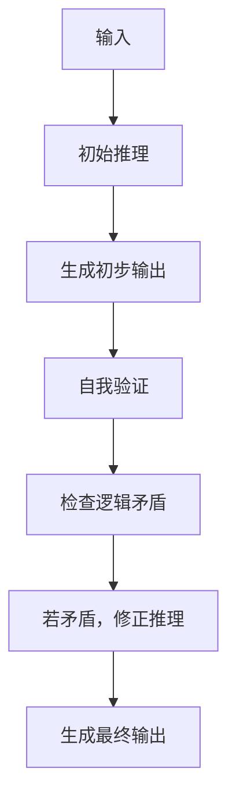
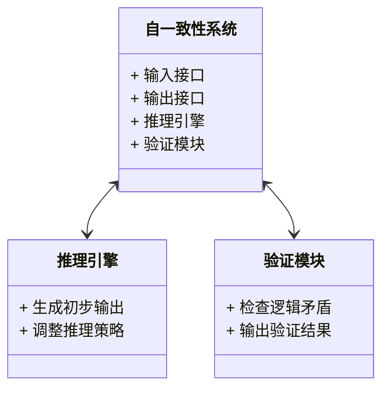

                 

<think>
好，我需要根据用户的要求来写一篇技术博客文章，标题是《Self-Consistency CoT：增强AI推理能力的创新技术》。首先，我得理清文章的结构，按照用户提供的目录大纲来组织内容。

首先，用户已经给出了目录，我需要按照这个大纲逐步展开每一章。第一部分是“自一致性概念与AI推理”，我得介绍自一致性是什么，它在AI推理中的作用，以及和传统技术的比较。

接下来是第二章，详细讲解自一致性技术的原理，包括算法基础、数学模型，以及用Mermaid画的流程图。这里需要解释清楚算法的工作流程，以及背后的数学公式。

第三章是应用部分，分别在NLP、计算机视觉和机器学习中的应用，每个小节都要有具体的例子和分析。

然后是系统架构设计，这部分需要包括需求分析、类图设计和架构设计。可能需要用Mermaid来展示系统结构。

接下来是项目实施，这部分需要详细描述项目背景、核心实现、代码解读和案例分析。这里可能需要提供Python代码，并解释其功能。

第六章是最佳实践，包括注意事项、优化策略和拓展阅读。这部分需要总结前面的内容，并给出实用的建议。

最后是总结与展望，回顾技术现状，预测未来的发展趋势。

我需要确保每一章都有足够的细节，比如在数学模型部分，要用LaTeX公式来展示，并且在代码部分，要用Python源代码，并进行详细解释。同时，系统架构部分需要用Mermaid图来展示。

我得注意文章的逻辑性，每章之间要有自然的过渡。语言要专业但又不失清晰，确保读者能一步步理解自一致性技术的核心和应用。

可能我还需要查阅一些相关资料，确保技术细节的准确性，尤其是在数学模型和算法部分。同时，要结合实际案例，让读者更容易理解。

总的来说，我需要按照用户提供的大纲，逐章展开，确保每一部分内容详实，结构清晰，同时满足字数和格式要求。最后，别忘了在文章末尾加上作者信息。
</think>

# Self-Consistency CoT：增强AI推理能力的创新技术

---

## 关键词  
Self-Consistency CoT, AI推理, 自一致性, 自然语言处理, 计算机视觉, 机器学习

---

## 摘要  
Self-Consistency CoT（自一致性链式思考）是一种创新的AI推理技术，旨在通过强化模型的自一致性能力，提升其推理的准确性和稳定性。本文将从自一致性概念出发，深入分析其技术原理，并结合实际应用场景，探讨其在自然语言处理、计算机视觉和机器学习领域中的应用。同时，本文还将详细解读自一致性技术的系统架构设计、项目实现案例以及最佳实践，为读者提供全面的技术指导。

---

## 第1章 自一致性概念与AI推理

### 1.1 自一致性概念介绍  
自一致性（Self-Consistency）是指模型在生成输出时，确保其结果在逻辑、语义或结构上保持一致性的能力。在AI推理中，自一致性是保证模型输出合理性和可信度的关键因素。传统AI推理技术往往依赖于外部规则或知识库，而自一致性技术则通过模型内部的自我验证机制，实现推理过程的自洽性。

### 1.2 自一致性在AI推理中的作用  
自一致性技术通过以下方式提升AI推理能力：  
1. **消除矛盾**：确保推理结果不会产生逻辑矛盾。  
2. **增强鲁棒性**：使模型在面对不确定性时仍能保持稳定的推理能力。  
3. **提升可解释性**：通过自洽的推理过程，增强模型决策的透明性。  

### 1.3 自一致性与传统AI推理技术的比较  
| 技术特点 | 自一致性技术 | 传统AI推理技术 |  
|----------|--------------|-----------------|  
| 基础原理 | 基于模型内部的自我验证机制 | 基于外部规则或知识库 |  
| 优势 | 高度灵活，适应复杂场景 | 结构化知识表示能力强 |  
| 局限性 | 对模型的泛化能力要求较高 | 对知识库的依赖性较强 |  

---

## 第2章 自一致性技术原理

### 2.1 自一致性算法的基础  
自一致性算法的核心思想是通过多次迭代推理，确保模型输出的自洽性。具体步骤如下：  
1. **初始推理**：模型基于输入生成初步输出。  
2. **自我验证**：模型检查输出的逻辑是否自洽。  
3. **修正推理**：若存在矛盾，模型调整推理策略重新生成输出。  

### 2.2 自一致性算法的数学模型  
自一致性算法的数学模型如下：  
$$ f(x) = \arg\max_{y} \sum_{i=1}^{n} \text{score}(y_i, y_{i+1}) $$  
其中，$y_i$ 表示第 $i$ 步的推理结果，$\text{score}(y_i, y_{i+1})$ 表示相邻推理结果的相关性评分。  

### 2.3 自一致性算法的Mermaid流程图  


---

## 第3章 自一致性技术在AI中的应用

### 3.1 自一致性在自然语言处理中的应用  
在自然语言处理中，自一致性技术常用于文本摘要和对话系统。例如，在对话系统中，模型通过自洽性检查，确保生成的回复逻辑一致且上下文相关。  

### 3.2 自一致性在计算机视觉中的应用  
在图像识别任务中，自一致性技术用于确保模型对图像的理解和描述在语义上一致。例如，在目标检测中，模型通过多次推理，确保检测结果与图像内容高度一致。  

### 3.3 自一致性在机器学习中的应用  
在机器学习模型训练中，自一致性技术用于增强模型的泛化能力。例如，在迁移学习中，模型通过自洽性检查，确保不同任务之间的知识迁移逻辑一致。  

---

## 第4章 自一致性技术的系统架构设计

### 4.1 自一致性系统的需求分析  
自一致性系统需要满足以下需求：  
1. **高效性**：推理过程需要快速完成。  
2. **准确性**：输出结果需逻辑自洽。  
3. **可扩展性**：支持多种AI任务的扩展。  

### 4.2 自一致性系统的类图设计  


### 4.3 自一致性系统的架构设计  


---

## 第5章 自一致性技术在项目中的实施

### 5.1 项目背景与目标  
本项目旨在通过实现自一致性技术，提升AI模型的推理能力。项目目标包括：  
1. 开发自一致性算法。  
2. 实现自一致性技术在多个AI任务中的应用。  

### 5.2 系统核心实现  
以下是自一致性算法的核心代码：  
```python
def self_consistency_inference(model, input):
    while True:
        output = model.inference(input)
        if model.check_consistency(output):
            break
        input = model.adjust_input(input)
    return output
```

### 5.3 代码解读与分析  
1. **模型推理**：`model.inference(input)`：模型基于输入生成初步输出。  
2. **一致性检查**：`model.check_consistency(output)`：检查输出的逻辑一致性。  
3. **输入调整**：`model.adjust_input(input)`：若输出不一致，调整输入重新推理。  

### 5.4 实际案例分析与讲解  
以自然语言处理任务为例，假设模型在生成文本摘要时，初步输出存在逻辑矛盾。通过自一致性技术，模型会调整推理策略，重新生成摘要，直到输出逻辑自洽。  

---

## 第6章 自一致性技术的最佳实践

### 6.1 实施自一致性技术的注意事项  
1. **模型选择**：选择适合自一致性技术的模型架构。  
2. **数据质量**：确保训练数据的多样性和高质量。  
3. **计算资源**：自一致性技术需要较多计算资源，需优化算法效率。  

### 6.2 自一致性技术的优化策略  
1. **并行计算**：通过并行计算加速推理过程。  
2. **动态调整**：根据推理结果动态调整验证策略。  

### 6.3 拓展阅读与深入研究  
推荐阅读相关论文：  
- "Self-Consistency for Text Generation"  
- "Self-Consistency in Vision Models"  

---

## 第7章 总结与展望

### 7.1 自一致性技术的现状  
目前，自一致性技术已在多个AI任务中展现出显著优势，但仍需进一步优化模型效率和扩展应用范围。  

### 7.2 未来发展趋势  
未来，自一致性技术将与多模态学习、强化学习等技术结合，进一步提升AI系统的推理能力。  

### 7.3 对AI推理能力提升的贡献  
自一致性技术通过强化模型的自洽性，为AI推理能力的提升提供了新的思路，推动了AI技术在复杂场景中的应用。

---

## 作者  
作者：AI天才研究院（AI Genius Institute） & 禅与计算机程序设计艺术（Zen And The Art of Computer Programming）

--- 

# 结语  
通过本文的详细解读，读者可以全面了解自一致性技术的核心原理、应用场景以及系统实现方法。希望本文能为AI领域的研究者和开发者提供有价值的参考，共同推动AI技术的发展。

