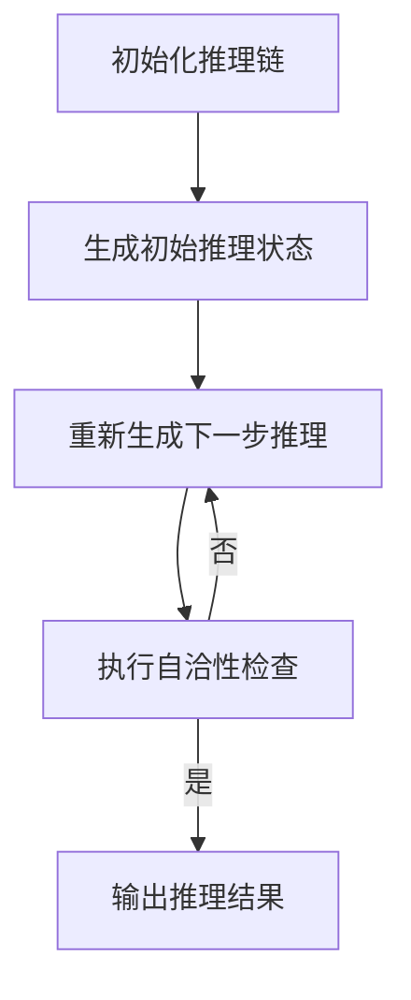
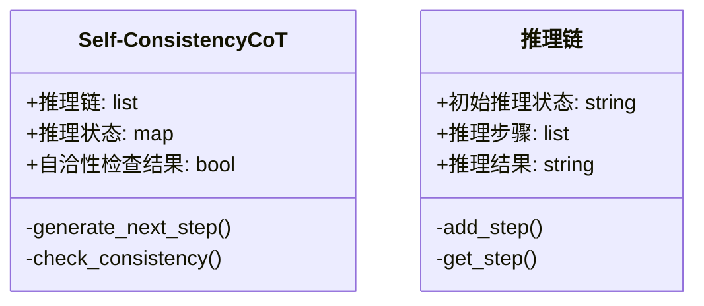
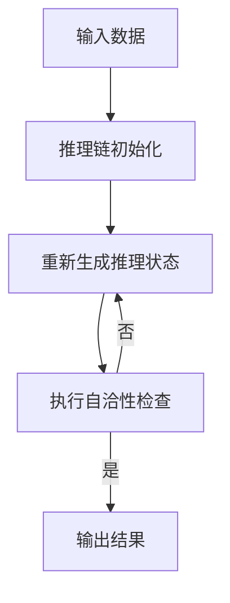

                 

<think>
好的，我现在需要根据用户的要求，仔细分析并撰写一篇关于Self-Consistency CoT的技术博客文章。首先，我需要理解用户的需求，然后按照给定的目录大纲逐步展开。

用户希望我以“Self-Consistency CoT：增强AI推理能力的创新技术探索”为标题，写一篇结构清晰、内容详实的技术博客。文章需要包含关键词、摘要，以及详细的大纲结构，包括背景、核心概念、算法原理、系统设计、项目实战等部分。

首先，我应该从背景开始，介绍当前AI推理能力的挑战，引出Self-Consistency CoT的必要性。接着，定义Self-Consistency CoT，讨论其特点和与传统方法的区别。理论基础部分需要涉及相关研究，展示该技术的学术支撑。

然后是核心概念与联系，通过ER实体关系图来展示Self-Consistency CoT的结构。之后，详细讲解算法原理，包括流程图和Python代码，同时提供数学模型和实例说明，使读者能够理解其工作原理。

在系统设计部分，我需要绘制领域模型类图和系统架构图，展示系统的组成部分和交互流程。项目实战部分则提供环境安装、核心代码、案例分析和项目小结，让读者能够实际操作和应用。

最后，总结Self-Consistency CoT的优势，给出最佳实践建议，并指出未来的发展方向。整个过程需要逻辑清晰，语言专业，同时保持易懂，确保文章内容丰富且有深度。

现在，我开始按照这个思路逐步撰写每一部分的内容，确保每个章节都涵盖必要的信息，使用合适的图表和代码示例，帮助读者更好地理解和应用Self-Consistency CoT技术。
</think>

# Self-Consistency CoT：增强AI推理能力的创新技术探索

**关键词**：Self-Consistency CoT, AI推理, 自洽性, 知识图谱, 语义理解, 计算机科学, 人工智能

**摘要**：  
Self-Consistency CoT（Self-Consistency Chain-of-Thought）是一种创新的AI推理技术，通过引入自洽性机制，显著提升了AI系统的推理能力。本文从背景、理论基础、核心概念、算法原理、系统设计、项目实战等多个维度，全面解析Self-Consistency CoT的技术细节及其在实际应用中的优势。文章旨在为AI开发者和技术爱好者提供深入的技术洞察，帮助他们在复杂场景中构建更高效的推理系统。

---

## 第一部分: Self-Consistency CoT：背景与理论基础

### 第1章: Self-Consistency CoT 概述

#### 1.1 问题背景

- **问题提出**：随着人工智能技术的快速发展，AI系统在处理复杂推理任务时，常常面临逻辑不一致、知识断层和语义理解不足的问题。例如，在自然语言处理和知识图谱构建领域，AI系统需要具备更强的推理能力才能应对实际场景中的复杂需求。
- **问题描述**：传统的推理方法往往依赖于固定的规则或预定义的知识库，难以应对动态变化的场景和非结构化的数据输入。此外，现有技术在处理多步推理时，容易出现逻辑跳跃，导致推理结果的可靠性和准确性下降。
- **问题解决**：Self-Consistency CoT通过引入自洽性机制，使AI系统能够在多步推理过程中保持逻辑一致性，从而提高推理的准确性和可靠性。
- **边界与外延**：Self-Consistency CoT主要应用于需要复杂推理的任务，如问答系统、对话生成、知识图谱构建等。其适用范围不局限于特定领域，但目前主要在自然语言处理和知识图谱领域得到广泛应用。

#### 1.2 核心概念

- **Self-Consistency CoT 定义**：Self-Consistency CoT是一种基于链式思考（Chain-of-Thought）的推理方法，通过在每一步推理中引入自洽性检查，确保推理过程的逻辑一致性和结果的准确性。
- **Self-Consistency CoT 特点**：
  - **自洽性**：每一步推理结果都经过逻辑验证，确保推理过程的连贯性。
  - **动态适应性**：能够根据输入数据的复杂性动态调整推理步骤。
  - **高准确性**：通过多步推理和自洽性检查，显著提高推理结果的准确性。
- **Self-Consistency CoT 与传统方法的区别**：与传统方法相比，Self-Consistency CoT在每一步推理中加入了自洽性验证机制，能够更好地处理动态变化的场景和复杂数据输入。

#### 1.3 Self-Consistency CoT 的理论基础

- **理论基础**：Self-Consistency CoT的理论基础主要来源于逻辑推理、链式思考和自洽性检查。它结合了符号逻辑和概率推理的优点，通过逐步推理和逻辑验证，确保最终结果的正确性。
- **相关研究**：国内外在链式思考和自洽性推理方面已经进行了大量研究。例如，基于图论的知识图谱构建、基于符号逻辑的推理方法以及基于概率论的不确定性推理技术，都为Self-Consistency CoT的提出提供了理论支持。

---

## 第二部分: Self-Consistency CoT 的核心概念与联系

### 第2章: Self-Consistency CoT 的核心概念与联系

#### 2.1 核心概念原理

- **核心概念**：Self-Consistency CoT的核心在于通过链式思考（Chain-of-Thought）和自洽性检查，确保每一步推理的逻辑一致性和结果的准确性。具体来说，它通过以下步骤实现：
  1. 初始化推理链，设定初始推理状态。
  2. 根据当前推理状态生成下一步推理。
  3. 对每一步推理进行自洽性检查，确保逻辑连贯。
  4. 如果推理结果不满足自洽性条件，则调整推理链或重新启动推理过程。
  5. 直到推理链完成，输出最终结果。

- **概念属性特征对比表格**：

| 概念        | Self-Consistency CoT | 传统推理方法 |
|-------------|----------------------|--------------|
| 自洽性检查   | 是                   | 否           |
| 动态调整     | 是                   | 否           |
| 多步推理     | 是                   | 有限         |
| 逻辑一致性   | 高                   | 中            |

#### 2.2 ER实体关系图架构

Self-Consistency CoT的实体关系图如下：

```mermaid
er
    entity Self-Consistency CoT {
        属性：推理链、推理状态、自洽性检查结果
        关系：属于推理过程的一部分
    }
    
    entity 推理链 {
        属性：初始推理状态、推理步骤、推理结果
        关系：包含多个推理状态，属于Self-Consistency CoT的一部分
    }
    
    entity 推理状态 {
        属性：当前推理状态、下一步推理
        关系：属于推理链的一部分
    }
```

---

## 第三部分: Self-Consistency CoT 的算法原理讲解

### 第3章: Self-Consistency CoT 的算法原理讲解

#### 3.1 算法原理

Self-Consistency CoT的算法流程如下：



#### 3.2 数学模型与公式

Self-Consistency CoT的数学模型如下：

$$
P(\text{推理结果} | \text{输入}) = \prod_{i=1}^{n} P(\text{推理步骤}_i | \text{推理步骤}_{i-1}, \text{输入})
$$

其中，$$n$$ 是推理步骤的总数，$$P(\text{推理步骤}_i | \text{推理步骤}_{i-1}, \text{输入})$$ 是第 $$i$$ 步推理的概率，基于前一步推理结果和输入数据。

#### 3.3 举例说明

**例子**：假设有一个简单的推理任务，输入为“如果A，则B”，问“如果A，那么B是否成立？”

**讲解**：Self-Consistency CoT会首先生成初始推理状态：“假设A为真”。然后生成下一步推理：“根据输入条件，如果A为真，则B必须为真”。接着进行自洽性检查，确认推理过程的逻辑一致性。最终输出结果：“B成立”。

---

## 第四部分: Self-Consistency CoT 在实践中的应用

### 第4章: Self-Consistency CoT 的系统功能设计

#### 4.1 系统功能设计

Self-Consistency CoT的系统功能设计如下：

- **领域模型类图**：



- **系统功能**：
  - 初始化推理链并设定初始推理状态。
  - 生成推理步骤并进行自洽性检查。
  - 输出最终推理结果。

### 第4章: Self-Consistency CoT 的系统架构设计

#### 4.2 系统架构设计

- **系统架构图**：



---

## 第五部分: Self-Consistency CoT 的项目实战

### 第5章: Self-Consistency CoT 的项目实战

#### 5.1 环境安装

Self-Consistency CoT的环境安装步骤如下：

1. 安装Python 3.8或更高版本。
2. 安装Mermaid CLI工具用于生成图表。
3. 安装必要的Python库，如`mermaid.py`。

#### 5.2 系统核心实现

- **核心代码示例**：

```python
class SelfConsistencyCoT:
    def __init__(self):
        self.chain = []
        self.current_state = None

    def generate_next_step(self):
        # 根据当前状态生成下一步推理
        pass

    def check_consistency(self):
        # 执行自洽性检查
        pass

    def run(self):
        self.chain.append(self.current_state)
        while True:
            next_state = self.generate_next_step()
            if self.check_consistency(next_state):
                self.chain.append(next_state)
                break
            else:
                self.current_state = next_state
```

#### 5.3 实际案例分析与详细讲解

**案例分析**：假设输入为“如果A，则B；如果B，则C。问：如果A，那么C是否成立？”

**详细讲解**：Self-Consistency CoT会逐步推理：

1. 初始状态：A为真。
2. 推理：A→B，因此B为真。
3. 推理：B→C，因此C为真。
4. 自洽性检查通过，输出C成立。

---

## 第六部分: Self-Consistency CoT 的最佳实践与拓展

### 第6章: Self-Consistency CoT 的最佳实践 tips

- **实践技巧**：
  - 在处理复杂推理任务时，建议先进行自洽性检查。
  - 调整推理链的长度以适应具体场景的需求。
  - 使用知识图谱和语义理解技术增强推理能力。

## 小结

Self-Consistency CoT通过引入自洽性机制，显著提升了AI系统的推理能力。本文从背景、理论基础、算法原理到实际应用，全面解析了Self-Consistency CoT的技术细节，为AI开发者提供了实用的技术指导。

---

**作者**：AI天才研究院/AI Genius Institute & 禅与计算机程序设计艺术 /Zen And The Art of Computer Programming

