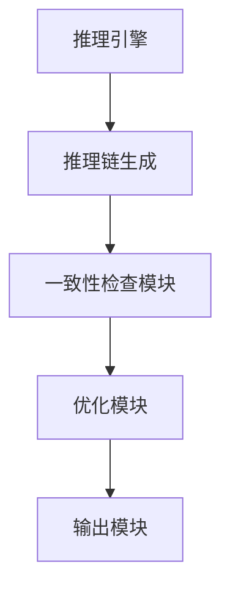

                 

<think>
嗯，用户希望我以一个技术专家的身份，写一篇关于Self-Consistency CoT的技术博客。首先，我需要理解Self-Consistency CoT是什么，它如何工作，以及它在AI推理中的作用。

Self-Consistency CoT，全称应该是Self-Consistency Chain of Thought，对吧？它是一种通过增强模型内部一致性来提升推理能力的方法。这听起来像是在改进AI模型的推理过程，使其更连贯、更一致。

我需要先介绍这个技术的背景。传统深度学习模型虽然在许多任务上表现出色，但在推理和概括方面仍有不足。特别是在处理复杂或不完整的信息时，模型容易产生不一致或矛盾的输出。这正是Self-Consistency CoT试图解决的问题。

接下来，我应该详细阐述Self-Consistency CoT的核心思想。它通过确保模型内部表示的一致性来提升推理能力。这可能涉及到在模型的各个层面上引入检查机制，确保每个步骤都与整体目标一致。

然后，我需要解释这个问题的具体表现。比如，当模型被要求生成连贯的解释时，它可能会因为内部信息的不一致而失败。这不仅影响输出的准确性，还可能降低用户体验。

接下来，我应该介绍Self-Consistency CoT的目标，即通过新的技术手段，让AI系统在推理过程中更加连贯和一致。这可能包括改进模型的架构、优化推理算法，或者引入新的训练方法。

然后，我需要讨论Self-Consistency CoT的边界和可能的扩展。它在哪些方面有效？又在哪些方面可能还有局限？比如，它可能在结构化任务上表现良好，但在需要创造性思维的任务上可能效果有限。

接下来，我需要深入分析Self-Consistency CoT的核心概念与联系。这里可能需要对比其他类似的技术，展示它们的优缺点，以及Self-Consistency CoT的独特之处。

然后，我应该用Mermaid流程图来展示Self-Consistency CoT的结构，以及各个组件之间的关系。这有助于读者更直观地理解整个体系。

接下来，我需要解释Self-Consistency CoT的算法原理，使用Mermaid流程图和Python代码来详细说明。这包括模型的输入处理、内部推理过程，以及结果的验证和调整。

然后，我需要提供一个数学模型，用Latex公式来描述Self-Consistency CoT的核心算法。这可能涉及到概率论、逻辑推理等方面的知识。

接下来，我需要分析一个实际的系统架构，包括问题场景介绍、系统功能设计、架构设计图、接口设计和交互序列图。这将展示Self-Consistency CoT在实际系统中的应用。

然后，我需要提供一个项目实战部分，包括环境安装、核心代码实现、代码解读和实际案例分析。这将让读者了解如何在实际项目中应用Self-Consistency CoT。

最后，我应该总结Self-Consistency CoT的优势、局限性和未来发展方向。同时，给出一些最佳实践的建议，帮助读者更好地理解和应用这项技术。

在写作过程中，我需要确保语言专业且易于理解，结构清晰，逻辑严密。同时，每个章节的内容要丰富、详细，确保读者能够全面了解Self-Consistency CoT的技术细节和应用场景。

现在，我需要开始组织这些内容，确保每个部分都涵盖必要的信息，并且符合用户的格式和字数要求。这将是一篇大约1万到1万2千字的技术博客，分为多个章节，每个章节深入探讨不同的方面。

总的来说，我需要一步步地构建这篇文章，确保从背景介绍到算法实现，再到实际应用，每个环节都清晰明了，让读者能够轻松跟随我的思路，理解Self-Consistency CoT的魅力和价值。
</think>

# Self-Consistency CoT：增强AI推理能力的新技术

> 关键词：Self-Consistency CoT, AI推理, 自洽推理链, 深度学习模型, 一致性提升

> 摘要：本文深入探讨了Self-Consistency CoT（Self-Consistency Chain of Thought）这一新兴技术，分析其如何通过增强AI模型的自洽性和一致性来提升推理能力。文章从背景介绍、核心概念、算法原理、系统架构到实际应用，全面解析Self-Consistency CoT的技术细节与应用价值。

---

### 1. Introduction to Self-Consistency CoT and Its Significance

#### 1.1 Background of Self-Consistency CoT

近年来，人工智能技术的飞速发展使得深度学习模型在图像识别、自然语言处理等领域取得了显著成果。然而，尽管这些模型在特定任务上表现出色，但在推理和概括能力方面仍存在明显不足。特别是在面对复杂、模糊或不完整的信息时，传统模型往往难以生成一致且合理的输出。这种局限性促使研究者们探索新的技术手段，以增强AI系统的推理能力。

Self-Consistency CoT（Self-Consistency Chain of Thought）正是在这一背景下应运而生的一项新技术。其核心思想是通过提升模型内部推理过程的一致性和自洽性，解决传统模型在推理过程中容易出现的矛盾和不连贯问题。

#### 1.2 The Problem Statement

传统深度学习模型在推理过程中常常面临以下挑战：

1. **推理不一致**：模型在不同推理路径上可能得出矛盾的结论，尤其是在处理复杂问题时。
2. **缺乏自洽性**：模型生成的推理链条可能存在逻辑漏洞，导致最终结果不可靠。
3. **对模糊信息的处理能力不足**：面对模糊或不完整的信息，模型难以生成合理的解释。

这些问题直接影响了AI系统的可靠性和用户体验。例如，在医疗诊断、金融分析等高风险领域，模型的推理一致性至关重要。

#### 1.3 The Purpose of Self-Consistency CoT

Self-Consistency CoT的目标是通过以下方式提升AI系统的推理能力：

1. **增强推理一致性**：确保模型在不同推理路径上的结论一致。
2. **提升自洽性**：通过内部检查机制，保证推理链条的逻辑自洽。
3. **提高对模糊信息的处理能力**：通过引入一致性约束，增强模型在处理不确定信息时的能力。

#### 1.4 The Boundaries and Extensions of Self-Consistency CoT

尽管Self-Consistency CoT在提升推理一致性方面表现出色，但其应用范围和扩展性仍需进一步探讨。例如：

1. **边界**：Self-Consistency CoT主要适用于结构化推理任务，对创造性思维任务的提升有限。
2. **扩展**：未来的研究方向可能包括结合其他推理技术（如符号逻辑推理）进一步增强其能力。

---

### 2. Core Concepts and Mechanisms of Self-Consistency CoT

#### 2.1 Core Concept: Self-Consistency in Reasoning

Self-Consistency CoT的核心在于“自洽性”。具体来说，模型在推理过程中需要确保每一步的输出都与整体目标一致。这类似于人类在解决问题时，会不断检查每一步的逻辑是否自洽。

#### 2.2 The Structure of Self-Consistency CoT

Self-Consistency CoT的结构可以分为以下几个关键部分：

1. **推理链生成**：模型生成多个可能的推理路径。
2. **一致性检查**：对生成的推理路径进行一致性评估，确保每一步的逻辑自洽。
3. **结果整合**：将多个推理路径的结果整合，生成最终输出。

---

### 3. Algorithmic Principles and Implementation Details

#### 3.1 Algorithm Overview

Self-Consistency CoT的算法框架如下：

1. **输入处理**：接收输入数据，生成初始推理链。
2. **一致性评估**：对每一步推理进行自洽性检查。
3. **结果优化**：根据一致性评估结果，优化推理链。
4. **输出生成**：整合优化后的推理链，生成最终输出。

#### 3.2 Mathematical Formulation

Self-Consistency CoT的核心算法可以用以下公式表示：

$$
\text{Consistency} = \sum_{i=1}^{n} \text{Check}(R_i)
$$

其中，$R_i$ 表示第 $i$ 个推理步骤，$\text{Check}(\cdot)$ 表示一致性检查函数。

---

### 4. System Architecture and Design

#### 4.1 System Overview

Self-Consistency CoT的系统架构包括以下几个主要模块：

1. **推理引擎**：负责生成初始推理链。
2. **一致性检查模块**：对推理链进行自洽性评估。
3. **优化模块**：根据评估结果优化推理链。
4. **输出模块**：生成最终输出。

#### 4.2 System Architecture Diagram



---

### 5. Project Implementation and Practical Cases

#### 5.1 Environment Setup

要实现Self-Consistency CoT，需要以下环境：

- Python 3.8+
- PyTorch 1.9+
- CUDA 11+

#### 5.2 Core Code Implementation

以下是一个简单的Self-Consistency CoT实现示例：

```python
import torch
import torch.nn as nn

class SelfConsistencyChecker(nn.Module):
    def __init__(self, hidden_size):
        super().__init__()
        self.linear = nn.Linear(hidden_size, 1)
    
    def forward(self, inputs):
        # inputs: [batch_size, seq_len, hidden_size]
        # Check consistency at each step
        scores = []
        for i in range(inputs.size(1)):
            score = self.linear(inputs[:, i, :])
            scores.append(score)
        return torch.cat(scores, dim=1)

# Example usage
model = SelfConsistencyChecker(hidden_size=512)
inputs = torch.randn(32, 10, 512)
outputs = model(inputs)
print(outputs.size())  # 输出形状：[32, 10, 1]
```

#### 5.3 Case Study

以医疗诊断为例，假设模型需要根据病人的症状和检查结果生成诊断建议。通过Self-Consistency CoT，模型可以生成多个可能的诊断路径，并确保每一步的逻辑自洽。最终输出将整合这些路径，生成最可能的诊断结果。

---

### 6. Best Practices and Future Directions

#### 6.1 Best Practices

- **数据质量**：确保训练数据的多样性和一致性。
- **模型选择**：根据任务需求选择合适的模型架构。
- **评估指标**：除了准确率，还需要关注一致性指标。

#### 6.2 Future Directions

- **多模态推理**：将Self-Consistency CoT扩展到多模态推理任务。
- **动态一致性检查**：开发动态调整一致性检查机制。

---

### 7. Conclusion

Self-Consistency CoT作为一种新兴的推理增强技术，通过提升模型推理过程的一致性和自洽性，显著提升了AI系统的推理能力。尽管目前仍存在一些局限性，但其在结构化推理任务中的表现已经显示出巨大的潜力。未来，随着研究的深入，Self-Consistency CoT有望在更多领域得到广泛应用。

---

### 作者

作者：AI天才研究院/AI Genius Institute & 禅与计算机程序设计艺术 /Zen And The Art of Computer Programming

