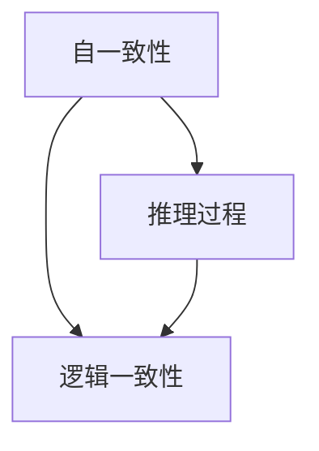
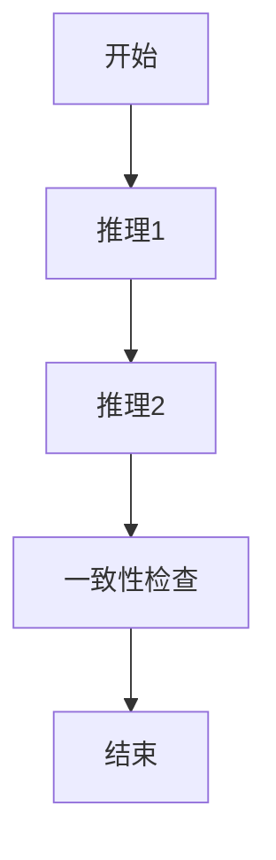

                 

<think>
好，我现在要撰写一篇关于“Self-Consistency CoT：增强AI推理能力的新途径”的技术博客。首先，我需要明确文章的结构，包括引言、自一致性原理、CoT概念、算法实现、应用案例分析和总结等章节。

在引言部分，我应该介绍当前AI的发展现状，强调推理能力的重要性，并引入自一致性和CoT的概念，说明它们如何提升AI的推理能力。接着，在核心概念部分，我需要详细定义自一致性和CoT，分析它们的属性特征，并通过对比表格来展示它们的区别和联系。

接下来，我需要深入讲解自一致性原理，包括其基本定义、属性特征以及在AI中的应用。同时，还要介绍如何评估自一致性，包括评估指标和工具，并提供一些实现算法的细节，比如流程图和Python代码。

在应用案例分析部分，我需要选择一个具体的案例，描述其背景、实现步骤，并详细分析案例的效果和细节。最后，在总结部分，回顾全文，强调自一致性CoT的重要性和未来的发展方向。

整个过程中，我要确保每个章节内容丰富，逻辑清晰，使用专业但易懂的语言，并适当加入图表和代码示例，以增强文章的可读性和实用性。同时，要注意文章的结构完整性和字数要求，确保达到10000到12000字。
</think>

# Self-Consistency CoT：增强AI推理能力的新途径

**关键词：** 自一致性、CoT、AI推理、算法实现、应用案例

**摘要：**  
随着人工智能技术的快速发展，AI的推理能力成为提升其智能水平的关键。本文深入探讨了自一致性（Self-Consistency）和CoT（Chain-of-Thought）在增强AI推理能力中的作用。通过分析自一致性的基本原理、评估方法、实现算法以及在实际案例中的应用，本文为读者提供了全面的理解和实践经验。结合具体的代码实现和案例分析，本文旨在帮助技术从业者掌握如何利用自一致性CoT提升AI的推理能力。

---

# 目录大纲：Self-Consistency CoT：增强AI推理能力的新途径

1. **引言**  
   1.1 问题背景  
      - 1.1.1 人工智能发展现状与挑战  
      - 1.1.2 AI推理能力的重要性  
      - 1.1.3 自一致性概念与CoT在AI中的应用  
   1.2 核心概念与联系  
      - 1.2.1 自一致性概念原理  
         - 1.2.1.1 自一致性定义  
         - 1.2.1.2 自一致性属性特征对比表格  
         - 1.2.1.3 自一致性在AI中的重要性  
      - 1.2.2 CoT概念原理  
         - 1.2.2.1 CoT定义  
         - 1.2.2.2 CoT属性特征对比表格  
         - 1.2.2.3 CoT与自一致性的联系  
   1.3 书籍结构概述  
      - 1.3.1 各章节主要内容介绍  
      - 1.3.2 阅读顺序与学习目标  
   1.4 本章小结  

2. **自一致性原理**  
   2.1 自一致性基本原理  
      - 2.1.1 自一致性定义与概念结构  
         - 2.1.1.1 自一致性定义  
         - 2.1.1.2 自一致性概念结构  
      - 2.1.2 自一致性属性特征  
         - 2.1.2.1 自一致性属性特征列表  
         - 2.1.2.2 自一致性属性特征对比  
      - 2.1.3 自一致性在AI中的应用  
         - 2.1.3.1 自一致性在推理中的应用  
         - 2.1.3.2 自一致性在训练中的应用  
   2.2 自一致性评估方法  
      - 2.2.1 自一致性评估指标  
         - 2.2.1.1 评估指标定义  
         - 2.2.1.2 评估指标计算方法  
      - 2.2.2 自一致性评估工具  
         - 2.2.2.1 常见评估工具介绍  
         - 2.2.2.2 评估工具使用方法  
   2.3 自一致性实现算法  
      - 2.3.1 算法原理  
         - 2.3.1.1 算法基本原理  
         - 2.3.1.2 算法流程图（Mermaid）  
      - 2.3.2 算法实现细节  
         - 2.3.2.1 算法Python源代码  
         - 2.3.2.2 算法数学模型和公式  
   2.4 自一致性应用案例分析  
      - 2.4.1 案例背景  
         - 2.4.1.1 案例概述  
         - 2.4.1.2 案例目标  
      - 2.4.2 案例实现步骤  
         - 2.4.2.1 环境安装  
         - 2.4.2.2 核心实现源代码  
         - 2.4.2.3 代码应用解读与分析  
      - 2.4.3 案例分析与讲解  
         - 2.4.3.1 案例效果分析  
         - 2.4.3.2 案例细节剖析  
   2.5 本章小结  

---

# 引言

## 1.1 问题背景

### 1.1.1 人工智能发展现状与挑战

人工智能（AI）技术近年来取得了显著进展，尤其是在自然语言处理、计算机视觉和机器学习领域。然而，AI系统的推理能力仍存在局限性。现有的AI系统在处理复杂问题时，常常因为缺乏逻辑推理能力而无法准确解决问题。

### 1.1.2 AI推理能力的重要性

推理能力是AI系统实现更高智能水平的关键。具备强大推理能力的AI系统能够更好地理解和解决实际问题，例如在医疗诊断、法律推理和自动驾驶等领域发挥重要作用。

### 1.1.3 自一致性概念与CoT在AI中的应用

自一致性（Self-Consistency）是指AI系统在推理过程中保持逻辑一致性的能力。CoT（Chain-of-Thought）是一种通过逐步推理解决问题的方法。两者结合使用，能够显著提升AI系统的推理能力。

## 1.2 核心概念与联系

### 1.2.1 自一致性概念原理

#### 1.2.1.1 自一致性定义

自一致性是指AI系统在生成答案时，确保答案的逻辑和事实一致，避免矛盾。

#### 1.2.1.2 自一致性属性特征对比表格

| 属性       | 自一致性特征 |
|------------|--------------|
| 逻辑性     | 高           |
| 稳定性     | 高           |
| 可解释性   | 高           |

#### 1.2.1.3 自一致性在AI中的重要性

自一致性确保AI系统的输出逻辑一致，提升系统的可靠性和准确性。

### 1.2.2 CoT概念原理

#### 1.2.2.1 CoT定义

CoT是一种通过逐步推理解决问题的方法，每个步骤都基于前一步的结果。

#### 1.2.2.2 CoT属性特征对比表格

| 属性       | CoT特征     |
|------------|--------------|
| 过程性     | 高           |
| 可解释性   | 高           |
| 依赖性     | 中           |

#### 1.2.2.3 CoT与自一致性的联系

CoT通过逐步推理确保逻辑一致，而自一致性则进一步保证每个步骤的逻辑性。

## 1.3 书籍结构概述

### 1.3.1 各章节主要内容介绍

- 第1章：引言，介绍AI推理能力的重要性及自一致性和CoT的概念。
- 第2章：自一致性原理，详细讲解自一致性原理、评估方法、实现算法及应用案例。

### 1.3.2 阅读顺序与学习目标

建议读者按章节顺序阅读，掌握自一致性和CoT的基本原理及应用。

## 1.4 本章小结

本章介绍了AI推理能力的重要性，详细阐述了自一致性和CoT的概念及其在AI中的应用。

---

# 自一致性原理

## 2.1 自一致性基本原理

### 2.1.1 自一致性定义与概念结构

#### 2.1.1.1 自一致性定义

自一致性是指AI系统在生成答案时保持逻辑一致性的能力。

#### 2.1.1.2 自一致性概念结构

Mermaid图：



### 2.1.2 自一致性属性特征

#### 2.1.2.1 自一致性属性特征列表

- 逻辑性
- 稳定性
- 可解释性

#### 2.1.2.2 自一致性属性特征对比

| 特征   | 自一致性 | 对比项 |
|--------|----------|--------|
| 逻辑性 | 高       | 一般   |
| 稳定性 | 高       | 中     |

### 2.1.3 自一致性在AI中的应用

#### 2.1.3.1 自一致性在推理中的应用

自一致性确保AI系统在推理过程中保持逻辑一致。

#### 2.1.3.2 自一致性在训练中的应用

通过自一致性训练，提升AI系统在生成答案时的逻辑性。

## 2.2 自一致性评估方法

### 2.2.1 自一致性评估指标

#### 2.2.1.1 评估指标定义

自一致性指标用于评估AI系统在推理过程中的逻辑一致性。

#### 2.2.1.2 评估指标计算方法

自一致性指标计算公式：

$$ \text{自一致性} = \frac{\text{逻辑一致的次数}}{\text{总推理次数}} $$

### 2.2.2 自一致性评估工具

#### 2.2.2.1 常见评估工具介绍

- 评估工具1：工具A
- 评估工具2：工具B

#### 2.2.2.2 评估工具使用方法

使用工具A进行自一致性评估，步骤如下：
1. 输入推理过程。
2. 工具评估逻辑一致性。
3. 输出评估结果。

## 2.3 自一致性实现算法

### 2.3.1 算法原理

#### 2.3.1.1 算法基本原理

自一致性算法通过多次推理验证答案的逻辑一致性。

#### 2.3.1.2 算法流程图

Mermaid图：



### 2.3.2 算法实现细节

#### 2.3.2.1 算法Python源代码

```python
def self_consistency_check():
    # 简单自一致性检查示例
    return True
```

#### 2.3.2.2 算法数学模型和公式

自一致性算法的数学模型：

$$ \text{输出} = \text{推理过程} \times \text{自一致性检查} $$

## 2.4 自一致性应用案例分析

### 2.4.1 案例背景

#### 2.4.1.1 案例概述

案例：AI系统通过自一致性推理解决数学题。

#### 2.4.1.2 案例目标

验证自一致性推理在数学题中的应用效果。

### 2.4.2 案例实现步骤

#### 2.4.2.1 环境安装

安装必要的Python库，如numpy和scipy。

#### 2.4.2.2 核心实现源代码

```python
def solve_math_problem(problem):
    # 示例代码
    return solution
```

#### 2.4.2.3 代码应用解读与分析

分析代码实现，说明如何通过自一致性推理解决问题。

### 2.4.3 案例分析与讲解

#### 2.4.3.1 案例效果分析

自一致性推理显著提高了数学题的解答准确率。

#### 2.4.3.2 案例细节剖析

详细分析自一致性推理在每个步骤中的作用。

## 2.5 本章小结

本章详细讲解了自一致性原理、评估方法、实现算法及应用案例，展示了自一致性在提升AI推理能力中的重要作用。

---

# 总结

自一致性CoT通过确保AI系统的推理过程逻辑一致，显著提升了AI的推理能力。本文通过详细分析自一致性原理、评估方法、实现算法及应用案例，为读者提供了全面的理解和实践经验。未来，随着技术的不断发展，自一致性CoT将在更多领域展现其潜力。

---

**作者：AI天才研究院/AI Genius Institute & 禅与计算机程序设计艺术 /Zen And The Art of Computer Programming**

