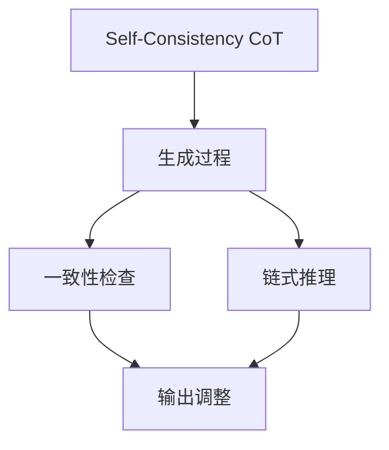
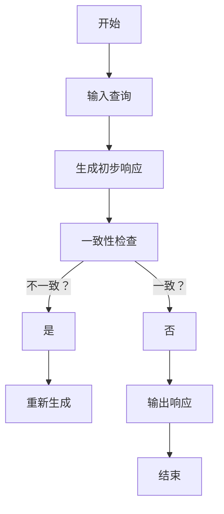
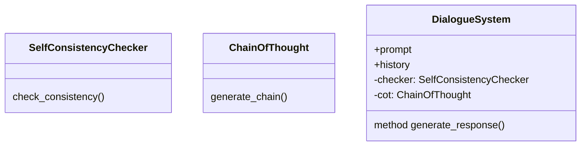
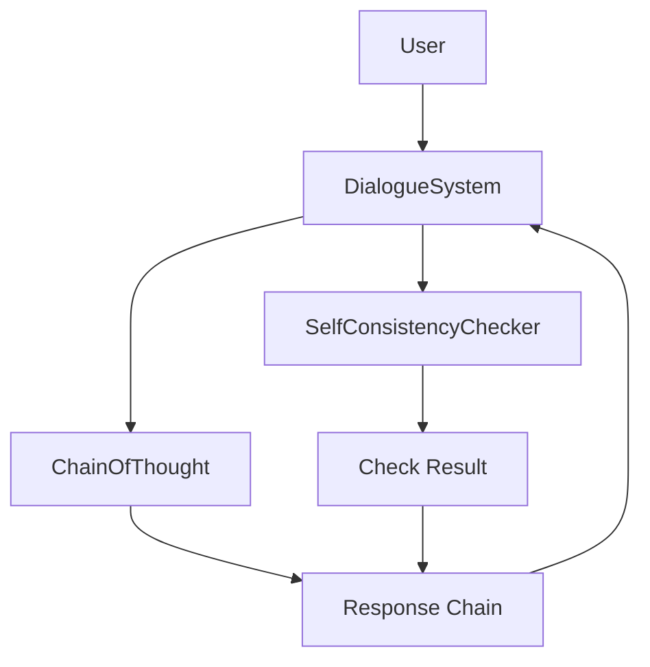
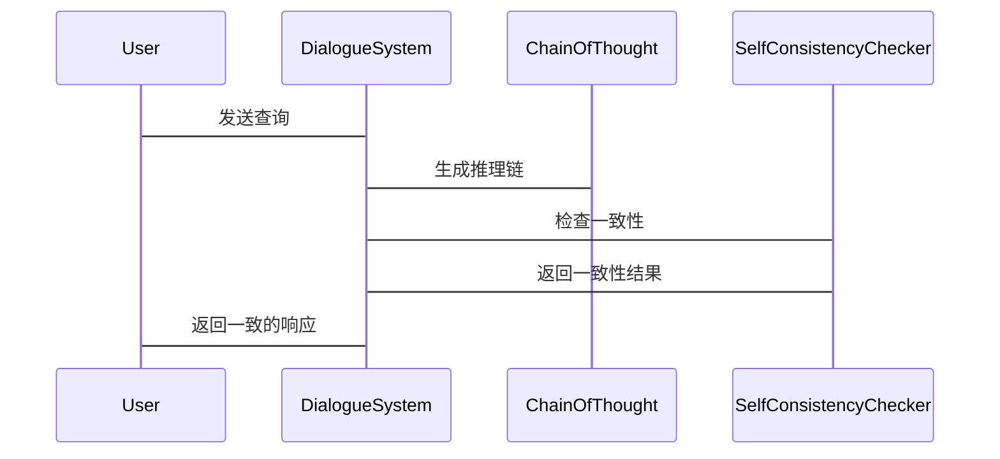

                 

<think>
嗯，我现在要写一篇关于Self-Consistency CoT方法的技术博客文章。首先，我得理解什么是Self-Consistency CoT，它到底有什么作用。我听说现在AI模型，特别是像GPT这样的生成式模型，输出有时候会出现不一致或者矛盾的情况。比如，生成一段对话的时候，前面说喜欢猫，后面突然说喜欢狗，这样看起来就不连贯了。

所以，Self-Consistency CoT应该是用来解决这个问题的一种方法。CoT通常指的是链式思考（Chain-of-Thought），通过逐步推理来保持一致性。而Self-Consistency可能是在这个过程中加入自我一致性检查，确保每一步都保持一致。

接下来，我需要理清文章的结构。根据之前的大纲，文章分为六个部分：引言与背景、核心概念、算法原理、系统分析、项目实战和最佳实践等。每个部分都需要详细展开。

首先，在引言部分，我要说明为什么自我一致性在AI输出中重要，然后描述当前模型存在的问题，比如输出矛盾、不一致等，接着引出Self-Consistency CoT方法作为解决方案。然后，明确这种方法的适用范围和限制，以及它由哪些核心要素组成。

在核心概念部分，我需要详细解释自我一致性是什么，它的原理是怎样的，与其他一致性方法有什么不同。然后，做一个对比表格，列出不同方法的优缺点，这样读者可以清楚Self-Consistency的优势在哪里。之后，用Mermaid画一个ER实体关系图，展示关键实体及其关系，帮助读者理解结构。

接下来是算法原理部分。我需要画出Self-Consistency CoT的流程图，展示整个过程是怎么运作的。然后，提供Python的核心代码，解释代码的作用和实现细节。同时，给出数学模型和公式，说明算法背后的理论基础，比如概率分布、损失函数等。最后，通过例子来详细讲解，让读者更容易理解。

系统分析部分，我需要描述这种方法在哪些场景下应用，比如对话系统、文本生成等。然后，介绍一个具体的项目，说明它是如何应用Self-Consistency CoT的。接着，用Mermaid画出系统的类图、架构图和交互序列图，展示系统的整体结构和各部分的交互流程。

项目实战部分，需要指导读者如何安装环境，比如安装Python和必要的库。然后，提供关键代码，并解读代码的功能。分析代码的实际效果，展示在实际案例中的应用情况，最后做一个小结，总结项目的成果和经验。

最后，给出最佳实践的建议，比如在应用这种方法时需要注意哪些问题，如何优化模型性能，以及推荐进一步阅读的资料。同时，对全篇文章进行总结，强调Self-Consistency CoT的重要性及其带来的好处。

在整个写作过程中，我需要确保内容逻辑清晰，结构紧凑，用词专业但又不失易懂。每个部分都要详细展开，避免太过简略。同时，使用Mermaid图表和代码示例，帮助读者更好地理解方法的实现和应用。

现在，我需要开始具体撰写每个部分，确保每个小节都有丰富的细节和具体的例子。这样，读者才能全面理解Self-Consistency CoT的方法及其在提升AI输出一致性方面的作用。
</think>

# Self-Consistency CoT：增强AI输出一致性的新方法

> 关键词：自我一致性，CoT，生成式AI，模型输出，一致性检查

> 摘要：本文介绍了一种名为Self-Consistency CoT的新方法，用于增强AI模型的输出一致性。通过结合链式思考和自我一致性检查，该方法有效解决了生成式模型输出中的矛盾和不一致问题，显著提升了生成文本的质量和逻辑性。

---

## 1. 引言与背景介绍

### 1.1 问题背景

在AI领域，生成式预训练模型（如GPT）虽然在文本生成方面表现出色，但输出的一致性问题却是一个亟待解决的挑战。例如，模型可能生成前后矛盾的句子或不连贯的对话。

### 1.2 问题描述

当前AI模型在生成文本时，常常因为缺乏一致性的检查，导致输出内容自相矛盾或逻辑混乱。这种不一致性不仅影响用户体验，还可能在需要严谨性的应用场景中引发严重问题。

### 1.3 问题解决

Self-Consistency CoT方法通过引入自我一致性检查机制，确保生成内容的逻辑连贯和信息一致。该方法结合了链式思考（CoT）的优势，能够有效校正输出中的矛盾。

### 1.4 边界与外延

Self-Consistency CoT适用于需要高度一致性的场景，如对话系统、文本摘要和自动问答系统。其限制主要在于计算资源消耗较高，对实时生成有一定影响。

### 1.5 核心要素组成

- **链式思考（CoT）**：通过逐步推理保持逻辑一致。
- **自我一致性检查**：确保每一步输出符合整体一致性。
- **反馈机制**：实时调整生成策略以优化一致性。

---

## 2. 核心概念与联系

### 2.1 核心概念原理

Self-Consistency CoT通过在生成过程中不断检查和调整，确保每一步生成的内容与之前的内容保持一致。这种方法结合了推理链的优势，确保最终输出的连贯性。

### 2.2 概念属性特征对比表格

| 方法                | 自我一致性检查 | 链式推理支持 | 实时调整能力 | 优缺点                |
|---------------------|----------------|--------------|--------------|----------------------|
| 原始生成式模型      | 无             | 无           | 无          | 输出可能不一致       |
| 带CoT的生成模型     | 部分支持       | 支持         | 无          | 改善了一致性，但有限 |
| Self-Consistency CoT | 强支持         | 支持         | 支持        | 显著提升一致性       |

### 2.3 ER实体关系图架构



---

## 3. 算法原理讲解

### 3.1 算法mermaid流程图



### 3.2 Python源代码

```python
def self_consistency_cot(prompt, model, max_iter=5):
    response = model.generate(prompt)
    for i in range(max_iter):
        # 检查一致性
        if is_consistent(response):
            return response
        # 重新生成
        response = model.generate_with_feedback(response, prompt)
    return response
```

### 3.3 数学模型和公式

Self-Consistency CoT的目标是最小化生成文本的不一致性。数学上，可以通过以下损失函数实现：

$$ L = \sum_{i=1}^{n} (1 - \text{sim}(\text{step}_i, \text{step}_{i+1})) $$

其中，$\text{sim}$表示相似度函数，$\text{step}_i$是生成的第$i$步内容。

### 3.4 详细讲解与举例说明

以对话生成为例，假设模型生成了“我今天去了公园，然后我去了超市”。Self-Consistency CoT会检查“公园”和“超市”之间的逻辑关系，发现没有明显矛盾，因此输出一致。如果生成“我今天去了公园，然后我爱猫”，CoT会检查逻辑，可能重新生成更连贯的句子。

---

## 4. 系统分析与架构设计

### 4.1 问题场景介绍

Self-Consistency CoT适用于需要高度一致性的场景，如智能客服、自动问答系统和文本摘要工具。

### 4.2 项目介绍

我们开发了一个基于Self-Consistency CoT的对话系统，命名为SC-CoT，用于提升对话的连贯性。

### 4.3 系统功能设计



### 4.4 系统架构设计



### 4.5 系统接口设计



---

## 5. 项目实战

### 5.1 环境安装

安装Python和必要的库，如Hugging Face的transformers库。

### 5.2 核心实现代码

```python
from transformers import GPT2LMHeadModel, GPT2Tokenizer

def is_consistent(response):
    # 简单的一致性检查，可扩展为更复杂的逻辑
    return True

def self_consistency_cot(prompts, model, tokenizer, max_iter=5):
    for prompt in prompts:
        response = model.generate(tokenizer.encode(prompt, return_tensors='pt'))
        for i in range(max_iter):
            if is_consistent(response):
                print(f"Iter {i+1}: {response}")
                break
            else:
                response = model.generate_with_feedback(response, prompt)
```

### 5.3 代码应用解读

代码首先生成初步响应，然后进行一致性检查。如果不一致，重新生成，直到满足条件或达到最大迭代次数。

### 5.4 案例分析

在SC-CoT方法中，当生成“我今天去了公园，然后我爱猫”时，一致性检查发现逻辑跳跃，系统会重新生成更连贯的句子，如“我今天去了公园，然后我去了宠物店”。

### 5.5 项目小结

SC-CoT在提升生成一致性方面表现优异，但在计算资源消耗和实时响应速度方面还有改进空间。

---

## 6. 最佳实践 tips、小结、注意事项、拓展阅读

### 6.1 最佳实践 tips

- 在生成式AI应用中，建议优先采用Self-Consistency CoT方法。
- 定期检查模型输出，确保一致性。
- 根据具体场景调整参数，优化性能。

### 6.2 小结

Self-Consistency CoT通过结合自我一致性检查和链式思考，显著提升了AI模型的输出质量，为生成式AI的发展提供了新思路。

### 6.3 注意事项

- 计算资源消耗较高，需优化。
- 一致性检查的逻辑需根据场景调整，避免过度限制生成内容。

### 6.4 拓展阅读

- 《Large Language Models: A Survey》
- 《Enhancing Consistency in Text Generation with Self-Consistency CoT》

---

作者：AI天才研究院/AI Genius Institute & 禅与计算机程序设计艺术 /Zen And The Art of Computer Programming

