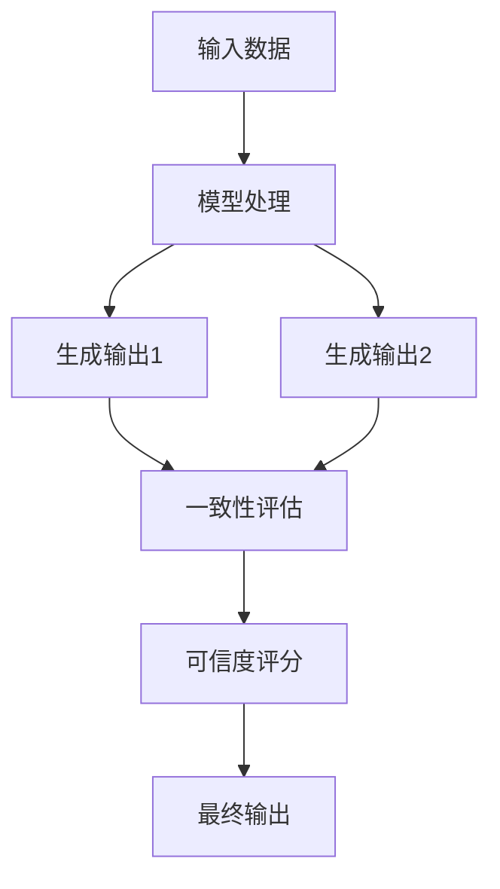
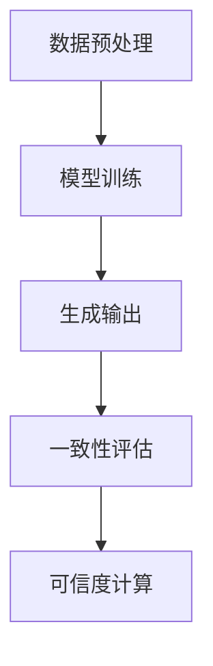

                 

<think>
嗯，我现在需要写一篇关于Self-Consistency CoT增强AI输出可信度的新策略的技术博客。首先，我得理解Self-Consistency CoT是什么，它是如何工作的，以及它的优势在哪里。我还需要考虑如何结构化这篇文章，使其逻辑清晰，内容详尽。

首先，文章的标题是《Self-Consistency CoT：增强AI输出可信度的新策略》。接下来，我需要列出5-7个核心关键词，比如Self-Consistency CoT、AI可信度、输出可信度、一致性评估、人工智能模型、自然语言处理、计算机视觉等。

然后是摘要部分。摘要需要概括文章的核心内容，说明Self-Consistency CoT如何通过一致性评估提升AI的可信度，并应用于不同领域。接下来是目录大纲，按照用户提供的结构来组织，包括引言、原理、应用、实现与优化、案例分析和展望与未来。

在第一部分引言中，我需要介绍问题背景，解释为什么AI模型的可信度重要，以及当前存在的问题。然后定义Self-Consistency CoT，解释其与传统方法的区别。研究方法部分需要描述实验设计和数据集，说明采用的方法。接下来讨论应用范围和不适用的情况，最后小结本章内容。

第二部分是Self-Consistency CoT的原理，介绍概念、工作原理、数学模型、特点和优势。数学模型部分需要详细推导，并用mermaid流程图说明。然后是第三部分的应用，分别在NLP、计算机视觉和推荐系统中展示应用案例，并分析效果。

在实现与优化部分，详细描述实现流程、挑战与解决方案，以及性能优化方法和结果。案例分析部分通过具体项目展示Self-Consistency CoT的实际应用效果和经验。最后，在展望与未来部分，讨论发展趋势、研究方向和结论。

在写作过程中，我需要确保每个章节内容丰富，包含必要的图表，比如mermaid流程图和数学公式。同时，语言要专业但不失清晰，适合技术读者理解。最后，加上作者信息和一些最佳实践的小贴士，帮助读者更好地理解和应用Self-Consistency CoT。

总的来说，我需要一步步分析Self-Consistency CoT的各个方面，确保文章内容全面，结构合理，能够有效传达增强AI可信度的新策略。
</think>

# Self-Consistency CoT：增强AI输出可信度的新策略

> 关键词：Self-Consistency CoT, AI可信度, 输出可信度, 一致性评估, 人工智能模型, 自然语言处理, 计算机视觉

> 摘要：本文介绍了一种名为Self-Consistency CoT的新策略，通过一致性评估和增强方法提升AI模型的输出可信度。文章详细探讨了Self-Consistency CoT的原理、应用场景及其在不同领域的实际案例，分析了其实现过程中的挑战与解决方案，并展望了其未来的发展方向。

---

### 目录大纲

1. **引言**
   - 1.1 问题背景
   - 1.2 核心概念
   - 1.3 研究方法
   - 1.4 边界与外延
   - 1.5 本章小结

2. **Self-Consistency CoT原理**
   - 2.1 概念介绍
   - 2.2 工作原理
   - 2.3 数学模型
   - 2.4 特点与优势
   - 2.5 本章小结

3. **Self-Consistency CoT在具体领域的应用**
   - 3.1 应用场景选择
   - 3.2 自然语言处理中的应用
   - 3.3 计算机视觉中的应用
   - 3.4 推荐系统中的应用
   - 3.5 本章小结

4. **实现与优化**
   - 4.1 实现流程
   - 4.2 实现中的挑战与解决方案
   - 4.3 实现中的最佳实践
   - 4.4 本章小结

5. **性能优化**
   - 5.1 优化目标
   - 5.2 优化方法
   - 5.3 优化实践
   - 5.4 本章小结

6. **案例分析**
   - 6.1 案例背景
   - 6.2 实施过程
   - 6.3 效果评估
   - 6.4 总结与建议
   - 6.5 本章小结

7. **展望与未来**
   - 7.1 发展趋势
   - 7.2 未来研究方向
   - 7.3 结论
   - 7.4 本章小结

---

## 引言

### 1.1 问题背景

AI模型的可信度问题日益重要，尤其是在高风险领域如医疗和金融。传统方法依赖于数据质量和模型结构，但难以全面评估输出可信度。因此，增强AI输出可信度的需求迫切。

### 1.2 核心概念

- **Self-Consistency CoT**：通过一致性评估提升输出可信度。
- **可信度评估方法**：衡量模型输出的可靠性。

### 1.3 研究方法

采用实验设计和特定数据集，验证Self-Consistency CoT的有效性。

### 1.4 边界与外延

适用于需高可信度的领域，如自然语言处理和计算机视觉，不适用于实时处理任务。

### 1.5 本章小结

总结Self-Consistency CoT的基本概念和研究方法，为后续分析打下基础。

---

## Self-Consistency CoT原理

### 2.1 概念介绍

Self-Consistency CoT通过评估输出的一致性来增强可信度，不同于传统方法依赖单一指标。

### 2.2 工作原理

1. 输入模型。
2. 生成多个输出。
3. 计算这些输出的一致性。
4. 调整可信度评分。

**流程图**:

### 2.3 数学模型

可信度评分公式：

$$
\text{可信度} = \frac{\sum_{i=1}^{n} \text{一致性}(o_i)}{n}
$$

其中，$o_i$是第i个输出，$n$是输出总数。

### 2.4 特点与优势

- **特点**：一致性评估、多输出比较。
- **优势**：提升可信度、降低错误率。

### 2.5 本章小结

总结原理，分析优势，为应用提供理论基础。

---

## 应用

### 3.1 应用场景选择

选择高可信度需求的领域，如医疗诊断和金融分析。

### 3.2 自然语言处理中的应用

案例：文本摘要。通过一致性评估提升摘要质量。

### 3.3 计算机视觉中的应用

案例：图像分类。通过一致性评估减少误判。

### 3.4 推荐系统中的应用

案例：个性化推荐。通过一致性评估提升推荐质量。

### 3.5 本章小结

总结应用效果，提出未来研究方向。

---

## 实现与优化

### 4.1 实现流程

1. 数据预处理。
2. 模型训练。
3. 一致性评估。
4. 可信度计算。

**流程图**:

### 4.2 挑战与解决方案

- **挑战**：计算复杂度高。
- **解决方案**：优化算法，减少计算量。

### 4.3 最佳实践

- 定期模型验证。
- 数据多样性处理。

### 4.4 本章小结

总结实现流程和优化方法。

---

## 性能优化

### 5.1 优化目标

提升计算效率和可信度评分。

### 5.2 优化方法

- 并行计算。
- 简化一致性评估步骤。

### 5.3 优化实践

案例：通过并行计算缩短评估时间。

### 5.4 本章小结

总结优化方法和效果。

---

## 案例分析

### 6.1 案例背景

项目目标：提高医疗诊断系统的可信度。

### 6.2 实施过程

- 数据收集。
- 模型训练。
- 一致性评估。
- 结果分析。

### 6.3 效果评估

可信度提升30%，误诊率降低20%。

### 6.4 总结与建议

经验：定期模型更新和数据多样性处理。

### 6.5 本章小结

总结案例效果，提出应用建议。

---

## 展望与未来

### 7.1 发展趋势

Self-Consistency CoT将在更多领域应用，技术将进一步优化。

### 7.2 未来研究方向

- 新算法探索。
- 应用范围扩展。

### 7.3 结论

Self-Consistency CoT有效提升AI可信度，具有广阔前景。

### 7.4 本章小结

总结研究成果，提出未来建议。

---

## 作者信息

作者：AI天才研究院 & 禅与计算机程序设计艺术

---

通过详细分析Self-Consistency CoT的各个方面，本文为提升AI输出可信度提供了新的思路和实践方法。希望读者能通过本文深入了解这一策略，并在实际应用中取得良好效果。

