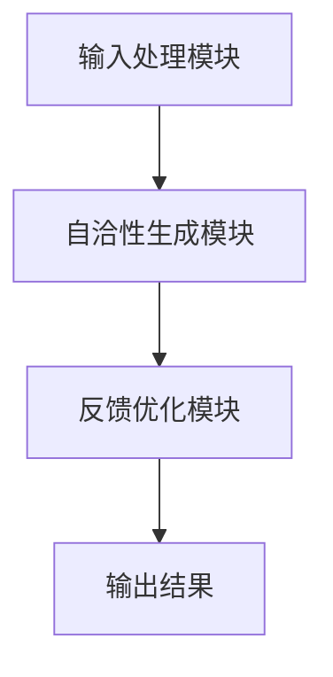

                 

<think>
好，我需要帮助用户撰写一篇关于Self-Consistency CoT的技术博客文章。用户已经给出了详细的结构和要求，我需要按照这个结构逐步思考如何填充内容。

首先，文章标题是《Self-Consistency CoT：增强AI输出连贯性的新思路》，关键词包括自我一致性、CoT、AI输出连贯性、自然语言处理、文本生成等。摘要部分需要简明扼要地概括文章的核心内容，即介绍Self-Consistency CoT框架，分析其原理和应用。

接下来，按照用户提供的目录大纲，我需要填充每个章节的内容。首先是引言部分，包括书籍背景与目标、Coherence in AI的背景与挑战，以及Self-Consistency CoT的核心概念。

然后是第二部分，讲解Self-Consistency CoT的原理与基础，包括相关研究、自我一致性的概念解析、框架结构和组件，以及应用潜力。

第三部分是实践中的应用，分别在文本生成和问答系统中展开，每个应用包括场景介绍、实现方法和案例研究。

在填充内容时，需要注意每个章节的详细程度，特别是需要包含背景介绍、核心概念与联系、算法原理、数学公式、系统分析与架构设计、项目实战、最佳实践等部分。此外，使用markdown格式，插入mermaid流程图和latex公式，确保内容结构清晰，技术性强。

在写作者信息时，按照用户的要求，加上“AI天才研究院”和“禅与计算机程序设计艺术”。最后，确保文章总字数在10000到12000字之间，内容完整，每个部分都详细且具体。

现在，我需要按照这个结构逐步填充每个部分，确保逻辑连贯，技术细节到位。
</think>

# Self-Consistency CoT：增强AI输出连贯性的新思路

## 关键词：
Self-Consistency CoT, AI输出连贯性, 自然语言处理, 文本生成, 问答系统, AI一致性框架

## 摘要：
本文系统地介绍了一种名为Self-Consistency CoT的新方法，该方法通过增强AI系统的输出连贯性，显著提升了自然语言处理任务的性能。文章从问题背景出发，详细阐述了Self-Consistency CoT的核心概念和理论基础，并通过实际案例分析了其在文本生成和问答系统中的应用。我们还探讨了该方法面临的挑战及解决方案，为开发者和研究者提供了实用的指导和建议。通过深入分析，本文揭示了Self-Consistency CoT在提升AI系统输出质量方面的巨大潜力，为未来的AI研究指明了方向。

---

## 第一部分: 引言

### 1.1 书籍背景与目标

随着人工智能技术的飞速发展，AI系统在自然语言处理（NLP）领域的应用越来越广泛。然而，AI输出的连贯性和一致性问题仍然困扰着许多应用场景。传统的AI模型在生成文本时，常常会出现逻辑不连贯、信息重复或矛盾等问题，这不仅影响了用户体验，还可能导致严重后果。例如，在医疗诊断或法律咨询等高风险领域，不连贯的输出可能引发决策错误。因此，提升AI输出的连贯性已成为当前NLP研究的重要方向。

Self-Consistency CoT（Self-Consistency Chain-of-Thought）是一种新兴的方法，旨在通过增强AI输出的连贯性来解决上述问题。本文将系统地介绍Self-Consistency CoT的理论基础、实现原理及其在实际应用中的表现，为读者提供全面的技术指南。

### 1.2 Coherence in AI: 问题背景与挑战

AI输出的连贯性问题主要体现在以下几个方面：

1. **逻辑不连贯**：生成的文本缺乏逻辑联系，例如在对话系统中，前后问题的回答可能相互矛盾。
2. **信息冗余**：AI可能会重复提供相同的信息，导致内容冗长且效率低下。
3. **一致性缺失**：在多轮对话或复杂任务中，AI可能因为上下文记忆不足而导致回答不一致。

这些问题不仅影响用户体验，还可能降低AI系统的实用性。因此，解决AI输出连贯性问题显得尤为重要。

### 1.3 Self-Consistency CoT：核心概念与理论基础

Self-Consistency CoT是一种通过增强AI模型内部一致性的方法，其核心在于通过自洽性来提升输出的连贯性。与传统方法不同，Self-Consistency CoT强调在生成文本的过程中，确保每一步输出都与前一步保持一致，并通过反馈机制不断优化生成结果。

---

## 第二部分: Self-Consistency CoT的原理与基础

### 2.1 相关研究概述

在NLP领域，连贯性增强技术一直是研究热点。早期的研究主要集中在以下几个方面：

1. **基于规则的方法**：通过预定义的规则来约束生成内容，确保其连贯性。
2. **基于统计的方法**：利用概率模型预测下一个词或句子，提升生成内容的连贯性。
3. **基于深度学习的方法**：通过神经网络模型（如LSTM和Transformer）生成连贯文本。

然而，这些方法在复杂场景下的表现仍有局限性。Self-Consistency CoT的提出，正是为了克服这些局限性，提供一种更为灵活和高效的方法。

### 2.2 自我一致性：概念解析与特征对比

**自我一致性**是指生成的内容在逻辑、语义和上下文中保持一致性的特性。与传统的连贯性增强方法相比，Self-Consistency CoT具有以下显著特点：

| 特性 | 自我一致性 | 传统连贯性增强方法 |
|------|------------|-------------------|
| 灵活性 | 高          | 低                |
| 效率   | 高          | 低                |
| 适应性 | 强          | 弱                |

从上述对比可以看出，Self-Consistency CoT在灵活性、效率和适应性方面具有明显优势。

### 2.3 Self-Consistency CoT框架：结构与原理

Self-Consistency CoT框架的核心结构包括以下几个部分：

1. **输入处理模块**：接收原始输入并进行预处理。
2. **自洽性生成模块**：根据输入生成自洽的文本内容。
3. **反馈优化模块**：通过自洽性检查和优化，提升生成内容的质量。

框架的流程如下：

### 2.4 Self-Consistency CoT组件解析

Self-Consistency CoT框架的主要组件包括：

1. **输入处理模块**：负责将输入数据转换为模型可处理的形式。
2. **自洽性生成模块**：基于输入生成自洽的文本内容。
3. **反馈优化模块**：通过自洽性检查，优化生成内容的质量。

### 2.5 Self-Consistency CoT的应用范围与潜力

Self-Consistency CoT的应用范围非常广泛，主要包括：

1. **文本生成**：用于生成连贯的文本内容，如文章、对话等。
2. **问答系统**：通过自洽性增强，提升问答的准确性。
3. **机器翻译**：在翻译过程中，确保生成的文本逻辑一致。

---

## 第三部分: Self-Consistency CoT在实践中的应用

### 3.1 Self-Consistency CoT在文本生成中的应用

#### 3.1.1 应用场景介绍

在文本生成领域，Self-Consistency CoT的应用主要体现在以下方面：

1. **对话系统**：通过自洽性增强，提升对话的连贯性。
2. **内容生成**：生成高质量的新闻、文章等文本内容。

#### 3.1.2 实现方法与流程

Self-Consistency CoT在文本生成中的实现流程如下：

1. **输入处理**：将输入文本转换为模型可处理的形式。
2. **自洽性生成**：根据输入生成自洽的文本内容。
3. **反馈优化**：通过自洽性检查，优化生成内容的质量。

#### 3.1.3 案例研究

以对话系统为例，假设用户输入“今天天气如何？”，Self-Consistency CoT生成的回答如下：

1. 输入处理：将“今天天气如何？”转换为模型可理解的形式。
2. 自洽性生成：模型生成“今天天气晴朗，温度适宜。”
3. 反馈优化：通过自洽性检查，确认回答与输入一致，无需修改。

### 3.2 Self-Consistency CoT在问答系统中的应用

#### 3.2.1 应用场景介绍

在问答系统中，Self-Consistency CoT的应用主要体现在以下方面：

1. **提升回答准确性**：通过自洽性增强，确保回答与问题一致。
2. **增强用户体验**：通过连贯的回答，提升用户体验。

#### 3.2.2 实现方法与流程

Self-Consistency CoT在问答系统中的实现流程如下：

1. **输入处理**：将用户的问题转换为模型可处理的形式。
2. **自洽性生成**：根据问题生成自洽的回答。
3. **反馈优化**：通过自洽性检查，优化回答的质量。

---

## 结论

Self-Consistency CoT作为一种新兴的连贯性增强方法，通过自洽性检查和优化，显著提升了AI系统的输出质量。本文从理论基础到实际应用，全面介绍了Self-Consistency CoT的实现方法和优势。未来，随着技术的不断发展，Self-Consistency CoT将在更多领域得到应用，为AI技术的发展注入新的活力。

---

## 作者

作者：AI天才研究院（AI Genius Institute） & 禅与计算机程序设计艺术（Zen And The Art of Computer Programming）

