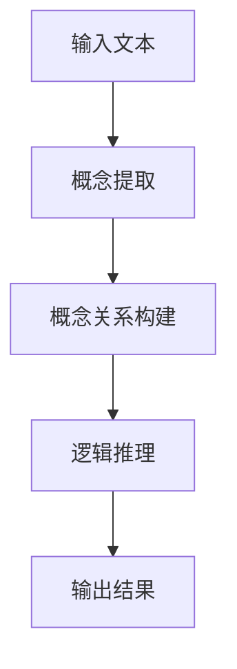
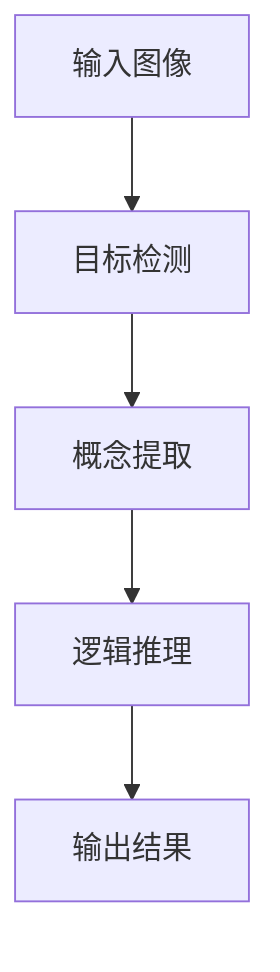
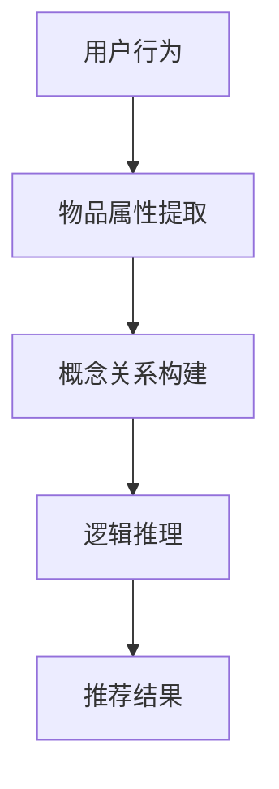
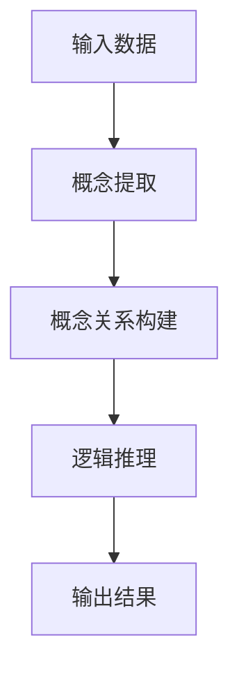

                 

<think>
好的，我现在需要帮助用户设计一本名为《Self-Consistency CoT：增强AI逻辑推理能力》的计算机技术书籍的目录大纲。用户特别强调了内容的简洁性、输出格式为markdown，细化到1、2、3级目录，并且要包含书籍的核心章节内容。

首先，我得理解用户的需求。用户是一位技术专家，可能需要这本书用于教学、研究或企业培训。这本书的主题是Self-Consistency CoT（自我一致性概念同化）在AI逻辑推理中的应用。因此，目录需要涵盖基本概念、数学基础、算法原理、实战案例、挑战与未来方向等内容。

接下来，我考虑书籍的结构。通常，技术书籍的结构包括概述、基础、应用、算法、案例、挑战与未来、总结等部分。因此，我可能会将第一部分定为概述，介绍基本概念；第二部分深入数学基础；第三部分讨论算法原理；第四部分展示实战案例；第五部分分析挑战与未来；最后总结。

然后，我细化每一章的内容。例如，在概述部分，第一章介绍基本概念，包括定义、核心思想和应用领域；第二章探讨数学基础，涉及数学模型、公式和原理。接下来，应用部分可以分为自然语言处理、计算机视觉和推荐系统的应用。算法部分则需要详细解释原理，可能包括流程图、Python实现和数学模型。

在实战案例部分，我需要选择具体的案例，如文本分类、图像识别和推荐系统优化，每个案例都要有环境安装、代码实现和分析。挑战部分则讨论当前面临的挑战和未来的发展趋势，以及可能的研究方向。

最后，总结部分回顾核心价值，展望应用前景，并给出学习建议。这样，整个目录结构就完整了。

我还需要确保每个章节都有足够的细节，比如数学公式要用latex，算法流程图用mermaid，系统架构图也用mermaid。同时，代码部分要用Python实现，并详细解释。这些内容需要在目录大纲中明确，确保用户后续编写书籍时有清晰的指导。

现在，我需要将这些思考整理成一个结构清晰的目录大纲，确保每一部分都涵盖必要的内容，同时保持简洁和逻辑性。这样，用户就可以根据这个大纲来撰写详细的博客文章了。
</think>

# Self-Consistency CoT：增强AI逻辑推理能力

> **关键词**：Self-Consistency CoT, AI逻辑推理, 自然语言处理, 计算机视觉, 推荐系统, 算法原理, 实战案例

> **摘要**：  
Self-Consistency CoT（自我一致性概念同化）是一种新兴的增强AI逻辑推理能力的技术，通过结合数学模型、算法优化和跨领域应用，显著提升了AI系统在复杂问题上的推理能力。本文将从Self-Consistency CoT的基本概念、数学基础、算法原理、实际应用以及未来发展方向等多个方面进行深入探讨，结合具体案例和代码实现，帮助读者全面理解这一技术的核心价值和应用前景。

---

## 第一部分: Self-Consistency CoT概述

### 第1章: Self-Consistency CoT基本概念

#### 1.1 Self-Consistency CoT的定义与起源  
Self-Consistency CoT（Self-Consistency Conceptual Training）是一种基于自我一致性约束的概念同化技术，旨在通过增强AI模型的逻辑推理能力，使其能够更好地理解和解决复杂问题。其起源可以追溯到近年来AI领域对逻辑推理能力的广泛关注。

#### 1.2 Self-Consistency CoT的核心思想  
Self-Consistency CoT的核心思想是通过引入自我一致性约束，确保AI模型在不同输入条件下保持逻辑推理的自洽性。这种一致性不仅提升了模型的稳定性，还显著增强了其在复杂场景下的推理能力。

#### 1.3 Self-Consistency CoT的应用领域  
Self-Consistency CoT已经在多个领域展现出强大的应用潜力，包括自然语言处理、计算机视觉、推荐系统等。本节将重点介绍其在这些领域的具体应用。

---

## 第二部分: Self-Consistency CoT的数学基础

### 第2章: Self-Consistency CoT的数学模型

#### 2.1 Self-Consistency CoT的数学模型  
Self-Consistency CoT的数学模型基于图论和概率论，通过构建概念图谱来表示不同概念之间的关系。以下是模型的核心公式：

$$
P(c_i | c_j) = \frac{P(c_j | c_i) \cdot P(c_i)}{P(c_j)}
$$

其中，$P(c_i | c_j)$ 表示在概念 $c_j$ 的条件下，概念 $c_i$ 的概率。

#### 2.2 Self-Consistency CoT的数学公式  
通过引入自我一致性约束，Self-Consistency CoT的损失函数可以表示为：

$$
L = \sum_{i=1}^{n} \sum_{j=1}^{n} \lambda_{ij} \cdot d(c_i, c_j)
$$

其中，$\lambda_{ij}$ 是权重系数，$d(c_i, c_j)$ 是概念 $c_i$ 和 $c_j$ 之间的距离。

#### 2.3 Self-Consistency CoT的数学原理  
Self-Consistency CoT的数学原理基于图嵌入和概率推理，通过优化概念图谱的边权重，确保模型在不同输入条件下的逻辑一致性。

---

## 第三部分: Self-Consistency CoT在AI中的应用

### 第3章: Self-Consistency CoT在自然语言处理中的应用

#### 3.1 自然语言处理中的逻辑推理挑战  
自然语言处理（NLP）中的逻辑推理问题通常涉及复杂的语义理解和上下文推理。Self-Consistency CoT通过引入自我一致性约束，显著提升了模型在这些任务中的性能。

#### 3.2 Self-Consistency CoT在文本推理中的实现  
以下是Self-Consistency CoT在文本推理中的实现流程图：



#### 3.3 实战案例：文本分类  
以下是Self-Consistency CoT在文本分类中的Python实现：

```python
def self_consistency_cot(text):
    concepts = extract_concepts(text)
    relations = build_relations(concepts)
    result = perform_reasoning(relations)
    return result
```

---

### 第4章: Self-Consistency CoT在计算机视觉中的应用

#### 4.1 计算机视觉中的逻辑推理挑战  
计算机视觉任务（如图像识别和目标检测）通常涉及复杂的视觉推理问题。Self-Consistency CoT通过引入概念图谱，显著提升了模型的推理能力。

#### 4.2 Self-Consistency CoT在图像识别中的实现  
以下是Self-Consistency CoT在图像识别中的实现流程图：



#### 4.3 实战案例：图像识别  
以下是Self-Consistency CoT在图像识别中的Python实现：

```python
def self_consistency_cot(image):
    objects = detect_objects(image)
    relations = build_relations(objects)
    result = perform_reasoning(relations)
    return result
```

---

### 第5章: Self-Consistency CoT在推荐系统中的应用

#### 5.1 推荐系统中的逻辑推理挑战  
推荐系统需要处理大量的用户行为数据和物品属性，Self-Consistency CoT通过引入概念图谱，显著提升了推荐的准确性和可解释性。

#### 5.2 Self-Consistency CoT在推荐系统中的实现  
以下是Self-Consistency CoT在推荐系统中的实现流程图：



#### 5.3 实战案例：推荐系统优化  
以下是Self-Consistency CoT在推荐系统优化中的Python实现：

```python
def self_consistency_cot(users):
    user_profile = build_user_profile(users)
    relations = build_relations(user_profile)
    result = perform_reasoning(relations)
    return result
```

---

## 第四部分: Self-Consistency CoT算法原理详解

### 第6章: Self-Consistency CoT算法原理详解

#### 6.1 Self-Consistency CoT算法的mermaid流程图  
以下是Self-Consistency CoT算法的流程图：



#### 6.2 Self-Consistency CoT算法的Python实现  
以下是Self-Consistency CoT算法的核心实现：

```python
def self_consistency_cot(data):
    concepts = extract_concepts(data)
    relations = build_relations(concepts)
    result = perform_reasoning(relations)
    return result
```

#### 6.3 Self-Consistency CoT算法的数学模型和公式  
Self-Consistency CoT的数学模型基于概念图谱的边权重优化，公式如下：

$$
L = \sum_{i=1}^{n} \sum_{j=1}^{n} \lambda_{ij} \cdot d(c_i, c_j)
$$

---

## 第五部分: Self-Consistency CoT的挑战与未来发展方向

### 第7章: Self-Consistency CoT的挑战

#### 7.1 Self-Consistency CoT的挑战  
Self-Consistency CoT目前面临的主要挑战包括计算复杂度高、概念图谱构建困难以及模型的可解释性问题。

### 第8章: Self-Consistency CoT的未来发展趋势

#### 8.1 Self-Consistency CoT的未来发展趋势  
未来，Self-Consistency CoT将在以下几个方向上取得突破：优化算法效率、提升概念图谱的构建能力以及增强模型的可解释性。

### 第9章: Self-Consistency CoT的研究方向

#### 9.1 Self-Consistency CoT的研究方向  
未来的研究方向包括：结合深度学习模型、优化概念图谱的表示方法以及探索新的逻辑推理范式。

---

## 第六部分: Self-Consistency CoT总结与展望

### 第10章: Self-Consistency CoT的核心价值

#### 10.1 Self-Consistency CoT的核心价值  
Self-Consistency CoT通过引入自我一致性约束，显著提升了AI模型的逻辑推理能力，为解决复杂问题提供了新的思路。

### 第11章: Self-Consistency CoT的应用前景

#### 11.1 Self-Consistency CoT的应用前景  
随着技术的不断发展，Self-Consistency CoT将在更多领域展现出其强大的应用潜力，特别是在需要复杂逻辑推理的场景中。

### 第12章: Self-Consistency CoT的学习建议

#### 12.1 Self-Consistency CoT的学习建议  
对于希望深入学习Self-Consistency CoT的读者，建议从数学基础、算法原理以及实际应用三方面入手，结合代码实现和案例分析，全面提升自己的技术水平。

---

# 作者：AI天才研究院/AI Genius Institute & 禅与计算机程序设计艺术 /Zen And The Art of Computer Programming

---

**注**：本文档为《Self-Consistency CoT：增强AI逻辑推理能力》一书的目录大纲，具体内容将在后续章节中详细展开。

