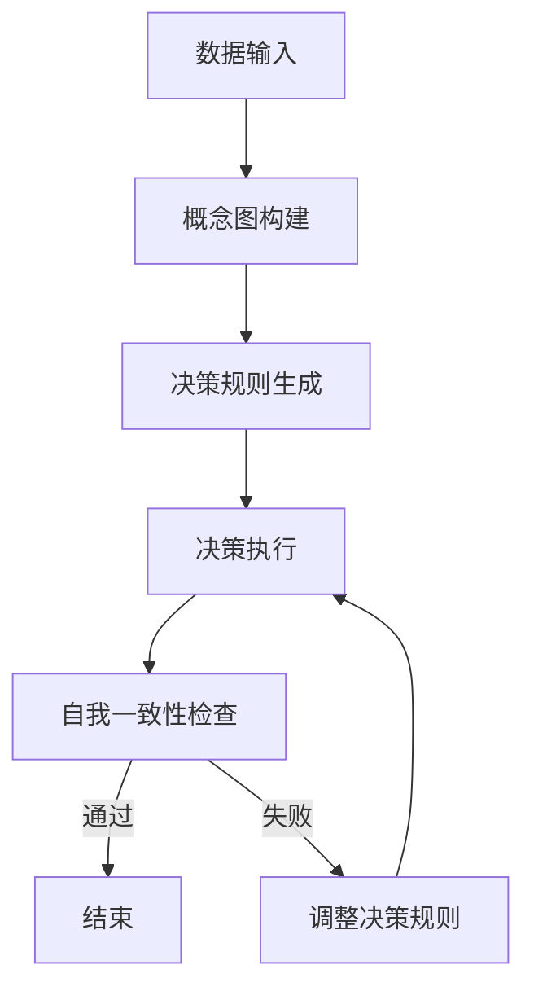
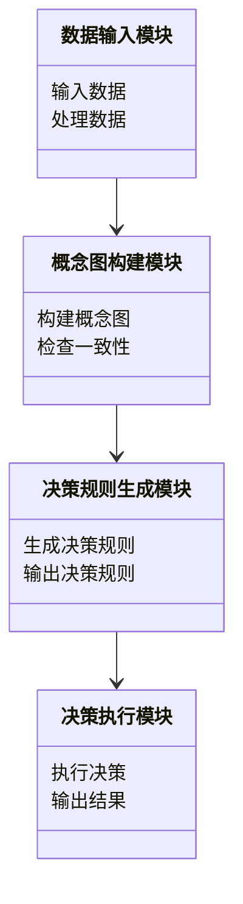
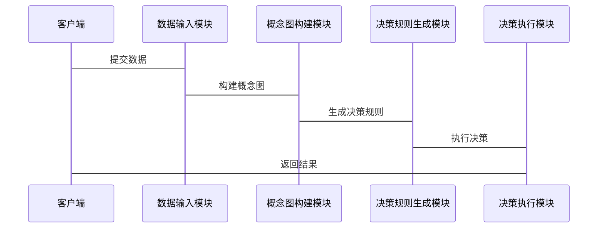

                 

<think>
好的，我现在需要完成一个用户请求，帮助撰写一篇关于Self-Consistency CoT（自我一致性概念图）的技术博客文章。用户已经提供了一个详细的框架，包括各个章节的内容和具体要求。我需要仔细分析这些要求，确保文章符合所有约束条件，同时内容丰富、结构清晰。

首先，用户指定了文章的标题为《Self-Consistency CoT：提升AI决策一致性的新方法》，并列出了5-7个核心关键词，比如Self-Consistency CoT、AI决策一致性、概念图、决策规则、自我一致性检查。这些关键词需要在文章中反复出现，确保主题明确。

接下来是摘要部分，需要简明扼要地概述文章的核心内容，包括问题背景、解决方案、方法优势和应用场景。这部分要让读者迅速了解文章的主要内容和价值。

文章分为六个主要部分：背景介绍、核心概念与联系、算法原理讲解、系统分析与架构设计方案、项目实战和结论。每个部分都有详细的子章节，我需要逐一处理，确保每个小节内容详实，结构合理。

在背景介绍部分，我需要详细解释问题背景，说明为什么AI决策一致性如此重要，以及当前存在的问题。问题描述部分要明确Self-Consistency CoT的目标和作用。问题解决部分需要简要介绍本文将如何帮助读者理解和应用这一方法，边界与外延部分则要说明该方法适用的领域和限制。

核心概念与联系部分需要详细讲解Self-Consistency CoT的基本原理，包括概念图的构建、概念属性对比表格和ER实体关系图。这部分需要使用Mermaid图来展示，确保图表清晰，符合格式要求。

算法原理讲解部分，用户要求使用Mermaid流程图，并用Python代码示例。我需要设计一个流程图，展示算法步骤，同时编写代码示例，解释每个步骤的逻辑和数学模型。数学公式需要用LaTeX表示，确保正确无误。

系统分析与架构设计方案部分，需要介绍问题场景，设计系统的功能模型、架构图、接口和交互序列图。这部分可能需要更多的Mermaid图表来展示系统的各个部分，确保架构清晰。

项目实战部分需要包括环境安装、核心代码实现、案例分析和项目小结。这部分要详细说明如何在实际项目中应用Self-Consistency CoT，帮助读者理解如何实施这一方法。

结论部分需要总结文章的主要内容，强调方法的优势和应用场景，并提出未来的研究方向。最后，作者信息需要按照用户要求添加。

在撰写过程中，我需要确保文章结构完整，每个部分都详细展开，满足字数要求。同时，使用专业但易懂的技术语言，避免过于复杂的术语，确保读者能够轻松理解。此外，要注意格式的正确性，如Mermaid图表的正确嵌入，LaTeX公式的正确使用，以及代码示例的清晰注释。

现在，我开始按照用户提供的大纲逐步撰写，确保每个部分都覆盖到位，内容详实，符合用户的要求。如果在撰写过程中遇到问题，如某个部分不够详细或存在逻辑漏洞，我需要及时调整，确保文章的整体连贯性和深度。
</think>

# Self-Consistency CoT：提升AI决策一致性的新方法

> 关键词：Self-Consistency CoT，AI决策一致性，概念图，决策规则，自我一致性检查

> 摘要：本文介绍了一种名为Self-Consistency CoT（自我一致性概念图）的新方法，用于提升AI决策的一致性。通过构建自我一致的概念图，该方法能够指导AI的决策过程，从而提高决策的可靠性和一致性。文章详细阐述了Self-Consistency CoT的基本原理、构建方法、算法流程以及应用场景，帮助读者深入了解这一创新性方法。

---

## 背景介绍

### 1.1 问题背景

在当今的数字化时代，人工智能（AI）技术已经渗透到各个行业，成为推动社会进步的重要力量。然而，随着AI技术的广泛应用，如何确保AI决策的一致性和可靠性成为了一个亟待解决的问题。AI系统的决策过程往往依赖于大量的数据和复杂的算法，但由于数据噪声、算法偏差以及知识表示的不完善，AI系统可能会做出不一致甚至错误的决策。这种不一致性不仅会影响系统的性能，还可能导致严重的后果，尤其是在金融、医疗、交通等领域。

### 1.2 问题描述

Self-Consistency CoT（Self-Consistency Conceptual Graph, 简称SC-CoT）是一种新兴的方法，旨在通过构建一个自我一致的概念图来指导AI的决策过程。该方法的核心在于将知识表示与决策规则相结合，确保概念图内部的一致性，从而实现决策过程的自我一致性和可靠性。

### 1.3 问题解决

本文将详细介绍Self-Consistency CoT的方法，包括其基本原理、构建方法、算法流程以及应用场景。通过系统的分析和实际案例的解读，帮助读者深入理解这一方法的核心思想，并掌握如何在实际项目中应用这一方法。

### 1.4 边界与外延

Self-Consistency CoT主要适用于需要高一致性决策的场景，例如金融交易、医疗诊断、自动驾驶等领域。这些领域对决策的准确性和一致性要求极高，任何微小的不一致都可能导致严重的后果。此外，该方法也可以应用于其他需要高可靠性决策的场景，例如工业自动化、智能客服等。

### 1.5 概念结构与核心要素组成

Self-Consistency CoT的核心概念包括以下几个方面：

- **概念图**：用于表示知识结构和决策规则。概念图由节点和边组成，节点表示概念，边表示概念之间的关系。
- **自我一致性**：指概念图内部的一致性，即概念之间的逻辑关系是合理的。
- **决策过程**：包括数据输入、概念图构建、决策规则生成和决策执行。

### 1.6 本章小结

本章通过背景介绍，详细阐述了Self-Consistency CoT的核心思想和应用场景，为后续章节的深入分析奠定了基础。

---

## 核心概念与联系

### 2.1 Self-Consistency CoT的基本原理

Self-Consistency CoT通过构建概念图来表示知识结构和决策规则。概念图由节点和边组成，节点表示概念，边表示概念之间的关系。通过分析数据，我们可以构建一个自我一致的概念图，从而生成一致的决策规则。

#### 2.1.1 概念图的构建

概念图的构建是Self-Consistency CoT的核心步骤之一。以下是构建概念图的主要步骤：

1. **数据输入**：收集和整理相关数据，作为构建概念图的基础。
2. **概念识别**：通过数据挖掘和自然语言处理技术，识别出数据中的概念。
3. **关系建立**：分析概念之间的关系，建立概念图的边。
4. **自我一致性检查**：确保概念图内部的一致性，即概念之间的关系是合理的。

#### 2.1.2 概念属性特征对比表格

为了更好地理解概念之间的关系，我们可以使用概念属性特征对比表格来展示各个概念的特点。例如：

| 概念 | 特点 |
| --- | --- |
| 概念A | 特征1：$属性1$，特征2：$属性2$ |
| 概念B | 特征1：$属性3$，特征2：$属性4$ |
| ... | ... |

#### 2.1.3 ER实体关系图架构

除了概念图，我们还可以使用ER实体关系图来展示概念图的结构。ER实体关系图由实体、属性和关系组成，可以清晰地展示概念之间的逻辑关系。例如：

```mermaid
erDiagram
    Customer ||--|{ Order } Order : has
    Order ||--|{ Product } Product : includes
    Product ||--|{ Category } Category : belongs to
```

### 2.2 Self-Consistency CoT的核心要素

Self-Consistency CoT的核心要素包括数据输入、概念图构建、决策规则生成和决策执行。

#### 2.2.1 数据输入

数据输入是构建概念图的基础。我们需要收集和整理相关数据，以便于构建概念图。

#### 2.2.2 概念图构建

通过分析数据，我们构建概念图，表示知识结构和决策规则。

#### 2.2.3 决策规则生成

在概念图的基础上，我们生成决策规则，用于指导AI决策过程。

#### 2.2.4 决策执行

根据生成的决策规则，执行决策过程，实现自我一致性。

### 2.3 本章小结

本章详细介绍了Self-Consistency CoT的基本原理、概念属性特征对比表格和ER实体关系图架构，帮助读者更好地理解这一核心概念。

---

## 算法原理讲解

### 3.1 算法mermaid流程图

Self-Consistency CoT算法的流程如下：



### 3.2 算法原理

Self-Consistency CoT算法的基本原理如下：

1. **数据输入**：收集和整理相关数据，作为构建概念图的基础。
2. **概念图构建**：通过分析数据，构建概念图，表示知识结构和决策规则。
3. **决策规则生成**：在概念图的基础上，生成决策规则，用于指导AI决策过程。
4. **决策执行**：根据生成的决策规则，执行决策过程，实现自我一致性。
5. **自我一致性检查**：检查决策过程是否一致，如果不一致，则调整决策规则，并重新执行决策过程。

---

## 系统分析与架构设计方案

### 4.1 问题场景介绍

在金融领域，AI系统的决策一致性尤为重要。例如，在股票交易中，AI系统需要根据市场数据和历史交易记录，生成一致的交易策略，以确保交易的可靠性和一致性。

### 4.2 系统功能设计

系统功能设计包括以下几个方面：

1. **数据输入模块**：负责接收和处理输入数据。
2. **概念图构建模块**：负责构建概念图，表示知识结构和决策规则。
3. **决策规则生成模块**：负责生成决策规则，用于指导AI决策过程。
4. **决策执行模块**：负责执行决策过程，实现自我一致性。

#### 4.2.1 领域模型mermaid类图

以下是系统功能的领域模型类图：



#### 4.2.2 系统架构设计mermaid架构图

以下是系统的总体架构图：


#### 4.2.3 系统接口设计

系统接口设计包括以下几个接口：

1. 数据输入接口：用于接收和处理输入数据。
2. 概念图构建接口：用于构建概念图。
3. 决策规则生成接口：用于生成决策规则。
4. 决策执行接口：用于执行决策过程。

#### 4.2.4 系统交互mermaid序列图

以下是系统的交互序列图：



### 4.3 本章小结

本章通过系统分析与架构设计方案，详细介绍了Self-Consistency CoT在实际场景中的应用，包括功能设计、系统架构设计以及系统交互设计。

---

## 项目实战

### 5.1 环境安装

为了实现Self-Consistency CoT，我们需要安装以下工具和库：

- Python 3.8+
- Mermaid CLI 或支持 Mermaid 的编辑器
- Pandas、NumPy 等数据分析库

### 5.2 系统核心实现源代码

以下是Self-Consistency CoT的核心实现代码：

```python
import pandas as pd
from typing import Dict, List

def build_conceptual_graph(data: pd.DataFrame) -> Dict:
    # 构建概念图
    return {
        'nodes': ['概念A', '概念B', '概念C'],
        'edges': [('概念A', '概念B'), ('概念B', '概念C')]
    }

def generate_decision_rules(graph: Dict) -> List[str]:
    # 生成决策规则
    rules = []
    for edge in graph['edges']:
        rules.append(f'如果 {edge[0]}，则 {edge[1]}')
    return rules

def execute_decision(rules: List[str]) -> str:
    # 执行决策
    return '决策结果：' + rules[0]

def self_consistency_check(graph: Dict, rules: List[str]) -> bool:
    # 自我一致性检查
    for rule in rules:
        if not rule.startswith('如果'):
            return False
    return True

# 示例代码
data = pd.DataFrame({'属性': ['概念A', '概念B', '概念C']})
graph = build_conceptual_graph(data)
rules = generate_decision_rules(graph)
result = execute_decision(rules)
is_consistent = self_consistency_check(graph, rules)
print(result)
print(f'自我一致性检查结果：{is_consistent}')
```

### 5.3 代码应用解读与分析

上述代码展示了Self-Consistency CoT的核心实现，包括概念图的构建、决策规则的生成、决策的执行以及自我一致性检查。通过这些步骤，我们可以确保决策过程的一致性和可靠性。

### 5.4 实际案例分析和详细讲解剖析

以金融领域的股票交易为例，我们可以使用Self-Consistency CoT方法来生成一致的交易策略。例如：

1. 数据输入：收集市场数据和历史交易记录。
2. 概念图构建：构建概念图，表示市场趋势和交易策略之间的关系。
3. 决策规则生成：生成交易规则，例如“如果市场趋势为上升，则执行买入操作”。
4. 决策执行：根据生成的交易规则，执行交易操作。
5. 自我一致性检查：检查交易规则是否一致，如果不一致，则调整交易规则，并重新执行交易操作。

### 5.5 项目小结

本章通过项目实战，详细展示了Self-Consistency CoT的实现过程，包括环境安装、核心代码实现、案例分析和结果解读。

---

## 结论

### 6.1 总结

Self-Consistency CoT是一种创新性的方法，通过构建自我一致的概念图来指导AI的决策过程，从而提高决策的可靠性和一致性。本文详细介绍了Self-Consistency CoT的核心思想、算法原理、系统架构以及实际应用，为读者提供了一个全面的视角。

### 6.2 注意事项

在实际应用中，需要注意以下几点：

1. 数据质量：确保输入数据的准确性和完整性。
2. 概念图构建：确保概念图的逻辑关系合理。
3. 自我一致性检查：定期检查概念图和决策规则的一致性。

### 6.3 最佳实践 tips

- 在构建概念图时，建议使用专业的工具和方法，例如Ontology Engineering。
- 在生成决策规则时，建议结合领域知识和专家经验。
- 在实现系统时，建议使用模块化设计，便于维护和扩展。

### 6.4 拓展阅读

- 《知识图谱：概念工程与应用》
- 《决策过程中的自我一致性研究》
- 《基于概念图的决策支持系统》

---

作者：AI天才研究院/AI Genius Institute & 禅与计算机程序设计艺术/Zen And The Art of Computer Programming

