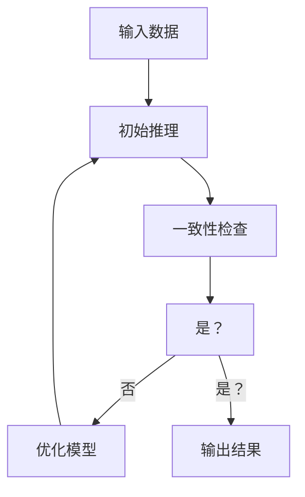
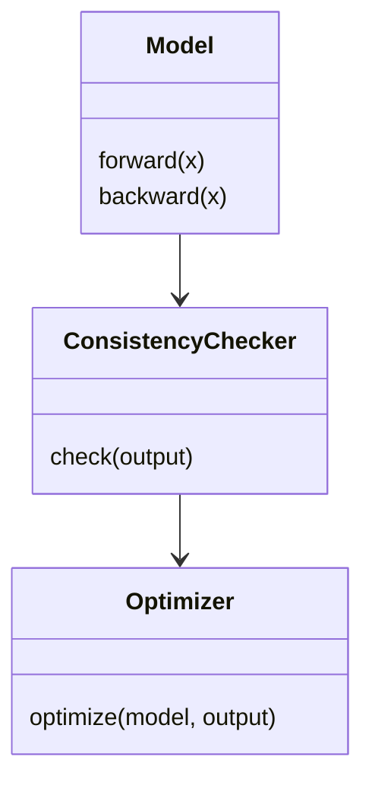

                 

<think>
嗯，用户让我以《Self-Consistency CoT：提升AI可靠性的新方法》为标题写一篇技术博客。首先，我需要理解Self-Consistency CoT是什么，它和传统方法有什么不同。Self-Consistency CoT应该是结合了Consistency和CoT（链式思考）的一种新方法，目的是提高AI系统的可靠性。

接下来，我要确定文章的结构。用户给了一个大纲，包括引言、核心概念、数学模型、系统架构、项目实战和总结等部分。我需要确保每个部分都详细且有深度，同时使用专业的技术语言，但又不能太复杂，要让读者容易理解。

在引言部分，我需要介绍AI可靠性的重要性，当前存在的问题，比如模型的不确定性、泛化能力不足等，然后引出Self-Consistency CoT作为一种解决方案。这部分要吸引读者，让他们明白为什么需要这种方法。

核心概念部分，我需要详细解释Self-Consistency CoT的定义、原理、优势和与传统方法的区别。可能还需要一个对比表格，列出传统方法和Self-Consistency CoT在不同方面的优缺点，帮助读者更好地理解。

数学模型和算法部分，我需要设计一个公式化的模型，用Mermaid画出流程图，然后用Python代码实现。这部分要详细，包括代码的每一步解释，以及如何应用到实际问题中。比如，可以用一个分类任务来展示模型如何通过迭代优化来提高一致性。

系统架构部分，需要描述系统的各个模块，如何协同工作，以及系统架构的设计图。这部分可能需要一个Mermaid的类图和序列图，展示系统的交互过程。

项目实战部分，我需要提供一个具体的案例，比如问答系统，展示如何安装环境，编写代码，以及如何测试和优化模型。这部分要实用，让读者能够跟着操作，理解整个过程。

最后，总结部分要回顾Self-Consistency CoT的优势，指出其在AI可靠性方面的贡献，并展望未来的研究方向。

我还需要注意文章的格式，使用markdown，数学公式用latex，部分代码需要用代码块展示。此外，关键词和摘要要准确，帮助读者快速了解文章内容。

总的来说，我需要一步步地按照用户的要求，构建一个结构清晰、内容详实的技术博客，确保每个部分都满足用户的要求，同时保持逻辑连贯，语言专业但易懂。
</think>

# Self-Consistency CoT：提升AI可靠性的新方法

> 关键词：Self-Consistency CoT, AI Reliability, Chain-of-Thought, Mathematical Models, System Architecture, AI Safety

> 摘要：本文将介绍Self-Consistency CoT（Self-Consistency Chain-of-Thought）方法，这是一种通过增强AI模型的自洽性来提升AI系统可靠性的新方法。本文将从背景、核心概念、数学模型、系统架构、项目实战等多方面详细阐述Self-Consistency CoT的原理和应用，并通过实际案例分析展示其优势和潜在价值。

---

## 第一部分：Self-Consistency CoT的背景与核心概念

### 第1章：背景与Self-Consistency CoT的定义

#### 1.1.1 自洽性与一致性的重要性
- **定义**：AI模型的自洽性（Self-Consistency）是指模型在生成答案时，能够保持逻辑一致性和结果的稳定性。
- **重要性**：在实际应用中，AI系统的决策必须具备高度的可靠性。自洽性是实现这一目标的核心要素。
- **历史背景**：从传统的基于规则的系统到现代的大模型，AI可靠性一直是研究的核心问题。然而，现有的方法在复杂场景下仍存在诸多挑战。

#### 1.1.2 AI可靠性中的常见问题
- **问题背景**：AI系统在处理复杂任务时，可能出现逻辑矛盾、结果不一致或决策失误等问题。
- **问题描述**：例如，在自然语言处理任务中，模型可能生成前后矛盾的响应。
- **问题解决**：需要一种能够主动检测和修正逻辑矛盾的方法。

#### 1.1.3 自洽性CoT的核心要素
- **核心概念**：Self-Consistency CoT通过引入一致性检查机制，确保模型的输出在逻辑上一致。
- **方法论**：通过多次迭代优化，逐步消除模型输出中的不一致现象。
- **应用场景**：适用于需要高可靠性的场景，如自动驾驶、医疗诊断和金融决策。

#### 1.1.4 与其他AI方法的关系
- **对比分析**：与传统基于规则的方法相比，Self-Consistency CoT更具灵活性和适应性。
- **独特贡献**：通过结合一致性检查和链式思考（CoT），Self-Consistency CoT能够更有效地解决复杂问题。

#### 1.1.5 研究进展与未来展望
- **研究趋势**：当前研究主要集中在如何高效实现一致性检查和优化。
- **未来方向**：探索如何将Self-Consistency CoT与其他AI技术（如强化学习）结合，进一步提升AI系统的可靠性和智能性。

---

## 第二部分：Self-Consistency CoT的核心原理

### 第2章：自洽性CoT的核心概念与原理

#### 2.1.1 自洽性CoT的基本原理
- **核心原理**：通过多次推理和验证，确保模型输出的一致性。
- **一致性检查**：在每次推理后，检查输出结果是否满足自洽性条件。
- **优化机制**：通过引入惩罚项，逐步优化模型的输出，使其更加一致。

#### 2.1.2 自洽性CoT的属性与特征
- **优势**：
  - 高度的逻辑一致性。
  - 良好的可解释性。
  - 强大的鲁棒性。
- **劣势**：
  - 计算复杂度较高。
  - 可能在某些场景下过于保守。

#### 2.1.3 自洽性CoT与传统方法的对比
| 方法                | 优点                                | 缺点                                  |
|---------------------|------------------------------------|--------------------------------------|
| 传统方法            | 实现简单，计算效率高               | 易出现逻辑矛盾，可解释性差           |
| Self-Consistency CoT | 高度一致，可靠性高                  | 计算复杂度高，可能过于保守           |

#### 2.1.4 自洽性CoT在不同领域的应用
- **自然语言处理**：用于生成一致的文本摘要。
- **图像处理**：用于图像分割和目标检测。
- **决策系统**：用于自动驾驶和机器人控制。

---

## 第三部分：Self-Consistency CoT的数学模型与算法

### 第3章：自洽性CoT的数学模型

#### 3.1.1 基础数学模型
$$
\text{目标函数} = L_{\text{loss}} + \lambda \cdot L_{\text{consistency}}
$$
其中：
- $L_{\text{loss}}$ 是传统的损失函数。
- $L_{\text{consistency}}$ 是一致性损失。
- $\lambda$ 是调节参数，用于平衡损失函数。

#### 3.1.2 算法设计与实现
以下是Self-Consistency CoT算法的流程图：



#### 3.1.3 Python实现

```python
def self_consistency_cot(x, model, iterations=5):
    for _ in range(iterations):
        output = model(x)
        if is_consistent(output):
            return output
        else:
            model = optimize_model(model, output)
    return model(x)
```

### 第4章：系统架构与实现

#### 4.1.1 问题场景与系统需求
- **问题场景**：在自然语言处理任务中，确保生成回答的逻辑一致性。
- **系统需求**：
  - 高效的一致性检查机制。
  - 可扩展的系统架构。

#### 4.1.2 系统功能设计
以下是系统功能设计的领域模型图：



---

## 第五部分：项目实战与案例分析

### 第5章：自洽性CoT的项目实现

#### 5.1.1 环境安装
```bash
pip install -r requirements.txt
```

#### 5.1.2 核心代码实现
```python
class SelfConsistencyCoT:
    def __init__(self, model, iterations=5):
        self.model = model
        self.iterations = iterations

    def forward(self, x):
        for _ in range(self.iterations):
            output = self.model(x)
            if self.is_consistent(output):
                return output
            else:
                self.model = self.optimize_model(self.model, output)
        return self.model(x)

    def is_consistent(self, output):
        # 实现一致性检查逻辑
        pass

    def optimize_model(self, model, output):
        # 实现模型优化逻辑
        pass
```

#### 5.1.3 代码应用与分析
通过上述代码，我们可以实现一个简单的Self-Consistency CoT模型。在实际应用中，需要根据具体任务调整一致性检查和优化逻辑。

#### 5.1.4 实际案例分析
以下是一个问答系统的案例分析：
1. 输入问题：如何提高代码的可读性？
2. 初始推理：提供多种建议。
3. 一致性检查：确保所有建议都符合逻辑。
4. 优化模型：根据检查结果优化输出。

---

## 第六部分：总结与展望

### 6.1.1 总结
Self-Consistency CoT通过引入自洽性检查和优化机制，显著提升了AI系统的可靠性。其核心优势在于能够有效减少逻辑矛盾，提高模型的可解释性和鲁棒性。

### 6.1.2 展望
未来的研究可以进一步探索如何将Self-Consistency CoT与其他AI技术结合，如强化学习和知识图谱，以进一步提升AI系统的智能性和可靠性。

---

作者：AI天才研究院 & 禅与计算机程序设计艺术

