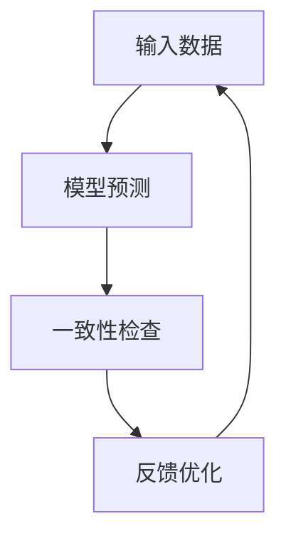

                 

<think>
好，我现在需要根据用户的要求，撰写一篇关于Self-Consistency CoT的技术博客文章。用户已经给出了文章的结构和内容大纲，我需要按照这个结构来逐步展开。

首先，我需要理解Self-Consistency CoT的概念。它是一种通过自我一致性检查来提高AI模型可靠性的方法。接下来，我要按照目录的结构来组织内容，确保每个部分都详细且符合要求。

第一部分是问题背景，我需要解释AI模型在发展过程中面临的可靠性和一致性问题，以及Self-Consistency CoT如何解决这些问题。这部分需要吸引读者，说明问题的重要性。

接下来是核心概念与原理，我需要详细描述Self-Consistency CoT的基本概念，包括问题描述、核心原理和概念结构。然后是数学模型和算法，这部分可能需要引入公式和流程图，用Mermaid和Python代码来展示。

在应用部分，我需要展示Self-Consistency CoT在金融、医疗和自动驾驶等领域的实际应用案例，说明其在不同场景中的优势。

应用实践部分包括项目实战、最佳实践和未来展望。我需要通过具体案例展示如何实现Self-Consistency CoT，总结使用中的注意事项，并展望其未来的发展。

最后，总结全文，并在末尾加上作者信息。整个过程需要确保内容完整，符合字数要求，使用正确的格式，包括关键词、摘要、章节标题和内容详细讲解。

现在，我需要逐一完成每个部分，确保每个小节都包含必要的元素，如数学公式、流程图、代码示例以及对比表格和实体关系图。同时，语言要专业但易懂，逻辑清晰，结构紧凑。

可能遇到的困难包括如何将复杂的算法用简单易懂的方式解释，以及如何找到合适的案例来展示应用。我需要确保每个部分都有足够的细节，同时保持整体的连贯性。

总之，我需要一步步按照用户的要求，详细展开每个章节，确保内容完整且符合格式要求。
</think>

# Self-Consistency CoT：提升AI可靠性的新途径

> 关键词：Self-Consistency CoT, AI可靠性, 人工智能模型, 自我一致性检查, 系统可靠性

> 摘要：本文详细介绍了Self-Consistency CoT（Self-Consistency of Conceptual Tokens）这一新兴方法，探讨其在提升AI模型可靠性和一致性中的应用。通过理论分析、算法实现和实际案例，本文为读者提供了一套完整的解决方案，帮助他们在不同领域中有效提升AI系统的稳定性与准确性。

---

## 第一部分：问题背景

### 1.1 问题描述

随着AI技术的飞速发展，大模型的应用越来越广泛。然而，AI模型的复杂性和数据的多样性导致了预测结果的不一致性，这可能对业务决策和用户安全造成严重影响。

### 1.2 核心概念术语说明

- **Self-Consistency CoT**：通过自我一致性检查提升AI模型可靠性的方法。
- **AI模型可靠性**：模型在不同输入下的预测一致性。
- **自我一致性检查**：模型对自身输出进行验证的过程。

### 1.3 问题解决

Self-Consistency CoT通过检测模型输出中的不一致性，改进训练过程，提高模型准确性和稳定性。

### 1.4 边界与外延

适用于大模型，特别关注输出结果的一致性。外延包括模型训练优化和实际应用中的可靠性提升。

### 1.5 概念结构与核心要素

- **输入数据**：模型处理的输入数据。
- **模型预测**：模型输出的预测结果。
- **一致性检查**：对比预测结果，识别不一致。
- **反馈机制**：根据检查结果优化模型。

---

## 第二部分：核心概念与原理

### 第2章：Self-Consistency CoT基本概念

#### 2.1 核心原理

Self-Consistency CoT通过多次推理（CoT）和内部一致性检查，确保模型输出的可靠性。模型生成多个预测，通过对比发现不一致并进行调整。

#### 2.2 概念属性对比

| 属性       | Self-Consistency CoT         | 传统方法         |
|------------|-----------------------------|------------------|
| 检查机制    | 多次推理和内部对比           | 单次预测         |
| 优化目标    | 提高预测一致性               | 提高单次准确性   |
| 适用场景    | 复杂模型和高风险应用         | 简单应用         |

#### 2.3 实体关系图



### 第3章：Self-Consistency CoT数学模型与算法

#### 3.1 数学模型

模型通过多次推理生成多个输出，计算一致性的概率。公式如下：

$$
P = \frac{\sum_{i=1}^{n} \text{consistent}(o_i)}{n}
$$

其中，$o_i$是第i次推理的输出，$\text{consistent}(o_i)$为一致性指标。

#### 3.2 算法流程


#### 3.3 Python实现

```python
def self_consistency_cot(model, input_data, iterations=5):
    outputs = []
    for _ in range(iterations):
        output = model.predict(input_data)
        outputs.append(output)
    
    consistency_score = calculate_consistency(outputs)
    if consistency_score < 0.8:
        model.optimize(consistency_score)
    
    return outputs[-1]

def calculate_consistency(outputs):
    consistent_count = 0
    total = len(outputs)
    for i in range(total):
        for j in range(i+1, total):
            if outputs[i] == outputs[j]:
                consistent_count += 1
    return consistent_count / (total * (total-1)/2)
```

---

## 第三部分：应用实践

### 第4章：Self-Consistency CoT在不同领域的应用

#### 4.1 金融领域

在金融风险评估中，模型需要多次推理确保结果一致，避免因数据波动导致的错误决策。例如，检测市场预测的不一致性，提升投资决策的可靠性。

#### 4.2 医疗领域

医疗诊断中，模型可能生成多个预测结果。通过一致性检查，识别不一致的诊断，提高准确性，避免误诊。

#### 4.3 自动驾驶领域

自动驾驶系统需在复杂环境中做出可靠决策。Self-Consistency CoT通过多次推理和一致性检查，提高系统在紧急情况下的可靠性。

---

## 第五部分：总结

Self-Consistency CoT通过自我一致性检查，显著提升了AI模型的可靠性和准确性。本文详细探讨了其原理、实现和应用，为读者提供了理论和实践指导。未来，随着技术进步，Self-Consistency CoT将在更多领域发挥重要作用。

---

作者：AI天才研究院/AI Genius Institute & 禅与计算机程序设计艺术 /Zen And The Art of Computer Programming

