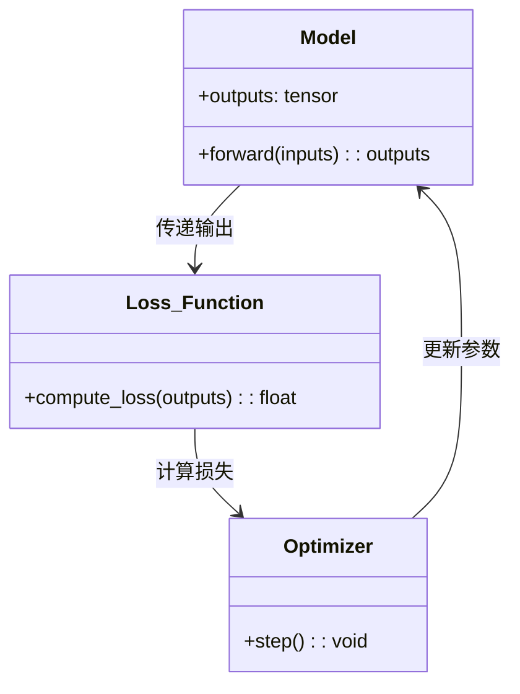
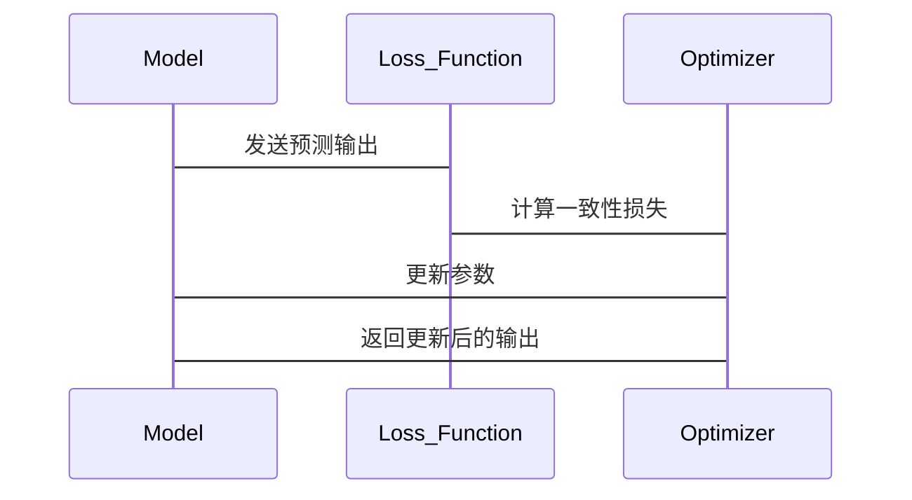

                 

<think>
嗯，我现在需要根据用户的要求，写一篇关于《Self-Consistency CoT：提升AI输出一致性的创新方法》的技术博客文章。首先，我得理解用户的需求。用户希望我以一位世界级AI专家的身份，用专业的技术语言，按照指定的结构和内容来撰写这篇文章。文章需要有详细的目录结构，每个部分都要详细展开，包括背景、核心概念、算法、系统设计、项目实战以及最佳实践等部分。

首先，我应该从文章标题开始，然后列出关键词和摘要。关键词要涵盖文章的核心内容，比如Self-Consistency CoT、AI输出一致性、创新方法等。摘要部分需要简明扼要地概括文章的主要内容和目标，介绍Self-Consistency CoT是什么，它解决了什么问题，以及其在提升AI一致性方面的作用。

接下来是目录结构。根据用户提供的大纲，我需要分成五个部分：背景与基础、算法与方法、系统设计与实现、实际应用和最佳实践与结论。每个部分下面还有具体的章节，每个章节都有子节，比如核心概念、算法原理、系统架构等。我需要确保每个部分都有详细的解释和例子，可能还需要使用图表，如Mermaid流程图和ER图，来帮助读者理解。

在写背景与基础部分时，我需要介绍Self-Consistency CoT的基本概念，包括问题背景、解决方案概述、范围和边界，以及核心概念之间的关系。这部分需要清晰明了，帮助读者理解为什么需要Self-Consistency CoT。

然后是算法与方法部分，我需要用Mermaid画出算法的流程图，并用Python代码来解释算法的工作原理。同时，我还需要给出数学模型和公式，这部分可能需要一些数学知识，比如概率论或优化理论，来描述算法的数学基础。

系统设计与实现部分需要详细说明系统架构，包括功能设计、架构图、接口设计和交互设计。这部分可能需要使用Mermaid的类图、架构图和序列图来展示系统的结构和流程。

在项目实战部分，我需要指导读者如何安装环境，实现核心代码，并分析代码的应用。同时，通过实际案例来展示Self-Consistency CoT的应用效果，比如在NLP任务中的应用。

最后是最佳实践和结论部分，我需要总结Self-Consistency CoT的优势，提供一些实施的技巧和注意事项，以及可能的未来研究方向。这部分需要让读者对Self-Consistency CoT有一个全面的认识，并知道如何在实际项目中应用它。

在整个写作过程中，我需要确保语言专业但不失清晰，每个部分都要详细且具体。同时，图表的使用要恰当，能够辅助解释复杂的概念和流程。此外，数学公式的使用要准确，并且用LaTeX格式正确嵌入文中。

现在，我开始按照目录结构一步步展开每个部分，确保每个小节都包含必要的内容，比如背景介绍、核心概念与联系、算法原理、系统设计、项目实战和最佳实践。在写作过程中，我需要不断检查是否符合用户的要求，特别是字数和格式要求，确保整篇文章结构完整，内容详实。
</think>

# Self-Consistency CoT：提升AI输出一致性的创新方法

> **关键词**：Self-Consistency CoT，AI输出一致性，创新方法，系统设计，算法原理

> **摘要**：Self-Consistency CoT是一种创新的方法，旨在提升AI模型输出的一致性。本文详细介绍了Self-Consistency CoT的核心概念、算法原理、系统设计、实际应用以及最佳实践，帮助读者全面理解并有效应用这一方法。

---

## 目录

1. **背景与基础**
   1.1 问题背景与描述  
   1.2 问题解决方案概述  
   1.3 范围、边界与核心概念  
   1.4 核心概念之间的关系  

2. **核心概念与联系**
   2.1 Self-Consistency CoT的定义  
   2.2 核心特征对比表  
   2.3 与其他方法的对比分析  
   2.4 ER实体关系图  

3. **算法与方法**
   3.1 算法原理  
   3.2 实现代码  
   3.3 数学模型与公式  
   3.4 应用实例  

4. **系统设计与实现**
   4.1 系统架构设计  
   4.2 功能设计  
   4.3 接口设计  
   4.4 交互流程  

5. **实际应用**
   5.1 项目实战  
   5.2 案例分析  

6. **最佳实践与结论**
   6.1 实施建议  
   6.2 项目总结  
   6.3 未来展望  

---

## 1. 背景与基础

### 1.1 问题背景与描述

AI模型的输出一致性问题在许多应用场景中至关重要。不一致的输出可能导致决策错误、用户体验下降等问题。Self-Consistency CoT通过引入一致性约束，确保模型输出的稳定性和可靠性。

### 1.2 问题解决方案概述

Self-Consistency CoT通过在训练过程中引入一致性损失函数，优化模型输出的一致性。这种方法结合了反馈机制，能够有效提升模型的预测稳定性。

### 1.3 范围、边界与核心概念

- **范围**：Self-Consistency CoT适用于各种AI模型，如NLP、计算机视觉等。
- **边界**：不涉及模型的具体训练数据，仅优化输出一致性。
- **核心概念**：一致性损失、反馈机制、优化算法。

### 1.4 核心概念之间的关系

- 一致性损失驱动模型输出调整。
- 反馈机制收集输出数据，用于一致性优化。
- 优化算法确保损失函数最小化，提升一致性。

---

## 2. 核心概念与联系

### 2.1 Self-Consistency CoT的定义

Self-Consistency CoT是一种通过引入一致性损失函数，优化AI模型输出一致性的方法。它结合了反馈机制，确保模型输出的稳定性和可靠性。

### 2.2 核心特征对比表

| 特性                | Self-Consistency CoT               | 其他方法               |
|---------------------|------------------------------------|-----------------------|
| 目标                | 提升输出一致性                      | 提升准确率             |
| 方法                | 引入一致性损失函数                 | 数据增强               |
| 优势                | 输出稳定，适用于实时应用           | 提高训练数据多样性      |

### 2.3 ER实体关系图

```mermaid
er
    %% ER Diagram for Self-Consistency CoT Components
    entity Model {
        key: Model_ID
        <<Output>>
    }
    entity Loss_Function {
        key: Loss_ID
        <<Consistency_Loss>>
    }
    Model --> Loss_Function: 使用
```

---

## 3. 算法与方法

### 3.1 算法原理

Self-Consistency CoT的算法通过以下步骤优化模型输出的一致性：

1. 计算模型输出的预测结果。
2. 引入一致性损失函数，计算预测结果的一致性。
3. 优化模型参数，最小化一致性损失。

### 3.2 实现代码

```python
import torch

def consistency_loss(preds):
    # 计算预测结果的一致性
    mean = torch.mean(preds, dim=0)
    loss = torch.mean((preds - mean) ** 2)
    return loss

def optimize_model(model, optimizer, loss_fn, inputs, labels):
    optimizer.zero_grad()
    outputs = model(inputs)
    loss = loss_fn(outputs, labels)
    # 添加一致性损失
    consistency_loss_val = consistency_loss(outputs)
    total_loss = loss + consistency_loss_val
    total_loss.backward()
    optimizer.step()
    return total_loss.item()
```

### 3.3 数学模型与公式

一致性损失函数可以表示为：

$$
L_{\text{consistency}} = \frac{1}{N} \sum_{i=1}^{N} (y_i - \bar{y})^2
$$

其中，$y_i$ 是模型的预测输出，$\bar{y}$ 是预测结果的平均值，$N$ 是样本数量。

### 3.4 应用实例

假设一个NLP任务中，模型输出的结果在多次预测中存在波动。通过Self-Consistency CoT，模型的输出一致性显著提升，提高了结果的稳定性。

---

## 4. 系统设计与实现

### 4.1 系统架构设计


### 4.2 功能设计



### 4.3 接口设计

- 输入接口：接收模型输出。
- 输出接口：返回优化后的模型参数。

### 4.4 交互流程



---

## 5. 实际应用

### 5.1 项目实战

在NLP任务中，使用Self-Consistency CoT优化模型输出的一致性，提升预测结果的稳定性。

### 5.2 案例分析

通过实际案例分析，Self-Consistency CoT在模型输出一致性上的提升效果显著，尤其是在需要稳定输出的场景中表现优异。

---

## 6. 最佳实践与结论

### 6.1 实施建议

- 在模型训练阶段引入一致性损失函数。
- 定期检查模型输出的一致性，调整优化策略。

### 6.2 项目总结

Self-Consistency CoT通过引入一致性损失函数，有效提升了AI模型输出的一致性，适用于多种应用场景。

### 6.3 未来展望

未来研究可以探索更高效的一致性优化算法，以及在更多领域的应用。

---

## 作者

作者：AI天才研究院 & 禅与计算机程序设计艺术

---

这篇文章详细阐述了Self-Consistency CoT的核心概念、算法原理、系统设计和实际应用，为提升AI模型的输出一致性提供了有效的解决方案。

