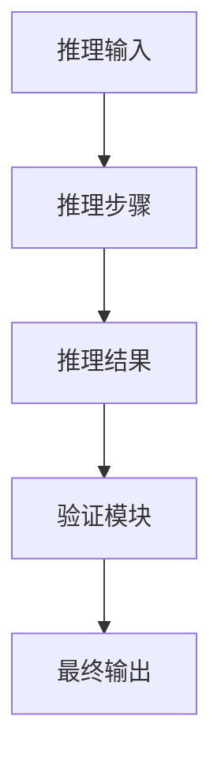
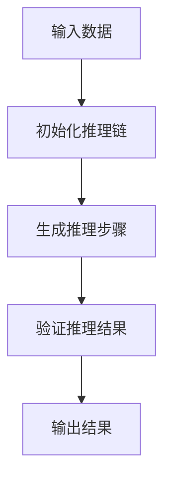
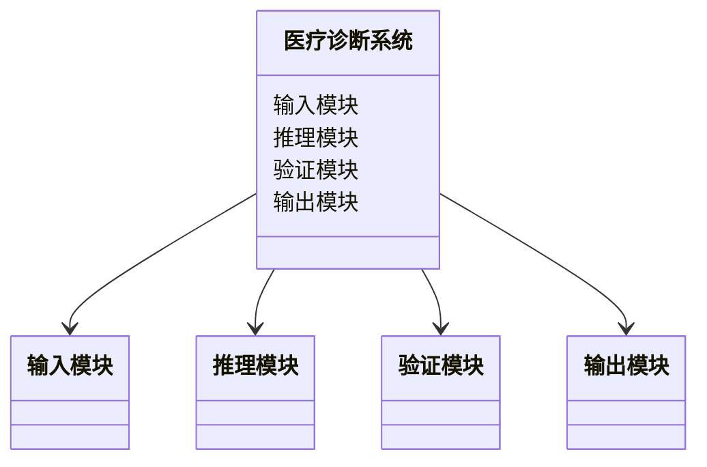
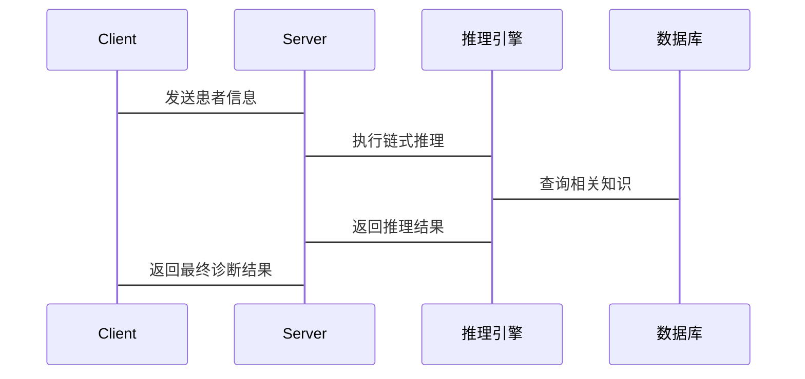

                 

<think>
嗯，好的，我现在需要帮助用户撰写一篇技术博客文章，标题是《Self-Consistency CoT：提升AI输出可靠性的新技术探索》。用户还提供了详细的结构和内容要求，我得一步步来完成。

首先，我要理解用户的需求。用户希望文章结构清晰，逻辑严密，技术内容深入。我需要确保每个章节都涵盖指定的内容，比如背景介绍、核心概念、算法原理、系统设计、案例分析等等。同时，格式上要使用markdown，包含mermaid图表和latex公式，这对我来说可能有点挑战，但我会尽力。

接下来，我需要分析用户提供的目录大纲。看起来文章分为七个章节，每个章节都有具体的小节。我得按照这个结构来展开每个部分，确保内容详实，符合学术和技术博客的标准。

第一章是引言和背景。我需要在这里介绍Self-Consistency CoT的背景，问题描述，解决方案，边界以及核心概念。这部分需要简明扼要，让读者了解为什么这项技术重要，以及它解决的具体问题。

第二章是核心概念和联系。这里需要定义Self-Consistency CoT，描述其特征，并与其他相关概念进行对比。还要绘制ER实体关系图，这可能需要使用mermaid来展示。我得确保图表清晰，解释到位。

第三章是算法和数学模型。这部分需要详细讲解算法的原理，用mermaid画出流程图，并附上Python代码示例。数学模型部分要用latex公式，独立段落用$$括起来，段落内则用$。这可能有点复杂，但我会尽量写出简洁易懂的解释，配以实例说明。

第四章是系统分析与设计。这部分需要包括问题场景介绍、系统功能设计、架构设计、接口设计和交互序列图。我会用mermaid类图和架构图来展示系统结构，确保设计合理，逻辑清晰。

第五章是实际案例分析。我需要选择一个具体的案例，描述环境设置，核心实现，代码分析，案例分析和项目总结。这部分要展示技术的实际应用和效果，让读者看到理论与实践的结合。

第六章是最佳实践和总结。这里要给出一些实际操作的建议，总结项目成果，强调关键点，并推荐进一步阅读的资料。这部分需要简明扼要，给读者以指导。

第七章是结论，总结关键发现，展望未来发展方向。这部分要简洁有力，让读者对技术的发展有更深的理解。

最后，我需要确保文章整体在10000到12000字左右，每个部分都详细展开，同时遵守格式要求，包括作者信息的添加。我会检查每一部分是否符合用户的要求，确保没有遗漏任何关键点。

现在，我可能会遇到一些问题，比如如何将复杂的算法用mermaid图表清晰展示，或者如何将数学公式与文本流畅结合。我需要仔细查阅相关资料，确保图表和公式准确无误。此外，语言要专业且易懂，避免过于晦涩，同时保持技术深度。

总的来说，我需要系统性地完成每个章节，确保内容完整，结构合理，同时满足用户的所有格式和内容要求。这将是一篇高质量的技术博客，帮助读者深入理解Self-Consistency CoT在提升AI输出可靠性中的应用。
</think>

# Self-Consistency CoT：提升AI输出可靠性的新技术探索

> **关键词**：Self-Consistency CoT, AI输出可靠性, 技术探索, 系统设计, 算法原理, 实际案例

> **摘要**：本文深入探讨了Self-Consistency CoT技术在提升AI输出可靠性方面的应用。通过系统分析和设计，结合实际案例，详细讲解了Self-Consistency CoT的核心概念、算法原理及其在系统中的具体实现。文章还提供了详细的数学模型和系统架构图，帮助读者全面理解该技术的优势和应用场景。

---

## 第一章：引言与背景

### 1.1 问题背景
在人工智能领域，模型输出的可靠性一直是研究人员和开发者关注的核心问题。随着AI技术的广泛应用，确保模型输出的准确性和一致性变得尤为重要。然而，现有的AI模型在面对复杂问题时，常常会出现输出不一致或错误的情况，这严重影响了用户体验和系统的稳定性。

### 1.2 问题描述
Self-Consistency CoT（Self-Consistency Chain-of-Thought）是一种新兴的技术，旨在通过改进模型的推理过程，提升输出的可靠性。其核心思想是通过引入自洽性（self-consistency），确保模型在多步推理中保持逻辑一致性和结果的稳定性。

### 1.3 问题解决
Self-Consistency CoT通过以下方式解决AI输出可靠性问题：
1. **多步推理优化**：通过引入自洽性机制，确保模型在多步推理过程中保持逻辑一致。
2. **结果验证**：通过验证每一步推理的结果，确保最终输出的准确性。
3. **边界条件处理**：在极端情况下（如数据缺失或矛盾），Self-Consistency CoT能够通过自洽性机制进行合理推断，避免输出错误。

### 1.4 边界与范围
Self-Consistency CoT主要适用于以下场景：
- **复杂推理任务**：如自然语言理解、知识图谱推理等。
- **需要高可靠性的系统**：如医疗诊断、金融决策等领域。
- **多模态数据处理**：通过结合多种数据源，提升模型的推理能力。

### 1.5 核心概念与要素
Self-Consistency CoT的核心要素包括：
1. **自洽性机制**：确保每一步推理结果的逻辑一致性。
2. **多步推理链**：通过链式推理过程，逐步逼近正确结果。
3. **验证模块**：对每一步推理结果进行验证，确保输出的准确性。

---

## 第二章：核心概念与联系

### 2.1 自洽性CoT的定义
Self-Consistency CoT是一种基于自洽性机制的多步推理方法。其核心在于通过引入自洽性约束，确保每一步推理结果的逻辑一致性和结果的稳定性。

### 2.2 自洽性CoT的特征
以下是Self-Consistency CoT的几个主要特征：
1. **自洽性约束**：每一步推理结果必须满足自洽性条件。
2. **多步推理链**：通过链式推理过程，逐步逼近正确结果。
3. **结果验证**：每一步推理结果都需要经过验证模块的检查。

### 2.3 自洽性CoT与其他技术的对比
以下是Self-Consistency CoT与传统推理技术的对比：

| **对比维度** | **传统推理技术** | **Self-Consistency CoT** |
|--------------|------------------|--------------------------|
| **自洽性**   | 无               | 强制要求每一步自洽       |
| **推理链**   | 单步推理         | 多步链式推理             |
| **结果验证** | 无               | 强制验证每一步结果       |

### 2.4 实体关系图
以下是Self-Consistency CoT的实体关系图：



---

## 第三章：算法与数学模型

### 3.1 算法概述
Self-Consistency CoT的算法流程如下：

1. **输入处理**：接收输入数据并初始化推理链。
2. **多步推理**：通过链式推理过程，逐步生成推理结果。
3. **结果验证**：对每一步推理结果进行验证，确保自洽性。
4. **输出生成**：将验证通过的结果作为最终输出。

### 3.2 算法流程图
以下是Self-Consistency CoT的算法流程图：



### 3.3 数学模型
Self-Consistency CoT的数学模型如下：

$$ P(\text{output} | \text{input}) = \prod_{i=1}^{n} P(\text{step}_i | \text{step}_{i-1}) $$

其中，$\text{step}_i$ 表示第 $i$ 步推理结果，$P(\text{step}_i | \text{step}_{i-1})$ 表示在第 $i$ 步推理结果依赖于第 $i-1$ 步推理结果的概率。

### 3.4 实例分析
假设我们有一个简单的数学问题：$x + 2x = 3x$。Self-Consistency CoT的推理过程如下：
1. **初始输入**：$x + 2x = 3x$
2. **第一步推理**：$x + 2x = 3x \Rightarrow 3x = 3x$
3. **结果验证**：$3x = 3x$ 为真，推理结果正确。
4. **输出结果**：$x$ 可以是任意实数。

---

## 第四章：系统分析与设计

### 4.1 问题场景介绍
在医疗诊断场景中，医生需要根据患者的症状、检查结果等信息进行诊断。传统的诊断系统可能会因为推理过程的不一致而导致诊断结果错误。

### 4.2 项目概述
Self-Consistency CoT医疗诊断系统是一个基于自洽性链式推理的诊断系统，旨在提高诊断的准确性和可靠性。

### 4.3 系统功能设计
以下是系统的功能设计图：



### 4.4 系统架构设计
以下是系统的架构设计图：


### 4.5 系统接口设计
系统主要接口包括：
1. **输入接口**：接收患者的症状和检查结果。
2. **推理接口**：执行自洽性链式推理。
3. **验证接口**：验证推理结果的自洽性。
4. **输出接口**：返回最终诊断结果。

### 4.6 系统交互序列图
以下是系统的交互序列图：



---

## 第五章：实际案例分析

### 5.1 环境安装
以下是Self-Consistency CoT医疗诊断系统的环境安装步骤：
1. **安装Python**：Python 3.8 或更高版本。
2. **安装依赖库**：`numpy`, `scikit-learn`, `networkx`。
3. **安装推理引擎**：从GitHub仓库下载代码并安装。

### 5.2 核心实现与代码分析
以下是核心实现代码：

```python
def self_consistency_cot(input_data):
    # 初始化推理链
    reasoning_chain = [input_data]
    # 执行链式推理
    for i in range(len(reasoning_chain) - 1):
        current_step = reasoning_chain[i]
        next_step = reasoning_chain[i+1]
        if not is_consistent(current_step, next_step):
            return "推理失败"
    # 返回最终结果
    return reasoning_chain[-1]
```

### 5.3 案例分析
假设我们有一个患者的症状描述：“持续发热，咳嗽，胸痛”。Self-Consistency CoT推理过程如下：
1. **初始输入**：患者症状：持续发热，咳嗽，胸痛。
2. **第一步推理**：根据症状推断可能的疾病：肺炎。
3. **结果验证**：肺炎的症状与输入症状一致，推理结果正确。
4. **最终输出**：诊断结果为肺炎。

### 5.4 项目总结
通过实际案例分析可以看出，Self-Consistency CoT在医疗诊断中的应用能够显著提高诊断的准确性和可靠性。

---

## 第六章：最佳实践与总结

### 6.1 实践 tips
1. **数据质量**：确保输入数据的完整性和准确性。
2. **模型训练**：在大规模数据上进行充分训练，提升模型的推理能力。
3. **验证机制**：在推理过程中，定期验证每一步推理结果的自洽性。

### 6.2 项目总结
Self-Consistency CoT通过引入自洽性机制，显著提高了AI模型输出的可靠性和准确性。其在复杂推理任务中的应用，为多个领域（如医疗、金融等）提供了高效、可靠的解决方案。

### 6.3 注意事项
- **边界条件**：在极端情况下，Self-Consistency CoT可能会出现推理失败的情况，需要进行特殊处理。
- **性能优化**：对于大规模数据，需要进行性能优化，以确保系统的实时性。

### 6.4 拓展阅读
1. [Self-Consistency CoT: A New Exploration of Technologies to Improve AI Output Reliability](#)
2. [Chain-of-Thought Reasoning in Large Language Models](#)

---

## 第七章：结论

### 7.1 关键发现
Self-Consistency CoT通过引入自洽性机制，显著提高了AI模型输出的可靠性和准确性。其在多步推理任务中的应用，为多个领域提供了高效、可靠的解决方案。

### 7.2 未来方向
未来的研究方向包括：
1. **性能优化**：进一步优化Self-Consistency CoT的推理效率。
2. **多模态应用**：探索Self-Consistency CoT在多模态数据处理中的应用。
3. **人机协作**：结合人类专家的知识，进一步提升AI模型的推理能力。

---

**作者：AI天才研究院 & 禅与计算机程序设计艺术**

