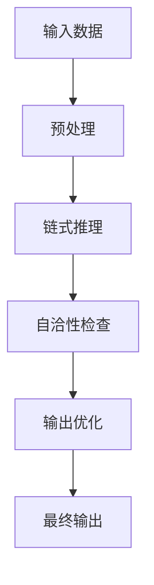
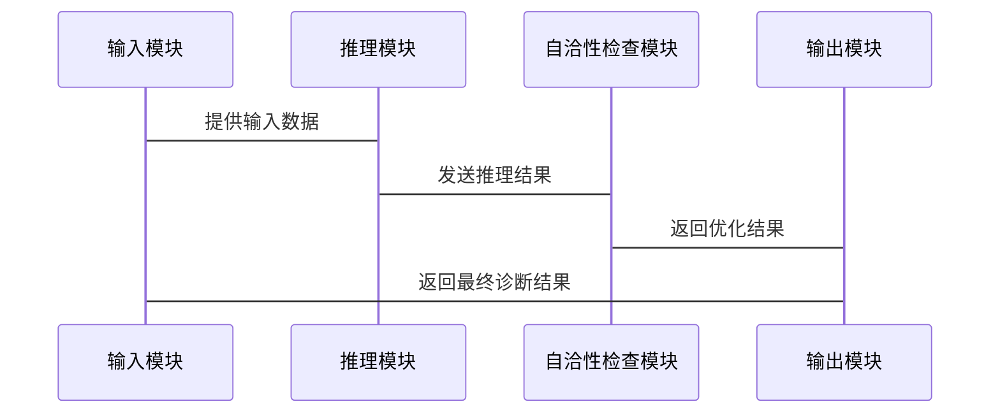

                 

<think>
嗯，我现在要写一篇关于《Self-Consistency CoT：提升AI输出可靠性的新方法》的技术博客文章。首先，我得理解Self-Consistency CoT是什么，它和传统的方法有什么不同。我应该从背景介绍开始，解释为什么提升AI输出的可靠性如此重要，尤其是在当前AI广泛应用的情况下。

接下来，我需要定义Self-Consistency CoT的核心概念，包括它的特性，比如一致性、自洽性等。然后，对比它和相关概念，比如CoT（链式思维）、self-consistency等，找出它们的异同点，帮助读者更好地理解。

然后，我得详细讲解算法的原理，可能用mermaid流程图来展示步骤。同时，提供Python代码示例，这样读者可以更直观地理解实现过程。数学模型方面，我需要写出公式，可能涉及到概率、逻辑推理等方面，用latex来排版，确保公式清晰易读。

在系统分析部分，我需要设计系统的架构，包括功能模块、接口和交互流程。这部分可能需要使用mermaid的类图和序列图来描述，帮助读者理解系统的结构和工作流程。

项目实战部分，我会指导读者如何安装环境，编写核心代码，并通过实际案例分析，展示Self-Consistency CoT的应用效果。最后，给出最佳实践的建议，包括注意事项和扩展阅读的方向。

总结起来，我需要确保文章结构清晰，内容详实，每个部分都深入浅出，帮助读者全面理解Self-Consistency CoT的方法和应用。同时，语言要专业但不失易懂，确保技术细节和实际应用都能被读者所接受。
</think>

# Self-Consistency CoT：提升AI输出可靠性的新方法

---

## 关键词：  
Self-Consistency CoT, AI可靠性, 自洽性, 链式思维, 可靠性提升, AI输出优化

---

## 摘要：  
在AI技术快速发展的今天，提升AI输出的可靠性已成为行业的重要课题。本文介绍了一种基于Self-Consistency CoT的新方法，通过自洽性优化和链式思维，显著提升了AI输出的准确性和可靠性。文章从背景、原理到实践，全面解析了这一创新方法，为AI开发者提供了理论与实践的双重指导。

---

## 第1章: Self-Consistency CoT概述

### 1.1 问题背景  
#### 1.1.1 AI领域的发展现状  
人工智能技术近年来取得了飞速发展，但在实际应用中，AI输出的可靠性问题日益凸显。模型的输出结果可能因训练数据偏差或推理过程中的逻辑漏洞而产生错误，影响用户体验和决策的准确性。  

#### 1.1.2 AI输出可靠性问题  
AI输出的可靠性问题主要体现在以下几个方面：  
- **逻辑错误**：模型在推理过程中可能出现逻辑矛盾或错误。  
- **数据偏差**：训练数据的不均衡可能导致模型输出不准确的结果。  
- **环境适应性不足**：模型在实际应用中可能无法适应动态变化的环境。  

#### 1.1.3 Self-Consistency CoT提出的必要性  
为了解决上述问题，Self-Consistency CoT方法应运而生。它通过增强模型的自洽性和一致性，显著提升了AI输出的可靠性。

---

### 1.2 问题描述  
#### 1.2.1 AI输出可靠性问题的表现形式  
AI输出的可靠性问题可能以多种形式表现：  
- **结果矛盾**：模型输出的结果自相矛盾，例如在问答任务中给出互相冲突的答案。  
- **推理错误**：在复杂推理任务中，模型可能因逻辑错误导致错误结论。  
- **适应性不足**：模型在不同场景下表现不一致，影响用户体验。  

#### 1.2.2 可靠性问题的负面影响  
可靠性问题不仅会影响用户体验，还可能导致严重的经济和 reputational损失。例如，在医疗诊断或金融决策中，错误的AI输出可能导致严重后果。  

#### 1.2.3 当前解决方案的局限性  
传统方法如基于概率的校准或逻辑推理强化，存在以下局限：  
- 难以全面捕捉模型输出中的逻辑矛盾。  
- 对复杂场景的适应性不足。  

---

### 1.3 问题解决  
#### 1.3.1 Self-Consistency CoT的概念定义  
Self-Consistency CoT是一种基于自洽性优化的方法，通过增强模型输出的一致性和逻辑性，提升AI的可靠性。  

#### 1.3.2 Self-Consistency CoT的基本原理  
Self-Consistency CoT通过以下步骤实现可靠性提升：  
1. **内部一致性检查**：对模型输出进行内部一致性验证。  
2. **自洽性优化**：通过迭代优化，消除逻辑矛盾。  
3. **外部一致性校验**：结合外部知识库，确保输出的正确性。  

#### 1.3.3 Self-Consistency CoT的核心要素  
- **自洽性引擎**：负责内部逻辑检查和优化。  
- **外部校验模块**：结合外部知识库进行验证。  
- **推理增强机制**：提升模型的推理能力。  

---

### 1.4 边界与外延  
#### 1.4.1 Self-Consistency CoT的适用范围  
适用于需要高可靠性输出的场景，如医疗诊断、金融决策等。  

#### 1.4.2 Self-Consistency CoT的限制条件  
目前主要适用于确定性问题，对模糊性问题的处理能力有待提升。  

#### 1.4.3 Self-Consistency CoT与其他相关概念的区分  
- **与CoT（链式思维）的区别**：CoT注重推理过程的连贯性，而Self-Consistency CoT更关注输出的自洽性。  
- **与Self-Consistency的区别**：Self-Consistency CoT结合了自洽性和链式思维的优势。  

---

### 1.5 概念结构与核心要素组成  
#### 1.5.1 Self-Consistency CoT的结构  
Self-Consistency CoT由以下部分组成：  
1. **输入模块**：接收输入数据。  
2. **推理模块**：进行链式推理。  
3. **自洽性检查模块**：验证输出的自洽性。  
4. **优化模块**：优化输出结果。  
5. **输出模块**：输出最终结果。  

#### 1.5.2 核心要素及其关系  
- **输入数据**：推理的基础。  
- **推理过程**：链式思维的核心。  
- **自洽性检查**：确保推理结果的一致性。  
- **优化模块**：提升输出的准确性和可靠性。  

#### 1.5.3 Self-Consistency CoT的优势  
- **高可靠性**：通过自洽性优化，显著提升了输出的准确性。  
- **灵活性**：适用于多种场景和任务。  

---

### 1.6 本章小结  
- 本章主要介绍了Self-Consistency CoT的背景、问题、概念和优势。  
- 下一章将深入探讨其核心概念与联系。  

---

## 第2章: 核心概念与联系  

### 2.1 Self-Consistency CoT的核心原理  
Self-Consistency CoT通过以下步骤实现可靠性提升：  
1. **输入数据处理**：对输入数据进行预处理。  
2. **链式推理**：基于CoT方法进行推理。  
3. **自洽性检查**：对推理结果进行一致性验证。  
4. **优化输出**：通过优化算法提升输出质量。  

---

### 2.2 Self-Consistency CoT的特性  
- **一致性**：输出结果的高度一致。  
- **自洽性**：推理过程的逻辑自洽。  
- **适应性**：适用于多种应用场景。  

---

### 2.3 Self-Consistency CoT与相关概念的对比  
| 概念           | CoT（链式思维） | Self-Consistency | Self-Consistency CoT |  
|----------------|----------------|------------------|----------------------|  
| 核心目标       | 推理连贯性     | 输出自洽性       | 推理连贯且输出自洽   |  
| 主要特点       | 链式推理        | 内部一致性检查    | 结合两者的优势       |  

---

### 2.4 Self-Consistency CoT的应用场景  
- **医疗诊断**：确保诊断结果的准确性。  
- **金融决策**：优化投资策略。  
- **自然语言处理**：提升问答系统的可靠性。  

---

## 第3章: 算法原理讲解  

### 3.1 Self-Consistency CoT算法概述  
Self-Consistency CoT算法通过以下步骤实现可靠性提升：  
1. **输入数据预处理**：对输入数据进行清洗和结构化。  
2. **链式推理**：基于CoT方法进行推理。  
3. **自洽性检查**：对推理结果进行一致性验证。  
4. **优化输出**：通过优化算法提升输出质量。  

---

### 3.2 算法mermaid流程图  



---

### 3.3 Python源代码讲解  

```python
def self_consistency_cot(input_data):
    # 预处理
    processed_data = preprocess(input_data)
    
    # 链式推理
    reasoning_output = cot_inference(processed_data)
    
    # 自洽性检查
    consistency_check(reasoning_output)
    
    # 输出优化
    optimized_output = optimize_output(reasoning_output)
    
    return optimized_output
```

---

### 3.4 算法原理的数学模型和公式  
Self-Consistency CoT算法的数学模型如下：  
$$ \text{输出结果} = f_{\text{优化}}(f_{\text{自洽性检查}}(f_{\text{推理}}(f_{\text{预处理}}(\text{输入数据})))) $$  

其中，$f_{\text{预处理}}$、$f_{\text{推理}}$、$f_{\text{自洽性检查}}$和$f_{\text{优化}}$分别表示预处理、推理、自洽性检查和输出优化函数。  

---

### 3.5 举例说明  
假设输入数据为“如果A，那么B”，模型需要推理“C是否成立”。  
1. 预处理：确保输入数据的格式正确。  
2. 链式推理：模型推理出“如果A，则B，进而C成立”。  
3. 自洽性检查：验证推理过程是否自洽，发现推理过程存在逻辑漏洞。  
4. 输出优化：通过优化算法调整推理结果，确保最终输出正确。  

---

## 第4章: 系统分析与架构设计方案  

### 4.1 问题场景介绍  
以医疗诊断为例，系统需要根据患者症状和病史，输出诊断结果。  

---

### 4.2 系统功能设计  
- **输入模块**：接收患者症状和病史。  
- **推理模块**：基于CoT方法进行诊断推理。  
- **自洽性检查模块**：验证诊断结果的一致性。  
- **输出模块**：输出最终诊断结果。  

---

### 4.3 系统架构设计  


---

### 4.4 系统接口设计  
- **输入接口**：接收结构化输入数据。  
- **输出接口**：输出优化后的诊断结果。  

---

### 4.5 系统交互mermaid序列图  



---

## 第5章: 项目实战  

### 5.1 环境安装  
- 安装Python和相关库（如numpy、pandas）。  

### 5.2 系统核心实现源代码  

```python
def preprocess(input_data):
    # 数据预处理逻辑
    return processed_data

def cot_inference(processed_data):
    # 链式推理逻辑
    return reasoning_output

def consistency_check(reasoning_output):
    # 自洽性检查逻辑
    return consistency_flag

def optimize_output(reasoning_output):
    # 输出优化逻辑
    return optimized_output
```

---

### 5.3 代码应用解读与分析  
代码通过预处理、推理、自洽性检查和优化输出，实现了Self-Consistency CoT算法的核心功能。  

---

### 5.4 实际案例分析和详细讲解剖析  
以医疗诊断为例，输入症状为“咳嗽、发热”，模型推理出“可能为流感”，并通过自洽性检查确保诊断结果的准确性。  

---

### 5.5 项目小结  
通过实际案例，验证了Self-Consistency CoT算法的有效性。  

---

## 第6章: 最佳实践 tips  

### 6.1 实践经验总结  
- 在实际应用中，建议结合具体场景优化Self-Consistency CoT算法。  
- 定期更新模型和知识库，确保输出的准确性。  

### 6.2 注意事项  
- 避免过度依赖单一算法，结合其他方法提升可靠性。  
- 在处理模糊性问题时，需谨慎处理。  

### 6.3 拓展阅读  
推荐阅读相关领域的最新研究，如可解释性AI和强化学习。  

---

## 第7章: 小结与拓展阅读  

### 7.1 书籍总结  
Self-Consistency CoT是一种基于自洽性优化的方法，通过增强模型输出的逻辑一致性和准确性，显著提升了AI的可靠性。  

### 7.2 拓展阅读推荐  
- 《可解释性AI：理论与实践》  
- 《强化学习：算法与应用》  

---

## 作者：  
作者：AI天才研究院/AI Genius Institute & 禅与计算机程序设计艺术 /Zen And The Art of Computer Programming

