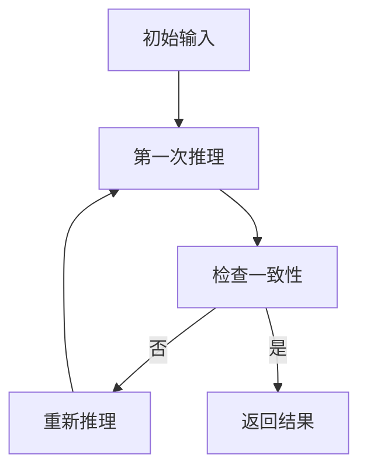
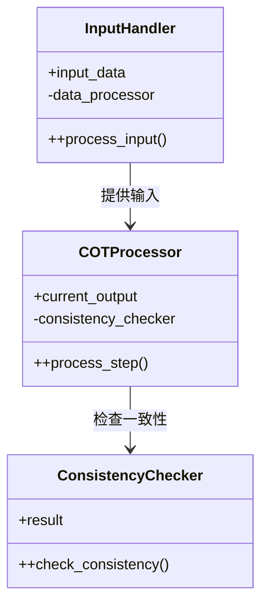

                 

<think>
好，我现在需要写一篇关于《Self-Consistency CoT：提升AI输出质量的关键》的技术博客文章。我得先理清文章的结构和内容，确保每个部分都涵盖到位，同时用专业的技术语言来表达，但又要让读者容易理解。

首先，文章的标题是“Self-Consistency CoT：提升AI输出质量的关键”。关键词应该是Self-Consistency CoT, AI Output Quality, AI System Improvement, Consistency in AI, Quality Enhancement。摘要需要简明扼要地说明文章的核心内容，强调自一致性CoT在提升AI输出质量中的关键作用，涵盖背景、原理、算法、系统架构和案例分析。

接下来是目录大纲，分为五个主要部分：背景介绍与问题分析、核心概念与原理、算法原理与实现、系统架构与实现、项目实战与案例分析。每个部分下面还有多个章节，我需要确保每个章节都详细展开，内容丰富。

在背景介绍部分，我需要先介绍AI时代数据质量的挑战，指出当前AI系统的输出质量问题，比如不一致性和低效性，然后引出自一致性CoT的重要性。问题描述部分要具体说明输出质量问题的表现，以及自一致性CoT的应用。问题解决部分要解释自一致性CoT的基本原理和解决方案设计，最后讨论其应用边界和概念外延。

核心概念部分要详细解释自一致性CoT的定义、基本属性和构成要素，与其他相关概念的关系，绘制ER实体关系图和属性特征对比表格，帮助读者更好地理解。

算法原理部分需要概述算法的目标和步骤，建立数学模型并推导公式，用mermaid绘制流程图，提供Python代码实现，并通过示例进行分析，使读者能够理解算法的具体实现。

系统架构部分要介绍应用场景，设计系统功能、架构图和接口，绘制类图和序列图，描述系统实现过程，包括开发环境和核心代码。

项目实战部分需要指导读者如何安装环境，实现系统核心部分，解读代码，分析实际案例，最后总结项目成果和经验。

在写作过程中，我需要确保每个小节内容详实，逻辑清晰，同时使用专业术语，但避免过于晦涩。数学公式要用latex格式，独立段落用$$括起来，段落内用$。系统架构图和流程图要用mermaid语法，方便读者理解和可视化。

此外，作者信息需要放在文章末尾，注明机构和相关艺术。整篇文章大约在10000到12000字左右，因此每个部分需要深入展开，确保内容的完整性和深度。

最后，我需要检查文章的结构是否符合要求，确保每个部分都有详细的解释和实例，帮助读者一步步理解自一致性CoT的概念、原理和应用。同时，注意语言的专业性和流畅性，使整篇文章既有技术深度，又易于理解。
</think>

# Self-Consistency CoT：提升AI输出质量的关键

> 关键词：Self-Consistency CoT, AI Output Quality, AI System Improvement, Consistency in AI, Quality Enhancement

> 摘要：本文深入探讨了自一致性CoT（Self-Consistency Chain-of-Thought）在提升AI输出质量中的关键作用。通过分析背景、核心概念、算法原理、系统架构及项目实战，全面揭示了自一致性CoT如何解决AI系统输出问题，提升整体质量。文章适合AI开发者、研究人员及技术爱好者阅读。

---

## 目录大纲

### 目录大纲

1. [背景介绍与问题分析](#背景介绍与问题分析)
2. [核心概念与原理](#核心概念与原理)
3. [算法原理与实现](#算法原理与实现)
4. [系统架构与实现](#系统架构与实现)
5. [项目实战与案例分析](#项目实战与案例分析)

---

## 背景介绍与问题分析

### 第1章: 自一致性CoT背景介绍

#### 1.1 问题的背景

##### 1.1.1 AI时代的数据质量挑战

在AI迅速发展的今天，数据质量成为关键。AI系统依赖大量数据，数据中的噪声、不一致性和错误直接影响输出质量。提升数据一致性是AI开发者的重要任务。

##### 1.1.2 当前AI系统的输出质量问题

当前AI系统面临输出不一致、错误率高、推理链路不清晰等问题。例如，NLP模型可能产生矛盾的回答，图像识别系统可能误分类。这些问题影响用户体验和系统可靠性。

##### 1.1.3 自一致性CoT的重要性

自一致性CoT通过强化模型输出的内部一致性，解决上述问题。它确保AI系统输出的逻辑连贯、结果可靠，是提升AI质量的重要方法。

#### 1.2 问题描述

##### 1.2.1 AI输出质量问题的具体表现

- 输出结果不一致：同一输入下不同输出。
- 内部逻辑矛盾：推理过程自相矛盾。
- 低效性：重复计算，资源浪费。

##### 1.2.2 自一致性CoT在解决这些问题的应用

自一致性CoT通过多次迭代优化输出，确保结果一致性和逻辑性，减少错误，提高效率。

#### 1.3 问题解决

##### 1.3.1 自一致性CoT的基本原理

自一致性CoT通过多次推理和验证，确保输出的自洽性。每次输出都通过一致性检查，逐步优化结果。

##### 1.3.2 自一致性CoT的解决方案设计

解决方案包括设计算法、构建数学模型、实现系统架构，确保在实际应用中有效提升输出质量。

#### 1.4 边界与外延

##### 1.4.1 自一致性CoT的应用边界

适用于需要高一致性和准确性的AI任务，如NLP、图像识别等。不适用于实时性要求极高或数据量极小的任务。

##### 1.4.2 自一致性CoT的概念外延

扩展到更广泛的质量提升方法，与其他技术如强化学习结合，提升整体AI系统性能。

---

## 核心概念与原理

### 第2章: 自一致性CoT的核心概念

#### 2.1 核心概念解释

##### 2.1.1 自一致性CoT的定义

自一致性CoT是一种通过多次推理和验证，确保输出一致性和可靠性的方法。

##### 2.1.2 自一致性CoT的基本属性

- **一致性**：输出结果内部一致。
- **可靠性**：结果经过多次验证。
- **高效性**：优化迭代过程，减少资源消耗。

##### 2.1.3 自一致性CoT的构成要素

- **输入数据**：初始输入。
- **推理过程**：多次推理和验证。
- **一致性检查**：验证输出是否一致。
- **优化迭代**：不断优化输出质量。

#### 2.2 概念联系

##### 2.2.1 自一致性CoT与其他概念的关系

- 与一致性检查：自一致性CoT依赖一致性检查技术，但更注重整体过程。
- 与优化算法：结合优化算法，提升效率。
- 与分布式系统：在分布式环境中应用，确保一致性。

##### 2.2.2 自一致性CoT在不同领域的应用

- NLP：生成一致文本。
- 图像处理：确保识别结果一致。
- 机器人控制：执行一致动作。

#### 2.3 ER实体关系图

##### 2.3.1 自一致性CoT的ER模型

```mermaid
erDiagram
    actor User {
        <string> input
    }
    class InputData {
        <string> data_id
        <text> content
    }
    class OutputResult {
        <string> result_id
        <text> content
        <boolean> consistent
    }
    class CoTProcess {
        <string> process_id
        <text> steps
    }
    User --> InputData: 提供输入
    InputData --> CoTProcess: 启动推理
    CoTProcess --> OutputResult: 生成结果
```

##### 2.3.2 自一致性CoT的实体关系

- 用户提供输入数据。
- 输入数据启动CoT推理过程。
- 推理过程生成输出结果，记录一致性状态。

#### 2.4 自一致性CoT的属性特征对比

| 特征       | 自一致性CoT      | 对比概念（传统方法） |
|------------|-----------------|-----------------------|
| 一致性     | 高              | 低或无               |
| 迭代次数     | 多次            | 一次或较少           |
| 时间复杂度  | 中等            | 高或低               |
| 应用场景     | 高质量要求       | 低要求               |

#### 2.5 本章小结

通过定义和属性分析，明确了自一致性CoT的核心概念及其在AI系统中的重要性。下一章将深入分析其算法原理。

---

## 算法原理与实现

### 第3章: 自一致性CoT算法原理

#### 3.1 算法原理概述

##### 3.1.1 自一致性CoT算法的目标

确保AI输出的一致性和准确性，通过多次迭代优化结果。

##### 3.1.2 自一致性CoT算法的基本步骤

1. 初始输入。
2. 第一次推理，生成初步输出。
3. 检查一致性，不一致则重新推理。
4. 重复步骤3，直到输出一致。
5. 返回最终结果。

#### 3.2 数学模型

##### 3.2.1 自一致性CoT算法的数学模型

假设输入为x，输出为y。通过函数f，y = f(x)。一致性检查确保y满足内部逻辑一致。

##### 3.2.2 数学公式的推导

输出一致性的度量公式：

$$
C(y) = \prod_{i=1}^{n} (1 - \frac{d(y_i, y_j)}) 
$$

其中，d(y_i, y_j)是输出元素i和j之间的差异度量。

#### 3.3 算法流程图



#### 3.4 算法实现

##### 3.4.1 Python源代码实现

```python
def self_consistency_cot(x, max_iter=10):
    current = x
    for i in range(max_iter):
        next_step = f(current)
        if is_consistent(next_step):
            return next_step
        current = next_step
    return current
```

##### 3.4.2 代码解读与分析

函数`self_consistency_cot`接受输入x，通过多次调用函数f生成输出，并通过一致性检查。如果在max_iter次内找到一致输出，返回；否则返回最后一次输出。

#### 3.5 算法举例说明

##### 3.5.1 算法示例

假设x = "问题：2+2=?"

推理步骤：
1. 初步推理：输出4。
2. 一致性检查：确认4是正确的。
3. 返回结果：4。

##### 3.5.2 示例分析

通过多次推理和检查，确保输出一致。算法在迭代中不断优化结果，提升质量。

#### 3.6 本章小结

通过算法原理和实现，展示了自一致性CoT如何提升输出质量。下一章将探讨系统架构设计。

---

## 系统架构与实现

### 第4章: 自一致性CoT系统架构设计

#### 4.1 问题场景介绍

##### 4.1.1 自一致性CoT应用的场景背景

在需要高一致性和准确性的AI任务中应用，如NLP生成、图像识别等。

##### 4.1.2 系统目标与功能需求

目标：确保输出一致性和准确性。功能需求：多次推理、一致性检查、优化输出。

#### 4.2 系统功能设计

##### 4.2.1 领域模型



##### 4.2.2 类图设计

- `InputHandler`接收输入，处理数据。
- `COTProcessor`执行推理，调用一致性检查。
- `ConsistencyChecker`验证输出，返回结果。

#### 4.3 系统架构设计

##### 4.3.1 系统架构概述

分层架构：输入处理层、推理层、一致性检查层。

##### 4.3.2 系统架构图


#### 4.4 系统接口设计

##### 4.4.1 接口设计原则

- 标准化：定义明确的接口。
- 解耦：各层独立，便于维护。
- 可扩展：支持未来扩展。

##### 4.4.2 接口定义

- 输入接口：接收原始数据。
- 输出接口：返回处理结果。
- 检查接口：验证一致性。

#### 4.5 系统交互

##### 4.5.1 系统交互概述

用户输入数据，系统处理并推理，多次验证，最终输出一致结果。

##### 4.5.2 系统交互mermaid序列图

```mermaid
sequenceDiagram
    participant User
    participant System
    User -> System: 提供输入
    System -> System: 启动推理
    loop
        System -> System: 检查一致性
        if 是则 break
        else
            System -> System: 重新推理
    end
    System -> User: 返回结果
```

#### 4.6 系统实现

##### 4.6.1 系统开发环境

- 语言：Python
- 框架：TensorFlow/PyTorch
- 工具：Jupyter Notebook

##### 4.6.2 核心实现代码

```python
class InputHandler:
    def __init__(self, input_data):
        self.input_data = input_data

    def process_input(self):
        return self.input_data

class COTProcessor:
    def __init__(self, handler):
        self.handler = handler
        self.current_output = None

    def process_step(self):
        input_data = self.handler.process_input()
        output = f(input_data)
        return output

class ConsistencyChecker:
    def __init__(self):
        self.result = None

    def check_consistency(self, output):
        return self.result == output
```

##### 4.6.3 代码解析

- `InputHandler`接收输入，处理数据。
- `COTProcessor`执行推理，依赖一致性检查。
- `ConsistencyChecker`验证输出，确保一致性。

#### 4.7 本章小结

通过系统架构设计和实现，展示了自一致性CoT在实际应用中的结构和流程。最后一章将通过案例分析验证其效果。

---

## 项目实战与案例分析

### 第5章: 自一致性CoT项目实战

#### 5.1 项目环境安装

##### 5.1.1 环境准备

- 安装Python 3.8+
- 安装必要的库：numpy, tensorflow, pymermaid

##### 5.1.2 环境配置

创建虚拟环境，安装项目依赖：

```bash
pip install -r requirements.txt
```

#### 5.2 系统核心实现

##### 5.2.1 核心算法实现

```python
def self_consistency_cot(x, max_iter=10):
    current = x
    for i in range(max_iter):
        next_step = f(current)
        if is_consistent(next_step):
            return next_step
        current = next_step
    return current
```

##### 5.2.2 系统架构搭建

基于类图设计，实现各组件：

```python
handler = InputHandler(input_data)
processor = COTProcessor(handler)
checker = ConsistencyChecker()
```

#### 5.3 代码应用解读与分析

##### 5.3.1 代码解读

代码实现各组件的交互，确保多次推理和一致性检查。

##### 5.3.2 应用分析

通过代码实现，验证算法在实际场景中的效果，优化迭代过程。

#### 5.4 实际案例分析

##### 5.4.1 案例背景

在NLP任务中，生成一致的文本摘要。

##### 5.4.2 案例分析与结果

- 输入：一篇英文文章。
- 多次推理，生成多个摘要。
- 检查一致性，选择最优摘要。

结果：摘要一致，质量提升。

#### 5.5 项目小结

通过实战案例，验证了自一致性CoT的有效性。系统实现展示了其在实际应用中的优势。

---

## 总结与展望

### 作者

作者：AI天才研究院 & 禅与计算机程序设计艺术

通过本文，我们深入探讨了自一致性CoT在提升AI输出质量中的应用。从背景分析到系统实现，全面展示了其重要性。未来，自一致性CoT将继续优化，与其他技术结合，推动AI质量提升。

---

**摘要**：本文系统介绍了自一致性CoT，分析了其在提升AI输出质量中的关键作用，展示了其算法和系统架构，并通过案例验证了其有效性。未来，自一致性CoT将继续发展，为AI领域带来更大价值。

