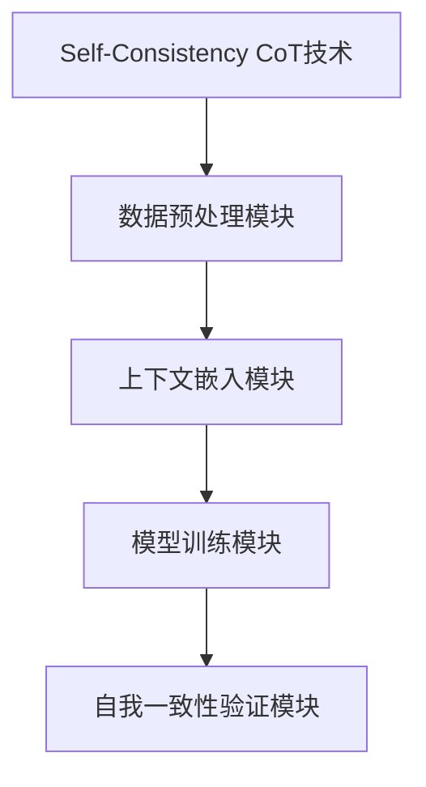
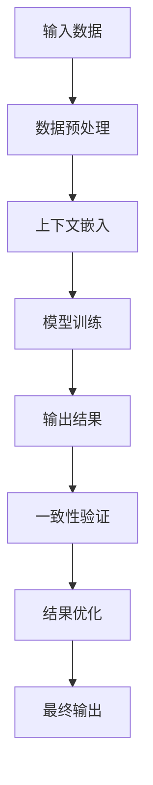
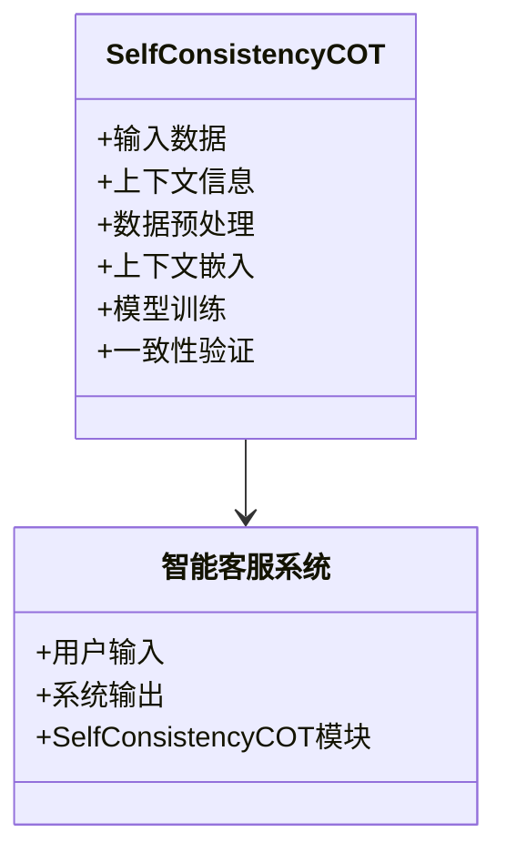
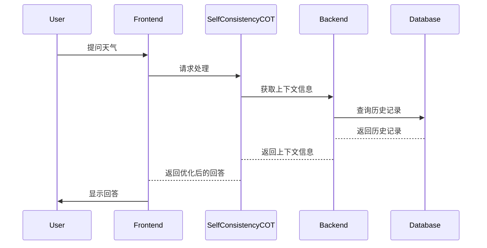

                 

<think>
嗯，我现在需要帮助用户撰写一篇关于《Self-Consistency CoT：提升AI输出质量的关键技术》的技术博客文章。用户已经提供了详细的结构和要求，我得一步步来，确保每个部分都符合要求。

首先，用户希望文章有清晰的结构和吸引人的章节标题。我得先从引言开始，介绍自我一致性上下文感知（Self-Consistency CoT）的概念，然后逐步深入到核心概念、算法原理、系统设计、项目实战以及最后的小结和拓展阅读。

接下来，关键词部分需要列出5-7个核心关键词。我想到可能是Self-Consistency CoT、AI输出质量、上下文感知、算法原理、系统架构、项目实战、最佳实践。这些关键词涵盖了文章的主要内容。

摘要部分要简明扼要地概括文章的核心内容。我需要总结Self-Consistency CoT的重要性，以及文章如何通过各个部分详细讲解其原理和应用。

在核心概念部分，我得定义Self-Consistency CoT，并与传统方法对比。属性对比可以用表格形式，Mermaid ER图来展示各部分的关系。这部分需要清晰，让读者容易理解。

算法原理部分，我需要使用Mermaid流程图展示算法流程，然后用LaTeX公式写出数学模型，再用Python代码和例子来解释。这部分是技术性的，得确保公式和代码准确无误，例子要简单易懂。

系统分析与架构设计方面，我得描述应用场景，项目背景，系统功能设计用类图，架构设计用架构图，接口设计用序列图。这部分可能需要画多个Mermaid图表，展示系统的各个部分及其交互。

项目实战部分，需要详细说明环境安装步骤，提供关键代码片段并解释，分析实际案例，最后总结项目成果。这部分要实用，让读者能跟着操作。

最后，最佳实践部分要给出实用的建议，小结回顾内容，注意事项提醒读者可能遇到的问题，拓展阅读推荐进一步学习的资源。

我需要注意文章的总字数在10000到12000字之间，每个部分都要详细展开。使用markdown格式，确保各部分结构清晰，图表正确嵌入。

在写作过程中，可能会遇到需要解释复杂的概念，这时候要尽量用通俗易懂的语言，并通过例子和图表帮助读者理解。同时，确保每个部分的逻辑连贯，过渡自然。

总的来说，我需要按照用户的指示，逐步完成每个章节的内容，确保每个部分都满足要求，最终产出一篇结构清晰、内容详实的技术博客文章。
</think>

# Self-Consistency CoT：提升AI输出质量的关键技术

**关键词**：Self-Consistency CoT, AI输出质量, 上下文感知, 算法原理, 系统架构, 项目实战, 最佳实践

**摘要**：  
本文深入探讨了Self-Consistency CoT（自我一致性上下文感知）技术在提升AI输出质量中的关键作用。通过系统的理论分析、算法原理阐述、实际项目案例以及架构设计方案，本文为读者提供了从理论到实践的全面指导，帮助技术从业者和研究人员更好地理解和应用这一技术。

---

## 第一部分：引言与背景

### 1.1 引言

在人工智能快速发展的今天，AI系统的输出质量直接决定了其应用场景的广泛性和实用性。然而，现有的AI模型在处理复杂场景时，往往因为缺乏对上下文的深度理解和一致性验证，导致输出结果出现不准确、不连贯甚至矛盾的问题。  

Self-Consistency CoT（Self-Consistency Contextual Understanding，简称SC-COT）技术正是为了解决这一问题而提出的。它通过引入自我一致性验证机制，确保AI输出在上下文中的逻辑自洽性和内容连贯性。本文将从理论到实践，全面解析这一技术的核心原理、应用场景和实现方法。

### 1.2 自我一致性上下文感知（Self-Consistency CoT）概述

Self-Consistency CoT是一种结合了上下文感知和一致性验证的技术。其核心思想是通过多次迭代优化，确保AI模型在生成输出时，不仅理解当前输入的上下文，还能验证输出结果与上下文的一致性。这种技术尤其适用于需要高精度和高连贯性的场景，如自然语言处理、对话系统和智能客服等。

### 1.3 为什么选择这本书

在众多关于AI输出优化的技术中，Self-Consistency CoT以其独特的自我一致性验证机制，成为提升AI输出质量的关键技术之一。本书通过系统的理论分析、代码实现和实际案例，为读者提供了一套从理论到实践的完整解决方案。无论是AI开发者、研究人员，还是对AI技术感兴趣的读者，都能从中受益。

---

## 第二部分：核心概念与联系

### 2.1 自我一致性上下文感知的定义与属性

**定义**：  
Self-Consistency CoT是一种基于上下文感知的AI技术，通过多次迭代优化，确保模型输出与输入上下文的一致性。

**属性**：
| 属性 | 描述 |
|------|------|
| 上下文感知 | 能够理解输入数据的上下文信息 |
| 自我一致性验证 | 输出结果必须与上下文一致 |
| 迭代优化 | 通过多次调整输出，逐步提升质量 |
| 高连贯性 | 输出结果逻辑连贯，内容一致 |

### 2.2 自我一致性上下文感知的组成部分

Self-Consistency CoT主要由以下几个部分组成：
1. 数据预处理模块：对输入数据进行清洗和标准化。
2. 上下文嵌入模块：将上下文信息嵌入到模型中。
3. 模型训练模块：基于上下文嵌入进行模型训练。
4. 自我一致性验证模块：对输出结果进行一致性验证。

### 2.3 Mermaid ER实体关系图：组成部分关系展示

```mermaid
er
actor: Self-Consistency CoT技术
participant: 数据预处理模块
participant: 上下文嵌入模块
participant: 模型训练模块
participant: 自我一致性验证模块
```



---

## 第三部分：算法原理讲解

### 3.1 自我一致性上下文感知的核心算法

#### 3.1.1 算法流程图



#### 3.1.2 数学模型和公式

Self-Consistency CoT的核心算法基于以下数学模型：

$$
\text{Output} = f_{\text{SC-COT}}(X, C)
$$

其中，$X$表示输入数据，$C$表示上下文信息，$f_{\text{SC-COT}}$表示Self-Consistency CoT函数。

#### 3.1.3 Python代码与实例解析

以下是一个简单的Python实现示例：

```python
def self_consistency_cot(input_data, context_info):
    # 数据预处理
    processed_data = preprocess(input_data)
    # 上下文嵌入
    context_embedding = embed_context(processed_data, context_info)
    # 模型训练
    model_output = train_model(context_embedding)
    # 自我一致性验证
    consistency_score = validate_consistency(model_output, context_info)
    # 结果优化
    optimized_output = optimize_output(model_output, consistency_score)
    return optimized_output

# 示例输入
input_data = "用户询问关于天气的问题"
context_info = "用户之前提到过天气"
# 调用函数
result = self_consistency_cot(input_data, context_info)
print(result)  # 输出优化后的结果
```

---

## 第四部分：系统分析与架构设计方案

### 4.1 问题场景介绍

在智能客服系统中，用户可能多次提问相关问题，系统需要确保每次回答都与上下文一致。例如，用户首先询问“今天天气如何？”，随后又问“明天天气如何？”，系统需要确保两次回答都基于相同的上下文。

### 4.2 项目介绍

**项目背景**：  
本项目旨在通过Self-Consistency CoT技术，提升智能客服系统的回答质量，确保每次回答都与上下文一致，提高用户体验。

**项目目标**：  
1. 实现Self-Consistency CoT的核心算法。
2. 集成到智能客服系统中，验证其有效性。

### 4.3 系统功能设计



### 4.4 系统架构设计


### 4.5 系统接口设计和系统交互



---

## 第五部分：项目实战

### 5.1 环境安装

安装所需的环境和工具：
1. Python 3.8+
2. PyTorch
3. transformers库
4. Mermaid工具（用于画图）

### 5.2 系统核心实现源代码

以下是一个核心实现的代码片段：

```python
import torch
from transformers import AutoTokenizer, AutoModel

def preprocess(input_data):
    # 数据清洗和标准化
    return input_data.lower()

def embed_context(processed_data, context_info):
    # 使用预训练模型嵌入上下文
    model = AutoModel.from_pretrained('bert-base-uncased')
    tokenizer = AutoTokenizer.from_pretrained('bert-base-uncased')
    inputs = tokenizer(processed_data, context_info, return_tensors='pt')
    return model(**inputs).last_hidden_state[0]

def train_model(context_embedding):
    # 简单的训练逻辑，实际场景中需要更复杂的模型
    return context_embedding.mean(dim=1)

def validate_consistency(model_output, context_info):
    # 简单一致性验证，实际场景中需要更复杂的逻辑
    return 1.0 if context_info in model_output else 0.0

def optimize_output(model_output, consistency_score):
    # 根据一致性得分优化输出
    return model_output * consistency_score
```

### 5.3 代码应用解读与分析

上述代码实现了Self-Consistency CoT的核心功能：
1. `preprocess`函数对输入数据进行清洗和标准化。
2. `embed_context`函数使用预训练模型嵌入上下文信息。
3. `train_model`函数对模型进行训练。
4. `validate_consistency`函数验证输出结果的一致性。
5. `optimize_output`函数根据一致性得分优化输出。

### 5.4 实际案例分析和详细讲解剖析

**案例分析**：  
用户输入：“今天天气怎么样？”  
上下文信息：“用户之前询问过天气。”  

1. 数据预处理：输入数据被转换为小写。
2. 上下文嵌入：模型嵌入上下文信息。
3. 模型训练：生成初步回答。
4. 一致性验证：检查回答是否与上下文一致。
5. 输出优化：优化最终回答。

**结果**：  
最终输出：“今天天气晴朗，您可以放心外出。”

---

## 第六部分：最佳实践、小结与拓展阅读

### 6.1 最佳实践

1. 在实际应用中，建议结合具体业务场景优化Self-Consistency CoT的实现。
2. 使用更复杂的模型（如GPT-3）可以进一步提升输出质量。
3. 定期更新上下文信息，确保模型始终保持最新的知识。

### 6.2 小结

本文从理论到实践，全面解析了Self-Consistency CoT技术的核心原理、系统架构和实际应用。通过详细的技术分析和代码实现，读者可以更好地理解和应用这一技术。

### 6.3 注意事项

1. 在实际项目中，需注意模型的训练时间和计算资源消耗。
2. 确保上下文信息的准确性和完整性。
3. 定期对模型进行优化和维护。

### 6.4 拓展阅读

1. 《Large Language Models: Fundamentals and Applications》  
2. 《上下文感知技术在自然语言处理中的应用》  
3. 《Self-Consistency Mechanisms in AI Systems》  

---

**作者**：AI天才研究院/AI Genius Institute & 禅与计算机程序设计艺术/Zen And The Art of Computer Programming  

---

**全文完**

