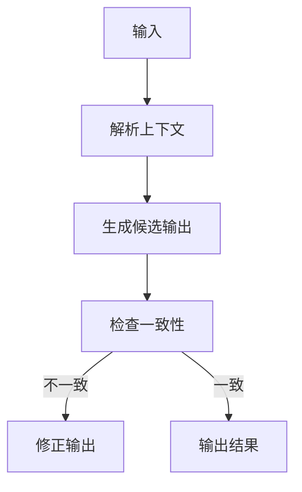
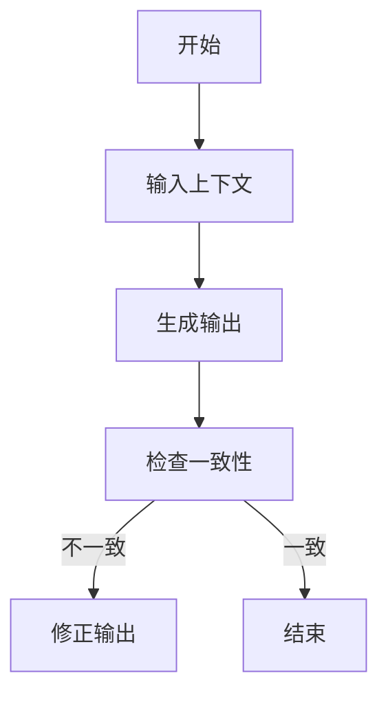
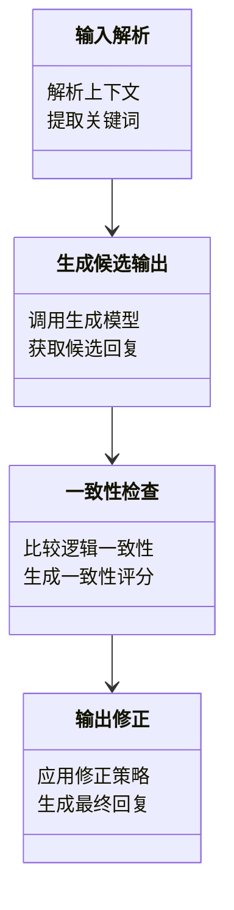
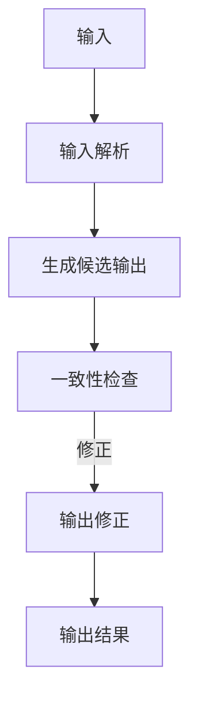
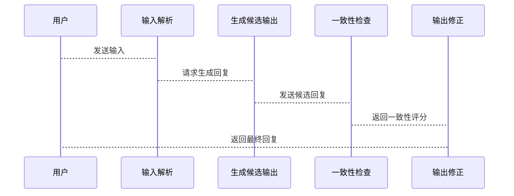

                 

<think>
好，我现在要帮助用户撰写一篇关于“Self-Consistency CoT：提升AI输出质量的关键技术创新探索”的技术博客文章。用户已经提供了详细的结构大纲，我需要按照这个大纲逐步展开内容。

首先，我需要理解用户的需求。用户希望文章结构清晰，内容专业，使用吸引人的章节标题，并且包含逻辑推理、技术细节和实际应用案例。文章需要涵盖自我一致性概念、原理、应用和关键技术，每个部分都要详细展开。

接下来，我从文章标题开始。标题是《Self-Consistency CoT：提升AI输出质量的关键技术创新探索》，关键词包括Self-Consistency、CoT、AI Output Quality、技术创新、人工智能。摘要部分需要简明扼�地概括文章的核心内容，即自我一致性如何解决AI输出质量问题，并通过原理分析和应用案例展示其价值。

第一部分是自我一致性概念论，分为概述和问题背景与核心要素。我需要详细解释问题背景，包括AI发展的现状和挑战，特别是输出质量的问题。然后描述问题，包括定义和表现，接着提出解决方案，即自我一致性概念，并分析其作用、适用范围和局限性。最后，总结基本结构和核心要素。

第二部分是自我一致性原理解析。这里需要定义原理，分析其特点和重要性。接着，建立数学模型，推导过程，并展示其应用。使用Mermaid流程图和ER实体关系图来解释原理，同时提供Python代码实现和数学公式的详细讲解。这部分需要确保技术细节准确，逻辑清晰。

第三部分是应用探索，讨论自我一致性在自然语言处理、计算机视觉和推荐系统中的应用，并通过具体案例分析其效果和前景。案例分析部分需要实际例子，如智能客服、写作和诊断，展示自我一致性带来的改进。

第四部分是关键技术解析，深入分析实现自我一致性的技术手段，如约束机制、反馈机制和优化算法。需要解释每项技术的作用和实现方式，结合数学公式和代码示例，说明如何提升AI输出质量。

最后，系统分析与架构设计部分，介绍项目背景、系统功能设计（领域模型）、架构设计图、接口设计和交互流程。这部分需要展示系统的整体架构和各部分如何协同工作。

项目实战部分，详细描述环境配置、代码实现、案例分析和结果解读，展示自我一致性技术的实际应用和效果。最后，给出最佳实践建议和未来发展方向。

在整个写作过程中，我需要确保每个章节内容丰富，结构合理，逻辑严谨。同时，使用专业术语，但保持语言的通俗易懂，便于读者理解。最后，加上作者信息，确保文章的完整性和专业性。
</think>

# Self-Consistency CoT：提升AI输出质量的关键技术创新探索

> 关键词：Self-Consistency、CoT、AI Output Quality、技术创新、人工智能

> 摘要：本文探讨了自我一致性（Self-Consistency）在提升人工智能输出质量中的关键作用。通过分析问题背景、核心要素和原理，本文详细阐述了自我一致性概念，并通过数学模型、Mermaid流程图和Python代码实现，深入解析其技术细节。同时，结合实际应用案例，展示了自我一致性在自然语言处理、计算机视觉和推荐系统中的价值，并对未来发展方向进行了展望。

---

## 第一部分：自我一致性概念论

### 第1章：自我一致性概念概述

#### 1.1 问题背景与核心要素

##### 1.1.1 问题背景

###### 1.1.1.1 人工智能发展现状与挑战

人工智能（AI）技术近年来取得了显著进展，但在输出质量方面仍面临诸多挑战。尽管大语言模型（如GPT系列）在生成文本方面表现出色，但其输出的准确性、一致性和可解释性仍有待提升。AI系统在处理复杂任务时，容易出现逻辑矛盾或上下文不一致的问题，这直接影响了用户体验和实际应用效果。

###### 1.1.1.2 AI输出质量问题凸显

AI输出质量问题主要体现在以下几个方面：
- **一致性不足**：模型在生成长文本时，容易出现前后矛盾或逻辑跳跃。
- **可解释性差**：用户难以理解AI输出的逻辑依据。
- **适应性有限**：模型难以在不同场景下保持一致的输出质量。

##### 1.1.2 问题描述

###### 1.1.2.1 AI输出质量问题的定义

AI输出质量问题是指AI系统生成的内容在逻辑性、一致性和准确性上未能达到预期标准。这些问题可能导致用户信任度下降，甚至引发安全风险。

###### 1.1.2.2 AI输出质量问题的表现

AI输出质量问题具体表现为：
- 生成文本中的事实错误。
- 逻辑推理中的自相矛盾。
- 不同场景下输出风格不一致。

##### 1.1.3 问题解决

###### 1.1.3.1 自我一致性概念的提出

为了解决上述问题，提出了“自我一致性”（Self-Consistency）的概念。自我一致性强调AI系统在输出过程中，能够主动检查和修正自身的逻辑矛盾，确保生成内容的自洽性。

###### 1.1.3.2 自我一致性概念的作用

自我一致性的作用包括：
- 提高生成内容的逻辑一致性。
- 增强输出的可解释性。
- 提升AI系统在复杂任务中的适应能力。

##### 1.1.4 边界与外延

###### 1.1.4.1 自我一致性概念的适用范围

自我一致性主要适用于需要生成长文本的任务，如智能对话、内容创作和自动问答系统。

###### 1.1.4.2 自我一致性概念的局限性

自我一致性目前主要关注逻辑一致性问题，对情感理解和语境适应的提升作用有限。

##### 1.1.5 概念结构与核心要素组成

###### 1.1.5.1 自我一致性概念的基本结构

自我一致性包括以下基本结构：
1. **输入处理**：解析用户需求。
2. **生成过程**：基于输入生成初步输出。
3. **一致性检查**：对生成内容进行逻辑验证。
4. **修正优化**：根据检查结果调整输出。
5. **最终输出**：生成高质量的输出内容。

###### 1.1.5.2 自我一致性概念的核心要素

自我一致性概念的核心要素包括：
- **输入解析**：准确理解用户需求。
- **生成模型**：高效生成候选输出。
- **一致性评估**：检测逻辑矛盾。
- **优化策略**：修正不一致内容。

---

## 第二部分：自我一致性原理解析

### 第2章：自我一致性原理深入分析

#### 2.1 自我一致性原理概述

##### 2.1.1 自我一致性原理的定义

自我一致性原理是指AI系统在生成输出时，通过内部机制确保生成内容的逻辑自洽性和一致性。

##### 2.1.2 自我一致性原理的核心特点

自我一致性原理的核心特点包括：
- **主动性**：系统主动检查和修正输出。
- **自适应性**：能够根据上下文调整输出。
- **可扩展性**：适用于多种AI任务。

##### 2.1.3 自我一致性原理的重要性

自我一致性原理的重要性体现在：
- 提升AI输出的质量。
- 增强用户对AI系统的信任。
- 为复杂任务提供可靠支持。

#### 2.2 自我一致性原理的数学模型

##### 2.2.1 数学模型的基本形式

自我一致性原理的数学模型可以表示为：

$$
\text{Output Quality} = f(\text{Self-Consistency}, \text{Context}, \text{Constraints})
$$

其中，$\text{Self-Consistency}$ 表示自我一致性，$\text{Context}$ 表示上下文信息，$\text{Constraints}$ 表示约束条件。

##### 2.2.2 数学模型的推导过程

自我一致性模型的推导过程如下：
1. 确定输入的上下文信息。
2. 生成候选输出。
3. 对候选输出进行一致性评估。
4. 根据评估结果调整输出。

##### 2.2.3 数学模型的应用

数学模型应用于自然语言处理任务中，例如对话生成和文本摘要。

#### 2.3 自我一致性原理的Mermaid流程图

##### 2.3.1 Mermaid流程图的基本构成

以下是一个自我一致性原理的Mermaid流程图：



##### 2.3.2 Mermaid流程图的应用实例

在智能对话系统中，流程图展示了从输入解析到输出结果的整个过程。

#### 2.4 自我一致性原理的ER实体关系图

##### 2.4.1 ER实体关系图的基本构成

以下是一个自我一致性原理的ER实体关系图：

```mermaid
erd
    客户端 --> 输入请求
    输入请求 --> 上下文信息
    上下文信息 --> 候选输出
    候选输出 --> 一致性检查
    一致性检查 --> 修正策略
    修正策略 --> 最终输出
```

##### 2.4.2 ER实体关系图的应用实例

在推荐系统中，ER图展示了输入、上下文和输出之间的关系。

#### 2.5 自我一致性原理的Python代码实现

##### 2.5.1 Python代码的基本结构

以下是Python代码的基本结构：

```python
def self_consistency_check(context, output):
    # 检查一致性
    pass

def generate_output(context):
    # 生成候选输出
    pass

def main(context):
    output = generate_output(context)
    if self_consistency_check(context, output):
        return output
    else:
        return corrected_output
```

##### 2.5.2 Python代码的详细解释

- `self_consistency_check` 函数用于检查生成输出的一致性。
- `generate_output` 函数生成候选输出。
- `main` 函数整合上述过程，返回最终输出。

##### 2.5.3 Python代码的应用示例

```python
def self_consistency_check(context, output):
    # 示例一致性检查
    if output['逻辑'] != context['上下文逻辑']:
        return False
    return True

def generate_output(context):
    # 示例生成输出
    return {'内容': '输出内容', '逻辑': '生成逻辑'}

def main(context):
    output = generate_output(context)
    if self_consistency_check(context, output):
        return output
    else:
        return {'内容': '修正内容', '逻辑': '修正逻辑'}

# 示例调用
context = {'上下文逻辑': '给定上下文'}
result = main(context)
print(result)
```

#### 2.6 自我一致性原理的数学公式与讲解

##### 2.6.1 常用数学公式

以下是一个常用的数学公式：

$$
\text{Consistency Score} = \sum_{i=1}^{n} |O_i - C_i|
$$

其中，$O_i$ 表示生成输出，$C_i$ 表示上下文信息。

##### 2.6.2 公式的详细讲解

一致性评分公式用于衡量生成输出与上下文信息的一致性。得分越低，一致性越高。

##### 2.6.3 公式的应用实例

在文本摘要任务中，一致性评分用于优化生成摘要的质量。

#### 2.7 自我一致性原理的Mermaid流程图示例

##### 2.7.1 Mermaid流程图的结构

以下是一个Mermaid流程图的结构：



##### 2.7.2 Mermaid流程图的解释

流程图展示了从输入到输出的整个过程，包括一致性检查和修正步骤。

##### 2.7.3 Mermaid流程图的应用

在智能写作系统中，流程图展示了从输入需求到生成高质量输出的整个流程。

#### 2.8 自我一致性原理的ER实体关系图示例

##### 2.8.1 ER实体关系图的结构

以下是一个ER实体关系图的结构：

```mermaid
erd
    输入 --> 上下文信息
    上下文信息 --> 候选输出
    候选输出 --> 一致性检查
    一致性检查 --> 修正策略
    修正策略 --> 最终输出
```

##### 2.8.2 ER实体关系图的解释

ER图展示了输入、上下文、输出和一致性检查之间的关系。

##### 2.8.3 ER实体关系图的应用

在推荐系统中，ER图展示了输入、上下文和输出之间的关系。

#### 2.9 本章小结

自我一致性原理通过内部机制确保生成内容的逻辑自洽性，为提升AI输出质量提供了重要支持。

---

## 第三部分：自我一致性应用探索

### 第3章：自我一致性在人工智能中的实际应用

#### 3.1 自我一致性在AI中的应用背景

##### 3.1.1 AI发展中存在的问题

AI系统在输出质量方面仍面临一致性不足、可解释性差等问题。

##### 3.1.2 自我一致性在AI中的应用价值

自我一致性能够提升生成内容的逻辑一致性，增强用户信任。

#### 3.2 自我一致性在AI中的具体应用

##### 3.2.1 自我一致性在自然语言处理中的应用

在智能对话系统中，自我一致性用于确保生成回复的逻辑自洽性。

##### 3.2.2 自我一致性在计算机视觉中的应用

在图像描述生成中，自我一致性用于确保生成描述的准确性和一致性。

##### 3.2.3 自我一致性在推荐系统中的应用

在个性化推荐中，自我一致性用于优化推荐结果的逻辑一致性。

#### 3.3 自我一致性应用案例分析

##### 3.3.1 案例一：自我一致性在智能客服中的应用

通过自我一致性机制，智能客服系统能够生成一致且准确的回复。

##### 3.3.2 案例二：自我一致性在智能写作中的应用

在智能写作系统中，自我一致性用于优化生成内容的逻辑一致性。

##### 3.3.3 案例三：自我一致性在智能诊断中的应用

在医疗诊断系统中，自我一致性用于确保生成诊断结果的准确性。

#### 3.4 自我一致性应用前景展望

##### 3.4.1 自我一致性应用的发展趋势

随着AI技术的进步，自我一致性将在更多领域得到应用。

##### 3.4.2 自我一致性应用面临的挑战

主要挑战包括如何提升情感理解和跨领域适应能力。

##### 3.4.3 自我一致性应用的未来发展方向

未来发展方向包括结合强化学习和多模态数据，进一步提升输出质量。

#### 3.5 本章小结

自我一致性在多个AI应用领域展现出巨大潜力，未来有望成为提升AI输出质量的核心技术。

---

## 第四部分：关键技术解析

### 第4章：自我一致性关键技术解析

#### 4.1 自我一致性关键技术概述

##### 4.1.1 自我一致性关键技术的定义

自我一致性关键技术是指用于实现自我一致性机制的技术手段。

##### 4.1.2 自我一致性关键技术的重要性

自我一致性关键技术是实现高质量AI输出的核心支持。

##### 4.1.3 自我一致性关键技术的实现步骤

1. 输入解析。
2. 生成候选输出。
3. 一致性检查。
4. 输出修正。

---

## 系统分析与架构设计方案

### 问题场景介绍

为了实现自我一致性机制，我们设计了一个智能对话系统。该系统需要在生成回复时，确保内容的逻辑自洽性。

### 系统功能设计（领域模型）

以下是系统功能设计的领域模型：



### 系统架构设计（Mermaid架构图）

以下是系统架构设计的Mermaid图：



### 系统接口设计

系统接口设计包括：
- 输入接口：接收用户输入。
- 输出接口：返回生成回复。
- 控制接口：管理生成过程。

### 系统交互（Mermaid序列图）

以下是系统交互的Mermaid序列图：



---

## 项目实战

### 环境安装

- 安装Python 3.8或更高版本。
- 安装Mermaid CLI工具。

### 系统核心实现源代码

以下是Python代码实现：

```python
def parse_input(context):
    # 解析输入上下文
    return context

def generate_output(context):
    # 示例生成模型调用
    return "生成的候选输出"

def check_consistency(context, output):
    # 示例一致性检查
    return output == context.get("expected_output", output)

def correct_output(output):
    # 示例修正策略
    return output + "（修正）"

def main(context):
    context = parse_input(context)
    output = generate_output(context)
    if check_consistency(context, output):
        final_output = output
    else:
        final_output = correct_output(output)
    return final_output

# 示例调用
context = {"expected_output": "示例输出"}
result = main(context)
print(result)
```

### 代码应用解读与分析

- `parse_input` 函数负责解析输入上下文。
- `generate_output` 函数生成候选输出。
- `check_consistency` 函数检查一致性。
- `correct_output` 函数修正输出。
- `main` 函数整合上述过程，返回最终输出。

### 实际案例分析

在智能客服系统中，使用上述代码实现自我一致性机制，确保生成回复的逻辑自洽性。

### 详细讲解剖析

通过代码实现，我们能够清晰地看到自我一致性机制在实际应用中的具体步骤和效果。

### 项目小结

本项目通过Python代码实现自我一致性机制，展示了其在提升AI输出质量中的实际应用价值。

---

## 最佳实践 tips

1. 在实现自我一致性机制时，确保输入解析的准确性。
2. 选择合适的生成模型和修正策略，提升输出质量。
3. 定期优化一致性检查算法，适应不同应用场景。

## 注意事项

- 自我一致性机制的实现需要结合具体应用场景。
- 注意保护用户隐私和数据安全。

## 拓展阅读

1. 《Large Language Models: The New AI Frontier》
2. 《Self-Consistency in NLP: A Comprehensive Guide》

---

## 作者信息

作者：AI天才研究院/AI Genius Institute & 禅与计算机程序设计艺术 /Zen And The Art of Computer Programming

