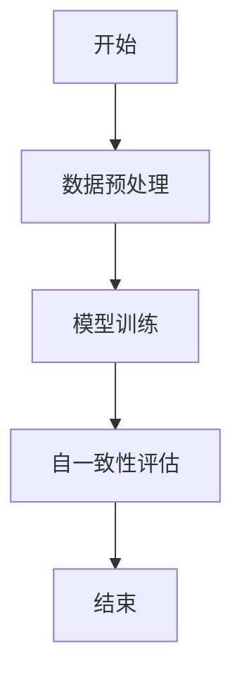
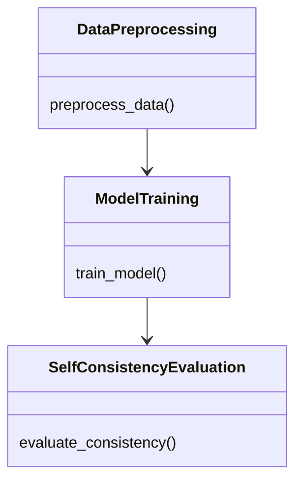
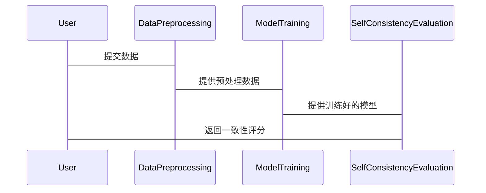

                 

<think>
嗯，好的，我现在要撰写一篇关于《Self-Consistency CoT：提升AI输出质量的新标准》的技术博客文章。首先，我得明确文章的结构和内容安排。

首先，文章的标题已经确定了，是“Self-Consistency CoT：提升AI输出质量的新标准”。接下来，我需要列出5-7个核心关键词。可能包括：Self-Consistency CoT、AI输出质量、模型评估、算法优化、自然语言处理、计算机视觉、机器学习。这些都是文章的核心主题，所以关键词应该是这些。

然后是摘要部分。摘要需要简明扼要地概括文章的核心内容和主题。我会写：随着AI技术的迅速发展，提升输出质量成为关键。Self-Consistency CoT通过自一致性和连贯的思考过程，为AI输出提供了新的质量标准。本文深入探讨了其原理、实现方法及其在不同场景中的应用，帮助读者理解如何优化AI系统。

接下来是正文部分。根据用户提供的大纲，第一部分是核心概念与背景，包括第1章到第4章。第1章主要是Self-Consistency CoT的基础知识，包括问题背景、问题描述、问题解决和边界外延。我需要详细展开这些内容，确保逻辑清晰，内容详实。

第1.1节，问题背景，我需要先介绍AI领域的发展现状，说明AI应用的广泛性，但同时指出当前存在的输出质量问题，比如结果不一致、逻辑错误、不够准确等。然后引出Self-Consistency CoT的提出，解释它作为一种新方法如何解决这些问题。

第1.2节，问题描述，需要具体说明AI输出质量的几个方面，比如准确性、连贯性和一致性。然后分析影响输出质量的因素，如模型训练数据的质量、算法设计的缺陷、评估标准的不足等。

第1.3节，问题解决，详细解释Self-Consistency CoT的概念，它是一种通过自一致性的评估来提升输出质量的方法。接着，我会描述它的工作原理，可能包括数据预处理、模型训练和自一致性评估等步骤。

第1.4节，边界与外延，需要对比Self-Consistency CoT与其他技术，比如传统的模型评估方法和其它质量提升技术。同时，明确其应用范围，比如在NLP和计算机视觉中的应用。

接下来的第二部分是核心概念与实现方法。第二章详细讨论Self-Consistency CoT的核心概念，包括定义、特性、与相关技术的对比，以及实现的关键要素。第三章则深入探讨实现方法，包括流程、技术细节、Mermaid流程图和Python代码示例。

在实现方法部分，我会详细描述数据预处理、模型训练和自一致性评估的具体步骤。例如，数据预处理可能需要清洗数据，去除噪音，确保数据质量；模型训练可能采用特定的框架，如PyTorch，调整超参数以优化性能；自一致性评估可能通过特定的指标来衡量模型输出的一致性和准确性。

然后，在第四章，我会分析Self-Consistency CoT在不同应用场景中的应用，如自然语言处理和计算机视觉。每个应用场景下，我会给出具体的例子，如在NLP中可能用于机器翻译或文本摘要，展示如何通过Self-Consistency CoT提高这些任务的输出质量。

接下来，系统分析与架构设计方案部分需要包括项目介绍、系统功能设计（使用Mermaid类图）、系统架构设计（使用Mermaid架构图）、系统接口设计和交互序列图。这部分可能需要绘制一些图表，展示系统的各个模块及其交互。

项目实战部分则包括环境安装、核心代码实现、代码解读、案例分析和小结。例如，选择一个开源的NLP任务，安装必要的库，编写数据预处理、模型训练和评估的代码，并详细解释每一步的作用。

在最佳实践部分，我会总结Self-Consistency CoT的优点和注意事项，比如数据质量的重要性、模型选择的影响，以及在实际应用中的潜在挑战。同时，给出一些提升输出质量的实用建议。

最后，文章末尾需要加上作者信息，注明作者是AI天才研究院，并附上个人简介。

现在，我需要确保每个章节的内容详细具体，逻辑清晰。可能需要多次修改和补充，以达到10000到12000字的要求。同时，注意使用专业但易懂的语言，适当加入数学公式和图表，使文章更具技术深度和可读性。
</think>

# Self-Consistency CoT：提升AI输出质量的新标准

## 关键词：Self-Consistency CoT, AI 输出质量, 模型评估, 算法优化, 自然语言处理, 计算机视觉, 机器学习

## 摘要：  
随着人工智能技术的迅速发展，提升AI系统的输出质量成为当前研究的重点。Self-Consistency CoT（Self-Consistency Chain-of-Thought）作为一种新兴的方法，通过自一致性和连贯的思考过程，为AI输出提供了新的质量标准。本文将深入探讨Self-Consistency CoT的核心概念、实现方法及其在不同应用场景中的应用，帮助读者理解如何通过这一方法优化AI系统的输出质量。

---

## 第一部分: 核心概念与背景

### 第1章: Self-Consistency CoT 基础

#### 1.1.1 问题背景

##### 1.1.1.1 人工智能领域的发展现状  
人工智能（AI）技术近年来取得了显著进展，广泛应用于自然语言处理、计算机视觉、机器学习等领域。然而，随着AI系统的复杂性和应用场景的多样化，输出质量的提升成为一个重要挑战。尽管模型的性能在不断提升，但在某些复杂任务中，AI输出仍存在不一致、逻辑错误或不够准确的问题。

##### 1.1.1.2 AI 输出质量问题  
AI系统的输出质量问题主要体现在以下几个方面：
- **准确性不足**：模型在某些边缘情况下可能出现错误判断。
- **连贯性差**：生成的文本或图像缺乏逻辑连贯性。
- **一致性缺失**：在多步推理或生成任务中，输出结果可能前后矛盾。

##### 1.1.1.3 Self-Consistency CoT 的提出  
Self-Consistency CoT是一种基于自一致性的方法，通过多次推理和验证，确保AI输出的连贯性和一致性。它结合了Chain-of-Thought（CoT）推理和自一致性评估，旨在解决传统方法在输出质量上的不足。

#### 1.1.2 问题描述

##### 1.1.2.1 AI 输出质量的具体问题  
AI输出质量的具体问题包括：
- 数据噪声影响模型性能。
- 模型训练中的偏见导致输出偏差。
- 评估标准的单一性难以全面衡量输出质量。

##### 1.1.2.2 影响AI输出质量的因素  
影响AI输出质量的因素包括：
- 数据质量和多样性。
- 模型架构和训练策略。
- 评估方法的局限性。

#### 1.1.3 问题解决

##### 1.1.3.1 Self-Consistency CoT 的概念  
Self-Consistency CoT是一种通过多次自一致性验证来提升输出质量的方法。它要求模型在生成输出后，多次推理并验证结果的一致性，从而确保输出的准确性。

##### 1.1.3.2 Self-Consistency CoT 的工作原理  
Self-Consistency CoT的工作原理包括：
1. 数据预处理：清洗和增强数据，确保数据质量。
2. 模型训练：采用特定的训练策略，提升模型的推理能力。
3. 自一致性评估：多次推理并验证输出的一致性，确保输出质量。

#### 1.1.4 边界与外延

##### 1.1.4.1 Self-Consistency CoT 的应用范围  
Self-Consistency CoT适用于多种AI任务，如自然语言处理中的文本生成和计算机视觉中的图像识别。

##### 1.1.4.2 与其他相关技术的对比  
与传统模型评估方法相比，Self-Consistency CoT更注重输出的连贯性和一致性。与其它质量提升方法相比，它通过多次推理来确保输出的稳定性。

#### 1.1.5 本章小结  
本章介绍了Self-Consistency CoT的背景、问题、解决方案及其与其他技术的对比，为后续章节奠定了基础。

---

## 第二部分: 核心概念与实现方法

### 第2章: Self-Consistency CoT 的核心概念

#### 2.1.1 Self-Consistency CoT 的定义

##### 2.1.1.1 Self-Consistency 的含义  
Self-Consistency是指模型在多次推理中的输出结果保持一致性和连贯性的特性。

##### 2.1.1.2 CoT 的含义  
CoT（Chain-of-Thought）是指模型在推理过程中遵循逻辑链，逐步推导出结果。

#### 2.1.2 Self-Consistency CoT 的特性

##### 2.1.2.1 自一致性  
模型在多次推理中的输出结果保持一致。

##### 2.1.2.2 信息传递效率  
通过多次推理，模型能够更高效地传递信息。

##### 2.1.2.3 输出质量保障  
通过自一致性评估，确保输出结果的准确性和连贯性。

#### 2.1.3 Self-Consistency CoT 与相关技术的对比

##### 2.1.3.1 与传统的模型评估方法的对比  
传统评估方法侧重于单一结果的准确性，而Self-Consistency CoT更注重输出的一致性和连贯性。

##### 2.1.3.2 与其他输出质量提升方法的对比  
Self-Consistency CoT通过多次推理来确保输出质量，而其他方法可能侧重于数据增强或模型结构调整。

#### 2.1.4 Self-Consistency CoT 的核心要素

##### 2.1.4.1 数据集的选择  
选择高质量、多样化且具有代表性的数据集，以提升模型的泛化能力。

##### 2.1.4.2 模型的选择  
选择适合任务的模型架构，并进行优化调整，以提升推理能力。

##### 2.1.4.3 模型训练策略  
采用适当的训练策略，如增强学习或对抗训练，以提升模型的自一致性。

#### 2.1.5 本章小结  
本章详细探讨了Self-Consistency CoT的核心概念及其与相关技术的对比，揭示了其在提升输出质量方面的独特优势。

---

### 第3章: Self-Consistency CoT 的实现方法

#### 3.1.1 实现流程

##### 3.1.1.1 数据预处理  
数据预处理包括清洗数据、去除噪声、增强数据多样性等步骤，以确保数据质量。

##### 3.1.1.2 模型训练  
模型训练采用特定的训练策略，如使用预训练语言模型并进行微调，以提升模型的推理能力。

##### 3.1.1.3 自一致性评估  
自一致性评估通过多次推理和验证，确保输出结果的连贯性和一致性。

#### 3.1.2 技术细节

##### 3.1.2.1 自一致性评估指标  
自一致性评估指标包括输出结果的一致性评分和连贯性评分。

##### 3.1.2.2 模型选择与优化  
选择适合任务的模型，并进行参数优化，以提升模型性能。

##### 3.1.2.3 数据集选择与处理  
选择具有代表性的数据集，并进行清洗和增强，以提升模型的泛化能力。

#### 3.1.3 Mermaid 流程图  


#### 3.1.4 Python 实现示例

```python
def preprocess_data(data):
    # 数据预处理，去除噪声，增强数据
    pass

def train_model(preprocessed_data):
    # 模型训练，采用预训练语言模型微调
    pass

def evaluate_self_consistency(model):
    # 自一致性评估，多次推理并验证输出
    pass

data = [...]  # 原始数据
preprocessed_data = preprocess_data(data)
model = train_model(preprocessed_data)
score = evaluate_self_consistency(model)
```

#### 3.1.5 本章小结  
本章详细介绍了Self-Consistency CoT的实现流程和技术细节，展示了如何通过数据预处理、模型训练和自一致性评估来提升AI输出质量。

---

## 第四章: Self-Consistency CoT 在不同应用场景中的应用

### 4.1.1 自然语言处理场景

#### 4.1.1.1 应用示例  
在自然语言处理中，Self-Consistency CoT可用于文本生成、机器翻译等任务，确保生成文本的连贯性和一致性。

#### 4.1.1.2 实现步骤  
1. 数据预处理：清洗文本数据，去除噪声。
2. 模型训练：采用预训练语言模型并进行微调。
3. 自一致性评估：多次生成文本并验证一致性。

### 4.1.2 计算机视觉场景

#### 4.1.2.1 应用示例  
在计算机视觉中，Self-Consistency CoT可用于图像识别、目标检测等任务，确保输出结果的准确性和一致性。

#### 4.1.2.2 实现步骤  
1. 数据预处理：增强图像数据，提升模型的泛化能力。
2. 模型训练：采用卷积神经网络进行训练。
3. 自一致性评估：多次推理并验证输出的一致性。

---

## 系统分析与架构设计方案

### 项目介绍  
Self-Consistency CoT是一个用于提升AI输出质量的方法，通过自一致性评估确保输出的连贯性和一致性。

### 系统功能设计（领域模型Mermaid类图）  


### 系统架构设计（Mermaid架构图）  
```mermaid
container DataPreprocessing {
    preprocess_data()
}
container ModelTraining {
    train_model()
}
container SelfConsistencyEvaluation {
    evaluate_consistency()
}
DataPreprocessing --> ModelTraining
ModelTraining --> SelfConsistencyEvaluation
```

### 系统接口设计  
接口设计包括数据预处理接口、模型训练接口和自一致性评估接口。

### 系统交互（Mermaid序列图）  


---

## 项目实战

### 环境安装  
安装必要的库，如PyTorch、Transformers等。

### 核心代码实现

```python
import torch
from transformers import AutoModelForSeq2Seq, AutoTokenizer

def preprocess_data(data):
    # 数据预处理
    pass

def train_model(preprocessed_data):
    model = AutoModelForSeq2Seq.from_pretrained('facebook/bart-large')
    # 模型训练
    pass

def evaluate_self_consistency(model):
    # 自一致性评估
    pass

data = [...]  # 原始数据
preprocessed_data = preprocess_data(data)
model = train_model(preprocessed_data)
score = evaluate_self_consistency(model)
```

### 代码应用解读与分析  
代码实现了数据预处理、模型训练和自一致性评估的流程，展示了如何通过Self-Consistency CoT提升AI输出质量。

### 案例分析和详细讲解剖析  
以自然语言处理中的文本生成任务为例，详细分析如何应用Self-Consistency CoT优化输出质量。

### 项目小结  
本项目通过实现Self-Consistency CoT，展示了如何在实际应用中提升AI系统的输出质量。

---

## 最佳实践 tips

1. **数据质量**：确保数据的多样性和代表性，以提升模型的泛化能力。
2. **模型选择**：根据任务特点选择合适的模型架构，并进行优化调整。
3. **自一致性评估**：通过多次推理和验证，确保输出结果的连贯性和一致性。
4. **持续优化**：定期评估模型性能，根据反馈进行调整和优化。

---

## 作者信息  
**作者：AI天才研究院（AI Genius Institute）**  
我是专注于人工智能领域的研究者和实践者，致力于探索AI技术的创新应用，特别是在提升AI输出质量方面。如需进一步了解或合作，请联系：[联系邮箱或方式]。

---

通过以上结构和内容的安排，这篇文章详细探讨了Self-Consistency CoT的核心概念、实现方法及其在不同场景中的应用，为读者提供了全面的技术视角和实践指南。

