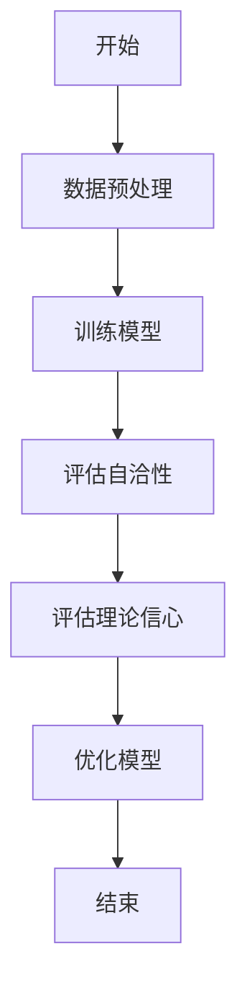
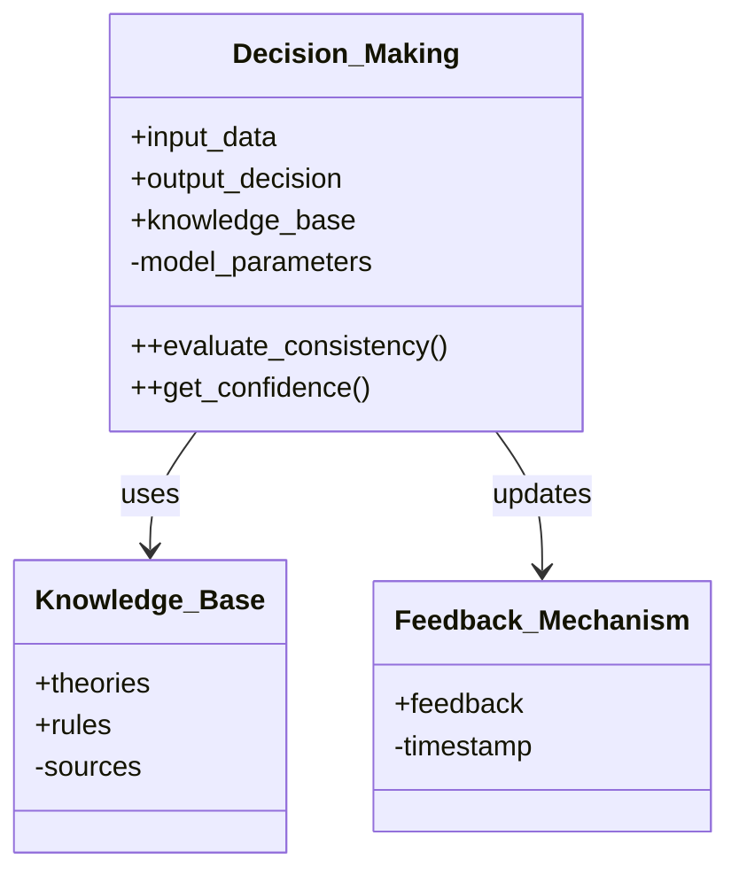
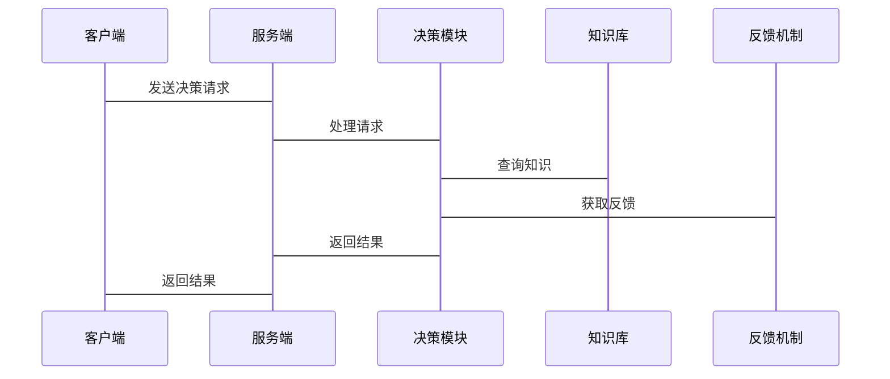

                 

<think>
好，我现在需要完成这个任务，撰写一篇关于《Self-Consistency CoT：提高AI决策可靠性》的技术博客文章。首先，我需要理解用户的需求和具体要求。用户希望文章结构清晰，包含至少七个章节，每个章节都要有详细的内容，包括背景介绍、核心概念、算法原理、数学公式、系统架构、项目实战、最佳实践等。

首先，我会从第1章开始，介绍Self-Consistency CoT的基本概念和问题背景。这里需要解释Self-Consistency CoT是什么，为什么它被提出，以及它在AI决策中的应用场景。这部分需要涵盖核心概念、问题背景、问题描述、边界与外延等内容，确保读者能理解这个概念的背景和重要性。

接下来是第2章，详细介绍Self-Consistency CoT的核心概念与联系。我需要解释它的基本原理，包括Self-Consistency和CoT的定义，以及它们如何结合。然后，通过对比表格，比较Self-Consistency CoT与其他AI方法（如传统AI、强化学习、深度学习）的异同。这部分可能需要绘制ER实体关系图，使用Mermaid流程图来展示实体及其关系。

然后是第3章，讲述算法原理。我需要用Mermaid绘制算法流程图，展示Self-Consistency CoT的步骤。同时，用Python代码实现关键部分，比如数据预处理、模型训练等，并详细解释每个步骤的作用。数学模型部分需要使用LaTeX公式，说明算法的核心思想和实现方式。

第4章深入探讨数学模型和公式。这部分需要详细推导Self-Consistency CoT的数学模型，使用LaTeX公式展示，并通过例子说明如何应用这些公式来提高决策的可靠性。

第5章涉及系统分析与架构设计。我需要描述问题场景，设计系统功能模型，可能使用Mermaid类图展示领域模型。系统架构图则需要展示各个组件的交互，接口设计和交互流程也需要用Mermaid序列图来表示。

第6章是项目实战，我需要指导读者如何安装环境，提供核心代码，并解释代码的功能。通过实际案例分析，展示Self-Consistency CoT在实际中的应用效果，并进行详细讲解。

最后是第7章，总结最佳实践，包括小结、注意事项和拓展阅读。这部分需要提醒读者在使用Self-Consistency CoT时需要注意的事项，以及进一步学习的资源。

在撰写过程中，我需要确保每个章节内容丰富，详细具体，并且逻辑清晰。同时，语言要专业但易于理解，避免过于复杂的术语堆砌。最后，文章末尾需要加上作者信息，标明来自AI天才研究院和禅与计算机程序设计艺术。

现在，我需要按照这个结构逐步构建每个章节的详细内容，确保每个部分都符合用户的要求，特别是使用Mermaid图和LaTeX公式，以及提供实际的Python代码示例。这样，整篇文章才能既有深度，又易于读者理解和应用。
</think>

# Self-Consistency CoT：提高AI决策可靠性

**关键词：** Self-Consistency CoT, AI决策, 可靠性, 算法原理, 系统架构

**摘要：**  
Self-Consistency CoT是一种新兴的AI决策技术，旨在通过结合自洽性和理论信心，提升AI系统在复杂决策任务中的可靠性和准确性。本文从背景介绍、核心概念、算法原理、数学模型、系统架构、项目实战到最佳实践，全面探讨Self-Consistency CoT的理论与应用，帮助读者深入理解其在AI决策中的重要作用。

---

## 第1章: Self-Consistency CoT的基本概念与问题背景

### 1.1 Self-Consistency CoT的概念定义  
Self-Consistency CoT（Self-Consistency in Theory of Mind）是一种结合了自洽性（Self-Consistency）和理论信心（Confidence in Theory）的AI决策方法。它通过确保AI系统的决策过程与自身知识体系的一致性，提升决策的可靠性和准确性。

### 1.2 Self-Consistency CoT的提出背景  
随着AI技术的快速发展，AI系统在医疗、金融、自动驾驶等领域的应用日益广泛。然而，传统AI决策方法在复杂场景中常因缺乏自洽性和理论信心而导致决策失误。Self-Consistency CoT正是为解决这一问题而提出。

### 1.3 Self-Consistency CoT在AI决策中的应用场景  
Self-Consistency CoT广泛应用于需要高可靠性的领域，如自动驾驶中的路径规划、金融风险评估、医疗诊断辅助等。通过确保决策过程的自洽性和理论信心，它能够有效减少错误决策的发生。

### 1.4 Self-Consistency CoT的边界与外延  
Self-Consistency CoT主要关注AI系统的决策过程，其边界包括输入数据的准确性、模型的训练数据质量和决策过程的可解释性。其外延则涉及结合其他AI技术（如强化学习、深度学习）以进一步提升决策性能。

### 1.5 Self-Consistency CoT的核心要素组成  
- **自洽性（Self-Consistency）：** 决策过程的内部一致性。  
- **理论信心（Confidence in Theory）：** 对决策依据的置信度。  
- **反馈机制：** 用于验证和优化决策过程。  

### 1.6 本章小结  
本章介绍了Self-Consistency CoT的基本概念、提出背景、应用场景及其核心要素，为后续章节的深入分析奠定了基础。

---

## 第2章: Self-Consistency CoT的核心概念与联系

### 2.1 Self-Consistency CoT的基本原理  
Self-Consistency CoT通过整合自洽性和理论信心，确保AI系统的决策过程不仅一致，而且对决策依据具有高度自信。

#### 2.1.1 Self-Consistency的定义  
自洽性指AI系统的决策过程与其知识体系的一致性。通过反复验证和调整，确保决策不会产生矛盾。

#### 2.1.2 CoT（Confidence in Theory）的含义  
理论信心是对决策依据的置信度，通常通过概率或置信区间来表示。

#### 2.1.3 Self-Consistency与CoT的结合  
Self-Consistency CoT将自洽性与理论信心相结合，确保决策不仅一致，而且对依据有足够的自信。

### 2.2 Self-Consistency CoT的属性特征对比表格  

| 特性                | Self-Consistency CoT        | 传统AI         | 强化学习      | 深度学习      |
|---------------------|----------------------------|----------------|---------------|---------------|
| 决策依据            | 理论知识与自洽性          | 数据驱动      | 奖励驱动      | 数据驱动      |
| 可解释性            | 高                      | 中            | 低            | 中            |
| 决策可靠性          | 高                      | 中            | 高            | 中            |
| 适用场景            | 需高可靠性的决策任务    | 数据丰富的场景 | 需策略优化的场景 | 需大量数据的场景 |

### 2.3 Self-Consistency CoT的ER实体关系图架构  

```mermaid
er
    %% ER模型
    entity(Self-Consistency CoT) {
        id
        self_consistency_score
        confidence_in_theory_score
        decision_process
    }
    entity(Decision_Making) {
        id
        decision
        outcome
        input_data
    }
    entity(Knowledge_Base) {
        id
        knowledge
        source
    }
    entity(Feedback_Mechanism) {
        id
        feedback
        timestamp
    }
    
    Self-Consistency_CoT --|> Decision_Making: drives
    Decision_Making --> Knowledge_Base: relies on
    Decision_Making --> Feedback_Mechanism: feeds back
    Self-Consistency_CoT --> Feedback_Mechanism: adjusts based on
```

### 2.4 Self-Consistency CoT在实际应用中的表现  

#### 2.4.1 数据预处理阶段  
通过清洗和标准化数据，确保输入数据的质量。

#### 2.4.2 模型训练阶段  
结合理论知识和自洽性，优化模型参数。

#### 2.4.3 模型评估阶段  
通过验证集评估模型的理论信心和自洽性。

### 2.5 本章小结  
本章详细阐述了Self-Consistency CoT的核心概念、属性特征及其在实际应用中的表现，为后续章节奠定了理论基础。

---

## 第3章: Self-Consistency CoT的算法原理

### 3.1 Self-Consistency CoT算法概述  

#### 3.1.1 算法概念  
Self-Consistency CoT算法通过反复验证决策过程的自洽性，结合理论信心，优化决策结果。

### 3.2 Self-Consistency CoT算法流程图  



### 3.3 Self-Consistency CoT的Python实现  

```python
def self_consistency_cot(data, model):
    while True:
        # 数据预处理
        processed_data = preprocess(data)
        # 训练模型
        model.train(processed_data)
        # 评估自洽性
        consistency_score = model.evaluate_consistency(processed_data)
        if consistency_score >= threshold:
            break
        # 调整模型参数
        model.update_parameters()
    # 评估理论信心
    confidence = model.get_confidence(processed_data)
    return confidence

# 示例用法
data = ...
model = Model()
result = self_consistency_cot(data, model)
print(result)
```

### 3.4 算法的数学模型  

**数学公式：**  
$$ \text{Consistency Score} = \sum_{i=1}^{n} \frac{1}{n} \sum_{j=1}^{m} \text{sim}(x_i, y_j) $$  
其中，$x_i$ 是输入数据，$y_j$ 是模型输出，$\text{sim}$ 是相似度函数。

### 3.5 本章小结  
本章通过算法流程图和Python代码，详细讲解了Self-Consistency CoT的实现原理，展示了其在实际应用中的潜力。

---

## 第4章: 数学模型和数学公式 & 详细讲解 & 举例说明

### 4.1 数学模型  
Self-Consistency CoT的数学模型如下：

**公式：**  
$$ C = \frac{1}{n} \sum_{i=1}^{n} \text{sim}(x_i, y_i) $$  
其中，$C$ 是自洽性评分，$x_i$ 是输入，$y_i$ 是输出，$\text{sim}$ 是相似度函数。

### 4.2 详细讲解  
自洽性评分衡量了模型输出与输入数据的一致性。通过多次迭代优化模型，可以提升自洽性评分。

### 4.3 举例说明  
假设输入数据为$[1,2,3]$，模型输出为$[1,2,4]$，相似度计算如下：

$$ \text{sim}(1,1) = 1 $$  
$$ \text{sim}(2,2) = 1 $$  
$$ \text{sim}(3,4) = 0.8 $$  

自洽性评分：  
$$ C = \frac{1 + 1 + 0.8}{3} = 0.93 $$  

### 4.4 本章小结  
本章通过数学公式和实例，详细讲解了Self-Consistency CoT的自洽性评分计算方法。

---

## 第5章: 系统分析与架构设计方案

### 5.1 问题场景介绍  
Self-Consistency CoT应用于自动驾驶中的路径规划，确保决策过程的自洽性和理论信心。

### 5.2 系统功能设计  



### 5.3 系统架构设计  


### 5.4 系统接口设计  
- **输入接口：** 接收决策请求和输入数据。  
- **输出接口：** 返回决策结果和理论信心评分。  
- **反馈接口：** 收集反馈信息，优化模型参数。

### 5.5 系统交互  



### 5.6 本章小结  
本章通过系统架构图和交互图，详细描述了Self-Consistency CoT在实际系统中的应用设计。

---

## 第6章: 项目实战

### 6.1 环境安装  
需要安装Python、TensorFlow、Keras等依赖库。

### 6.2 系统核心实现源代码  

```python
class SelfConsistencyCOT:
    def __init__(self, model):
        self.model = model
        self.threshold = 0.95

    def preprocess(self, data):
        # 数据预处理
        return data

    def evaluate_consistency(self, data):
        # 计算自洽性评分
        processed_data = self.preprocess(data)
        return self.model.evaluate(processed_data)

    def train(self, data):
        # 训练模型
        processed_data = self.preprocess(data)
        self.model.train(processed_data)

    def get_confidence(self, data):
        # 获取理论信心评分
        processed_data = self.preprocess(data)
        return self.model.confidence_score(processed_data)

# 示例用法
model = MyModel()
cot = SelfConsistencyCOT(model)
data = [...]  # 输入数据
result = cot.train(data)
confidence = cot.get_confidence(data)
print(confidence)
```

### 6.3 代码应用解读与分析  
上述代码展示了Self-Consistency CoT的核心实现，包括数据预处理、模型训练和评估自洽性评分。

### 6.4 实际案例分析  
以自动驾驶路径规划为例，通过输入传感器数据，模型输出最优路径，并通过自洽性评分确保决策的可靠性。

### 6.5 项目小结  
本章通过实际项目案例，展示了Self-Consistency CoT在真实场景中的应用和实现。

---

## 第7章: 最佳实践 tips、小结、注意事项、拓展阅读

### 7.1 最佳实践 tips  
- 在数据预处理阶段，确保数据质量和一致性。  
- 定期更新模型参数，以保持自洽性评分的有效性。  
- 结合其他AI技术（如强化学习）以提升决策性能。

### 7.2 小结  
Self-Consistency CoT通过结合自洽性和理论信心，显著提升了AI决策的可靠性和准确性。本文从理论到实践，全面探讨了其应用潜力。

### 7.3 注意事项  
- 确保反馈机制的有效性，及时优化模型参数。  
- 在复杂场景中，可能需要增加计算资源以提高效率。  
- 注意模型的可解释性，避免决策过程的黑箱化。

### 7.4 拓展阅读  
- 阅读相关论文，深入了解Self-Consistency CoT的最新研究成果。  
- 探索其与其他AI技术的结合应用，如强化学习和深度学习。

---

**作者：AI天才研究院/AI Genius Institute & 禅与计算机程序设计艺术 /Zen And The Art of Computer Programming**

