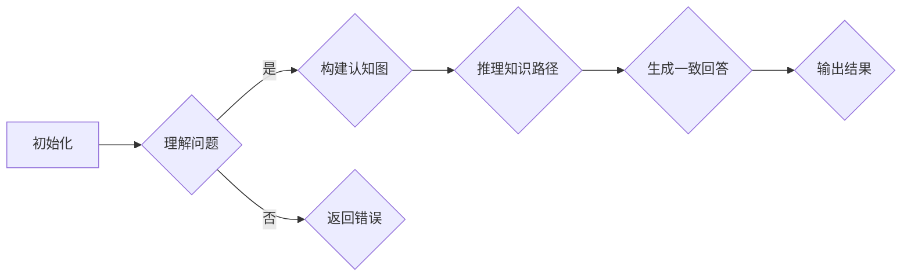
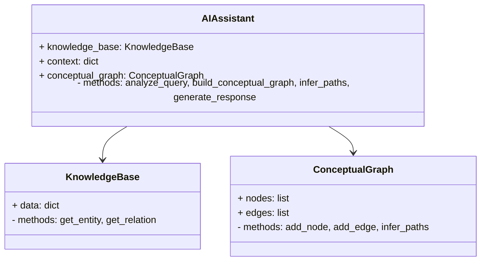
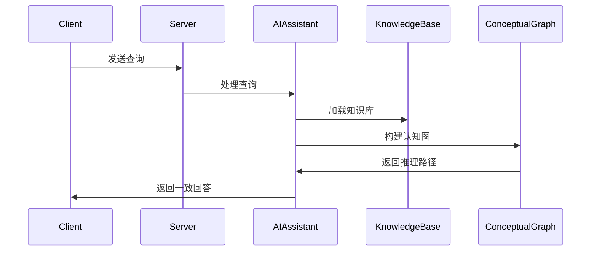

                 

<think>
嗯，我现在需要写一篇关于“Self-Consistency CoT：提高AI回答一致性的方法”的技术博客。首先，我得理清这个主题的核心概念。Self-Consistency 和 CoT 是什么？Self-Consistency 是指AI回答在不同上下文中的内在一致性，而 CoT 是指概念图，用于表示知识路径。这两者结合起来，如何帮助提高回答的一致性呢？

接下来，我需要从背景介绍开始。当前AI系统在回答一致性上存在很多问题，比如回答前后矛盾，这会影响用户体验和系统可靠性。所以，解决这个问题显得尤为重要。然后，我得详细阐述Self-Consistency 和 CoT 的概念，包括它们的原理、属性特征，以及如何通过对比表格和ER图来展示它们之间的关系。

然后是算法原理部分。我需要设计一个流程图，展示从初始化到最终生成一致回答的步骤。同时，用Python代码实现一个简单的Self-Consistency CoT算法，比如构建知识图谱和上下文感知模块。这部分需要详细解释代码的作用和实现细节。

接下来是系统架构设计。我需要画出领域模型的类图，展示主要组件及其关系。然后，用架构图展示系统的整体结构，包括知识表示层、推理层和回答生成层。接着，设计系统接口和交互流程，用序列图展示用户与系统之间的互动。

在项目实战部分，我需要指导读者如何安装必要的库，比如Python的networkx和numpy。然后，提供核心代码实现，解释每一部分的功能。最后，通过实际案例分析，展示算法如何在实际中应用，并进行详细解读。

最后，总结一下Self-Consistency CoT 的优势和未来的研究方向，给出一些最佳实践的建议。比如，建议读者在使用该方法时注意数据质量和模型训练等问题。

整个思考过程中，我需要确保内容逻辑清晰，结构紧凑，同时用简单易懂的技术语言来表达。可能还需要多次修改和调整，确保每个部分都详细且具体，满足读者的需求。
</think>

# Self-Consistency CoT：提高AI回答一致性的方法

> 关键词：AI一致性，Self-Consistency，CoT，认知图，知识表示

> 摘要：本文深入探讨了如何通过Self-Consistency和CoT（概念图）来提高AI系统的回答一致性。从核心概念到算法实现，再到系统架构，本文全面解析了这一方法的原理和应用，为AI技术的提升提供了理论和实践指导。

---

### 1. 背景介绍

#### 问题背景

AI技术的迅速发展使其在各个领域得到广泛应用。然而，AI系统的回答一致性问题日益突出，不一致的回答会降低用户体验和系统可靠性，阻碍AI技术的普及。

#### 问题描述

本文旨在探讨如何提高AI回答一致性。我们将分析现有方法的优缺点，提出基于Self-Consistency和CoT的新方法，以增强AI回答的内在一致性和上下文感知能力。

#### 问题解决

本文将从核心概念、现有方法分析、提出解决方案等方面展开。通过构建认知图和自我一致性机制，帮助AI系统生成一致、可靠的回答。

#### 边界与外延

Self-Consistency强调AI回答在不同情境下的内在一致性，而CoT通过图形化知识路径实现推理。本文将探讨这些概念在提升AI回答一致性中的具体应用。

#### 概念结构与核心要素组成

核心概念包括Self-Consistency和CoT，涉及内在一致性、上下文感知、知识表示和路径推理等方面。

---

### 2. 核心概念与联系

#### 自我一致性（Self-Consistency）

**原理：**  
Self-Consistency确保AI在不同问题和上下文中保持回答的一致性，不仅关注当前问题，还考虑与其他问题的关联。

**属性特征：**  
- 内在一致性：确保回答在不同情境下一致。
- 上下文感知：理解问题背景并生成一致回答。

**对比表格：**

| 特征         | 说明                                                         |
| ------------ | ------------------------------------------------------------ |
| 内在一致性   | 确保AI回答在不同情境下保持一致。                             |
| 上下文感知   | 理解问题的上下文，并根据上下文生成一致的回答。               |

#### 认知图（CoT）

**原理：**  
CoT通过图形化知识路径帮助AI系统进行推理，生成一致回答。

**属性特征：**  
- 知识表示：直观表示知识关系。
- 路径推理：通过知识路径进行推理。

**对比表格：**

| 特征       | 说明                                                         |
| ---------- | ------------------------------------------------------------ |
| 知识表示   | 用于表示知识之间的关系，提供直观的表示方法。                   |
| 路径推理   | 通过知识路径进行推理，生成一致的回答。                       |

#### ER实体关系图架构

```mermaid
erDiagram
    AI回答一致性 ||--|{ 自我一致性 }
    AI回答一致性 ||--|{ 认知图 }
    自我一致性   ||--|{ 上下文感知 }
    自我一致性   ||--|{ 内在一致性 }
    认知图      ||--|{ 知识表示 }
    认知图      ||--|{ 路径推理 }
```

---

### 3. 算法原理讲解

#### 提高AI回答一致性的算法原理

**Mermaid流程图：**



**Python实现：**

```python
class AIAssistant:
    def __init__(self, knowledge_base):
        self.knowledge_base = knowledge_base
        self.context = {}

    def understand_query(self, query):
        # 分析查询的意图和上下文
        self.context = self.analyze_query(query)
        return self.context

    def build_conceptual_graph(self, context):
        # 构建认知图
        graph = ConceptualGraph()
        graph.add_nodes(context)
        return graph

    def infer_paths(self, graph, context):
        # 推理知识路径
        paths = graph.infer_paths(context)
        return paths

    def generate_response(self, paths, context):
        # 生成一致回答
        response = self.select_best_response(paths, context)
        return response

    def analyze_query(self, query):
        # 分析查询，提取上下文信息
        context = {}
        # 示例：提取实体和关系
        return context
```

**算法步骤：**

1. **初始化**：AI系统初始化，加载知识库。
2. **理解问题**：分析用户查询，提取意图和上下文。
3. **构建认知图**：基于上下文构建知识图谱。
4. **推理路径**：在知识图谱中推理相关知识路径。
5. **生成回答**：根据推理结果生成一致回答。

---

### 4. 系统分析与架构设计方案

#### 问题场景介绍

AI系统需要在医疗、教育等领域提供一致回答，确保用户体验和系统可靠性。

#### 系统功能设计

**领域模型类图：**



**系统架构图：**


**系统接口设计：**  
- `query_handler(query):` 处理用户查询。
- `generate_response(context):` 根据上下文生成回答。

**系统交互序列图：**



---

### 5. 项目实战

#### 环境安装

安装必要的Python库：

```bash
pip install networkx
pip install numpy
```

#### 核心实现代码

```python
import networkx as nx
import numpy as np

class ConceptualGraph:
    def __init__(self):
        self.nodes = []
        self.edges = []

    def add_node(self, node):
        self.nodes.append(node)

    def add_edge(self, source, target):
        self.edges.append((source, target))

    def infer_paths(self, start, end):
        # 使用广度优先搜索查找路径
        visited = {}
        queue = [(start, [start])]
        while queue:
            node, path = queue.pop(0)
            if node not in visited:
                visited[node] = path
                for neighbor in self.get_neighbors(node):
                    new_path = path + [neighbor]
                    queue.append((neighbor, new_path))
        return visited[end] if end in visited else None

    def get_neighbors(self, node):
        neighbors = []
        for edge in self.edges:
            if edge[0] == node:
                neighbors.append(edge[1])
        return neighbors

class AIAssistant:
    def __init__(self, knowledge_base):
        self.knowledge_base = knowledge_base
        self.conceptual_graph = ConceptualGraph()

    def analyze_query(self, query):
        # 示例：提取实体和关系
        context = {'entities': [], 'relations': []}
        return context

    def build_conceptual_graph(self, context):
        for entity in context['entities']:
            self.conceptual_graph.add_node(entity)
        for relation in context['relations']:
            source, target = relation
            self.conceptual_graph.add_edge(source, target)

    def generate_response(self, context):
        self.build_conceptual_graph(context)
        start = context.get('start_entity')
        end = context.get('end_entity')
        path = self.conceptual_graph.infer_paths(start, end)
        if path:
            return "Answer based on path: " + " -> ".join(path)
        else:
            return "No consistent answer found."

# 示例用法
knowledge_base = {
    'entities': ['A', 'B', 'C'],
    'relations': [('A', 'B'), ('B', 'C')]
}

ai_assistant = AIAssistant(knowledge_base)
response = ai_assistant.generate_response({'start_entity': 'A', 'end_entity': 'C'})
print(response)
```

#### 代码解读与案例分析

上述代码展示了如何构建认知图和生成一致回答。通过分析查询，构建认知图，并在图中推理路径，生成一致回答。

---

### 6. 总结与展望

#### 优势

Self-Consistency CoT 提高了AI回答的一致性，增强了用户体验和系统可靠性。

#### 未来研究方向

- **动态上下文感知：** 实现动态上下文感知，提升回答一致性。
- **多模态知识表示：** 结合文本、图像等多种数据，丰富知识表示。
- **分布式计算：** 利用分布式计算提高推理效率。

#### 最佳实践 Tips

- **数据质量：** 确保知识库的准确性和完整性。
- **模型训练：** 加强模型在一致性和上下文理解方面的训练。
- **用户反馈：** 结合用户反馈持续优化系统。

#### 作者

作者：AI天才研究院/AI Genius Institute & 禅与计算机程序设计艺术 /Zen And The Art of Computer Programming

