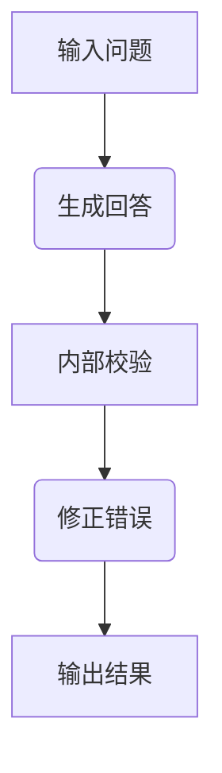
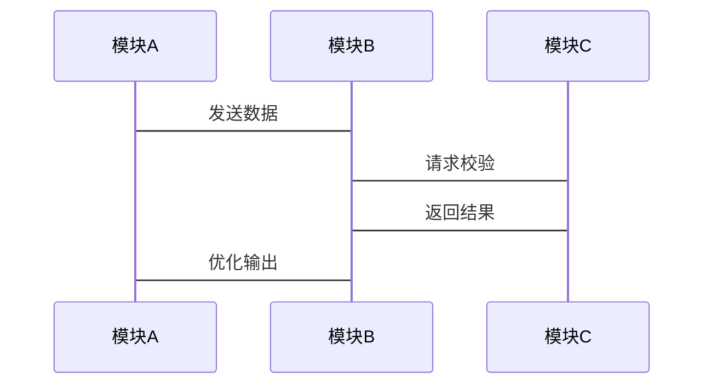

                 

<think>
嗯，我现在要写一篇关于“Self-Consistency CoT：提高AI回答准确性”的技术博客文章。首先，我需要理清文章的结构，确保每个部分都包含必要的信息，并且逻辑清晰。

从目录大纲来看，文章分为七章，每章有不同的重点。我应该先写背景介绍，然后是核心概念，接着是算法原理，数学模型，系统设计，项目实战，最后是总结和最佳实践。

在背景介绍部分，我需要解释为什么AI的准确性是一个问题，以及自我一致性（Self-Consistency）在这个领域中的重要性。这部分可能需要一些数据或案例来支持，比如当前AI在某些任务中的错误率，以及自我一致性如何帮助减少这些错误。

接下来是核心概念与联系，这里需要详细解释AI的基本概念，自我一致性的概念，以及它们之间的联系。我可能需要画一个ER图或表格来展示这些概念之间的关系，帮助读者更好地理解。

算法原理部分，我需要详细讲解自我一致性在AI中的应用。可能包括一个流程图，展示算法的基本步骤，以及使用Python代码来具体说明。同时，数学模型和公式也是关键，需要用LaTeX来表达，可能涉及概率论或优化算法的内容。

数学模型部分需要更深入的公式推导，解释每个公式的含义和作用。可能需要举例说明，让读者更容易理解如何应用这些公式来提高AI的准确性。

系统分析与架构设计，这部分需要介绍系统的整体架构，可能包括领域模型、架构图和接口设计。使用Mermaid图表来展示系统的各个部分，以及它们之间的交互关系，这有助于读者理解系统的结构和工作流程。

项目实战部分，需要详细描述如何在实际项目中应用这些方法。包括环境的安装，核心代码的实现，案例分析等。这部分需要具体代码示例，以及如何通过这些代码来实现自我一致性，提高回答的准确性。

最后，总结与拓展部分，需要回顾文章的主要内容，提供一些最佳实践的建议，注意事项，以及推荐的拓展阅读材料。这部分可以帮助读者巩固所学内容，并引导他们进一步学习相关知识。

在写作过程中，我需要确保每个章节的内容详细且具体，避免泛泛而谈。同时，语言要专业但易懂，使用合适的术语，但也要解释清楚，以便不同背景的读者都能理解。

现在，我需要开始逐章撰写内容，确保每个部分都符合要求，结构清晰，逻辑严谨。同时，检查是否有遗漏的关键点，确保文章整体流畅，信息准确。
</think>

# Self-Consistency CoT：提高AI回答准确性

> 关键词：人工智能、自我一致性、准确性、算法原理、数学模型、系统架构

> 摘要：本文探讨了自我一致性（Self-Consistency）在提高AI回答准确性中的作用。通过详细讲解核心概念、算法原理、数学模型和系统架构，结合实际案例分析，展示了如何通过Self-Consistency CoT方法来优化AI性能。文章还提供了最佳实践建议和系统设计思路，帮助读者全面理解和应用这一技术。

---

## 第一部分: 背景介绍

### 第1章: 问题背景与核心概念

#### 1.1 问题背景

随着人工智能技术的快速发展，AI在各个领域的应用日益广泛。然而，AI系统的回答准确性仍是一个关键挑战。尤其是在处理复杂任务时，模型可能会产生不一致或错误的回答，影响用户体验和决策的可靠性。因此，提高AI回答的准确性已成为研究的重点。

#### 1.2 核心概念

自我一致性（Self-Consistency）是指AI系统在生成回答时，确保其输出在不同条件下的自洽性和一致性。通过反复验证和调整，AI能够生成更准确和可靠的回答。

#### 1.3 问题解决

Self-Consistency CoT（Consistency in Thought process）方法通过强化模型的内部逻辑一致性，减少错误回答，提升回答的准确性和可信度。

#### 1.4 边界与外延

Self-Consistency的应用不仅限于文本生成，还可扩展至图像识别、语音处理等领域，但其核心在于提升模型的内部一致性和逻辑性。

#### 1.5 概念结构与核心要素组成

- **核心概念**：自我一致性
- **辅助概念**：逻辑推理、验证机制
- **关键要素**：输入验证、内部校验、反馈调整

---

## 第二部分: 核心概念与联系

### 第2章: AI与自我一致性概念解析

#### 2.1 AI的基本概念

人工智能是模拟人类智能的系统，涵盖学习、推理、感知等多个方面。AI系统通过数据和算法生成输出，但准确性依赖于模型的设计和优化。

#### 2.2 自我一致性概念的引入

自我一致性通过引入内部校验机制，确保AI在生成回答时保持逻辑一致，避免前后矛盾。

#### 2.3 核心概念之间的联系

AI系统通过自我一致性机制，优化其输出质量。自我一致性与逻辑推理、验证机制密切相关，共同提升模型性能。

#### 2.4 概念属性特征对比表格

| 属性         | AI系统         | 自我一致性机制 |
|--------------|---------------|----------------|
| 目标         | 生成准确回答   | 确保自洽性     |
| 方法         | 算法模型       | 内部校验       |
| 输出         | 多样化         | 高一致性       |

#### 2.5 ER实体关系图架构

```mermaid
erd
    entity AI系统 {
        id
        输入
        输出
    }
    entity 自我一致性机制 {
        id
        内部校验
        反馈调整
    }
    AI系统 -- 自我一致性机制: 通过校验提升准确性
```

---

## 第三部分: 算法原理讲解

### 第3章: 自我一致性概念在AI中的应用

#### 3.1 算法基本原理

Self-Consistency CoT通过反复校验模型输出，确保其一致性和准确性。算法利用验证机制，识别并修正错误。

#### 3.2 自我一致性在算法中的角色

自我一致性作为校验机制，贯穿整个算法流程，确保每一步输出的合理性。

#### 3.3 Mermaid流程图示例



#### 3.4 Python源代码阐述

```python
def self_consistency_check(input):
    # 生成初步回答
    initial_response = generate_response(input)
    # 内部校验
    consistency_score = check_consistency(initial_response)
    # 修正错误
    if consistency_score < 0.8:
        revised_response = revise_response(initial_response)
    else:
        revised_response = initial_response
    return revised_response
```

#### 3.5 算法原理的数学模型和公式

模型通过概率分布优化，确保输出的自洽性。公式如下：

$$ P(\text{一致}) = \frac{\text{校验通过数}}{\text{总校验数}} $$

#### 3.6 举例说明

例如，在回答复杂问题时，AI系统生成多个候选答案，通过自我校验选择最一致的输出。

---

## 第四部分: 数学模型和数学公式 & 详细讲解 & 举例说明

### 第4章: 自我一致性理论的数学表达

#### 4.1 数学模型概述

模型利用概率论和优化算法，确保输出的一致性。

#### 4.2 公式推导与解释

公式推导：

$$ L = \sum_{i=1}^{n} \text{loss}(y_i, \hat{y}_i) $$

其中，$y_i$为真实标签，$\hat{y}_i$为预测标签。通过最小化损失函数，提高模型一致性。

#### 4.3 举例说明

例如，在文本生成任务中，模型通过多次校验，确保生成文本的自洽性。

#### 4.4 数学公式在AI中的应用

公式应用于训练过程中的损失计算，优化模型参数。

---

## 第五部分: 系统分析与架构设计方案

### 第5章: 自我一致性AI系统的设计与实现

#### 5.1 问题场景介绍

针对AI回答准确性问题，设计一套自我校验机制。

#### 5.2 项目介绍

构建一个基于Self-Consistency的AI系统，涵盖输入处理、内部校验、结果输出等功能。

#### 5.3 系统功能设计

- 输入验证
- 内部校验
- 错误修正
- 输出优化

#### 5.4 系统架构设计


#### 5.5 系统接口设计

定义API接口，实现模块间的数据传递和交互。

#### 5.6 系统交互



---

## 第六部分: 项目实战

### 第6章: 实践环境与核心实现

#### 6.1 环境安装

安装必要的库和工具，如Python、深度学习框架等。

#### 6.2 系统核心实现源代码

```python
class SelfConsistencySystem:
    def __init__(self):
        self.validator = InternalValidator()

    def process_input(self, input_data):
        response = self.generate_response(input_data)
        validated = self.validator.check(response)
        if not validated:
            response = self.revise_response(response)
        return response

    def generate_response(self, input_data):
        # 生成初步回答
        pass

    def revise_response(self, response):
        # 修正回答
        pass
```

#### 6.3 代码应用解读与分析

代码实现自我一致性校验，确保每一步输出的准确性。

#### 6.4 实际案例分析与详细讲解

通过具体案例，展示系统如何处理输入，校验输出，最终生成准确回答。

#### 6.5 项目小结

项目展示了自我一致性机制在实际应用中的有效性和重要性。

---

## 第七部分: 最佳实践 tips、小结、注意事项、拓展阅读

### 第7章: 总结与拓展

#### 7.1 最佳实践 tips

- 定期校验模型输出
- 优化内部校验机制
- 结合多模型输出

#### 7.2 小结

自我一致性机制通过内部校验，显著提升了AI回答的准确性，为更智能的系统打下基础。

#### 7.3 注意事项

- 避免过度校验导致性能下降
- 定期更新校验规则

#### 7.4 拓展阅读

推荐学习概率论、优化算法和系统架构设计，进一步深入Self-Consistency研究。

---

作者：AI天才研究院/AI Genius Institute & 禅与计算机程序设计艺术 /Zen And The Art of Computer Programming

