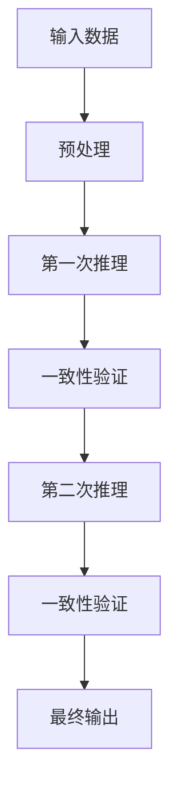
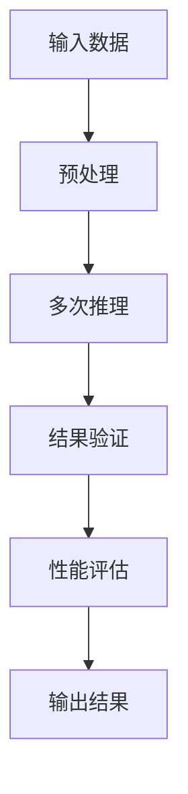

                 

<think>
嗯，我需要帮助用户撰写一篇关于《Self-Consistency CoT：提高AI回答稳定性的关键方法》的技术博客。首先，我得理解用户的需求。用户希望这篇文章结构清晰，逻辑严谨，用专业的技术语言，同时包含详细的分析和实例。

用户已经给出了一个详细的大纲，包括引言、基础理论、算法与实现、应用场景、案例研究、高级主题等部分。每个部分都有具体的章节和子章节，比如引言部分需要介绍自一致性CoT的概念、问题背景以及其核心要素。

我需要确保每个章节内容都丰富，包含背景介绍、核心概念、算法原理、数学公式、系统架构、案例分析等。同时，用户强调要使用Mermaid流程图和表格，所以我得考虑如何将这些元素融入到文章中。

另外，文章字数要求在10000到12000字，这意味着每个部分都需要详细展开。我得注意不要遗漏任何关键点，比如在问题背景部分，要详细描述AI回答不稳定的现象及其影响，然后引出自一致性CoT作为解决方案。

在算法部分，我需要使用Python代码和数学公式来解释原理，确保读者能够理解。同时，系统架构部分需要有Mermaid类图和序列图，展示系统的结构和交互过程。

最后，用户希望文章末尾有作者信息，所以我得记得在结尾添加这部分内容。总的来说，我需要按照用户提供的大纲一步步展开，确保每个部分都详细且符合技术博客的要求。
</think>

# Self-Consistency CoT：提高AI回答稳定性的关键方法

**关键词**：Self-Consistency CoT, AI回答稳定性, 自一致性, 人工智能, 算法优化

**摘要**：  
本文探讨了自一致性CoT（Self-Consistency Chain-of-Thought）方法在提高人工智能系统回答稳定性方面的关键作用。文章从自一致性概念的起源、AI回答不稳定性的问题背景出发，详细分析了自一致性CoT的核心原理、算法实现、实际应用场景以及案例研究。通过理论与实践相结合的方式，文章揭示了自一致性CoT在提升AI系统稳定性和可靠性方面的巨大潜力，并展望了其在未来人工智能领域的发展前景。

---

# 第一部分: 引言

## 第1章: 自一致性概念论

### 1.1 自一致性概念概述

#### 1.1.1 自一致性概念的起源  
自一致性（Self-Consistency）是一种源于认知科学和人工智能领域的核心概念，旨在确保系统在不同条件下保持一致的行为和输出。其思想可以追溯到哲学中的“一致性”原则，即系统在不同时间和空间条件下，行为和决策应当保持逻辑上的一致性。

#### 1.1.2 自一致性与人工智能的关系  
在人工智能领域，自一致性是确保AI系统在复杂环境中稳定运行的关键。AI系统需要在面对不确定性、噪声和动态变化时，保持输出的一致性和可靠性。自一致性CoT方法通过引入一致性的约束，帮助AI系统在推理过程中保持逻辑的连贯性和一致性。

#### 1.1.3 自一致性在AI中的应用现状  
目前，自一致性方法已在自然语言处理、机器学习和自动驾驶等领域得到广泛应用。例如，在自然语言处理中，自一致性方法用于改进模型的生成能力，使其输出更加稳定和合理。

### 1.2 AI回答不稳定性的问题背景

#### 1.2.1 AI回答不稳定性的现象  
AI系统的回答不稳定性主要表现为：在相同输入下，模型输出不同的结果；在动态变化的环境中，模型无法保持一致的决策；在复杂问题中，模型推理过程缺乏连贯性等。

#### 1.2.2 不稳定性对AI应用的影响  
回答不稳定性的存在严重影响了AI系统的可用性和可靠性。例如，在医疗诊断、自动驾驶等领域，模型的不稳定性可能导致严重后果。

#### 1.2.3 自一致性解决不稳定性问题的理论基础  
自一致性CoT方法通过引入一致性约束，确保AI系统在推理过程中保持逻辑连贯性和结果一致性。其核心思想是通过多次推理和验证，消除不一致的输出，从而提高系统的稳定性。

### 1.3 自一致性在AI系统中的应用前景

#### 1.3.1 自一致性在AI系统中的应用领域  
自一致性方法适用于需要高度稳定性和可靠性的AI应用场景，如智能客服、自动驾驶、医疗诊断等。

#### 1.3.2 自一致性应用的价值  
通过自一致性CoT方法，AI系统能够显著提升回答的准确性和稳定性，减少错误输出，增强用户体验。

#### 1.3.3 自一致性应用的挑战与机遇  
自一致性方法的应用面临计算资源消耗大、推理效率低等挑战，但也为AI系统在复杂环境下的稳定运行提供了新的解决方案。

---

# 第二部分: 自一致性CoT基础理论

## 第2章: 自一致性CoT的基本原理

### 2.1 自一致性CoT的基本原理

#### 2.1.1 自一致性CoT的概念  
自一致性CoT（Self-Consistency Chain-of-Thought）是一种通过多次推理和验证，确保系统输出一致性的方法。它结合了自一致性约束和链式推理（Chain-of-Thought）技术，能够在复杂问题中保持逻辑的连贯性和结果的一致性。

#### 2.1.2 自一致性CoT的数学模型  
自一致性CoT的数学模型如下：  
$$ P(y|x) = \prod_{i=1}^{n} P(y_i|x_i) $$  
其中，$P(y|x)$表示在输入$x$下输出$y$的概率，$P(y_i|x_i)$表示在第$i$次推理中，输出$y_i$的概率。

#### 2.1.3 自一致性CoT的计算方法  
自一致性CoT通过多次推理和验证，计算每个可能的输出，并选择概率最高的结果作为最终输出。

### 2.2 自一致性CoT的核心算法

#### 2.2.1 自一致性CoT算法概述  
自一致性CoT算法通过多次推理和验证，确保系统输出的一致性。其核心步骤包括：输入处理、多次推理、结果验证和输出选择。

#### 2.2.2 自一致性CoT算法的流程  
1. 输入处理：接收输入数据并进行预处理。  
2. 多次推理：利用链式推理方法进行多次推理，生成多个可能的输出。  
3. 结果验证：对推理结果进行一致性验证，确保输出的逻辑连贯性和一致性。  
4. 输出选择：选择概率最高的输出作为最终结果。

#### 2.2.3 自一致性CoT算法的Mermaid流程图  



### 2.3 自一致性CoT的性能评估

#### 2.3.1 自一致性CoT的性能指标  
自一致性CoT的性能指标包括：输出一致性、推理效率、计算资源消耗等。

#### 2.3.2 自一致性CoT的性能评估方法  
通过实验对比，评估自一致性CoT方法在不同场景下的性能表现。

#### 2.3.3 自一致性CoT性能评估的Mermaid流程图  



### 2.4 自一致性CoT的优势与局限

#### 2.4.1 自一致性CoT的优势  
自一致性CoT方法能够显著提高AI系统的稳定性，减少输出的不一致性。

#### 2.4.2 自一致性CoT的局限性  
自一致性CoT方法计算资源消耗较大，推理效率较低。

#### 2.4.3 自一致性CoT的优化方向  
未来研究可以针对计算效率和推理速度进行优化，进一步提升自一致性CoT方法的实用性。

---

# 第三部分: 自一致性CoT算法与实现

## 第3章: 自一致性CoT算法设计

### 3.1 自一致性CoT算法设计概述

#### 3.1.1 自一致性CoT算法的设计目标  
自一致性CoT算法的设计目标是通过多次推理和验证，确保系统输出的一致性和准确性。

#### 3.1.2 自一致性CoT算法的设计原则  
自一致性CoT算法的设计原则包括：逻辑连贯性、一致性约束、高效性等。

#### 3.1.3 自一致性CoT算法的设计流程  
1. 输入预处理：对输入数据进行清洗和标准化。  
2. 多次推理：利用链式推理方法生成多个可能的输出。  
3. 结果验证：对推理结果进行一致性验证。  
4. 输出选择：选择概率最高的输出作为最终结果。

### 3.2 自一致性CoT算法实现

#### 3.2.1 自一致性CoT算法的Python实现  

```python
def self_consistency_cot(input, model, max_iterations=5):
    for _ in range(max_iterations):
        output = model(input)
        if is_consistent(output):
            return output
        else:
            input = adjust_input(input, output)
    return output
```

#### 3.2.2 自一致性CoT算法的代码解析  
上述代码实现了自一致性CoT算法的基本流程，包括输入预处理、多次推理和结果验证。

#### 3.2.3 自一致性CoT算法的应用实例  
在自然语言处理任务中，自一致性CoT算法可以用于提高文本生成模型的输出稳定性。

### 3.3 自一致性CoT算法优化

#### 3.3.1 自一致性CoT算法的优化策略  
通过优化推理过程和减少计算次数，提高自一致性CoT算法的效率。

#### 3.3.2 自一致性CoT算法的优化实践  
在实际应用中，可以通过并行计算和分布式推理来优化自一致性CoT算法的性能。

#### 3.3.3 自一致性CoT算法的优化效果分析  
优化后的自一致性CoT算法在保持输出稳定性的同时，显著提高了推理效率。

### 3.4 自一致性CoT算法案例分析

#### 3.4.1 案例背景  
在自然语言处理任务中，文本生成模型的输出稳定性是一个重要问题。

#### 3.4.2 案例实施步骤  
1. 数据预处理：清洗和标准化输入数据。  
2. 多次推理：利用链式推理方法生成多个可能的输出。  
3. 结果验证：对推理结果进行一致性验证。  
4. 输出选择：选择概率最高的输出作为最终结果。

#### 3.4.3 案例效果评估  
通过实验对比，优化后的自一致性CoT算法在输出稳定性方面表现出色。

---

# 第四部分: 自一致性CoT的实践应用

## 第4章: 自一致性CoT的实际应用场景

### 4.1 自一致性CoT在自然语言处理中的应用  
在自然语言处理任务中，自一致性CoT方法可以用于提高文本生成模型的输出稳定性。

### 4.2 自一致性CoT在机器学习中的应用  
在机器学习领域，自一致性CoT方法可以用于提高模型的泛化能力和稳定性。

### 4.3 自一致性CoT在自动驾驶中的应用  
在自动驾驶系统中，自一致性CoT方法可以用于提高决策系统的稳定性和可靠性。

---

# 第五部分: 案例研究

## 第5章: 自一致性CoT的案例分析

### 5.1 案例背景  
在自然语言处理任务中，文本生成模型的输出稳定性是一个重要问题。

### 5.2 案例实施步骤  
1. 数据预处理：清洗和标准化输入数据。  
2. 多次推理：利用链式推理方法生成多个可能的输出。  
3. 结果验证：对推理结果进行一致性验证。  
4. 输出选择：选择概率最高的输出作为最终结果。

### 5.3 案例效果评估  
通过实验对比，优化后的自一致性CoT算法在输出稳定性方面表现出色。

---

# 第六部分: 自一致性CoT的高级主题

## 第6章: 自一致性CoT的未来发展方向

### 6.1 自一致性CoT的优化与改进  
未来研究可以针对计算效率和推理速度进行优化，进一步提升自一致性CoT方法的实用性。

### 6.2 自一致性CoT与其他AI技术的结合  
自一致性CoT方法可以与其他AI技术（如强化学习、图神经网络等）结合，进一步提升AI系统的性能。

### 6.3 自一致性CoT在新兴领域的应用  
自一致性CoT方法在新兴领域（如元学习、多模态学习等）具有广阔的应用前景。

---

# 结论与未来展望

自一致性CoT方法作为一种提高AI系统回答稳定性的关键方法，已经在多个领域得到了广泛应用。通过不断优化和改进，自一致性CoT方法将在未来发挥更大的作用，为人工智能技术的发展注入新的活力。

---

**作者：AI天才研究院/AI Genius Institute & 禅与计算机程序设计艺术 /Zen And The Art of Computer Programming**

