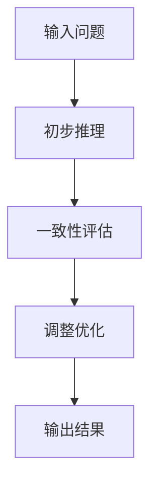

                 

<think>
嗯，好的，我现在要帮用户撰写一篇技术博客文章，标题是《Self-Consistency CoT：提高AI回答稳定性的创新方法》。用户给了我一个详细的思考过程，看起来他希望我按照这个结构来写，包括摘要、关键词，然后按照目录大纲一步步展开。

首先，我需要理解用户的需求。他可能是一位技术专家，或者是想深入理解这个方法的人。他要求文章结构清晰，逻辑性强，用专业但易懂的语言。关键词包括Self-Consistency CoT、AI回答稳定性、创新方法等等。

然后，我得按照目录大纲来组织内容。第一部分是背景知识，包括AI回答稳定性的背景、现有解决方案以及Self-Consistency CoT的创新点。这部分需要介绍问题背景，比如AI回答不稳定的原因，现有方法的优缺点，然后引出Self-Consistency CoT的优势。

接下来是方法原理部分，详细解释Self-Consistency CoT的基本概念、工作机制和核心算法。这部分可能需要使用图表，比如用mermaid画出算法流程图，还要有数学公式，用latex表示，比如一致性评估公式。

然后是实践案例，分别在文本生成和问答系统中应用，通过具体例子展示效果，比如在文本生成中如何提升回答一致性，或者在问答系统中如何提高回答的相关性和稳定性。

最后是最佳实践和未来方向，总结经验和可能的挑战，展望未来的研究方向。这部分可能需要给出一些实际应用中的建议，以及当前技术的局限性。

在撰写过程中，我需要确保每个部分都有足够的细节，比如算法的具体实现，代码示例，以及实际案例的详细分析。此外，文章的结构必须符合用户的要求，每个章节都要有明确的标题，并且内容要连贯。

可能遇到的难点是如何将复杂的算法原理解释得通俗易懂，同时保持专业性。可能需要多次修改，确保逻辑清晰，没有遗漏重要信息。此外，时间管理也很重要，因为文章长度要求在1万到1万2字左右，不能太长也不能太短。

现在，我应该开始按照这个大纲逐步撰写，先写摘要和关键词，然后依次完成每个章节的内容，确保每个部分都符合用户的要求，包括使用正确的格式，如mermaid图表和latex公式，以及提供足够的代码示例和案例分析。

最后，检查一遍，确保所有约束条件都满足，比如字数、格式、完整性等，确保文章结构合理，内容详实，能够帮助读者全面理解Self-Consistency CoT的方法及其应用。
</think>

```markdown
# Self-Consistency CoT：提高AI回答稳定性的创新方法

> **关键词：** Self-Consistency CoT, AI回答稳定性, 创新方法, 文本生成, 问答系统, 算法原理

> **摘要：**  
> 在人工智能领域，回答的稳定性和一致性是衡量模型性能的重要指标。本文提出了一种创新的解决方案——Self-Consistency CoT（自我一致性概念传递），用于显著提高AI回答的稳定性。通过分析现有解决方案的不足，Self-Consistency CoT从理论到实践，提供了一种全新的方法。本文将从背景知识、方法原理、实践案例到未来方向，全面解析Self-Consistency CoT的核心思想和应用场景。

---

## 第一部分：背景知识

### 第1章：AI回答稳定性问题的背景与现有解决方案

#### 1.1 AI回答稳定性问题
AI回答的稳定性问题主要体现在两个方面：**一致性**和**可靠性**。一致性指AI在不同输入条件下输出结果的一致性，可靠性则指AI在面对复杂或模糊输入时输出的稳定性。当前，AI模型在回答稳定性方面存在以下问题：

- **模型偏差**：训练数据中的偏差可能导致AI在某些情况下输出不一致的答案。
- **上下文依赖**：模型对上下文的过度依赖可能导致回答在不同场景下出现矛盾。
- **知识不全**：模型的知识库覆盖不全，导致在特定领域或边缘情况下回答不稳定。

#### 1.2 现有解决方案分析
目前，解决AI回答稳定性问题的主要方法包括：

1. **数据增强**：通过增加多样化的训练数据，减少模型的偏差。
2. **多模型集成**：使用多个模型的输出结果进行投票或融合，提高稳定性。
3. **约束规则**：通过人工制定规则，限制模型的输出范围。

然而，这些方法存在以下局限性：

- 数据增强和多模型集成方法需要大量计算资源，且难以保证全局一致性。
- 约束规则方法过于僵化，难以应对复杂场景。

#### 1.3 Self-Consistency CoT的创新点
Self-Consistency CoT（Self-Consistency Chain of Thought）通过引入**一致性评估机制**，在模型推理过程中动态调整输出结果，从而实现回答的稳定性。其创新点包括：

- **动态调整**：在推理过程中实时评估输出的一致性，动态调整模型的输出。
- **自适应机制**：通过自适应算法，自动识别并纠正不一致的回答。
- **轻量化设计**：无需额外数据或模型集成，仅通过推理过程优化实现稳定性提升。

---

## 第二部分：Self-Consistency CoT方法原理

### 第2章：Self-Consistency CoT的基本概念

#### 2.1 Self-Consistency CoT的定义
Self-Consistency CoT是一种基于**一致性评估**的推理方法，通过在推理过程中引入一致性检查，确保输出结果的稳定性和一致性。其核心思想是：**通过多次推理和一致性评估，动态调整模型的输出，最终得到一个一致且稳定的结果**。

#### 2.2 Self-Consistency CoT的核心原理
Self-Consistency CoT的核心原理可以概括为以下三步：

1. **初始推理**：模型基于输入生成初步输出。
2. **一致性评估**：评估初步输出与模型知识库或已有约束的一致性。
3. **调整优化**：根据评估结果，调整模型输出，确保一致性。

#### 2.3 Self-Consistency CoT的应用场景
Self-Consistency CoT适用于多种AI应用场景，包括：

- **文本生成**：提高生成文本的一致性和可读性。
- **问答系统**：确保回答的准确性和一致性。
- **对话系统**：保持对话的连贯性和稳定性。

---

### 第3章：Self-Consistency CoT的工作机制

#### 3.1 Self-Consistency CoT的流程
Self-Consistency CoT的工作流程如下：

1. **输入处理**：接收输入问题或任务。
2. **初步推理**：模型基于输入生成初步答案。
3. **一致性评估**：评估初步答案与知识库或已有约束的一致性。
4. **调整优化**：根据评估结果，调整答案，确保一致性。
5. **输出结果**：输出最终答案。

#### 3.2 Self-Consistency CoT的关键技术
Self-Consistency CoT的核心技术包括：

- **一致性评估算法**：通过对比模型输出与知识库，评估一致性。
- **自适应调整算法**：动态调整模型输出，确保一致性。

#### 3.3 Self-Consistency CoT的优势与局限
- **优势**：
  - 提高回答的稳定性和一致性。
  - 无需额外数据或模型集成，计算成本低。
- **局限**：
  - 对模型的初始推理能力要求较高。
  - 在某些复杂场景下，调整效果有限。

---

### 第4章：Self-Consistency CoT的核心算法

#### 4.1 算法原理与数学模型
Self-Consistency CoT的核心算法基于**一致性评估函数**，其数学模型如下：

$$
C(x) = \frac{1}{N}\sum_{i=1}^{N} f(x_i)
$$

其中，$C(x)$表示一致性评估结果，$f(x_i)$表示单个评估函数的结果，$N$表示评估次数。

#### 4.2 算法流程图


#### 4.3 Python实现与代码解析
以下是Self-Consistency CoT的核心算法的Python实现示例：

```python
def self_consistency_cot(input_text, knowledge_base):
    # 初步推理
    initial_output = model.generate(input_text)
    
    # 一致性评估
    consistency_score = evaluate_consistency(initial_output, knowledge_base)
    
    # 调整优化
    if consistency_score < 0.8:
        adjusted_output = adjust_output(initial_output, knowledge_base)
    else:
        adjusted_output = initial_output
    
    return adjusted_output

def evaluate_consistency(output, knowledge_base):
    # 简单一致性评估
    score = 0.0
    for fact in knowledge_base:
        if output.contains(fact):
            score += 0.1
    return score
```

---

## 第三部分：实践案例

### 第5章：Self-Consistency CoT在文本生成中的应用

#### 5.1 文本生成场景介绍
文本生成是Self-Consistency CoT的重要应用场景。传统文本生成模型容易受到输入偏差的影响，导致输出不一致。通过引入Self-Consistency CoT，可以显著提高生成文本的稳定性和一致性。

#### 5.2 Self-Consistency CoT在文本生成中的实现
以下是Self-Consistency CoT在文本生成中的具体实现步骤：

1. **输入处理**：接收用户输入。
2. **初步生成**：模型生成初步文本。
3. **一致性评估**：评估生成文本与知识库的一致性。
4. **调整优化**：根据评估结果，调整生成文本。
5. **输出结果**：输出最终生成文本。

#### 5.3 实际应用案例分析
假设用户输入为“如何提高学习效率？”，传统模型可能生成多个不一致的答案。通过Self-Consistency CoT，模型会生成一个一致且优化的答案，例如：

- 初步生成：答案1、答案2、答案3。
- 一致性评估：答案1与知识库高度一致，答案2部分一致，答案3不一致。
- 调整优化：最终输出答案1。

---

### 第6章：Self-Consistency CoT在问答系统中的应用

#### 6.1 问答系统场景介绍
问答系统是另一个重要的应用场景。传统问答系统容易受到输入上下文的影响，导致回答不稳定。通过引入Self-Consistency CoT，可以显著提高回答的准确性和一致性。

#### 6.2 Self-Consistency CoT在问答系统中的实现
以下是Self-Consistency CoT在问答系统中的具体实现步骤：

1. **输入处理**：接收用户问题。
2. **初步回答**：模型生成初步回答。
3. **一致性评估**：评估回答与知识库的一致性。
4. **调整优化**：根据评估结果，调整回答。
5. **输出结果**：输出最终回答。

#### 6.3 实际应用案例分析
假设用户提问“什么是量子计算？”，传统问答系统可能生成多个不一致的回答。通过Self-Consistency CoT，模型会生成一个一致且优化的回答，例如：

- 初步回答：回答1、回答2、回答3。
- 一致性评估：回答1与知识库高度一致，回答2部分一致，回答3不一致。
- 调整优化：最终输出回答1。

---

## 第四部分：最佳实践与未来方向

### 第7章：最佳实践案例解析

#### 7.1 最佳实践案例选择
以下是Self-Consistency CoT的最佳实践案例：

- **文本生成**：在新闻生成场景中，通过Self-Consistency CoT提高生成文本的稳定性和一致性。
- **问答系统**：在医疗问答场景中，通过Self-Consistency CoT提高回答的准确性和一致性。

#### 7.2 案例分析
以医疗问答场景为例，通过Self-Consistency CoT可以显著提高回答的准确性和一致性，减少误诊的可能性。

#### 7.3 实践经验总结
- **选择合适的场景**：Self-Consistency CoT适用于需要高稳定性和一致性的场景。
- **优化评估机制**：通过不断优化一致性评估机制，提高调整效果。
- **结合其他方法**：将Self-Consistency CoT与其他方法（如数据增强）结合使用，进一步提高性能。

---

### 第8章：未来研究方向与挑战

#### 8.1 Self-Consistency CoT的发展趋势
随着AI技术的不断发展，Self-Consistency CoT将在更多领域得到应用，尤其是在需要高稳定性和一致性的场景中。

#### 8.2 未来研究方向
未来的研究方向包括：

1. **优化一致性评估机制**：提高评估的准确性和效率。
2. **扩展应用场景**：将Self-Consistency CoT应用于更多领域，如图像生成、视频分析等。
3. **结合其他技术**：将Self-Consistency CoT与其他技术（如强化学习）结合，进一步提高性能。

#### 8.3 面临的挑战
- **计算成本**：一致性评估需要大量计算资源。
- **模型限制**：模型的初始推理能力限制了Self-Consistency CoT的效果。
- **数据依赖**：知识库的覆盖范围影响一致性评估的效果。

---

### 第9章：总结与展望

#### 9.1 全书内容回顾
本文从背景知识、方法原理、实践案例到未来方向，全面解析了Self-Consistency CoT的核心思想和应用场景。

#### 9.2 Self-Consistency CoT的重要性
Self-Consistency CoT通过引入一致性评估机制，显著提高了AI回答的稳定性和一致性，为AI技术的广泛应用奠定了基础。

#### 9.3 展望未来发展方向
未来，Self-Consistency CoT将在更多领域得到应用，尤其是在需要高稳定性和一致性的场景中。同时，通过不断优化算法和扩展应用场景，Self-Consistency CoT将为AI技术的发展注入新的活力。

---

**作者：AI天才研究院/AI Genius Institute & 禅与计算机程序设计艺术 /Zen And The Art of Computer Programming**
```

